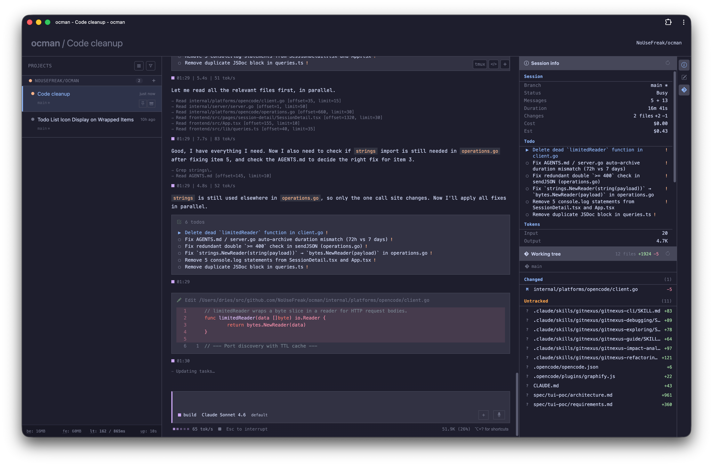

# ocman

[](https://forgejo.nousefreak.be/dries/ocman/actions?workflow=ci.yml)
[](https://forgejo.nousefreak.be/dries/ocman/actions?workflow=release.yml)
[](LICENSE)

A web dashboard for browsing and driving your coding-agent sessions.
Supports [OpenCode](https://github.com/anomalyco/opencode) and [Claude Code](https://claude.ai/code).



## Features

- **Session browser** — List, search, archive, and replay every session. Sessions are grouped by project with status indicators and a `+` button to start new ones.
- **Live composer** — Send messages, respond to permission prompts, abort, and compact a running session straight from the browser. Streaming output renders live.
- **Bash mode** — Prefix a message with `!` to run a shell command in the session's working directory and capture the output.
- **Command palette** — Unified ⌘K palette for jumping between sessions, settings, and actions, with in-app notifications.
- **Slash commands** — `/new [title]` to create a session, `/clear` to archive the current one and start fresh, plus keyboard-driven session rename.
- **Tmux integration** — Launch or auto-launch an OpenCode instance inside tmux directly from the UI.
- **Diff & changes view** — Syntax-highlighted diffs inline in the thread, plus a *Changes* sidebar combining session edits with the working-tree `git` diff.
- **Stats dashboard** — Per-project metrics, wall-clock totals, token/pricing graphs, and system stats.
- **Model picker** — Per-platform favorites and a refreshable catalog so new models appear without restarting.
- **Auth** — Optional password gate with rate-limited logins and persistent signed cookies. Off by default for localhost.
- **PWA** — Installable as a Progressive Web App.

## Quick start

```sh
# Run directly against the OpenCode database
./ocman
# Open http://localhost:8228
```

Download the latest binary from the [releases page](https://forgejo.nousefreak.be/dries/ocman/releases),
or build from source with `make build` (requires Go 1.24+ and Node.js 22+).

For interactive features (composer, permission replies, abort) start OpenCode with an explicit port:

```sh
opencode --port 0   # let OpenCode pick a free port
```

Ocman auto-discovers listening OpenCode processes and connects. Without `--port`, sessions are
still readable but the composer stays disabled — the UI shows a hint to re-launch with `--port 0`.

## Configuration

```sh
./ocman                              # default: listens on 127.0.0.1:8228
./ocman -addr localhost:9090         # custom listen address
./ocman -db /path/to/opencode.db     # custom OpenCode database path
./ocman -platforms opencode,claude-code  # enable multiple platforms
```

See [docs/configuration.md](docs/configuration.md) for the full flag and environment variable reference, including authentication setup.

## Optional agent integration

Ocman works as a dashboard without any agent integration. Install the optional
MCP integration if you want an agent to split work into child OpenCode sessions,
launch isolated git worktrees, check child status, cancel child sessions, or
send parent/child follow-up messages.

Add the local MCP server to your OpenCode config:

```json
{
  "$schema": "https://opencode.ai/config.json",
  "mcp": {
    "ocman": {
      "type": "remote",
      "url": "http://localhost:8229/mcp",
      "enabled": true
    }
  }
}
```

Use `http://localhost:8228/mcp` when running ocman through the Vite dev server
(`make dev`); the dev server proxies MCP requests to the Go backend. Use
`http://localhost:8229/mcp` when running the production binary directly.

The MCP server is localhost-only and provides small action tools such as
`split_to_session`, `split_to_worktree`, `get_session_status`,
`list_child_sessions`, `cancel_session`, and parent/child message tools.

Ocman also ships an optional OpenCode skill for deciding when and how to split
work. Install it if you want the agent to use better split heuristics without
putting long policy text into every MCP tool description:

```text
.opencode/skills/ocman-session-splitting/SKILL.md
```

When working in this repository, OpenCode loads the skill from the project
config automatically after restart. To use the same guidance in another
project, copy that folder into the target project's `.opencode/skills/`
directory, or add this repository's `.opencode/skills` path to that project's
OpenCode `skills.paths` config.

## Documentation

- [Configuration](docs/configuration.md) — flags, env vars, authentication
- [Contributing](docs/contributing.md) — architecture, project structure, development workflow

## License

This project is licensed under the MIT License. See [LICENSE](LICENSE) for details.
