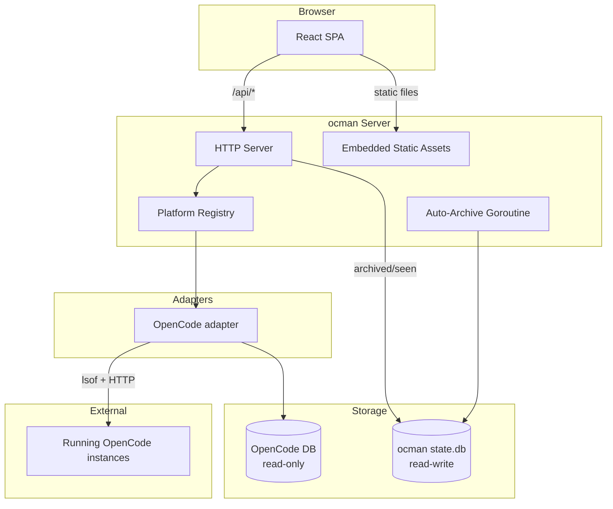

# ocman

[](https://forgejo.nousefreak.be/dries/ocman/actions?workflow=ci.yml)
[](https://forgejo.nousefreak.be/dries/ocman/actions?workflow=release.yml)
[](LICENSE)

A web dashboard for browsing and driving [OpenCode](https://github.com/anomalyco/opencode)
sessions. The Go backend serves a React SPA that lists, searches, and replays
sessions, and proxies live traffic (SSE events, composer, compact, permission
replies) to running OpenCode instances auto-discovered via `lsof`.

Ocman is wired through a generic `Platform` adapter interface
(`internal/platforms/`) so the frontend stays platform-agnostic — UI is gated
on a `/api/capabilities` endpoint rather than branching on platform identity.

## Features

- **Session browser** — List, search, archive, and replay every session in
  your OpenCode database. The sidebar auto-refreshes every 3 s (paused when
  the tab is hidden), is resizable via a drag handle, and offers a **Projects
  grouping view** that buckets sessions by project with an aggregate status
  dot, hover row, and a `+` button to start a new session in that project.
- **Live composer** — Send messages, respond to permission prompts (with a
  two-step confirmation on *Allow always*), abort, and compact a running
  session straight from the browser. Streaming output is rendered live,
  including under running subagent tasks.
- **Bash mode** — Prefix a draft with `!` to run a shell command in the
  session's working directory and capture the output.
- **Command palette** — Unified palette (⌘K-style) for jumping between
  sessions, settings, and actions. Includes a settings tab and a bell that
  surfaces in-app notifications.
- **Slash commands** — `/new [title]` to create a session (with an optional
  custom title), `/clear` to archive the current session and start a fresh
  one, plus session rename with keyboard shortcuts.
- **Tmux integration** — Launch a fresh `opencode` instance inside a tmux
  session from the UI, or have ocman auto-launch one when you create a new
  session. The composer stays disabled until the live HTTP API comes up.
- **Diff & changes view** — Syntax-highlighted edit / write diffs inline in
  the thread, plus a *Changes* sidebar that combines session edits with the
  working-tree `git` diff. Read-tool calls render project-relative paths;
  Skill tool calls collapse to a single muted line.
- **Stats dashboard** — Per-project metrics aggregation, Total Wall Clock
  across sessions, pricing/token graphs, and a backend system stats widget.
- **Model picker** — Per-platform favorites and a refreshable catalog so new
  models show up without restarting ocman.
- **Auth** — Optional password gate with bcrypt-hashed credentials,
  HMAC-signed stateless cookies persisted across restarts, a frontend
  lockscreen, and per-IP rate limiting. Off by default for localhost; flip
  one env var to require auth from every client.
- **PWA** — Installable as a Progressive Web App, with an optional in-app
  install button.

## Architecture



## Requirements

- Go 1.26+ (CGo enabled — required by `go-sqlite3`)
- Node.js 24+
- [mise](https://mise.jdx.dev/) (provides `air` for live-reload; run `mise install`)
- `~/.local/share/opencode/opencode.db` must exist (ocman fails fast
  otherwise).
- `tmux` on `PATH` if you want to use the in-UI launcher.

To **interact** with a running session (send messages, respond to
permissions/questions, abort, compact) you must start OpenCode with
an explicit port so its HTTP API is reachable:

```sh
opencode --port 0   # let OpenCode pick a free port
# or pin a specific port, e.g. opencode --port 4096
```

Ocman discovers listening OpenCode processes via `lsof` and
auto-connects. Without `--port`, sessions are still readable from
the database but the composer and other interactive features stay
disabled — the UI shows a hint telling you to re-launch OpenCode
with `--port 0` (or click the tmux launcher).

## Quick start

```sh
# Install tools
mise install

# Development mode (Vite dev server with HMR)
make dev
# Open http://localhost:8228

# OR: Production mode with auto-rebuild (for memory profiling)
make dev-prod-watch
# Open http://localhost:8228
```

**Development mode** (`make dev`): Opens on port **8228** - Vite dev server with instant HMR updates.  
**Production mode** (`make dev-prod-watch`): Opens on port **8228** - Vite preview mode serves production build, auto-rebuilds on changes (**manual browser refresh required**).

## Build

```sh
make build
```

This builds the frontend first (`npm ci && npm run build`), then compiles the Go binary with the static assets embedded. Order matters — the frontend must be built before `go build`.

## Usage

```sh
./ocman                              # default: listens on 127.0.0.1:8228
./ocman -addr localhost:9090         # custom listen address
./ocman -db /path/to/opencode.db     # custom OpenCode database path
```

### Flags

| Flag | Default | Description |
|------|---------|-------------|
| `-addr` | `127.0.0.1:8228` | Listen address. |
| `-db` | `~/.local/share/opencode/opencode.db` | Path to OpenCode's SQLite DB. Opened read-only. |
| `-platforms` | `opencode` | Comma-separated list of platforms to enable. |
| `-auth-password` | _(unset)_ | Password to require. Prefer `OCMAN_AUTH_PASSWORD` or `-auth-password-file`. |
| `-auth-password-file` | _(unset)_ | Read auth password from file (trailing whitespace trimmed). |
| `-auth-session-ttl` | `720h` (30 days) | Auth cookie lifetime. |
| `-auth-trust-localhost` | `false` | Exempt loopback clients from auth. Also `OCMAN_AUTH_TRUST_LOCALHOST=1`. |

Ocman's own state (archived / seen flags, per-platform; auth secret;
favorites; cached projects) lives in `~/.local/share/ocman/state.db`,
auto-created on first run. The schema is migrated on startup.

### Authentication

By default ocman binds `127.0.0.1:8228` and serves unauthenticated. To
require a password — including over a tunnel, Tailscale, or any non-loopback
listener — set one of the following (precedence in order):

1. `OCMAN_AUTH_PASSWORD` env var (preferred)
2. `-auth-password-file /path/to/file`
3. `-auth-password '<plaintext>'` (visible in `ps`; use only for testing)

Once auth is configured it applies to **every** client, including localhost.
For local dev loops, pass `-auth-trust-localhost` (or
`OCMAN_AUTH_TRUST_LOCALHOST=1`) to restore the "local user is trusted"
escape hatch.

The password is bcrypt-hashed at startup; auth cookies are HMAC-signed
(stateless) with a key persisted in `state.db`'s `auth_secret` table so
sessions survive restarts. Login attempts are rate-limited to 5/min per IP
(trusted-localhost clients skip the limiter). The frontend renders a
lockscreen instead of the dashboard when the user is unauthenticated.

### Other env vars

| Variable | Description |
|----------|-------------|
| `OCMAN_AUTH_PASSWORD` | See above. Empty string is treated as unset. |
| `OCMAN_AUTH_TRUST_LOCALHOST` | Truthy value enables the loopback bypass. |
| `OCMAN_ALLOWED_HOSTS` | Vite dev/preview only: comma-separated extra hostnames allowed by the dev server (e.g. `foo.tailnet.ts.net,bar.lan`). |

## Project structure

```
main.go                                    entrypoint (-addr, -db, -platforms, -auth-* flags)
frontend/                                  React + TypeScript + Vite SPA
e2e/                                       Playwright end-to-end suite
internal/platforms/                        Platform interface, Registry, common types/errors
internal/platforms/opencode/               OpenCode adapter (DB + HTTP proxy)
internal/db/                               SQLite queries against OpenCode's DB
internal/state/                            ocman's own writable state DB (archived/seen,
                                            auth secret, favorites, cached projects)
internal/server/                           HTTP server, API handlers, static file serving,
                                            OpenCode port discovery, tmux launcher, auth
internal/server/static/                    Vite build output (embedded into Go binary)
spec/                                      Requirements + architecture notes per feature
```

## Development

### Quick Command Reference

| Command                | Port | Live Reload | Use Case |
|------------------------|------|-------------|----------|
| `make dev`             | 8228 | ✅ Yes (HMR) | Regular development |
| `make dev-prod-watch`  | 8228 | ⚠️ Manual refresh | Memory profiling, production testing |
| `make dev-prod`        | 8228 | ❌ No | One-time production test |

### All Commands

| Command                | Port | Description                                      |
|------------------------|------|--------------------------------------------------|
| `make dev`             | 8228 | Backend (air) + frontend (vite dev) with HMR |
| `make dev-prod`        | 8228 | Backend (air) + frontend (vite preview of production build) |
| `make dev-prod-watch`  | 8228 | Backend (air) + frontend (vite preview, auto-rebuilds on changes) |
| `make dev-backend`     | 8229 | Go backend only (air, port 8229)                 |
| `make dev-frontend`    | 8228 | Vite dev server only (port 8228)                 |
| `make test`            | `go test ./...`, `vitest run`, and the Playwright e2e suite |
| `make lint`            | `go vet`, `tsc -b`, `eslint`, and the platform-branching check |
| `make build`           | Production build                                 |
| `make clean`           | Remove binary, tmp/, and static/assets/          |

### Development Workflows

**Regular Frontend Development:**
```bash
make dev
# → Instant HMR updates
# → Best for UI iteration
```

**Memory Profiling / Production Testing:**
```bash
make dev-prod-watch
# → Edit code → auto-rebuild → manually refresh browser
# → Shows real production memory usage
```

**Why no auto-refresh in prod mode?**  
Vite's preview mode serves the production build but doesn't include HMR. The watcher rebuilds automatically, but you need to manually refresh your browser to see changes. This is by design - production builds are meant for testing, not rapid iteration.

### Tests

The repo has **180+ Go tests** (unit + integration, in-package `*_test.go`
files), **81 frontend tests** (vitest), and a **Playwright end-to-end suite**
covering auth, the dashboard, composer, SSE streaming, and prompts. CI runs
all three on every PR; `make test` runs them locally.

### Platform-agnostic frontend

The frontend must not branch on `session.platform === 'opencode'`
(or similar). UI gating goes through `/api/capabilities` +
`useCapabilities()` instead. This is enforced by
`scripts/check-platform-branching.sh`, which `make lint` runs. If
you hit a false positive, the pragma `// ocman:allow-platform-branch`
suppresses the check on the next line — use it sparingly (e.g. for
generic helpers that legitimately need the platform identity).

## License

This project is licensed under the MIT License. See [LICENSE](LICENSE) for details.
