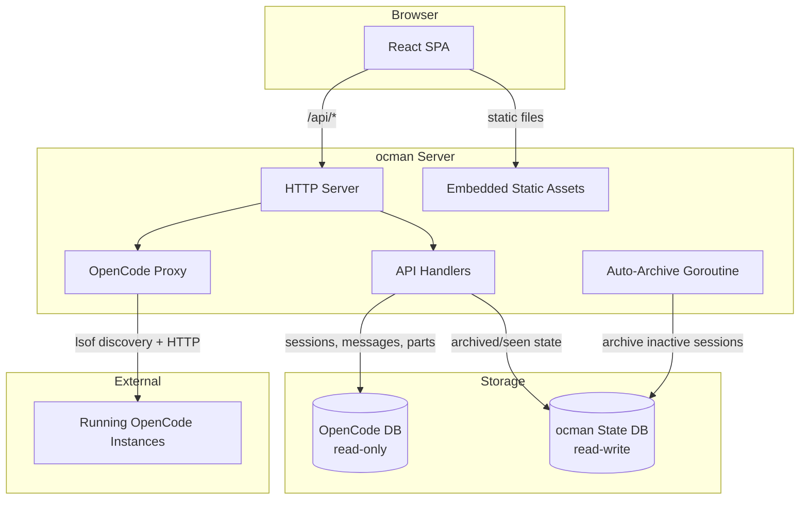

# ocman

[](https://github.com/NoUseFreak/ocman/actions/workflows/ci.yml)
[](https://github.com/NoUseFreak/ocman/actions/workflows/release.yml)
[](https://go.dev/)
[](LICENSE)

A web dashboard for viewing [OpenCode](https://github.com/anomalyco/opencode) session data. The Go backend reads OpenCode's SQLite database (read-only) and serves a React SPA. It can also proxy live data from running OpenCode instances via their HTTP API.

## Architecture



## Requirements

- Go 1.26+ (CGo enabled — required by `go-sqlite3`)
- Node.js 20+
- [mise](https://mise.jdx.dev/) (provides `air` for live-reload; run `mise install`)

## Quick start

```sh
# Install tools
mise install

# Run with live reload (backend on :8080, frontend on :8228)
make dev
```

Open <http://localhost:8228> during development (Vite proxies `/api` to the Go backend).

## Build

```sh
make build
```

This builds the frontend first (`npm ci && npm run build`), then compiles the Go binary with the static assets embedded. Order matters — the frontend must be built before `go build`.

## Usage

```sh
./ocman                              # default: listens on 0.0.0.0:8080, reads ~/.local/share/opencode/opencode.db
./ocman -addr localhost:9090         # custom listen address
./ocman -db /path/to/opencode.db    # custom database path
```

## Project structure

```
main.go                          entrypoint (-addr, -db flags)
frontend/                        React + TypeScript + Vite SPA
internal/db/                     SQLite queries (session, message, part tables)
internal/state/                  ocman's own writable state DB (archived/seen sessions)
internal/server/                 HTTP server, API handlers, static file serving
internal/server/static/          Vite build output (embedded into Go binary)
```

## Development

| Command              | Description                                    |
|----------------------|------------------------------------------------|
| `make dev`           | Backend (air) + frontend (vite) with live reload |
| `make dev-backend`   | Go backend only (air, port 8080)               |
| `make dev-frontend`  | Vite dev server only (port 8228)               |
| `make build`         | Production build                               |
| `make clean`         | Remove binary, tmp/, and static/assets/        |

### Frontend checks

```sh
cd frontend
npm run lint        # ESLint
npx tsc -b          # TypeScript type checking
```

### Backend checks

```sh
go vet ./...
```

## License

This project is licensed under the MIT License. See [LICENSE](LICENSE) for details.
