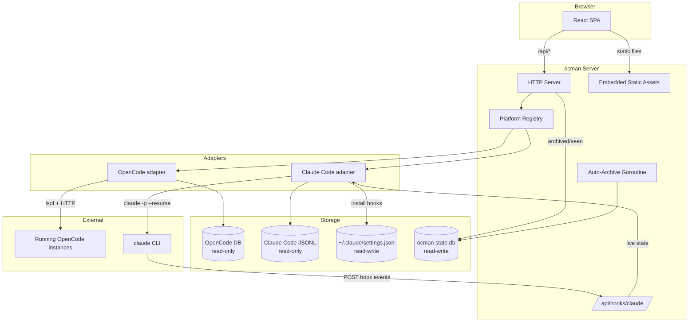

# ocman

[](https://github.com/NoUseFreak/ocman/actions/workflows/ci.yml)
[](https://github.com/NoUseFreak/ocman/actions/workflows/release.yml)
[](https://go.dev/)
[](LICENSE)

A web dashboard for viewing coding-agent session data. The Go backend
serves a React SPA that lists, searches, and replays sessions from
multiple platforms side-by-side, and — where the platform supports it —
lets you send new prompts back into them.

As of v2, ocman supports:

- **[OpenCode](https://github.com/anomalyco/opencode)** — reads its
  SQLite database read-only and proxies live traffic (SSE events,
  composer, compact, permission replies) to running OpenCode
  instances auto-discovered via `lsof`.
- **[Claude Code](https://code.claude.com)** _(deprecated)_ — reads
  its per-session JSONL transcripts from `~/.claude/projects/`,
  tracks live session state via HTTP hooks that ocman installs into
  `~/.claude/settings.json`, and injects new prompts using
  `claude -p --resume`. This adapter is no longer actively developed;
  see [Claude Code integration](#claude-code-integration-deprecated).

Both platforms are wired through a common `Platform` adapter interface
(`internal/platforms/`). The frontend is platform-agnostic: it gates
UI on a `/api/capabilities` endpoint rather than branching on platform
identity.

## Architecture



## Requirements

- Go 1.26+ (CGo enabled — required by `go-sqlite3`)
- Node.js 20+
- [mise](https://mise.jdx.dev/) (provides `air` for live-reload; run `mise install`)

Optional per-platform:

- OpenCode: `~/.local/share/opencode/opencode.db` must exist (ocman
  fails fast otherwise). To **interact** with a running session
  (send messages, respond to permissions/questions, abort, compact)
  you must start OpenCode with an explicit port so its HTTP API is
  reachable:

  ```sh
  opencode --port 0   # let OpenCode pick a free port
  # or pin a specific port, e.g. opencode --port 4096
  ```

  Ocman discovers listening OpenCode processes via `lsof` and
  auto-connects. Without `--port`, sessions are still readable from
  the database but the composer and other interactive features stay
  disabled — the UI shows a hint telling you to re-launch OpenCode
  with `--port 0`.
- Claude Code _(deprecated)_: ocman auto-detects
  `~/.claude/projects/`. On startup ocman installs a managed block of
  hooks into `~/.claude/settings.json` — see
  [Claude Code integration](#claude-code-integration-deprecated)
  below. Without Claude Code installed, the Claude Code adapter stays
  registered but silent.

## Quick start

```sh
# Install tools
mise install

# Development mode (Vite dev server with HMR)
make dev
# Open http://localhost:8228

# OR: Production mode with auto-rebuild (for memory profiling)
make dev-prod-watch
# Open http://localhost:8228
```

**Development mode** (`make dev`): Opens on port **8228** - Vite dev server with instant HMR updates.  
**Production mode** (`make dev-prod-watch`): Opens on port **8228** - Vite preview mode serves production build, auto-rebuilds on changes (**manual browser refresh required**).

## Build

```sh
make build
```

This builds the frontend first (`npm ci && npm run build`), then compiles the Go binary with the static assets embedded. Order matters — the frontend must be built before `go build`.

## Usage

```sh
./ocman                              # default: listens on 127.0.0.1:8228, reads ~/.local/share/opencode/opencode.db
./ocman -addr localhost:9090         # custom listen address
./ocman -db /path/to/opencode.db     # custom OpenCode database path
```

Ocman's own state (archived / seen flags, per-platform) lives in
`~/.local/share/ocman/state.db`, auto-created on first run.

## Claude Code integration (deprecated)

> **Deprecated.** The Claude Code adapter is no longer actively
> developed and may be removed in a future release. It is still
> wired up for users who opt in via `-platforms claude-code`, but
> new features and bug fixes target the OpenCode platform only.

Ocman installs a small block of HTTP hooks into
`~/.claude/settings.json` on startup so it can track live session
state (busy/idle/pending-permission). The block is identified by a
sentinel (`_owner: "ocman"`) and is installed idempotently — repeat
runs won't duplicate entries, and removing ocman is a matter of
deleting the sentinel block.

- **What the hooks do**: each hook POSTs a small JSON payload to
  `http://127.0.0.1:<addr>/api/hooks/claude` on localhost. The
  receiver accepts POSTs from loopback only.
- **Hook events installed**: `UserPromptSubmit`, `PreToolUse`,
  `PostToolUse`, `Stop`, `SubagentStop`, `Notification`,
  `SessionStart`. The full set is the minimum needed to reason about
  live state; adding more requires no user action beyond restarting
  ocman.
- **Preserved keys**: ocman rewrites only its own entries. Any other
  keys in `settings.json` (e.g. `effortLevel`, `enabledPlugins`, your
  own hooks) are left untouched.
- **Live-state retention**: in-memory only. Nothing is persisted
  across ocman restarts; the next hook event naturally rebuilds it.
  Busy state has a 2 min TTL so a missed `Stop` event doesn't leave
  a session stuck.
- **Composer guard**: the composer (`claude -p --resume`) refuses to
  send while the target session is reported `busy`, returning
  HTTP 409. This prevents the conversation tree from forking when
  ocman and a live `claude` TUI both write to the same session — see
  `spec/multi-agent-support/phase7/findings.md` for the full
  experiment.

If you prefer not to have ocman modify `settings.json`, don't run
ocman. There is no per-run flag to disable the installer at this
time; skipping the install silently would defeat the point of the
integration.

## Project structure

```
main.go                                    entrypoint (-addr, -db flags)
frontend/                                  React + TypeScript + Vite SPA
internal/platforms/                        Platform interface, Registry, common types/errors
internal/platforms/opencode/               OpenCode adapter (DB + HTTP proxy)
internal/platforms/claudecode/             Claude Code adapter (JSONL + hooks + composer)
internal/db/                               SQLite queries against OpenCode's DB
internal/state/                            ocman's own writable state DB
internal/server/                           HTTP server, API handlers, static file serving,
                                           OpenCode port discovery, Claude Code hook receiver
internal/server/static/                    Vite build output (embedded into Go binary)
spec/multi-agent-support/                  Requirements + architecture + Phase 7 findings
```

## Development

### Quick Command Reference

| Command                | Port | Live Reload | Use Case |
|------------------------|------|-------------|----------|
| `make dev`             | 8228 | ✅ Yes (HMR) | Regular development |
| `make dev-prod-watch`  | 8228 | ⚠️ Manual refresh | Memory profiling, production testing |
| `make dev-prod`        | 8228 | ❌ No | One-time production test |

### All Commands

| Command                | Port | Description                                      |
|------------------------|------|--------------------------------------------------|
| `make dev`             | 8228 | Backend (air) + frontend (vite dev) with HMR |
| `make dev-prod`        | 8228 | Backend (air) + frontend (vite preview of production build) |
| `make dev-prod-watch`  | 8228 | Backend (air) + frontend (vite preview, auto-rebuilds on changes) |
| `make dev-backend`     | 8229 | Go backend only (air, port 8229)                 |
| `make dev-frontend`    | 8228 | Vite dev server only (port 8228)                 |
| `make test`            | `go test ./...` + `vitest run`                   |
| `make lint`            | `go vet`, `tsc -b`, `eslint`, and the platform-branching check |
| `make build`           | Production build                                 |
| `make clean`           | Remove binary, tmp/, and static/assets/          |

### Development Workflows

**Regular Frontend Development:**
```bash
make dev
# → Instant HMR updates
# → Best for UI iteration
```

**Memory Profiling / Production Testing:**
```bash
make dev-prod-watch
# → Edit code → auto-rebuild → manually refresh browser
# → Shows real production memory usage
# → Good for debugging the 1GB memory issue
```

**Why no auto-refresh in prod mode?**  
Vite's preview mode serves the production build but doesn't include HMR. The watcher rebuilds automatically, but you need to manually refresh your browser to see changes. This is by design - production builds are meant for testing, not rapid iteration.

### Tests

The repo has **180+ Go tests** (unit + integration, in-package
`*_test.go` files) and **81 frontend tests** (vitest). CI runs both
on every PR; `make test` runs them locally.

### Platform-agnostic frontend

The frontend must not branch on `session.platform === 'opencode'`
(or similar). UI gating goes through `/api/capabilities` +
`useCapabilities()` instead. This is enforced by
`scripts/check-platform-branching.sh`, which `make lint` runs. If
you hit a false positive, the pragma `// ocman:allow-platform-branch`
suppresses the check on the next line — use it sparingly (e.g. for
generic helpers that legitimately need the platform identity).

## License

This project is licensed under the MIT License. See [LICENSE](LICENSE) for details.
