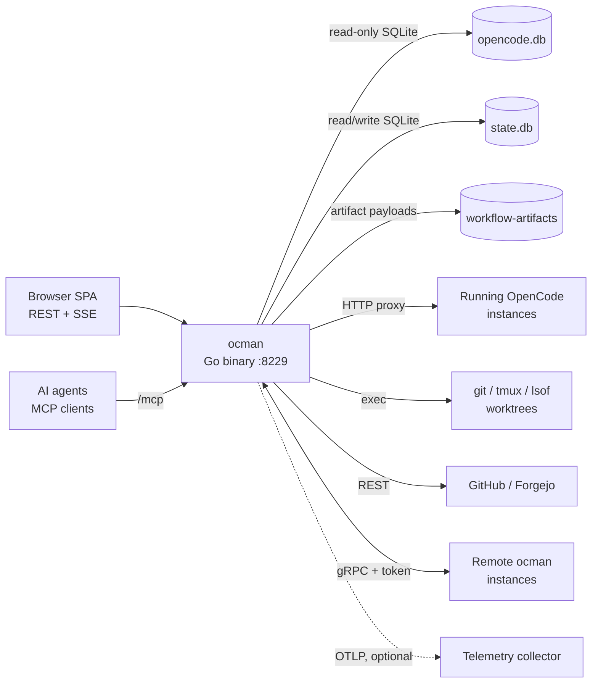
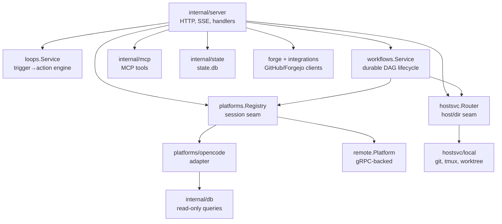
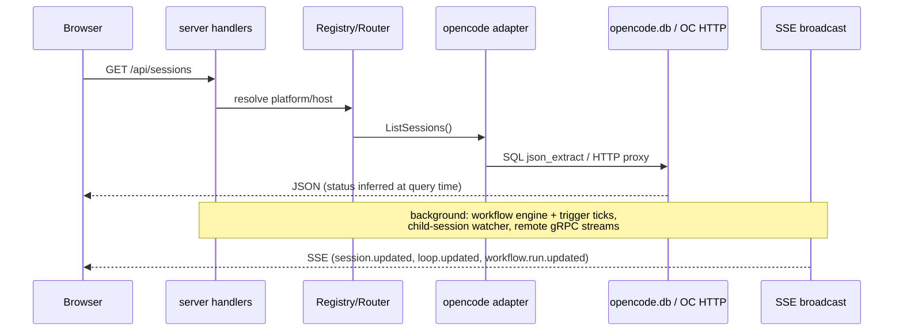
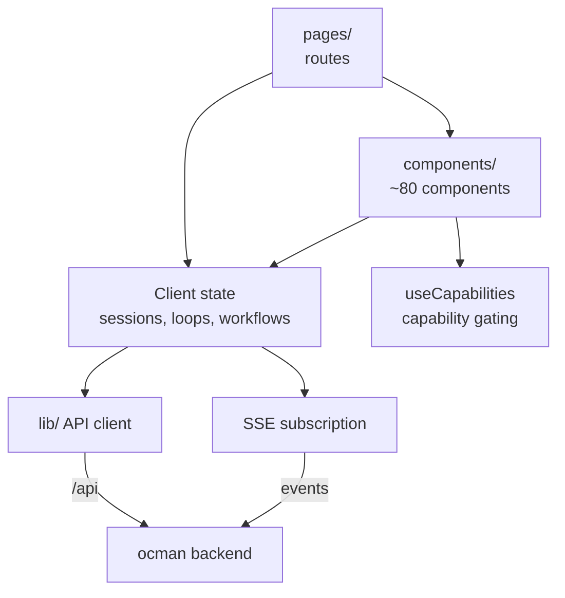

# Ocman Architecture

## Introduction

Ocman is a single Go binary that serves a React SPA and acts as a
control plane for coding-agent sessions. Four diagrams below: (1)
system context — what ocman talks to, (2) backend composition — the Go
packages, (3) the session/event data flow, (4) frontend composition.
Each diagram is capped at ~10 blocks; detail lives in the text.

## 1. System Context

Everything external that the ocman process touches.

- **Browser SPA** — the only UI; talks REST/SSE to the hub, never to
  remotes directly.
- **opencode.db** — foreign data, opened read-only; ocman never writes
  to it.
 - **state.db** — ocman's own state: archive flags, child sessions,
   loops, immutable workflow versions/runs, workflow artifact metadata,
   workflow resource/workspace leases, settings, and remote tokens.
- **workflow-artifacts/** — content-addressed store (under the ocman
  data dir, next to state.db) holding large, deduplicated, immutable
  artifact payloads out of SQLite; metadata rows in state.db reference
  payloads by content hash and expire them on a retention policy while
  keeping the audit metadata.
- **Remote ocman instances** — the hub dials remotes over gRPC and
  re-exposes their sessions/hosts transparently.

## 2. Backend Composition

The Go package graph, collapsed to the seams that matter.

- **internal/server** — HTTP mux, SSE broadcast/fanout, ~60 handler
   files, plus tmux, terminal, whisper, auto-approve, and workflow ticks.
- **platforms.Registry** — session-scoped seam. One adapter per
  platform; remotes register as compound-ID platforms so handlers
  can't tell local from remote.
- **hostsvc.Router** — directory-scoped seam (git, worktrees, tmux,
  projects); resolves the owning host and delegates. Same transparency
  trick as the registry. Worktree sessions run **in-app on the
  project's single opencode instance** (one per project, ensured via
  `EnsureProjectOpencode`) with a per-session working directory — there
  is no per-worktree opencode/tmux process.
- **platforms/opencode** — wraps the read-only DB queries
  (`internal/db`) plus an HTTP client to live instances, with
  `lsof`-based port discovery.
- **loops.Service** — pure domain logic behind small interfaces;
  driven by a 5 s tick goroutine in the server; shared by REST and
  MCP.
- **workflows.Service** — shared validation, durable trigger, and
  run-lifecycle seam for immutable workflow versions. Durable
  manual/interval/cron/PR/completion triggers create version-pinned runs
  (overlap skip/queue/parallel); a 5 s server tick reuses loop timing,
  forge, and session-status adapters. It schedules approval,
  permission-scoped command, and agent nodes from persisted dependency
  state. The command executor owns directory/environment policy, bounded
  logs, collectors, and process-tree cancellation; agent attempts
  create/send/abort through the session service, poll platform-neutral
  session status, and collect declared messages, diffs, or files through
  platform/host seams. REST, MCP, and SSE never implement independent
  transitions. Successful node outputs become immutable, typed artifacts
  (JSON/text/file/diff/diagnostics): payloads go to a content-addressed
  `BlobStore` (deduplicated) while metadata lands in state.db. Referenced
   secrets are resolved from host env at execution time and redacted from
   logs and artifact payloads; a background sweep drops payloads past
   their retention window (30-day default, per-workflow override) but
   keeps the metadata. A run may own a bounded pool of worktree shards
   (created host-locally through the git worktree service); mutating nodes
   acquire a durable workspace lease in the same transaction as pool
   capacity — exclusive by default, or path-scoped so disjoint declared
   scopes share a shard while overlapping (ancestor/exact) scopes cannot.
   Path-leased nodes are denied repository-wide git mutation
   (stash/reset/checkout/commit/push …) so a commit coordinator owns
   serialized per-shard git state. Leases carry an optional owning-host
   identity, release only after the attempt settles, and are visible in
   the run UI.
- **Loop → workflow migration (#325)** — on upgrade, migration v28 makes a
  one-time copy of every persisted loop into a one-node workflow definition
  (matching trigger + preserved loop policies under `definition_json`
  `.loopCompat`) and turns each loop iteration into a historical workflow run
  + node attempt. `loop_workflow_map` keeps loop identifiers resolvable to
  their new workflow ids. The copy is idempotent (already-mapped loops are
  skipped) and interrupted-safe (it runs inside the migration transaction).
  The original `loops` / `loop_iterations` tables and the loop
   REST/MCP/UI surfaces are **left intact as compatibility wrappers for one
   release**. They retain loop identifiers and payloads, while mapped loops
   execute only through the workflow scheduler; `loops.Service` translates
   compatibility controls to the mapped workflow trigger. **Planned removal:**
   `/api/loops`, the loop MCP tools, and the standalone Loops UI are slated
   for deletion one release after this workflow-backed compatibility release;
   until then loop and workflow surfaces coexist.
- **internal/mcp** — prompt composer + session launcher + tool
  handlers; all side effects go through the same `Platform` interface
  the HTTP layer uses.
- **internal/state** — the only writable store; migrations, settings,
  loops, child sessions.
- **forge / integrations** — forge-agnostic types in `forge`,
  per-forge HTTP clients in `integrations/{github,forgejo}`.

## 3. Session & Event Data Flow

How a session read and a live update travel through the system. Workflow runs
use the same SSE channel: discovery writes an immutable item artifact, map
creates pinned child runs, item phases fan out to independent reviews, then
fix, validation, and the serialized commit coordinator settle before the run
view refetches phases, artifacts, pools, and leases.

Key property: status is *inferred*, not stored — ocman derives session
state from the last message row on every query, so there is no sync
problem with OpenCode's DB.

Workflow state takes the opposite path because it is ocman-owned: publish,
trigger/manual start, approval, command completion, agent supervision,
pause, and cancel delegate to `workflows.Service`, which commits
trigger/version/run/node/attempt state and bounded command/collector output
to `state.db` before broadcasting a run ID. The browser then refetches the
authoritative trigger state and run graph, including linked agent sessions
and collector output.

## 4. Frontend Composition

- **Capability gating** — the UI never branches on platform identity;
  features toggle via `/api/capabilities` (enforced by a lint script).
- **Client state** — shared Zustand stores hold broad session/loop state;
  the bounded workflow page keeps its selected run locally and reconciles
  it from REST whenever the shared SSE stream reports a run change. Its run
  graph labels ordered phases, stable map items, attempts, artifact producers,
  resource pools, and workspace ownership without inferring platform identity.
