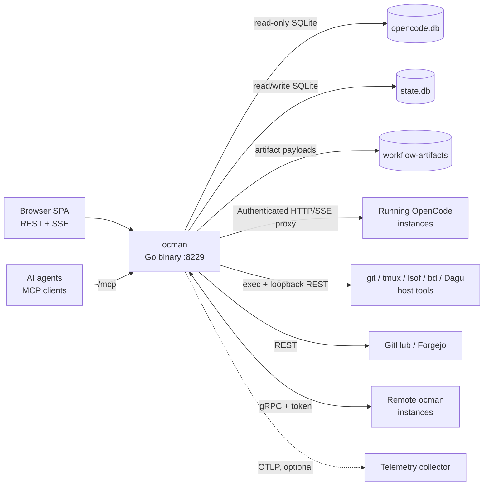
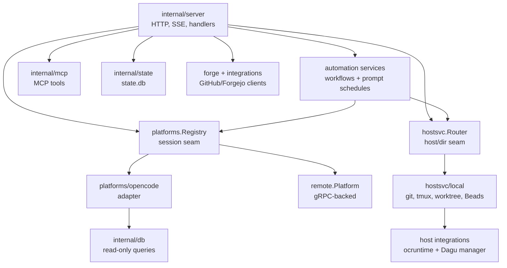
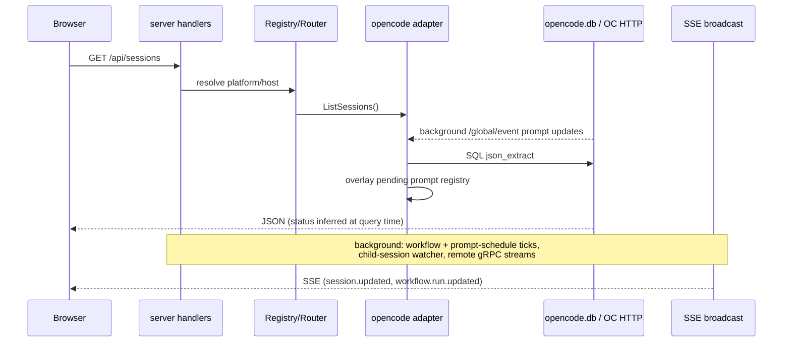
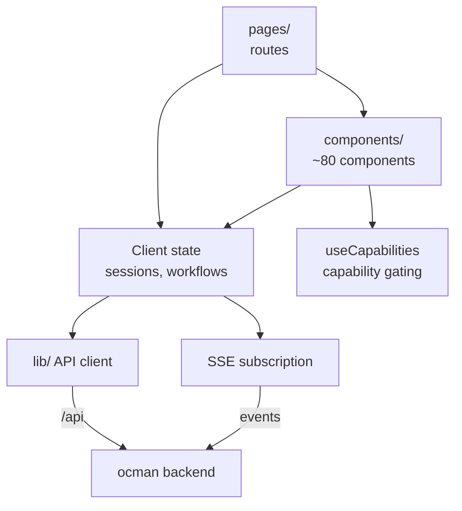

# Ocman Architecture

## Introduction

Ocman is a single Go binary that serves a React SPA and acts as a
control plane for coding-agent sessions. Four diagrams below: (1)
system context — what ocman talks to, (2) backend composition — the Go
packages, (3) the session/event data flow, (4) frontend composition.
Each diagram is capped at ~10 blocks; detail lives in the text.

## 1. System Context

Everything external that the ocman process touches.

- **Browser SPA** — the only UI; talks REST/SSE to the hub, never to
  remotes directly.
- **opencode.db** — foreign data, opened read-only; ocman never writes
  to it.
 - **state.db** — ocman's own state: archive flags, child sessions,
    immutable workflow versions/runs, workflow artifact metadata,
   workflow resource/workspace leases, settings, and remote tokens.
- **workflow-artifacts/** — content-addressed store (under the ocman
  data dir, next to state.db) holding large, deduplicated, immutable
  artifact payloads out of SQLite; metadata rows in state.db reference
  payloads by content hash and expire them on a retention policy while
  keeping the audit metadata.
- **Remote ocman instances** — the hub dials remotes over gRPC and
  re-exposes their sessions/hosts transparently.
- **Dagu** — an optional, separately installed 2.x CLI. On the first external
  workflow action, the owning ocman host starts one private loopback-only Dagu
  server under `~/.local/share/ocman/dagu`. Ocman submits command-only inline
  specs and reads graph state and step logs back through Dagu's REST API; Dagu
  remains the source of truth and receives no LLM credentials.

## 2. Backend Composition

The Go package graph, collapsed to the seams that matter.

- **internal/server** — HTTP mux, SSE broadcast/fanout, ~60 handler
   files, plus tmux, terminal, whisper, auto-approve, and workflow ticks.
- **platforms.Registry** — session-scoped seam. One adapter per
  platform; remotes register as compound-ID platforms so handlers
  can't tell local from remote.
- **hostsvc.Router** — directory-scoped seam (git, worktrees, tmux, Beads,
  projects); resolves the owning host and delegates. Same transparency
  trick as the registry. Worktree sessions run **in-app on the
  project's single opencode instance** (one per project, ensured via
  `EnsureProjectOpencode`) with a per-session working directory — there
  is no per-worktree opencode/tmux process. `EnsureProjectOpencodeResult`
  is runtime-neutral: callers use the full `Endpoint` URL (or its
  `Port()`) plus an opaque `ocruntime.Instance`; the owning host may use
  discovery once to adopt a healthy instance started before its managed
  registry entry existed.
  `RestartProjectOpencode` stops and relaunches the tracked instance.
- **internal/ocruntime** — the runtime abstraction behind the managed
  launch path. A `Runtime` interface (`Launch`/`Probe`/`Stop`) hides
  *how* a project's opencode is hosted; the native-tmux implementation
  runs `opencode --port N` on an ocman-allocated loopback port and
  probes authenticated `GET {endpoint}/config` for health. It is the plug point for
  the container runtime (epic #375) as a second implementation.
- **internal/dagu** — detects the optional executable, supervises one lazy
  private Dagu server, translates command-only definitions to inline Dagu
  specs, and traces runs through Dagu's REST API. `hostsvc.Host` and the remote
  gRPC seam keep launch, observation, logs, and cancellation on the owning
  machine. No external run graph or log is copied into `state.db`.
- **platforms/opencode** — wraps the read-only DB queries
  (`internal/db`) plus an HTTP client that attaches to live instances,
  with `lsof`-based discovery for instances started outside ocman. One
  process-wide `/global/event` stream per instance keeps pending permission
  and question state in memory across all session directories.
- **workflows.Service** — shared validation, durable trigger, and
  run-lifecycle seam for immutable workflow versions. Durable
  manual/interval/cron/PR/completion triggers create version-pinned runs
   (overlap skip/queue/parallel); a 5 s server tick evaluates triggers
   through narrow forge and session-status adapters. It schedules approval,
  permission-scoped command, and agent nodes from persisted dependency
   state. The command executor owns directory/environment policy, bounded
   logs, JSON stdout validation, and process-tree cancellation; agent attempts
   create/send/abort through the session service and poll platform-neutral
   session status. Agents with an `outputSchema` receive that JSON Schema in
   their prompt and have their final value validated by `jsonschema`; agents
   without one only need to complete successfully. REST, MCP, and SSE
  never implement independent transitions. Every node exposes one canonical
  Node Result; dependency-scoped interpolation passes its JSON output to
  commands, environments, prompts, maps, and CEL policies. The auxiliary
  content-addressed `BlobStore` remains for internal map-item payloads and
  historical artifact downloads, not as a second node-output channel. Referenced
   secrets are resolved from host env at execution time and redacted from
   logs and artifact payloads; a background sweep drops payloads past
   their retention window (30-day default, per-workflow override) but
   keeps the metadata. A run may own a bounded pool of worktree shards
   (created host-locally through the git worktree service); mutating nodes
   acquire a durable workspace lease in the same transaction as pool
   capacity — exclusive by default, or path-scoped so disjoint declared
   scopes share a shard while overlapping (ancestor/exact) scopes cannot.
   Path-leased nodes are denied repository-wide git mutation
   (stash/reset/checkout/commit/push …) so a commit coordinator owns
   serialized per-shard git state. Leases carry an optional owning-host
   identity, release only after the attempt settles, and are visible in
   the run UI.
 - **server prompt-schedule service** — the native prompt scheduler. It calculates
   one-time, interval, and five-field cron occurrences with `robfig/cron`, then
   atomically claims due `state.db` rows before sending the stored prompt through
   `sessionsvc`. Each occurrence either creates a fresh OpenCode session or queues
   into the schedule-owned session. On restart, persisted `running` claims become
   failed rather than being replayed, preventing duplicate external dispatch when
   completion is unknown.
- **Legacy loop migration (#325)** — migration v28 copies persisted legacy
  loops into ordinary one-node workflow definitions and turns each iteration
  into a historical workflow run + node attempt. `loop_workflow_map` makes
  the transaction-safe copy idempotent. The legacy tables are retained only
  as non-destructive upgrade input and historical data; no API, MCP, UI, or
  runtime scheduler reads them.
- **internal/mcp** — prompt composer + session launcher + tool
  handlers; all side effects go through the same `Platform` interface
  the HTTP layer uses.
- **internal/opencodeskills** — extracts binary-embedded ocman skills into
  XDG data and installs only ocman-owned symlinks for OpenCode discovery.
- **internal/state** — the only writable store; migrations, settings,
  workflows, prompt schedules, child sessions.
- **forge / integrations** — forge-agnostic types in `forge`,
  per-forge HTTP clients in `integrations/{github,forgejo}`.

## 3. Session & Event Data Flow

How a session read and a live update travel through the system. Workflow runs
use the same SSE channel: discovery publishes a JSON Node Result, map creates
pinned child runs from it, item phases fan out to independent reviews, then fix,
validation, and the serialized commit coordinator settle before the run view
refetches phases, Node Results, historical artifacts, pools, and leases.

Key property: status is *inferred*, not stored — ocman derives session
state from the last message row on every query, so there is no sync
problem with OpenCode's DB.

Workflow state takes the opposite path because it is ocman-owned: publish,
trigger/manual start, approval, command completion, agent supervision,
pause, and cancel delegate to `workflows.Service`, which commits
trigger/version/run/node/attempt state and canonical JSON Node Results to
`state.db` before broadcasting a run ID. The browser then refetches the
authoritative trigger state and run graph, including linked agent sessions and
map/join aggregate outputs.

One-time prompt schedules are also ocman-owned. The project page creates and
lists them over REST; the scheduler first commits a durable `running` claim,
then creates and prompts a session through the shared session mutation service.
The same row stores completion/error state and the session link shown by the UI.

## 4. Frontend Composition

- **Capability gating** — the UI never branches on platform identity;
  features toggle via `/api/capabilities` (enforced by a lint script).
- **Client state** — shared Zustand stores hold broad session/workflow state;
  the bounded workflow page keeps its selected run locally and reconciles
  it from REST whenever the shared SSE stream reports a run change. Its run
  graph labels ordered phases, stable map items, attempts, Node Results,
  historical artifacts, resource pools, and workspace ownership without
   inferring platform identity.
- **Beads status** — the right panel queries the repository owner's
  `hostsvc.Host` through `/api/project/beads-status`; remote owners proxy the
  same operation over gRPC. Ticket data stays in the repository and is polled
  only while the available pane is open.
