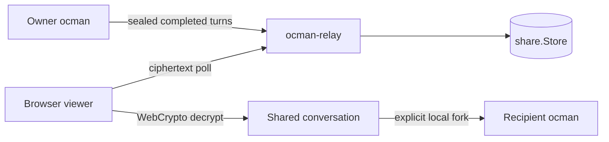
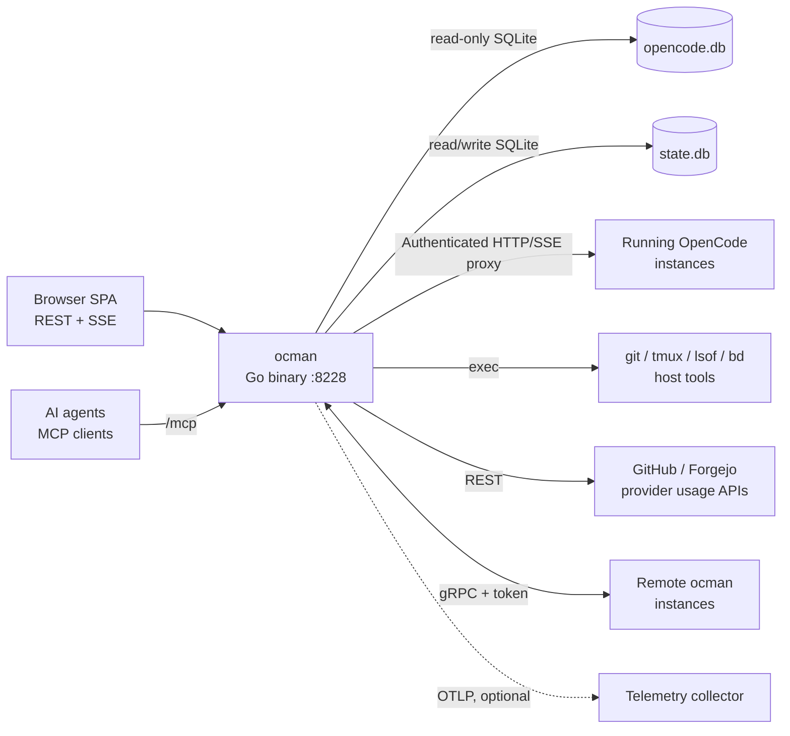
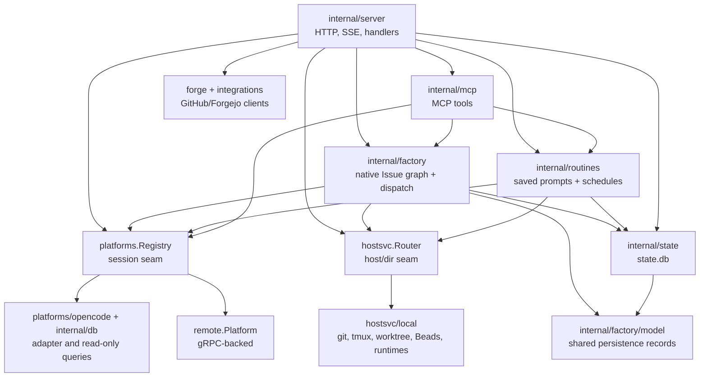
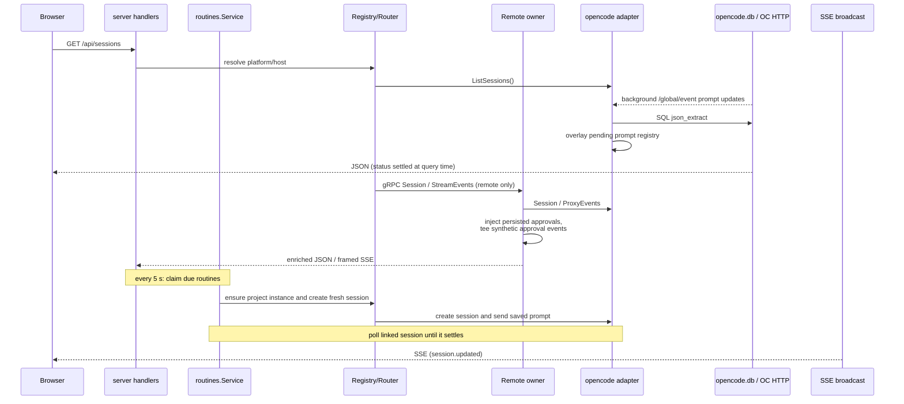
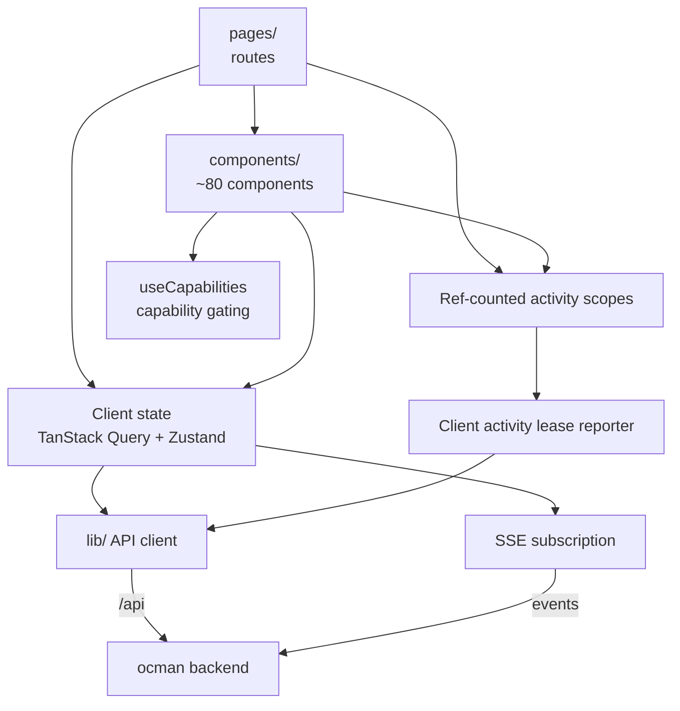

## Introduction

Ocman is a single Go binary that serves a React SPA and acts as a control
plane for coding-agent sessions. Four diagrams follow: the system context
(what ocman talks to), the backend composition (the Go packages), the
session/event data flow, and the frontend composition. Each diagram is capped
at roughly 10 blocks, and the detail lives in the text below it.

### Cross-machine conversation sharing

Ocman can publish a shared conversation through the standalone `ocman-relay`
binary. The relay stores only AES-256-GCM ciphertext through the `share.Store`
abstraction (disk today; object storage can implement the same
`Put`/`Get`/`List`/`DeletePrefix` contract). The per-share key stays in the URL
fragment, so it never reaches the relay.

- Chunk zero is a complete snapshot; later chunks contain the latest
  completed turn and the viewer merges them as id-keyed upserts.
- The owner allocates sequence numbers. Nonces derive from those sequence
  numbers, and the share id plus sequence is authenticated as GCM AAD.
- Revocation deletes the relay prefix. The relay stores only a hash of its
  append/delete token and needs no database.
- Forking fetches and decrypts in the recipient's authenticated local ocman
  UI, lets the recipient choose a local project, and parks the transcript as
  an unsent composer draft. Imported text never runs automatically.

## 1. System context

Everything external that the ocman process touches.

- **Browser SPA.** The only UI. It talks REST/SSE to the hub, never to
  remotes directly. `:8228` is the production `-addr` default; in dev the
  Vite server on :8228 proxies `/api` to the air backend on :8229.
- **opencode.db.** Foreign data, opened read-only. Ocman never writes to it.
- **state.db.** Ocman's own state: archive flags, routines and run history,
  permission approval provenance, settings, Factory records, and remote
  tokens. Legacy `workflow_*` rows remain inert for manual recovery.
- **Provider usage APIs.** The subscription usage page reads OpenCode's local
  OAuth credentials server-side and returns only normalized quota windows;
  provider tokens and account identifiers never reach the browser.
- **Remote ocman instances.** The hub dials remotes over gRPC and re-exposes
  their sessions and hosts transparently. The owning remote enriches session
  detail with its persisted approvals and tees synthetic approval events into
  the gRPC event stream before the hub forwards them to the browser.

## 2. Backend composition

The Go package graph, collapsed to the seams that matter.

- **internal/server.** The HTTP mux, SSE broadcast and fanout, around 60
  handler files, plus tmux, terminal, whisper, auto-approve and routine ticks.
- **internal/factory.** The independent Software Factory boundary. It stores
   Epics, Mols, typed Issues, dependencies, attempts, Formula revisions,
   Plan revisions, approvals, and materialization provenance in `state.db`.
   TOML Formulas compile to canonical JSON. A Plan session is read-only at the
   project root; approval of an exact revision enables user-requested atomic
   materialization of the proposed Implementation Issues and dependencies. Ready Issues
   launch configured worktree sessions. Failed or terminally blocked work can
   launch a read-only diagnosis session; its scoped `factory_unblock` MCP tool
   remains permission-gated in the conversation before reopening work or
   applying a graph mutation. The browser uses REST while agents use MCP.
   Routines are not involved.
- **Factory persistence.** Native `factory_*` tables own the graph and its
   provenance in `state.db`; they do not reference or alter routine tables.
- **internal/factory/model.** Dependency-neutral persistence records shared by
  `internal/factory` and `internal/state`. Factory owns their meaning; state
  only stores them, which avoids making Factory depend on its SQLite adapter.
- **platforms.Registry.** The session-scoped seam. One adapter per platform;
  remotes register as compound-ID platforms so handlers can't tell local from
  remote.
- **hostsvc.Router.** The directory-scoped seam (git, worktrees, tmux, Beads,
  projects and forge-repository detection/fetch). It resolves the owning host
  and delegates, the same transparency
  trick as the registry. Worktree sessions run in-app on the project's single
  opencode instance, one per project, ensured through
  `EnsureProjectOpencode`, with a per-session working directory. There is no
  opencode or tmux process per worktree. `EnsureProjectOpencodeResult` is
  runtime-neutral: callers use the full `Endpoint` URL (or its `Port()`) plus
  an opaque `ocruntime.Instance`. The owning host may use discovery once to
  adopt a healthy instance that started before its managed registry entry
  existed. `RestartProjectOpencode` stops and relaunches the tracked
  instance.
- **internal/ocruntime.** The runtime abstraction behind the managed launch
  path. A `Runtime` interface (`Launch`/`Probe`/`Stop`) hides how a project's
  opencode is hosted; the native-tmux implementation runs `opencode --port N`
  on an ocman-allocated loopback port and probes authenticated
  `GET {endpoint}/config` for health. It is where the container runtime (epic
  #375) plugs in as a second implementation.
- **platforms/opencode.** Wraps the read-only DB queries (`internal/db`) plus
  an HTTP client that attaches to live instances, with `lsof`-based discovery
  for instances started outside ocman. One process-wide `/global/event` stream
  per instance keeps pending permission and question state in memory across
  all session directories.
- **internal/routines.** Validates and stores manual, timeout, one-time and
  cron routines. Manual and scheduled dispatch share the durable occurrence
  claim, launch a fresh managed session through `hostsvc.Router` and
  `sessionsvc`, and leave the run active until platform-neutral session status
  reports success or failure. Startup resumes observation of linked runs.
  Timeout schedules become an absolute due time when saved. Cron schedules
  use a five-field expression and IANA timezone. Webhooks are deferred.
- **Legacy Workflow storage.** The `workflow_*` tables remain in `state.db` as
  inert historical data. No API, MCP tool, UI, or scheduler reads them. A DAG
  cannot be converted losslessly to one routine prompt, so recovery is a
  manual read-only SQLite export.
- **internal/mcp.** MCP handlers expose action-based `factory`,
  permission-gated `factory_unblock`, `inbox`, and `routines` tools, read-only
  session inspection, and `embed_file`. File embedding uses signed tokens
  persisted in `state.db`.
- **internal/opencodeskills.** Extracts binary-embedded ocman skills into
  XDG data and installs only ocman-owned symlinks for OpenCode discovery.
  Retirement unlinks only the exact verified symlink and preserves extracted data.
- **internal/state.** Ocman's writable SQLite store: migrations, settings,
  routines and their immutable run snapshots, legacy inert Workflow rows,
  and the independent native Factory Issue graph.
- **forge and integrations.** Forge-agnostic types in `internal/forge`, per-forge
  HTTP clients in `internal/forge/{github,forgejo}`. PR/Issue handlers obtain repository
  identity from the owner Host, then use the hub clients for metadata.

## 3. Session and event data flow

How session reads, live updates, and routine dispatch travel through the
system.

The key property: ocman never persists session status. The live turn signal
from the running OpenCode instance decides whether a session is busy; the
last stored message row only settles which terminal state a finished session
is in. Nothing is written back, so there is no sync problem with OpenCode's
DB.

Ocman owns routine state. The Routines page creates, edits, soft-deletes, and
starts routines over REST. Manual and scheduled paths first claim an immutable
run snapshot in `state.db`, then create and prompt a fresh session through the
shared session service. The run stays active until that session settles. The
same row stores success or failure, any error, and the session link shown in
history.

## 4. Frontend composition

- **Capability gating.** The UI never branches on platform identity. Features
  toggle via `/api/capabilities`, enforced by a lint script.
- **Client state.** Shared Zustand stores hold broad session state. The
  Routines page loads definitions and history over REST and keeps its form and
  selected edits locally.
- **Activity leases.** Mounted data subscriptions ref-count their scopes. One
  authenticated reporter renews the visible tab's lease, allowing the backend
  to skip view-serving session, project and metrics refreshes
  when every tab is hidden or gone. Scheduled routines and auto-approve do not
  consult these leases.
- **Beads status.** The right panel queries the repository owner's
  `hostsvc.Host` through `/api/project/beads-status`; remote owners proxy the
  same operation over gRPC. Ticket data stays in the repository and is polled
  only while the available pane is open.
- **Factory.** `/factory` presents actionable approval Gates, Epics, Issues,
   Queue, and Configuration through TanStack Query. Browser mutations create
   native Epics, pour Mols, decide exact Plan revisions, and explicitly close
   completed containers. It can also launch a read-only unblock conversation;
   approved repairs return through the scoped MCP tool. The dispatcher records
   attempts before launching the read-only planning or configured implementation
   session.
