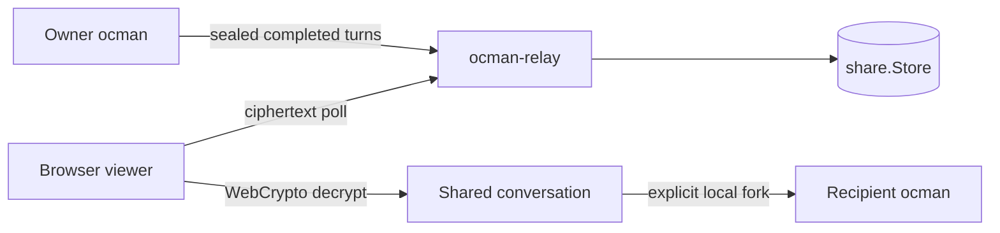
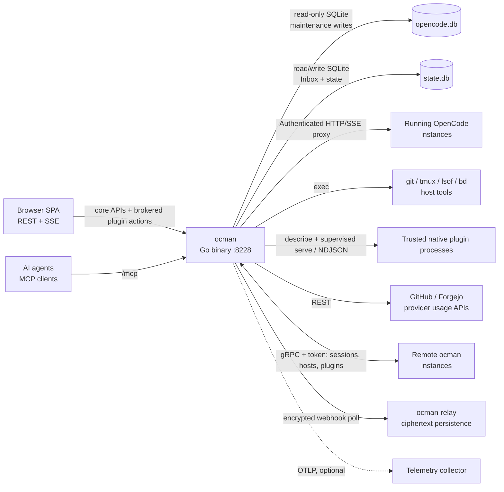
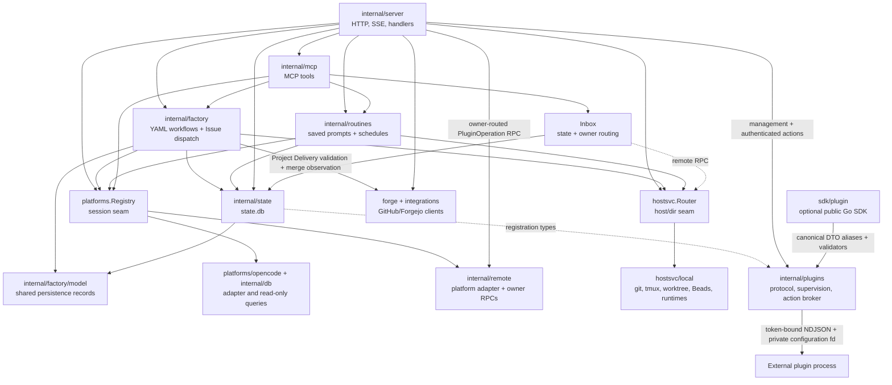
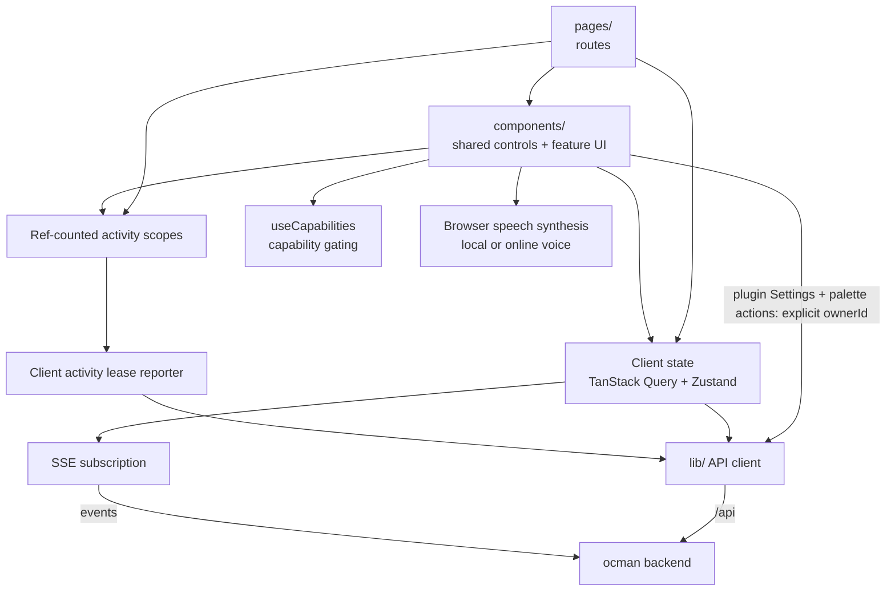

## Introduction

Ocman is a single Go binary that serves a React SPA and acts as a control
plane for coding-agent sessions. The main diagrams cover the system context
(what ocman talks to), the backend composition (the Go packages), the
session/event data flow, frontend composition, and plugin action flow. Detail
lives in the text below each diagram.

### Cross-machine conversation sharing

Ocman can publish a shared conversation through the standalone `ocman-relay`
binary. The relay stores only AES-256-GCM ciphertext through the `share.Store`
abstraction (disk today; object storage can implement the same
`Put`/`Get`/`List`/`DeletePrefix` contract). The per-share key stays in the URL
fragment, so it never reaches the relay.



- Chunk zero is a complete snapshot; later chunks contain the latest
  completed turn and the viewer merges them as id-keyed upserts.
- The owner allocates sequence numbers. Nonces derive from those sequence
  numbers, and the share id plus sequence is authenticated as GCM AAD.
- Revocation deletes the relay prefix. The relay stores only a hash of its
  append/delete token and needs no database.
- Forking fetches and decrypts in the recipient's authenticated local ocman
  UI, lets the recipient choose a local project, and parks the transcript as
  an unsent composer draft. Imported text never runs automatically.

## 1. System context

Everything external that the ocman process touches.



- **Browser SPA.** The only UI. It talks REST/SSE to the hub, never to
  remotes directly. `:8228` is the production `-addr` default; in dev the
  Vite server on :8228 proxies `/api` to the air backend on :8229.
- **opencode.db.** Foreign data, opened read-only. The one exception is the
  user-started maintenance job (`internal/ocmaint`, Settings → Maintenance).
  It stops the managed instances, refuses while any other process holds the
  file, and moves old `summary.diffs` patches into a restorable dump.
- **state.db.** Ocman's own state: archive flags, routines and run history,
  permission approval provenance, live session commit observations, settings,
  Factory records, Inbox items, remote tokens, and the last local projects-index
  snapshot. Inbox sends are owner-local and persist until recalled or archived
  by the user. Legacy `workflow_*` rows remain inert for manual recovery.
- **Provider usage APIs.** The subscription usage page reads OpenCode's local
  OAuth credentials server-side and returns only normalized quota windows;
  provider tokens and account identifiers never reach the browser.
- **Native plugin executables.** Startup and explicit rescans describe direct
  executables from the local plugin directory. Each describe has a fresh token,
  minimal environment, bounded output, and a three-second deadline. Duplicate
  identities conflict; changed binaries lose approval. Discovery itself executes
  trusted code. Grants minimize brokered context, not operating-system access.
  See [Plugins](../features/plugins.md) for installation and operations.
- **Remote ocman instances.** The hub dials remotes over gRPC and re-exposes
  their sessions and hosts transparently. The owning remote enriches session
  detail with its persisted approvals and tees synthetic approval events into
  the gRPC event stream before the hub forwards them to the browser.
  Plugin catalog, management, health, actions and artifact reads use the same
  authenticated connection. Each machine discovers its own binaries and stores
  its own configuration and secrets. The hub never installs remote binaries.
- **Encrypted webhooks.** Providers submit plaintext to the relay's ingestion
  URL, where ocman encrypts a versioned age X25519 envelope. The relay
  persists ciphertext plus visible size/timing metadata; the owning local or
  remote ocman decrypts it, durably accepts it in `state.db`, claims routine
  dispatches, then acknowledges the relay. A lost acknowledgment is retried
  without duplicate scheduling.

## 2. Backend composition

The Go package graph, collapsed to the seams that matter.



- **internal/server.** The HTTP mux, SSE broadcast and fanout, around 60
  handler files, plus tmux, terminal, whisper, auto-approve and routine ticks.
- **internal/plugins.** External wire DTOs, bounded NDJSON, version negotiation,
  handshake and stream-order validation, executable discovery, and description
  validation. `Server.StartOnListener` scans once; `RescanPlugins` repeats the scan
  and records identities, checksums, and conflicts in state. The server supervises
  one serve process per enabled local plugin from its private data directory, with
  bounded calls/output, cancellation, restart cutoff and process-group shutdown.
  Process health is durable; sensitive stderr stays bounded in local memory.
  Authenticated management routes expose catalog, health, grant approval and
  revocation, configuration validation/update, restart/retry, and data removal.
  Mutations and redacted stderr reads require localhost and safe browser origins.
  Configuration reaches the child on a private inherited descriptor before
  readiness; failed activation restores the last working public and secret values.
  Authenticated action list/invoke/download endpoints use the action broker. It
  filters context by each action's approved grants, requires host-issued confirmation
  tokens when declared, and returns only typed results. Grant changes serialize with
  dispatch and are checked again before results or artifact bytes are returned. See the
  [wire contract](https://forgejo.nousefreak.be/dries/ocman/src/branch/main/internal/plugins/README.md).
  The remote `PluginOperation` RPC accepts a closed set of host operations, never
  raw stdio messages. Both transports use the same lifecycle and action broker.
  Catalog identities are `(ownerId, description.id)`; nested capabilities and
  instances inherit that owner. Management and artifact endpoints take `ownerId`.
  Action requests distinguish the installation `ownerId` from `context.ownerId`.
  Project/session listings combine the owner's owner-scoped actions with the hub's
  hub-scoped actions. Owner-scoped actions run on the owner; hub-scoped actions run
  only on the hub. Global placements always resolve to the hub. Explicit disconnected
  project owners fail closed. Remote secret updates pass through without hub
  persistence, and responses contain secret presence only.
  Configuration writes are capped at 1 MiB of canonical JSON; catalog responses
  are capped at 16 MiB on both transports.
- **sdk/plugin.** Optional public Go lifecycle and action helpers reuse the canonical
  protocol DTOs and validators. `sdk/plugin/conformance` runs black-box executable
  tests, including host-broker grant checks. `examples/ocman-plugin-fixture` is the
  deterministic executable used by the supervisor integration tests. Plugins in
  other languages can implement the same NDJSON contract directly.
- **Plugin persistence.** `internal/state` stores discovered identities, capability
  instances, enablement, grants, health and public configuration in schema v91.
  Schema v92 adds operation receipts committed before action dispatch, preventing
  replay after a host restart even when the original outcome is unknown.
  Secret snapshots use separate `0600` files beside the configured database;
  plugin-owned data uses its own directory. Configuration checkpoints restore
  public values and secret references together. Disable and removal retain data;
  permanent deletion is explicit. Catalog reads expose secret-presence flags only.
- **internal/factory.** The independent Software Factory boundary. It stores
   Epics, Mols, typed Issues, dependencies, attempts, Formula revisions,
   Plan revisions, approvals, and materialization provenance in `state.db`.
   YAML Formulas declare named steps with prompts, configuration, and `needs`.
   They compile to canonical JSON; historical TOML revisions remain readable.
   Poured steps keep their frozen definitions in `factory_workflow_step`.
   Implementation is a group whose required children must succeed before checks
   or later approvals can proceed. Verification and delivery expand per changed
   project; dependent steps wait for every project instance of each prerequisite.
   A Plan session is instructed not to
   modify files, but its configurable permission rules may allow shell commands
   for research; approval of an exact revision automatically materializes the
   proposed Implementation Issues and dependencies atomically. As defined by
   [ADR 0008](../adr/0008-coordinate-factory-work-across-projects.md), an Epic
   owns an admitted local project set, each executable Issue targets one project,
   and each project has an independent shared branch, checkpoint, and Delivery
   lineage. Ready Issues launch configured worktree sessions in their target
   project. Each implementation handoff records the clean, pushed commit in its
   Attempt result; the next Attempt for that project freezes the checkpoint and
   target branch in its policy. Workflow Project Deliveries follow the declared
   checks and approvals before publishing each project's PR. Legacy revisions
   create deliveries progressively as their required project work completes.
   Forge observations satisfy merge-gated cross-project dependencies; a recorded
   merge makes later work create a successor instead of refreshing the Delivery.
   Delivery retries preserve completed implementation Issues.
   Failed or terminally blocked work can
   launch a read-only diagnosis session; its scoped `factory_unblock` MCP tool
   remains permission-gated in the conversation before reopening work or
   applying a graph mutation. Implementation agents can also pause behind a
   durable project-admission gate; human REST approval adopts the local project,
   records execution acknowledgement, and launches an additive scoped Plan,
   while rejection resumes the same session with feedback. The browser uses REST
   while agents use MCP.
   Routines are not involved.
- **Factory persistence.** Native `factory_*` tables own the graph and its
   provenance in `state.db`; they do not reference or alter routine tables.
- **internal/factory/model.** Dependency-neutral persistence records shared by
  `internal/factory` and `internal/state`. Factory owns their meaning; state
  only stores them, which avoids making Factory depend on its SQLite adapter.
- **platforms.Registry.** The session-scoped seam. One adapter per platform;
  remotes register as compound-ID platforms so handlers can't tell local from
  remote.
- **hostsvc.Router.** The directory-scoped seam (git, worktrees, tmux, Beads,
  projects and forge-repository detection/fetch). It resolves the owning host
  and delegates, the same transparency
  trick as the registry. Worktree sessions run in-app on the project's single
  opencode instance, one per project, ensured through
  `EnsureProjectOpencode`, with a per-session working directory. There is no
  opencode or tmux process per worktree. `EnsureProjectOpencodeResult` is
  runtime-neutral: callers use the full `Endpoint` URL (or its `Port()`) plus
  an opaque `ocruntime.Instance`. The owning host may use discovery once to
  adopt a healthy instance that started before its managed registry entry
  existed. `RestartProjectOpencode` stops and relaunches the tracked
  instance.
- **internal/ocruntime.** The runtime abstraction behind the managed launch
  path. A `Runtime` interface (`Launch`/`Probe`/`Stop`) hides how a project's
  opencode is hosted; the native-tmux implementation runs `opencode --port N`
  on an ocman-allocated loopback port and probes authenticated
  `GET {endpoint}/config` for health. It is where the container runtime (epic
  #375) plugs in as a second implementation.
- **platforms/opencode.** Wraps the read-only DB queries (`internal/db`) plus
  an HTTP client that attaches to live instances, with `lsof`-based discovery
  for instances started outside ocman. One process-wide `/global/event` stream
  per instance keeps pending permission and question state in memory across
  all session directories. The same live stream captures completed bash parts
  containing Git commit summaries and stores immutable observations in
  `state.db`; transcript reads never trigger capture.
- **internal/routines.** Validates and stores manual, timeout, one-time and
  cron routines. Manual and scheduled dispatch share the durable occurrence
  claim, launch a fresh managed session through `hostsvc.Router` and
  `sessionsvc`, and leave the run active until platform-neutral session status
  reports success or failure. Startup resumes observation of linked runs.
  Timeout schedules become an absolute due time when saved. Cron schedules
  use a five-field expression and IANA timezone. Webhook polling is an
  independent owner-local/remote delivery loop.
- **Legacy Workflow storage.** The `workflow_*` tables remain in `state.db` as
  inert historical data. No API, MCP tool, UI, or scheduler reads them. A DAG
  cannot be converted losslessly to one routine prompt, so recovery is a
  manual read-only SQLite export.
- **internal/mcp.** MCP handlers expose action-based `factory`,
  permission-gated `factory_unblock`, `inbox`, and `routines` tools, read-only
  session inspection, and `embed_file`. File embedding uses signed tokens
  persisted in `state.db`.
- **Inbox.** The `inbox` MCP tool is deliberately limited to `help`, `send`, and
  `recall`. Sends write the owning host's `state.db`; remote sends and recalls
  cross the owner-routed gRPC seam. The browser alone lists, reads, and
  archives Inbox state through REST. Messages carry Permission, Factory, Routine,
  or Primary categories. The headless permission watcher creates owner-local
  actionable messages even when auto-approval is disabled. Successful replies,
  including TUI and automatic replies, archive them; a periodic reconciliation
  handles missed events and aborted requests. Permission replies use the existing
  session service with an explicit platform, including remote compound IDs.
  Routine completion writes its notification in the same transaction as the run
  outcome, and Factory deliveries explicitly use the Factory category.
- **internal/opencodeskills.** Extracts binary-embedded ocman skills into
  XDG data and installs only ocman-owned symlinks for OpenCode discovery.
  Retirement unlinks only the exact verified symlink and preserves extracted data.
- **internal/state.** Ocman's writable SQLite store: migrations, settings,
  routines and their immutable run snapshots, legacy inert Workflow rows,
  and the independent native Factory Issue graph.
- **forge and integrations.** Forge-agnostic types in `internal/forge`, per-forge
  HTTP clients in `internal/forge/{github,forgejo}`. PR/Issue handlers obtain repository
  identity from the owner Host, then use the hub clients for metadata.

## 3. Session and event data flow

See [Session and event data flow](../architecture-events/) for the sequence
diagram covering session reads, SSE activity updates, remote streams, and
routine dispatch. Sidebar activity updates arrive over global SSE and sort
within stable one-minute buckets, with reduced-motion-aware reorder animation.

## 4. Frontend composition



- **Shared controls.** `Control`, `IconButton`, `RefreshButton`, and `CopyButton`
  own button styling and feedback. Copy feedback follows the clipboard result
  and clears its timers on unmount. `SegmentedControl` uses native radio inputs for
  single-choice filters. `Tabs` wraps Radix UI for keyboard navigation, focus,
  and tab/panel associations, using the app's CSS. Tabs activate on click,
  Enter, or Space and unmount inactive panel content by default; pages keep
  their own fetching, filter, and URL state. `InlineAlert` reuses error-banner
  styling, announces errors, and optionally renders a busy-aware retry button;
  callers own error messages and retry requests.
- **Capability gating.** The UI never branches on platform identity. Features
  toggle via `/api/capabilities`, enforced by a lint script.
- **Read aloud.** Turn-end controls select original final-answer text parts and
  use browser speech synthesis. Opt-in autoplay waits for the idle reconciliation
  in the focused session tab. Voice preferences stay in browser storage; audio
  does not pass through the ocman backend.
- **Plugin Settings.** Settings uses shared setting rows and each host's
  `pluginManagement` capability. The hub probes remote plugin support with a
  bounded `available` RPC. Catalog, lifecycle, configuration, and stderr calls
  carry the selected `ownerId`; switching owners clears the previous view.
  Enabling requires checksum and grant review. Secret inputs are write-only,
  and failed configuration activation reloads persisted configuration and health.
- **Client state.** Shared Zustand stores hold broad session state. The
  Routines page loads definitions and history over REST and keeps its form and
  selected edits locally.
- **Plugin actions.** The command palette merges `action.v1` contributions for
  global, project, and session contexts. It sends opaque IDs and core route names
  through the authenticated backend, resolving older contexts independently of
  the recent-session search cache. Host dialogs render confirmation text and
  typed results, including owner-routed artifact downloads. Confirmation reuses
  the operation ID; failures and timeouts never trigger automatic invocation retries.
  Plugins supply no browser JavaScript or HTML.
- **Activity leases.** Mounted data subscriptions ref-count their scopes. One
  authenticated reporter renews the visible tab's lease, allowing the backend
  to skip view-serving session, project and metrics refreshes
  when every tab is hidden or gone. Scheduled routines and auto-approve do not
  consult these leases.
- **Beads status.** The right panel queries the repository owner's
  `hostsvc.Host` through `/api/project/beads-status`; remote owners proxy the
  same operation over gRPC. Ticket data stays in the repository and is polled
  only while the available pane is open.
- **Factory.** `/factory` presents actionable approval Gates, Epics, Issues,
   Queue, and Configuration through TanStack Query. Browser mutations create
   native Epics, pour Mols, decide exact Plan revisions, and explicitly close
   completed containers. It can also launch a read-only unblock conversation;
   approved repairs return through the scoped MCP tool. The dispatcher records
   attempts before launching the prompt-constrained planning or configured
   implementation session.
   Factory MCP results can carry `[[ocman:card ...]]` markers in the conversation.
   The markdown renderer turns them into creation or human-action cards using
   the same TanStack Query state and REST mutations as the Factory pages.
   Resolved actions disappear on refresh; rendering a marker never executes it.

## 5. Plugin action and remote projection flow

```mermaid
sequenceDiagram
    participant B as Browser palette / Settings
    participant H as Hub HTTP handlers
    participant O as Installation owner
    participant A as internal/plugins action broker
    participant D as Owner state.db
    participant P as External plugin process

    B->>H: Catalog / management with ownerId
    H->>O: Local call or authenticated PluginOperation RPC
    O-->>B: Via hub: owner-qualified catalog, safe health, secret presence
    B->>H: List actions for placement and context owner
    H->>O: Owner-scoped actions; merge hub-scoped actions
    H-->>B: Typed action declarations
    B->>H: Invoke with installation ownerId and stable operationId
    H->>O: Route to installation owner
    O->>A: Validate enablement, scope, grants, confirmation
    opt Confirmation required
        A-->>B: Via owner and hub: confirmation text and bound token
        B->>H: Same invocation and operationId plus confirmed token
        H->>O: Route confirmed invocation
        O->>A: Revalidate and admit
    end
    A->>D: Commit operation receipt before dispatch
    A->>P: NDJSON action.v1 invoke with minimized context
    P-->>A: One typed terminal result
    A-->>B: Via owner and hub: authorized results / artifact handles
    B->>H: Download artifact with installation ownerId
    H->>O: Recheck grants and read owner-local artifact
    O-->>B: Via hub: attachment bytes
```

- The installation owner supervises the process and owns its configuration,
  secret files, operation receipts, and in-memory results. The hub projects
  remote operations through a closed RPC, never raw plugin stdio.
- The browser can target a hub installation while carrying a remote project's
  context. These are separate owner identities; disconnected explicit project
  owners fail closed. Global placements resolve to the hub.
- Confirmation and result rendering belong to ocman. Calls are not replayed after
  crashes, and durable receipts prevent uncertain side effects from being repeated
  after host restart. Downloads recheck the installation's current grants.
- Only `action.v1` is shipped. Conversation-provider, platform-provider, iframe UI,
  relay inbox capability, registry/updates, signatures, sandboxing, Slack, and
  Codex remain future work. Existing core Inbox and webhook services do not imply
  a plugin capability for either.

See [Plugins](../features/plugins.md) for the operator and authoring guide.
