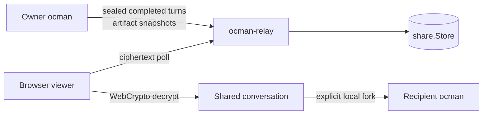
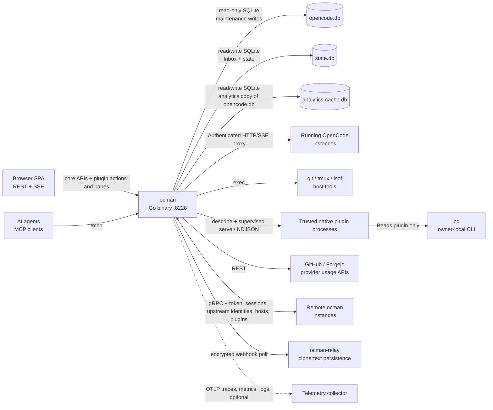
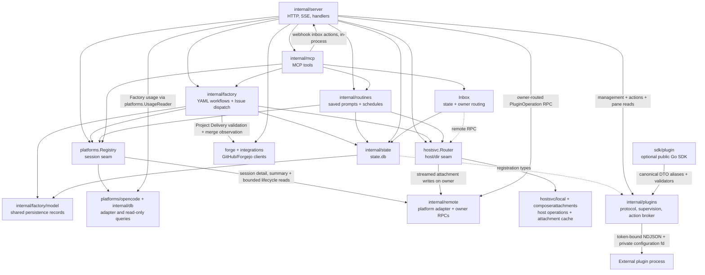
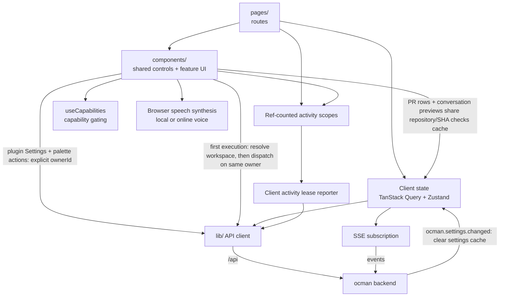

## Introduction

Ocman is a single Go binary that serves a React SPA and acts as a control
plane for coding-agent sessions. The main diagrams cover the system context
(what ocman talks to), the backend composition (the Go packages), the
session/event data flow, frontend composition, and plugin action flow. Detail
lives in the text below each diagram.

### Cross-machine conversation sharing

Ocman can publish a shared conversation through the standalone `ocman-relay`
binary. The relay stores only AES-256-GCM ciphertext through the `share.Store`
abstraction (disk today; object storage can implement the same
`Put`/`Get`/`List`/`DeletePrefix` contract). The per-share key stays in the URL
fragment, so it never reaches the relay.

```mermaid
flowchart LR
    Owner[Owner ocman] -->|sealed completed turns<br/>artifact snapshots| Relay[ocman-relay]
    Relay --> Store[(share.Store)]
    Viewer[Browser viewer] -->|ciphertext poll| Relay
    Viewer -->|WebCrypto decrypt| Thread[Shared conversation]
    Thread -->|explicit local fork| Local[Recipient ocman]
```

- Chunk zero is a complete snapshot; later chunks contain the latest
  completed turn and the viewer merges them as id-keyed upserts.
- The owner allocates sequence numbers. Nonces derive from those sequence
  numbers, and the share id plus sequence is authenticated as GCM AAD.
- Revocation deletes the relay prefix. The relay stores only a hash of its
  append/delete token and needs no database.
- Forking fetches and decrypts in the recipient's authenticated local ocman
  UI, lets the recipient choose a local project, and parks the transcript as
  an unsent composer draft. Imported text never runs automatically.
- Artifact shares reuse the relay but are written once: chunk zero is a sealed
  manifest (title, links, file list) and later chunks are the sealed file
  bytes. Ocman checks the relay's per-share byte and chunk limits before
  uploading, and deletes a half-written share on failure. See
  [Artifacts](../features/artifacts.md).

## 1. System context

Everything external that the ocman process touches.

```mermaid
flowchart LR
    Browser[Browser SPA<br/>REST + SSE] -->|core APIs + plugin actions and panes| Ocman[ocman<br/>Go binary :8228]
    Agent[AI agents<br/>MCP clients] -->|/mcp| Ocman
    Ocman -->|read-only SQLite<br/>maintenance writes| OCDB[(opencode.db)]
    Ocman -->|read/write SQLite<br/>Inbox + state| StateDB[(state.db)]
    Ocman -->|read/write SQLite<br/>analytics copy of opencode.db| Cache[(analytics-cache.db)]
    Ocman -->|Authenticated HTTP/SSE proxy| OCInst[Running OpenCode<br/>instances]
    Ocman -->|exec| Shell[git / tmux / lsof<br/>host tools]
    Ocman -->|describe + supervised serve / NDJSON| PluginExec[Trusted native plugin processes]
    PluginExec -->|Beads plugin only| Beads[bd<br/>owner-local CLI]
    Ocman -->|REST| APIs[GitHub / Forgejo<br/>provider usage APIs]
    Ocman <-->|gRPC + token: sessions, upstream identities, hosts, plugins| Remotes[Remote ocman<br/>instances]
    Ocman -->|encrypted webhook poll| Relay[ocman-relay<br/>ciphertext persistence]
    Ocman -.->|OTLP traces, metrics, logs, optional| Otel[Telemetry collector]
```

- **Browser SPA.** The only UI. It talks REST/SSE to the hub, never to
  remotes directly. `:8228` is the production `-addr` default; in dev the
  Vite server on :8228 proxies `/api` to the air backend on :8229.
- **Telemetry collector.** Optional OTLP/HTTP or gRPC export of traces, metrics,
  and batched Logrus logs through `internal/telemetry`. Logs retain structured
  fields and span context, console output stays enabled, and shutdown flushes
  all three signals. The bundled LGTM stack routes logs to Loki.
- **opencode.db.** Foreign data, opened read-only. The one exception is the
  user-started maintenance job (`internal/ocmaint`, Settings → Maintenance).
  It stops the managed instances, refuses while any other process holds the
  file, and moves old `summary.diffs` patches into a restorable dump.
  On an OpenCode v2 machine each connection gets TEMP views named `session`,
  `message` and `part` over v2's `session_v2`/`session_message` tables, so
  every query keeps its v1 SQL (`internal/db/v2views.go`).
- **state.db.** Ocman's own state: archive flags, routines and run history,
  permission approval provenance, live session commit observations, settings,
  Factory records, Inbox items, artifact metadata, remote tokens, and the last
  local projects-index snapshot. Artifact file bytes sit beside it in a
  SHA-256 content-addressed `artifacts/blobs/` directory. Inbox sends are owner-local and persist until recalled or archived
  by the user. Legacy `workflow_*` rows remain inert for manual recovery.
- **analytics-cache.db.** A disposable copy of opencode.db's message and
  session rows, stored beside state.db, which the analytics queries read.
  User-message attachments are stripped from the copy. A minimal tool-timing
  projection is refreshed in the same sync transaction as its messages,
  so warm analytics reads do not parse historical tool outputs. TPS divides
  output tokens by completed message time minus the union of tool intervals,
  including recorded permission/question waits. Missing tool timing excludes
  the sample. This is request throughput, including startup/prefill latency,
  rather than provider-side decode speed; elapsed-duration metrics keep tool time.
  Session message metadata, turn summaries, and the composer use the same
  calculation on loaded messages and parts. A stale copy gets a
  quick incremental sync before an analytics read; a read never waits on a
  sync already running. The first build and the 6-hourly full rebuild run in
  the background, and the rebuild time is persisted so restarts cannot
  postpone it. Delete the file and it is rebuilt
  (`internal/db/analytics_mirror.go`).
- **Provider usage APIs.** The subscription usage page reads OpenCode's local
  OAuth credentials server-side and returns only normalized quota windows;
  provider tokens and account identifiers never reach the browser.
- **Native plugin executables.** Startup and explicit rescans describe direct
  executables from the local plugin directory. Each describe has a fresh token,
  minimal environment, bounded output, and a fifteen-second deadline. Duplicate
  identities conflict; changed binaries lose approval. Discovery itself executes
  trusted code. Grants minimize brokered context, not operating-system access.
  See [Plugins](../features/plugins.md) for installation and operations.
- **Remote ocman instances.** The hub dials remotes over gRPC and re-exposes
  their sessions and hosts transparently. The owning remote enriches session
  detail with its persisted approvals and tees synthetic approval events into
  the gRPC event stream before the hub forwards them to the browser.
  Plugin catalog, management, health, actions and artifact reads use the same
  authenticated connection. Each machine discovers its own binaries and stores
  its own configuration and secrets. The hub never installs remote binaries.
- **Project identity.** Each owner enriches its project snapshot with Git fetch
  remotes inside the existing singleflight refresh. Loaded snapshots return
  immediately while background discovery runs; inventory projection reuses the
  enriched rows without running Git. Per-directory discovery also coalesces
  concurrent callers and caches successful results for five minutes. A failed
  refresh preserves the previous keys and snapshot and can retry immediately.
  Credential-free upstream keys normalize SSH and HTTP
  transport syntax, `.git` suffixes, host casing and default ports. The hub assigns
  a shared `projectKey` to checkouts connected by any common upstream, including
  chains through a checkout with multiple remotes. `/api/projects` keeps each
  owner's checkout row, counts and archive state. The browser groups those rows
  and their sessions by `projectKey`; project detail includes sessions from every
  matching host. Actions still target a specific owner and directory. Repositories
  without network remotes fall back to owner-scoped directories, with the existing
  worktree folding. Local filesystem remotes never identify cross-host projects.
- **Encrypted webhooks.** Providers submit plaintext to the relay's ingestion
  URL, where ocman encrypts a versioned age X25519 envelope. The relay
  persists ciphertext plus visible size/timing metadata; the owning local or
  remote ocman decrypts it, durably accepts it in `state.db`, claims routine
  dispatches, then acknowledges the relay. A lost acknowledgment is retried
  without duplicate scheduling.

## 2. Backend composition

The Go package graph, collapsed to the seams that matter.

```mermaid
flowchart TD
    Server[internal/server<br/>HTTP, SSE, handlers] --> Registry[platforms.Registry<br/>session seam]
    Server --> Router[hostsvc.Router<br/>host/dir seam]
    Server --> Routines[internal/routines<br/>saved prompts + schedules]
    Server --> Factory[internal/factory<br/>YAML workflows + Issue dispatch]
    Factory --> FactoryModel[internal/factory/model<br/>shared persistence records]
    Factory --> State
    State --> FactoryModel
    Factory --> Registry
    Factory --> Router
    Factory -->|Project Delivery validation + merge observation| Forge
    Routines --> Registry
    Routines --> Router
    Routines --> State
    Server --> MCP[internal/mcp<br/>MCP tools]
    MCP --> Factory
    MCP --> Inbox[Inbox<br/>state + owner routing]
    MCP --> Routines
    MCP -->|webhook inbox actions, in-process| Server
    MCP --> Registry
    Registry --> OC[platforms/opencode + internal/db<br/>adapter and read-only queries]
    Server -->|Factory usage via platforms.UsageReader| OC
    Registry -->|session detail, summary + bounded lifecycle reads| RP[internal/remote<br/>platform adapter + owner RPCs]
    Router --> Local[hostsvc/local + composerattachments<br/>host operations + attachment cache]
    Router -->|streamed attachment writes on owner| RP
    Server --> State[internal/state<br/>state.db]
    Inbox --> State
    Inbox -.->|remote RPC| Router
    Server --> Forge[forge + integrations<br/>GitHub/Forgejo clients]
    State -.->|registration types| Plugins[internal/plugins<br/>protocol, supervision, action broker]
    Server -->|management + actions + pane reads| Plugins
    Plugins -->|token-bound NDJSON + private configuration fd| PluginExec[External plugin process]
    Server -->|owner-routed PluginOperation RPC| RP
    PluginSDK[sdk/plugin<br/>optional public Go SDK] -->|canonical DTO aliases + validators| Plugins
```

- **internal/server.** The HTTP mux, SSE broadcast and fanout, around 60
  handler files, plus tmux, terminal, whisper, auto-approve and routine ticks.
- **Session summary reads.** Pinned sessions outside the recent window use
  `platforms.SummaryReader`, backed by `db.GetSessionSummary`. Remotes
  return the owner-local row through `SessionSummary` and stamp its compound
  platform on the hub. Older owners fall back to session detail. Session-list
  SSE invalidations trail by 150 ms, finish existing reads before refreshing,
  and retain one follow-up when another event arrives during the refresh.
- **Factory usage.** `/api/factory/epics/{id}/usage` joins durable attempt
  identities to `platforms.UsageReader`. The local OpenCode adapter reads
  descendant message metadata and reuses token and pricing calculations.
  The server deduplicates owner-qualified session IDs for Epic phase totals,
  retains retry history per Attempt, and flags unavailable reads as incomplete.
  Epic and Queue views poll these totals every ten seconds.
- **Follow-up queue.** `internal/queuesvc` drains one held message per turn.
  Each decision uses `platforms.LifecycleReader` for settled status and the
  latest message identity. The local adapter reads one session and its newest
  message, without parts, tree or costs. Remotes settle on the owner and return
  that same bounded DTO through `SessionLifecycle`. Older owners without the
  RPC fall back to session detail. A guarded sweep reads lifecycle under the
  session lock and checks guard generation before reusing that read.
  Idle-edge flushes still trust the edge regardless of the status read.
- **internal/plugins.** External wire DTOs, bounded NDJSON, version negotiation,
  handshake and stream-order validation, executable discovery, and description
  validation. `Server.StartOnListener` scans once; `RescanPlugins` repeats the scan
  and records identities, checksums, and conflicts in state. The server supervises
  one serve process per enabled local plugin from its private data directory, with
  bounded calls/output, cancellation, restart cutoff and process-group shutdown.
  Process health is durable; sensitive stderr stays bounded in local memory.
  Authenticated management routes expose catalog, health, grant approval and
  revocation, configuration validation/update, restart/retry, and data removal.
  Mutations and redacted stderr reads require localhost and safe browser origins.
  Configuration reaches the child on a private inherited descriptor before
  readiness; failed activation restores the last working public and secret values.
  Authenticated action list/invoke/download endpoints use the action broker. It
  filters context by each action's approved grants, requires host-issued confirmation
  tokens when declared, and returns only typed results. Grant changes serialize with
  dispatch and are checked again before results or artifact bytes are returned. See the
  [wire contract](https://forgejo.nousefreak.be/dries/ocman/src/branch/main/internal/plugins/README.md).
  The remote `PluginOperation` RPC accepts a closed set of host operations, never
  raw stdio messages. Both transports use the same lifecycle and action broker.
  Catalog identities are `(ownerId, description.id)`; nested capabilities and
  instances inherit that owner. Management and artifact endpoints take `ownerId`.
  Action requests distinguish the installation `ownerId` from `context.ownerId`.
  Project/session listings combine the owner's owner-scoped actions with the hub's
  hub-scoped actions. Owner-scoped actions run on the owner; hub-scoped actions run
  only on the hub. Global placements always resolve to the hub. Explicit disconnected
  project owners fail closed. Remote secret updates pass through without hub
  persistence, and responses contain secret presence only.
  Configuration writes are capped at 1 MiB of canonical JSON; catalog responses
  are capped at 16 MiB on both transports.
- **sdk/plugin.** Optional public Go lifecycle and action helpers reuse the canonical
  protocol DTOs and validators. `sdk/plugin/conformance` runs black-box executable
  tests, including host-broker grant checks. `examples/ocman-plugin-fixture` is the
  deterministic executable used by the supervisor integration tests. Plugins in
  other languages can implement the same NDJSON contract directly.
- **Plugin persistence.** `internal/state` stores discovered identities, capability
  instances, enablement, grants, health and public configuration in schema v91.
  Schema v92 adds operation receipts committed before action dispatch, preventing
  replay after a host restart even when the original outcome is unknown.
  Secret snapshots use separate `0600` files beside the configured database;
  plugin-owned data uses its own directory. Configuration checkpoints restore
  public values and secret references together. Disable and removal retain data;
  permanent deletion is explicit. Catalog reads expose secret-presence flags only.
- **internal/factory.** The independent Software Factory boundary. It stores
   Epics, Mols, typed Issues, dependencies, attempts, Formula revisions,
   Plan revisions, approvals, and materialization provenance in `state.db`.
   YAML Formulas declare named steps with prompts, configuration, and `needs`.
   They compile to canonical JSON; historical TOML revisions remain readable.
   Poured steps keep their frozen definitions in `factory_workflow_step`.
   Implementation is a group whose required children must succeed before checks
   or later approvals can proceed. Verification and delivery expand per changed
   project; dependent steps wait for every project instance of each prerequisite.
   A Plan session is instructed not to
   modify files, but its configurable permission rules may allow shell commands
   for research; approval of an exact revision automatically materializes the
   proposed Implementation Issues and dependencies atomically. As defined by
   [ADR 0008](../adr/0008-coordinate-factory-work-across-projects.md), an Epic
   owns an admitted local project set, each executable Issue targets one project,
   and each project has an independent shared branch, checkpoint, and Delivery
   lineage. Ready Issues launch configured worktree sessions in their target
   project. Each implementation handoff records the clean, pushed commit in its
   Attempt result; the next Attempt for that project freezes the checkpoint and
   target branch in its policy. Workflow Project Deliveries follow the declared
   checks and approvals before publishing each project's PR. Legacy revisions
   create deliveries progressively as their required project work completes.
   Forge observations satisfy merge-gated cross-project dependencies; a recorded
   merge makes later work create a successor instead of refreshing the Delivery.
   Delivery retries preserve completed implementation Issues.
   Failed or terminally blocked work can
   launch a read-only diagnosis session; its scoped `factory_unblock` MCP tool
   remains permission-gated in the conversation before reopening work or
   applying a graph mutation. Implementation agents can also pause behind a
   durable project-admission gate; human REST approval adopts the local project,
   records execution acknowledgement, and launches an additive scoped Plan,
   while rejection resumes the same session with feedback. The browser uses REST
   while agents use MCP.
   Routines are not involved.
- **Factory persistence.** Native `factory_*` tables own the graph and its
   provenance in `state.db`; they do not reference or alter routine tables.
- **internal/factory/model.** Dependency-neutral persistence records shared by
  `internal/factory` and `internal/state`. Factory owns their meaning; state
  only stores them, which avoids making Factory depend on its SQLite adapter.
- **platforms.Registry.** The session-scoped seam. One adapter per platform;
  remotes register as compound-ID platforms so handlers can't tell local from
  remote.
- **hostsvc.Router.** The directory-scoped seam (git, worktrees, tmux,
  projects and forge-repository detection/fetch). It resolves the owning host
  and delegates, the same transparency
  trick as the registry. Worktree sessions run in-app on the project's single
  opencode instance, one per project, ensured through
  `EnsureProjectOpencode`, with a per-session working directory. There is no
  opencode or tmux process per worktree. `EnsureProjectOpencodeResult` is
  runtime-neutral: callers use the full `Endpoint` URL (or its `Port()`) plus
  an opaque `ocruntime.Instance`. The owning host may use discovery once to
  adopt a healthy instance that started before its managed registry entry
  existed. `RestartProjectOpencode` stops and relaunches the tracked
  instance. `ReloadOpencode` requires a readable, matching server-default v2
  location directory before it calls the owning machine's v2
  `/api/location/reload` endpoint through the same Host/gRPC seam, retaining
  the process and running turns while refreshing configuration and the owner's
  cached catalogs. Pending permission and question prompts are cancelled.
- **internal/composerattachments.** Owner-local attachment cache storage and
  seven-day cleanup. HTTP uploads stream through `Host.SaveComposerAttachment`;
  remote owners receive a metadata packet followed by bounded byte chunks over
  gRPC, avoiding the unary message limit. Only the owner writes the file, and
  its returned path is referenced in the prompt. Interrupted/oversize uploads
  remove their partial file; multipart bodies are not spooled on the hub.
- **internal/ocruntime.** The runtime abstraction behind the managed launch
  path. A `Runtime` interface (`Launch`/`Probe`/`Stop`) hides how a project's
  opencode is hosted; the native-tmux implementation runs `opencode --port N`
  (v1, one per project) or `opencode serve --port N` (v2, one per machine,
  kept up by `RunMachineSupervisor`) on an ocman-allocated loopback port and
  probes authenticated `GET {endpoint}/config` for health. It is where the container runtime (epic
  #375) plugs in as a second implementation.
- **internal/ocv2.** OpenCode v2 compatibility. `ocapi.Auth.Transport` wraps
  every OpenCode HTTP client in `ocv2.Wrap`. On a machine whose `opencode` is v2,
  the wrapper answers v1 routes (sessions, messages, prompts, permissions,
  questions as v2 forms, catalogs, `/event` and `/global/event`) with v2
  `/api/*` calls. The SSE translator re-projects v2's typed events into v1
  `message.*`/`session.*` events. `ConvertMessage` is the single v2→v1 message
  converter: the HTTP layer, the event translator and `internal/db`'s TEMP
  views over `session_v2`/`session_message` all use it, so part ids agree
  everywhere. v1 servers are never probed.
- **platforms/opencode.** Wraps the read-only DB queries (`internal/db`) plus
  an HTTP client that attaches to live instances, with `lsof`-based discovery
  for instances started outside ocman. One process-wide `/global/event` stream
  per instance keeps pending permission and question state in memory across
  all session directories. The same live stream captures completed bash parts
  containing Git commit summaries and stores immutable observations in
  `state.db`; transcript reads never trigger capture.
- **internal/routines.** Validates and stores manual, timeout, one-time and
  cron routines. Manual and scheduled dispatch share the durable occurrence
  claim, launch a fresh managed session through `hostsvc.Router` and
  `sessionsvc`, and leave the run active until platform-neutral session status
  reports success or failure. Startup resumes observation of linked runs.
  Timeout schedules become an absolute due time when saved. Cron schedules
  use a five-field expression and IANA timezone. Webhook polling is an
  independent owner-local/remote delivery loop.
- **Legacy Workflow storage.** The `workflow_*` tables remain in `state.db` as
  inert historical data. No API, MCP tool, UI, or scheduler reads them. A DAG
  cannot be converted losslessly to one routine prompt, so recovery is a
  manual read-only SQLite export.
- **internal/mcp.** MCP handlers expose action-based `factory`,
  permission-gated `factory_unblock`, `inbox`, `webhooks`, and `routines` tools, read-only
  session inspection, and `embed_file`. File embedding uses signed tokens
  persisted in `state.db`.
- **Inbox.** The `inbox` MCP tool is deliberately limited to `help`, `send`, and
  `recall`. Sends write the owning host's `state.db`; remote sends and recalls
  cross the owner-routed gRPC seam. The browser alone lists, reads, and
  archives Inbox state through REST. Messages carry Permission, Factory, Routine,
  or Primary categories. The headless permission watcher creates owner-local
  actionable messages even when auto-approval is disabled. Successful replies,
  including TUI and automatic replies, archive them; a periodic reconciliation
  handles missed events and aborted requests. Permission replies use the existing
  session service with an explicit platform, including remote compound IDs.
  Routine completion writes its notification in the same transaction as the run
  outcome, and Factory deliveries explicitly use the Factory category.
- **internal/opencodeskills.** Extracts binary-embedded ocman skills into
  XDG data and installs only ocman-owned symlinks for OpenCode discovery.
  Retirement unlinks only the exact verified symlink and preserves extracted data.
- **internal/state.** Ocman's writable SQLite store: migrations, settings,
  routines and their immutable run snapshots, legacy inert Workflow rows,
  and the independent native Factory Issue graph.
- **forge and integrations.** Forge-agnostic types in `internal/forge`, per-forge
  HTTP clients in `internal/forge/{github,forgejo}`. PR/Issue handlers obtain repository
  identity from the owner Host, then use the hub clients for metadata.
- **internal/previewauth.** Machine-level credentials for private link
  previews. ocman is a personal tool, so every token and grant belongs to the
  hub machine (one fixed viewer ID, `machine`, keyed by this instance's ID),
  usable by any request with app access (auth cookie, or a direct un-proxied
  loopback client when auth is off). Personal tokens are pasted in Settings
  (`POST /api/previews/token`), checked with the provider's identify call and
  stored without expiry; OAuth sign-in (Slack, Jira, or any provider with an
  app) uses a one-time state, PKCE when supported, one exact redirect URI
  (`<public base>/api/previews/oauth/callback`) and same-origin return paths.
  Client secrets stay server-side; tokens are AES-GCM sealed per
  owner/provider/workspace with the row key as associated data, refreshed
  under a per-grant singleflight, and deleted on `invalid_grant`, a 401 or
  removal.
- **Preview ownership across remotes.** The hub holds every credential and
  makes every provider call, also for a remote's sessions; nothing is routed
  to the remote. An explicit `remoteId` that is not connected fails closed
  with a bare 503 before any credential or cache is touched.
- **internal/linkpreview.** Normalized previews behind
  `POST /api/previews/resolve` (text in, `Preview` list out; TS mirror in
  `frontend/src/lib/previews.ts`). Only *configured* providers register a
  `Resolver`; resolvers recognize known direct URLs and custom link rules
  carrying a `provider` (the rule's replacement link stays the client-side
  fallback), deduped by resource and capped at 20 per text. Metadata fetches go
  through `linkpreview.API`: the resolver's fixed API hosts, validated path
  segments, the stored token, no redirects, 1 MiB bodies, 10 s timeouts.
  Results are cached per owner/provider/workspace/resource with in-flight
  dedup, 4 concurrent fetches, a 60/min per-grant budget and `Retry-After`
  backoff. With several workspaces for one provider the service tries each
  and returns the first that previews. `GET /api/previews/providers` is the
  browser's whole view: each supported provider, whether it is configured,
  its link hosts, account display names, and the rule patterns routed to a
  configured provider. `useProviderPreviews` only posts text with a link on
  a configured host or a routed-rule match, so unconfigured links never cost
  a request. Cards carry no connect flow; Settings → Link previews manages
  tokens and sign-ins, and `ocman:preview-auth-changed` reloads previews.
- **Forge previews** (`linkpreview.Forge`, `internal/server/preview_forges.go`).
  GitHub, every https Forgejo host (tea logins, saved-token hosts and app
  hosts) and GitLab hosts (`gitlab.com`, saved-token and app hosts) resolve
  PR/issue/commit links. A saved token or sign-in wins; without one the
  resolver is a `linkpreview.Fallback` with the machine's env/CLI token
  (anonymous for GitLab), which previews private repositories for any
  request with app access (`WithOwnerAccess`) and public ones otherwise
  (repository visibility is checked before the resource is read).
  GitHub/Forgejo PR metadata includes `headSha`. A resolve request with
  `checksSha` accepts exactly one recognized PR URL and a validated SHA,
  then uses the same forge checks clients as the sidebar with the preview's
  selected credential and redirect-disabled HTTP client. These checks calls
  use the clients' 8 MiB response bound instead of `linkpreview.API`'s 1 MiB.
  The preview service caches checks for 15 seconds and retains its per-grant
  budget, concurrency limit and rate-limit backoff.
  Visible unfinished checks poll every 5 seconds with a cache bypass.
  Explicit refresh reloads PR metadata and bypasses the checks snapshot for
  its current head while retaining grant and
  rate controls. Checks HTTP 401 and ordinary 403 retain their status for token revocation
  and denial classification, and provider retry deadlines reach the backoff.
  Quota/secondary-limit 403 responses are classified as rate limits instead.
- **Slack previews** (`linkpreview.Slack`, opt-in via
  `OCMAN_SLACK_PREVIEW_CLIENT_ID/_SECRET`). A dedicated OAuth app yields a
  machine-wide *user* token (`user_scope`, bot tokens refused); conversation.v1
  bot tokens and grants are never used. `/archives/{channel}/p{ts}` links
  (plus `thread_ts` replies) resolve only when `auth.test`'s workspace URL
  matches the link host, and channels Slack reports private/DM/MPIM are
  denied before any message is read. Slack `ok:false` codes map onto the
  shared 401 (grant forgotten) / 403 / 404 / 429 handling.
- **Notion previews** (`linkpreview.Notion`, opt-in via
  `OCMAN_NOTION_PREVIEW_CLIENT_ID/_SECRET`). A public connection
  (`owner=user`, JSON token/revoke bodies with Basic auth) stores one grant
  per Notion workspace (or an internal integration token, identified via
  `GET /v1/users/me`); the shared pages are the whole permission model. Page links on notion.so / notion.com / app.notion.com /
  `*.notion.site` resolve by page ID to the API-returned URL; routed ticket
  identifiers run `POST /v1/search` and match titles by whole token. Several
  matches become `Choices` (state `ambiguous`), none is `not_found`. An
  unshared page is a 404 once the cache expires; a removed connection is a
  401 and forgets the grant.
- **Linear previews** (`linkpreview.Linear`, opt-in via
  `OCMAN_LINEAR_PREVIEW_CLIENT_ID`). Authorization code + PKCE with the
  `read` scope; the rotating refresh token is stored per Linear organization; a
  personal API key (`lin_api_…`, sent without `Bearer`) works without an app. One GraphQL query returns the organization and the issue;
  a link whose workspace `urlKey` differs from the grant's is `not_found`.
  GraphQL error codes (`AUTHENTICATION_ERROR`, `FORBIDDEN`, `RATELIMITED`,
  often on HTTP 400) map onto the shared 401 / 403 / 429 handling.
- **Jira previews** (`linkpreview.Jira`, opt-in via
  `OCMAN_JIRA_PREVIEW_CLIENT_ID`). Atlassian 3LO authorization code with
  `read:jira-work read:me offline_access`; one grant per
  Atlassian account (one rotating refresh token spans its sites). Each fetch
  lists `oauth/token/accessible-resources` and calls
  `api.atlassian.com/ex/jira/{cloudid}` for the site matching the link host,
  which is never contacted itself. An identifier found on several sites
  becomes `Choices`.
- **GitLab previews** (`linkpreview.GitLab`; `gitlab.com` by default, other
  hosts once they have a token or an `OCMAN_GITLAB_PREVIEW_APPS` app). One provider `gitlab:<host>` per instance
  (authorization code + PKCE, `read_api`), so grants never cross instances.
  Project paths are sent as one `%2F`-escaped segment
  (`API.WithEncodedSlashes`). Public projects preview anonymously after a
  visibility check; every call dials through a resolve-once, address-checked
  dialer (no loopback/link-local; no private ranges for gitlab.com).

## 3. Session and event data flow

See [Session and event data flow](../architecture-events/) for the sequence
diagram covering session reads, SSE activity updates, remote streams, and
routine dispatch. Sidebar activity updates arrive over global SSE without
changing row order. Terminal status events fetch the owner-qualified session's
durable completion timestamp, which ranks rows newest first.
Settled agent bash commands also produce `ocman.git.command` refresh hints for
the owning project's PR/Issue pane.

## 4. Frontend composition

```mermaid
flowchart TD
    Pages[pages/<br/>routes] --> Comp[components/<br/>shared controls + feature UI]
    Pages --> Stores[Client state<br/>TanStack Query + Zustand]
    Comp -->|PR rows + conversation previews share repository/SHA checks cache| Stores
    Comp -->|plugin Settings + palette actions: explicit ownerId| API
    Comp -->|first execution: resolve workspace, then dispatch on same owner| API
    Stores --> API[lib/ API client]
    Stores --> SSE[SSE subscription]
    Pages --> Scopes[Ref-counted activity scopes]
    Comp --> Scopes
    Scopes --> Reporter[Client activity lease reporter]
    Reporter --> API
    API -->|/api| Hub[ocman backend]
    SSE -->|events| Hub
    Hub -->|ocman.settings.changed: clear settings cache| Stores
    Comp --> Caps[useCapabilities<br/>capability gating]
    Comp --> Speech[Browser speech synthesis<br/>local or online voice]
```

- **Shared controls.** `Control` provides buttons, button groups, text inputs,
  textareas, search inputs, and selects with native form semantics and shared
  focus, disabled, and invalid styles. `IconButton`, `RefreshButton`, and
  `CopyButton` add action feedback; copying is confirmed only after success.
  `Pagination` shares previous/next controls while callers own indexing, page
  boundaries, totals, and requests.
- **New-conversation settings.** Settings → Sessions → Default agent starts at
  `build` and uses the shared searchable agent picker. Options come from agent-only
  reads of running local instances, scoped to their discovered directories and
  known local session directories. This includes project-defined agents on v2's
  single machine server without launching an instance. Hidden helpers and
  subagent-only agents are excluded. With no reachable instance, `build`, `plan`,
  and the saved preference remain selectable; remote-only catalogs are not read.
  Catalog discovery uses up to eight concurrent waiters within a five-second overall
  deadline, with a four-second per-target wait, and stops scheduling directories on
  cancellation. A stalled target
  does not block healthy catalogs or fallback choices. Shared port scans have an
  independent ten-second deadline;
  canceling a caller only cancels its wait, preserving other clients' live status.
  Shared agent fetches acquire one of eight global slots inside the singleflight
  leader and hold it through the HTTP response. Their two-second fetch deadline
  is independent of callers; slot admission waits at most ten seconds. Leaving
  Settings cannot cancel a composer's joined catalog read. Direct catalog callers
  also cancel only their own singleflight wait, without waiting for admission or
  the shared fetch to finish.
  A failed scan preserves the last successful snapshot for liveness readers and
  the auto-approval watcher for at most one minute without renewing the cache TTL.
  Sustained failure then expires old membership so stopped sessions lose stale
  busy status. A successful empty scan still removes disappeared instances.
  An explicit composer selection wins.
  `projectSettingsCache` shares the project settings fetch across conversations
  and sibling worktrees, keyed by owner and project root. Successful global or
  project setting saves broadcast `ocman.settings.changed`, which clears every
  cached project setting and refreshes mounted composers. Reconnecting SSE also
  clears the cache to recover missed saves; in-flight reads cannot restore stale
  settings after invalidation. The preference is stored in the hub's `state.db`.
  The header's project button opens `ProjectQuickSettings`, which reads the
  directory catalog without launching an instance and saves model, agent, and
  worktree defaults through `/api/project/settings`. These defaults use a
  separate owner-and-project-root setting key, preserving the ordered model
  fallback list. New conversations apply them after preparation; explicit
  composer selections win, including selections made while preparation waits.
- **Selection and overlays.** `SegmentedControl` uses native radios for filters.
  `Popover` shares the usage popover's compact, square-cornered shell with
  project quick settings. It portals to the document body, focuses the panel,
  handles outside-click and Escape dismissal, and restores trigger focus on
  Escape. Each caller positions the shell beside its trigger.
  `Tabs` and `DropdownMenu` wrap Radix UI for keyboard navigation, focus, and
  accessible associations, styled with the app's CSS. Tabs activate on click,
  Enter, or Space and unmount inactive content by default. Menu actions that open
  dialogs wait for the menu to restore focus so the dialog records a stable
  opener. `ModalHeader` and `ModalFooter` compose the existing `Modal`,
  `IconButton`, and `ButtonGroup`; `Modal` retains dismissal and focus handling.
- **Loading and errors.** `LoadingState` pairs a decorative `Spinner` with one
  status announcement and respects reduced-motion preferences. Structured
  skeletons remain separate. `InlineAlert` announces errors and can show a
  busy-aware retry button; `EmptyState` renders empty messages. Callers own
  loading, stale-data, error, and empty-state decisions.
- **Capability gating.** The UI never branches on platform identity. Features
  toggle via `/api/capabilities`, enforced by a lint script.
- **PR checks.** `lib/usePRChecks` polls only visible rows/cards until every
  check settles. Both views use `lib/prChecksCache`'s bounded localStorage
  cache, keyed by host/repository/SHA. Sidebar refresh also restarts checks
  on mounted conversation cards. Preview checks use the existing preview
  resolver endpoint so the conversation owner and preview credentials remain
  authoritative, including PR links outside the active project's repository.
- **New session target.** A new conversation is a client-only route,
  `/session/new?dir=…&remoteId=…&platform=…`, until its first prompt: no
  session, worktree or placeholder exists before that. `NewConversation`
  calls `POST /api/sessions/prepare`, which ensures the project's instance on
  the owning machine and returns the directory's agent, command and model
  catalogs (`Platform.DirectoryCatalog`, routed over gRPC for remotes), and
  `useWorktreeEligibility` reads the git-info branch, the owner's worktree
  list, and its verified default base ref to decide whether "New worktree"
  is offered. A repository without a usable base commit uses the current
  checkout, and automatic creation rejects it before launching OpenCode.
  Named bases use fully qualified refs to avoid branch/tag name collisions.
  Git probe failures propagate to the eligibility retry controls.
  Factory removes the exact namespace when recording a forge target branch.
  A detached default uses verified local `main` or `master` for delivery,
  otherwise preparation requires an explicit named target. Legacy recovery
  uses the same preparation path.
  The machine selector
  re-points the route; the target selector changes client state. Neither
  creates a session, and the draft survives under the shared `new` key.
  The first submission calls
  `POST /api/sessions/start`, which creates the session at the chosen target
  (an automatically named `session-<suffix>` worktree, or the current
  checkout), delivers a plain prompt server-side in the same request, and
  returns the real id; the client then navigates once. Until then the prompt
  renders as the conversation's first message with the server-reported start
  steps beneath it (`ocman.session.start.progress`, see the event flow); a
  failure removes only that request's prompt. Custom slash commands
  and shell submissions create the session the same way and run on it from
  the client; ocman built-ins need an existing conversation. A failed first
  send retains text, images, selections and error in the existing failed-send
  recovery path. Complete failed payloads stay in shared memory and notify
  mounted session views; only the best-effort localStorage copy is size-capped.
  Start locks are scoped to the draft generation so an older request cannot
  discard or unlock a newer draft's submission. Non-image files are retained
  until creation, uploaded to
  the real session, then sent; file/command/shell execution lives in
  child-keyed retry state, independently of the child's draft. Uncertain
  creation is never automatically replayed, and a late completion cannot
  override a newer route or clear its draft. Prepare/start preserve the
  localhost host-control guard. Afterwards the host has the
  `title` agent (its `small_model` or Haiku, in a temporary tool-denied
  session) title the bare prompt and renames the branch to that slug in
  place; the session title is left to OpenCode's own first-message titling.
  Naming failures keep `session-<suffix>`. Non-repository directories and
  directories already inside a linked worktree use the current checkout.
  Existing linked worktrees are also selectable. New conversations started
  from a worktree session open on the owner's main checkout, so every target
  stays available.
  Composer layout, dialogs, and props live in separate modules.
- **Read aloud.** Turn-end controls select original final-answer text parts and
  use browser speech synthesis. Opt-in autoplay waits for the idle reconciliation
  in the focused session tab. Voice preferences stay in browser storage; audio
  does not pass through the ocman backend.
- **Plugin Settings.** Settings uses shared setting rows and each host's
  `pluginManagement` capability. The hub probes remote plugin support with a
  bounded `available` RPC. Catalog, lifecycle, configuration, and stderr calls
  carry the selected `ownerId`; switching owners clears the previous view.
  Enabling requires checksum and grant review. Secret inputs are write-only,
  and failed configuration activation reloads persisted configuration and health.
- **Client state.** Shared Zustand stores hold broad session state. The
  Routines page polls definitions (each with its latest run) and webhook
  inboxes over REST, pages history only for the open drawer, and keeps its form
  and selected edits locally.
- **Plugin actions.** The command palette merges `action.v1` contributions for
  global, project, and session contexts. It sends opaque IDs and core route names
  through the authenticated backend, resolving older contexts independently of
  the recent-session search cache. Host dialogs render confirmation text and
  typed results, including owner-routed artifact downloads. Confirmation reuses
  the operation ID; failures and timeouts never trigger automatic invocation retries.
  Plugins supply no browser JavaScript or HTML.
- **Activity leases.** Mounted data subscriptions ref-count their scopes. One
  authenticated reporter renews the visible tab's lease, allowing the backend
  to skip view-serving session, project and metrics refreshes
  when every tab is hidden or gone. Scheduled routines and auto-approve do not
  consult these leases.
- **Plugin panes.** The right panel lists the active owner's enabled `pane.v1`
  declarations through `/api/plugins/panes`. Catalog reads never invoke the
  plugin. An open pane mounts its data query, calling `/api/plugins/panes/read`
  through the owner-routed `PluginOperation` RPC and the owner's grant checks.
  Closing it unmounts the query and cancels an outstanding read. Core renders
  bounded tree nodes as plain text. The optional Beads plugin owns all `bd`
  execution and parsing; no Beads operation remains on `hostsvc.Host`.
- **Factory.** `/factory` presents actionable approval Gates, Epics, Issues,
   Queue, and Configuration through TanStack Query. Browser mutations create
   native Epics, pour Mols, decide exact Plan revisions, and explicitly close
   completed containers. It can also launch a read-only unblock conversation;
   approved repairs return through the scoped MCP tool. The dispatcher records
   attempts before launching the prompt-constrained planning or configured
   implementation session.
   Factory MCP results can carry `[[ocman:card ...]]` markers. The tool-call
   renderer (and the markdown renderer, for markers in assistant text) turns
   them into creation or human-action cards using
   the same TanStack Query state and REST mutations as the Factory pages.
   Resolved actions disappear on refresh; rendering a marker never executes it.

## 5. Plugin action and remote projection flow

```mermaid
sequenceDiagram
    participant B as Browser palette / Settings / sidebar
    participant H as Hub HTTP handlers
    participant O as Installation owner
    participant A as internal/plugins action broker
    participant D as Owner state.db
    participant P as External plugin process

    B->>H: Catalog / management with ownerId
    H->>O: Local call or authenticated PluginOperation RPC
    O-->>B: Via hub: owner-qualified catalog, safe health, secret presence
    B->>H: List actions for placement and context owner
    H->>O: Owner-scoped actions; merge hub-scoped actions
    H-->>B: Typed action declarations
    B->>H: Invoke with installation ownerId and stable operationId
    H->>O: Route to installation owner
    O->>A: Validate enablement, scope, grants, confirmation
    opt Confirmation required
        A-->>B: Via owner and hub: confirmation text and bound token
        B->>H: Same invocation and operationId plus confirmed token
        H->>O: Route confirmed invocation
        O->>A: Revalidate and admit
    end
    A->>D: Commit operation receipt before dispatch
    A->>P: NDJSON action.v1 invoke with minimized context
    P-->>A: One typed terminal result
    A-->>B: Via owner and hub: authorized results / artifact handles
    B->>H: Download artifact with installation ownerId
    H->>O: Recheck grants and read owner-local artifact
    O-->>B: Via hub: attachment bytes
    B->>H: List enabled pane declarations with ownerId
    H->>O: Read approved pane metadata, no plugin invocation
    O-->>B: Via hub: owner-qualified pane declarations
    opt Sidebar pane open
        B->>H: Read pane with ownerId and directory
        H->>O: Route read, verify enablement and pane.project grant
        O->>P: NDJSON pane.v1 read
        P-->>O: Typed tree, no markup
        O-->>B: Via hub: validated and reauthorized tree
    end
```

- The installation owner supervises the process and owns its configuration,
  secret files, operation receipts, and in-memory results. The hub projects
  remote operations through a closed RPC, never raw plugin stdio.
- The browser can target a hub installation while carrying a remote project's
  context. These are separate owner identities; disconnected explicit project
  owners fail closed. Global placements resolve to the hub.
- Confirmation and result rendering belong to ocman. Calls are not replayed after
  crashes, and durable receipts prevent uncertain side effects from being repeated
  after host restart. Downloads recheck the installation's current grants.
- Only `action.v1` is shipped. Conversation-provider, platform-provider, iframe UI,
  relay inbox capability, registry/updates, signatures, sandboxing, Slack, and
  Codex remain future work. Existing core Inbox and webhook services do not imply
  a plugin capability for either.

See [Plugins](../features/plugins.md) for the operator and authoring guide.
