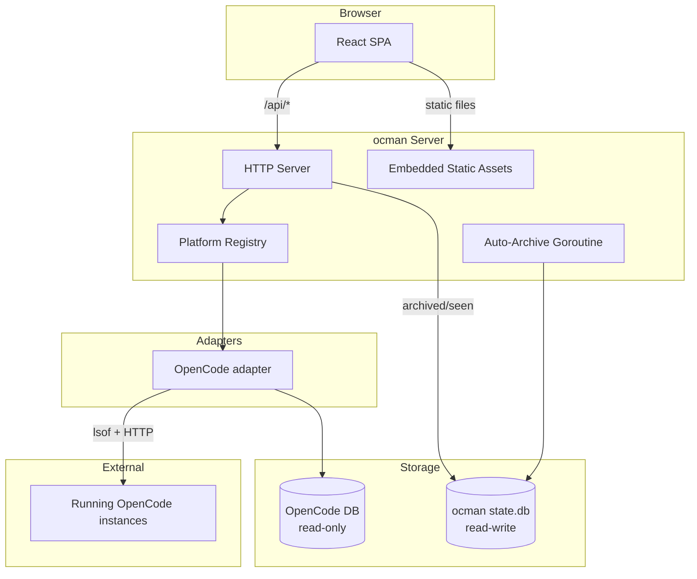

## Architecture



## Project structure

```
main.go                                    entrypoint (-addr, -db, -platforms, -auth-* flags)
frontend/                                  React + TypeScript + Vite SPA
e2e/                                       Playwright end-to-end suite
internal/platforms/                        Platform interface, Registry, common types/errors
internal/platforms/opencode/               OpenCode adapter (DB + HTTP proxy)
internal/db/                               SQLite queries against OpenCode's DB
internal/state/                            ocman's own writable state DB (archived/seen,
                                            auth secret, favorites, cached projects)
internal/server/                           HTTP server, API handlers, static file serving,
                                            OpenCode port discovery, auth
internal/webui/static/                     Vite build output (embedded into Go binary)
internal/tmux/                             tmux process control + opencode launchers
internal/term/                             in-app browser terminals (tmux windows + PTY bridge)
internal/whisper/                          voice transcription via local whisper-cpp
internal/autoapprove/                      LLM-judged permission auto-approve pipeline
spec/                                      Requirements + architecture notes per feature
```

## Development

### Requirements

- Go 1.24+
- Node.js 22+ (provided by `mise`)
- [pnpm](https://pnpm.io/) (provided by `mise`; pinned via `packageManager` in `frontend/package.json`)
- [mise](https://mise.jdx.dev/), which provides `air`, `node`, and `pnpm` (`mise install`)
- `tmux` on `PATH` for the in-UI launcher

> All Node-side commands use `pnpm`. `npm` is no longer supported: running
> `npm install` will not produce the expected `pnpm-lock.yaml`, and CI
> rejects it.

### Quick command reference

| Command                | Port | Live Reload | Use Case |
|------------------------|------|-------------|----------|
| `make dev`             | 8228 | Yes (HMR)   | Regular development |
| `make dev-prod-watch`  | 8228 | Manual refresh | Memory profiling, production testing |
| `make dev-prod`        | 8228 | No          | One-time production test |

### All commands

| Command                | Description |
|------------------------|-------------|
| `make dev`             | Backend (air) + frontend (vite dev) with HMR on :8228 |
| `make dev-prod`        | Backend (air) + frontend (vite preview of production build) on :8228 |
| `make dev-prod-watch`  | Backend (air) + frontend (vite preview, auto-rebuilds on changes) on :8228 |
| `make dev-backend`     | Go backend only (air, port 8229) |
| `make dev-frontend`    | Vite dev server only (port 8228) |
| `make test`            | `go test ./...`, `vitest run`, and the Playwright e2e suite |
| `make lint`            | `go vet`, `tsc -b`, `eslint`, and the platform-branching check |
| `make build`           | Production build (frontend then Go binary) |
| `make clean`           | Remove binary, tmp/, and static/assets/ |

### Build pipeline

1. `cd frontend && pnpm install --frozen-lockfile && pnpm build` builds the frontend into `internal/webui/static/`.
2. `go build -o ocman .` embeds `internal/webui/static/` via `//go:embed`.

Order matters: build the frontend before `go build`.

### Development workflows

Regular frontend development:

```bash
make dev
# → Instant HMR updates; best for UI iteration
```

Memory profiling or production testing:

```bash
make dev-prod-watch
# → Edit code → auto-rebuild → manually refresh browser
```

> Vite's preview mode has no HMR. The watcher rebuilds automatically but you refresh the
> browser yourself. That's deliberate: production builds are for testing, not rapid
> iteration.

## Tests

Three suites: Go tests (unit and integration), frontend tests in vitest, and a Playwright
end-to-end suite covering auth, the dashboard, composer, SSE streaming, and prompts. CI runs
all three on every PR, and `make test` runs them locally. Coverage is ratcheted, so new code
ships with tests.

## Platform-agnostic frontend

The frontend must not branch on `session.platform === 'opencode'` (or similar string comparisons).
UI capability gating goes through `/api/capabilities` and `useCapabilities()` instead.
`scripts/check-platform-branching.sh` enforces this, and `make lint` runs it. If you hit a false
positive, the pragma `// ocman:allow-platform-branch` suppresses the check on the next line. Use
it sparingly, for generic helpers that genuinely need the platform identity.
