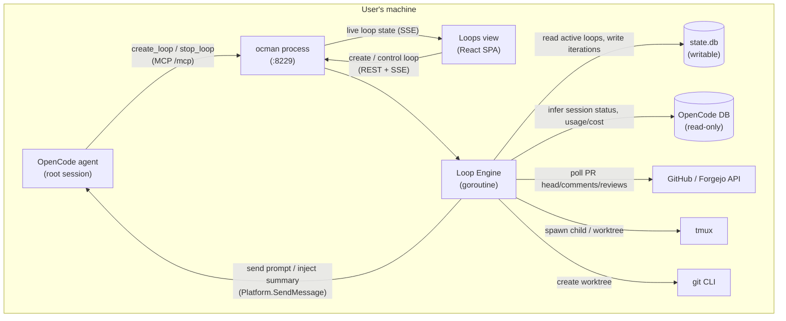
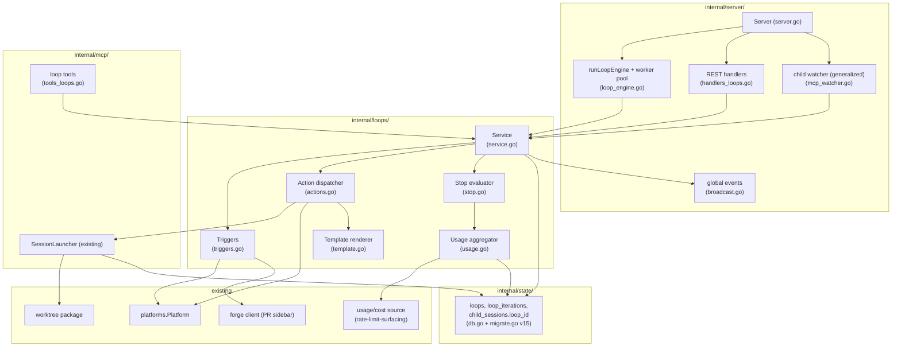
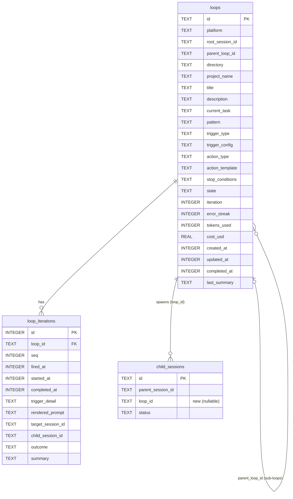
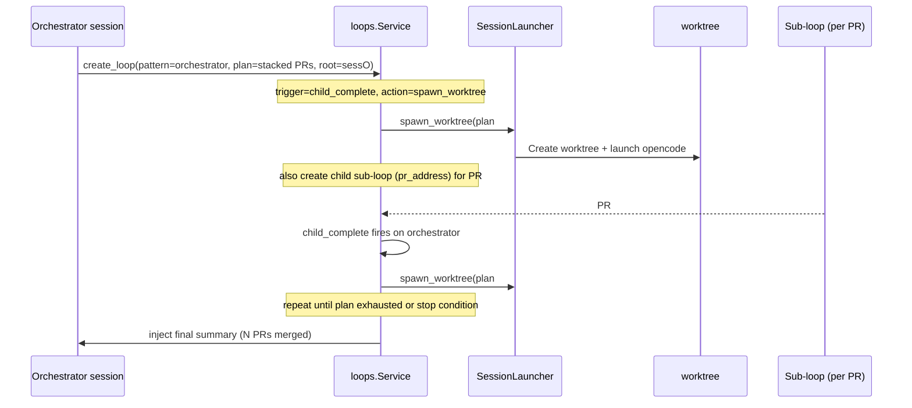

# Agent Loops - Architecture

## Overview

Agent Loops adds a **loop engine** to ocman that drives long-lived,
self-prompting orchestrations on top of the existing session-split machinery.
The design is **additive and reuse-first**: it generalizes the existing
one-shot child-session watcher (`internal/server/mcp_watcher.go`) into a
trigger→action engine, adds two `state.db` tables (and one column), a small set
of MCP tools, a server-side loop engine goroutine, and a capability-gated
frontend view. No existing behavior is removed: child sessions without a
`loop_id` keep their current report-once semantics.

The mental model:

```
trigger fires  →  check stop conditions  →  render action prompt  →  perform action
   (FR-2)            (FR-4, before action)        (FR-3)              (FR-3)
                                                                         │
                          record loop_iteration (FR-9)  ◄───────────────┘
                                                                         │
                          update loops counters, maybe inject summary into root
```

A loop is just a row in `loops` plus an audit trail in `loop_iterations`.
The engine is stateless between ticks — all loop state lives in `state.db`,
giving crash safety (NFR-3) for free.

The UI presents loops as **workflows**, not only as background jobs: each loop
has a project, trigger, action, current task/session, budget state, and a small
timeline/graph showing what fired, what ran, and what will be checked next.

---

## Context Diagram



---

## Architectural Decisions

### AD-1: Engine model — single shared tick engine

- **Status**: Decided
- **Context**: Loops need periodic evaluation. Options: (1) one shared engine
  goroutine ticking all loops; (2) one goroutine per active loop; (3) bolt onto
  the existing watchers.
- **Decision**: A single shared **loop engine goroutine** that ticks on a fixed
  interval, loads `active` loops from `state.db`, and evaluates each. Slow,
  potentially-blocking work (forge calls, worktree/tmux launch,
  `Platform.SendMessage`) is dispatched to a **bounded worker pool** so one slow
  loop cannot starve others (NFR-2).
- **Rationale**: Matches the existing watcher idiom (`runChildSessionWatcher`,
  `runAutoApproveWatcher`) — easy to reason about, easy to recover on panic
  (`runWithRecover`). State-in-DB means the tick is stateless and restart-safe.
  A worker pool restores the per-loop isolation that a goroutine-per-loop model
  would give, without unbounded goroutine growth.
- **Consequences**: New `internal/server/loop_engine.go` with
  `runLoopEngine(ctx)` started in `StartOnListener`. Per-loop concurrency is
  guarded by a per-loop "in-flight" flag (in-memory set keyed by loop id) so a
  long action does not double-fire on the next tick. The in-memory guard is only
  a tick-level optimization; durable idempotency comes from `loop_iterations`
  rows marked `pending` before side effects.

---

### AD-2: Trigger evaluation strategy

- **Status**: Decided
- **Context**: Four trigger types (FR-2) with different cadences:
  `child_complete`, `schedule`, `pr_event`, `turn_complete`.
- **Decision**: Each trigger type implements a small `Trigger` interface with a
  `ShouldFire(ctx, loop) (bool, detail, error)` method, evaluated on each engine
  tick. Cadence is enforced inside the trigger:
  - `child_complete` / `turn_complete` — reuse session-status inference from the
    OpenCode adapter (same code path as the existing watcher).
  - `schedule` — compares `now` against `last fired_at + interval_seconds`
    (floor 60s).
  - `pr_event` — polls the forge for the watched PR; fires on head-SHA change,
    unseen comment/review IDs, review-state change, or merge. Throttled to a
    per-loop minimum poll interval (default 30–60s).
- **Rationale**: A uniform interface keeps the engine generic; per-trigger
  throttling bounds both token burn and forge API usage. Reusing the existing
  status-inference and forge clients avoids new infra.
- **Consequences**: `internal/server/loop_triggers.go` (or
  `internal/loops/`, see AD-9). The engine tick interval can be short (e.g. 5s,
  matching the existing watcher) because each trigger self-throttles.
  Trigger implementations also return display metadata (`label`, `last_detail`,
  `next_check_at`) for the workflow UI.

---

### AD-3: PR triggers poll, not webhook (v1)

- **Status**: Decided
- **Context**: `pr_event` could be driven by polling the forge or by receiving
  webhooks.
- **Decision**: **Poll** the forge using the existing PR/Issue sidebar clients
  and auth. No webhook receiver in v1.
- **Rationale**: Polling reuses the sidebar's GitHub/Forgejo clients, env-var
  token + `gh`/`tea` fallback auth, and detection logic with zero new infra and
  no inbound network exposure (ocman is localhost-bound by default). The video's
  own examples poll every 5–10 minutes; 30–60s is more than adequate.
- **Consequences**: PR loops carry a small detection state (last seen head SHA,
  seen comment/review IDs, merge state) in `trigger_config`/`loop_iterations`.
  Counts are display data only. Webhooks are a future enhancement (documented in
  Out of Scope).

---

### AD-4: Generalize the existing child-session watcher

- **Status**: Decided
- **Context**: `mcp_watcher.go` already detects child terminal state and injects
  a one-shot result into the parent (`injectResultIntoParent`). This is exactly
  the `child_complete` edge a loop needs.
- **Decision**: Generalize the watcher so that when a completing child has a
  non-null `loop_id`, the completion is **routed to the loop engine** (which
  evaluates stop conditions and performs the next action) instead of (or in
  addition to) the one-shot injection. Children with `loop_id = NULL` keep the
  current report-once behavior unchanged.
- **Rationale**: Avoids two parallel completion-detection systems and preserves
  backward compatibility (NFR-5). The loop engine becomes the single owner of
  "what happens next" for loop-attached children.
- **Consequences**: `child_sessions` gains a nullable `loop_id` column (v15).
  `processChildSession` branches on `loop_id`. The loop's `child_complete`
  trigger consumes the terminal status; the loop decides whether to inject a
  summary into the root session.

---

### AD-5: Actions reuse `SessionLauncher` and `Platform.SendMessage`

- **Status**: Decided
- **Context**: Loop actions either re-prompt an existing session or spawn a new
  one. Both capabilities already exist.
- **Decision**:
  - `prompt_root` / `prompt_child` → `Platform.SendMessage(sessionID, prompt)`
    (the existing injection mechanism).
  - `spawn_child` → existing `split_to_session` path
    (`SessionLauncher.Launch`), with `loop_id` set.
  - `spawn_worktree` → existing `split_to_worktree` path
    (`SessionLauncher.LaunchWithWorktree`), with `loop_id` set.
- **Rationale**: Zero new launch/injection code; the loop layer is pure
  orchestration over stable primitives. Spawned children are automatically
  tracked in `child_sessions` and visible in existing UIs.
- **Consequences**: `SessionLauncher.LaunchRequest` gains an optional `LoopID`
  field (propagated to the `child_sessions` row). The composer is reused for
  spawn actions; for `prompt_*` actions the loop renders its own template
  (loop context, not session context).

---

### AD-5a: Action dispatch is DB-idempotent

- **Status**: Decided
- **Context**: A crash after `SendMessage`/worktree launch but before recording
  the iteration could otherwise repeat the same prompt on restart.
- **Decision**: Create the `loop_iterations` row with `outcome='pending'` and
  `started_at` before performing the side effect. On success/failure, update the
  same row with `target_session_id`/`child_session_id`, `outcome`, `summary`, and
  `completed_at`. If the engine sees an old `pending` row for the current loop
  sequence after restart, it does not send the action again; it marks the row
  `error` with a recovery summary or reconciles the child/session if possible.
- **Rationale**: One extra state in an existing table is the smallest reliable
  outbox. It avoids a new queue table and avoids trusting in-memory guards.
- **Consequences**: `ActionDispatcher` owns the pending-row lifecycle. The UI can
  show a pending/stale iteration rather than hiding uncertain work.

---

### AD-6: Stop conditions enforced pre-action; mandatory budgets

- **Status**: Decided
- **Context**: The video's headline risk is runaway token burn and loops going
  down a wrong path for a long time.
- **Decision**: Stop conditions are evaluated **before every action**, never
  after. A loop with no budget cannot be created (`create_loop` and the REST
  create endpoint reject it). Defaults: `max_iterations=25`, `max_duration=8h`,
  `error_streak=3`, and a required `max_cost_usd` (or `max_tokens`). When any
  condition trips, the loop transitions terminal and injects a final summary.
- **Rationale**: Pre-action evaluation guarantees an over-budget loop never
  sends "one more" prompt. Mandatory budgets make the dangerous default safe.
  The `error_streak` cutoff directly addresses the "wrong path for longer"
  failure mode.
- **Consequences**: `evaluateStopConditions(loop)` runs at the top of every
  action dispatch. Cost/token accounting (AD-7) must be current at that point.

---

### AD-7: Cost accounting via rate-limit-surfacing data

- **Status**: Decided
- **Context**: Budget enforcement needs per-loop aggregate token/cost across the
  loop's own actions and all descendant child sessions.
- **Decision**: Accounting reads from the **same usage source the
  rate-limit-surfacing feature uses** (`spec/opencode-rate-limit-surfacing/`),
  aggregated over the loop's session tree (root + tracked children, recursively
  for sub-loops). The aggregate is cached on the `loops` row
  (`tokens_used`, `cost_usd`) and refreshed each tick.
- **Rationale**: One source of truth; avoids a divergent second accounting path
  (NFR-4). The loop tree is already known from `child_sessions.loop_id` and
  `loops.parent_loop_id`.
- **Consequences**: A `loopUsage(loop)` helper walks the tree and sums usage.
  If usage data is unavailable for a session, the loop is treated conservatively
  (architect to choose: pause vs. continue with a warning — see Open Question).

---

### AD-8: Control surface — REST + MCP, localhost-only

- **Status**: Decided
- **Context**: Both the UI and the agent must create/inspect/control loops.
- **Decision**: A small REST API under `/api/loops` (used by the SPA) and a set
  of MCP tools (used by the agent), both backed by the same
  `internal/loops` service so behavior is identical. Both are localhost-only
  (`requireLocalhost`), consistent with existing MCP/tmux/worktree endpoints.
- **Rationale**: Single service, two transports — no behavior drift between the
  agent path and the UI path. Matches the existing pattern where MCP tools and
  server handlers share lower-level packages.
- **Consequences**: `internal/loops` exposes a `Service` with
  `Create/List/Get/Stop/Pause/Resume/Step`. `internal/mcp` tools and
  `internal/server/handlers_loops.go` both call it.

---

### AD-9: Package boundary — `internal/loops`

- **Status**: Decided
- **Context**: Loop logic could live in `internal/server` (next to the
  watchers) or in a dedicated package.
- **Decision**: A dedicated **`internal/loops`** package holds the loop domain:
  the `Service`, the trigger implementations, the action dispatcher, the stop-
  condition evaluator, and template rendering. `internal/server` owns only the
  thin pieces that need the `Server` (the engine goroutine wiring, the REST
  handlers, and SSE broadcasting). `internal/mcp` owns the tool adapters.
- **Rationale**: Mirrors the existing split where `internal/mcp` holds MCP
  domain logic and `internal/server` holds HTTP wiring. Keeps the loop engine
  unit-testable without spinning up the full server (NFR-5 testability).
- **Consequences**: `internal/loops` depends on `internal/state`,
  `internal/platforms`, `internal/db`, `internal/worktree`, and the forge
  client interface — but not on `internal/server`. The engine goroutine in
  `internal/server` injects these dependencies.

---

### AD-10: Live UI via existing SSE/global-events

- **Status**: Decided
- **Context**: The Loops view must update live without browser busy-polling.
- **Decision**: Loop state changes (iteration advance, state transition, budget
  crossing) publish events through the existing global-events broadcaster
  (`internal/server/broadcast.go`); the SPA subscribes via the existing SSE
  stream and updates a Zustand store.
- **Rationale**: Reuses the live-update infrastructure already used for session
  notifications; no new transport. Consistent with the project's SSE-rewrite
  direction (`spec/sse-rewrite/`).
- **Consequences**: A new event kind (e.g. `loop.updated`) is added to the
  broadcaster. The Loops view consumes it; capability-gated on `agentLoops`.

---

### AD-11: Workflow visualization uses audit data first

- **Status**: Decided
- **Context**: Users need to understand the workflow: project, trigger, action,
  current task, spawned sessions/worktrees, PRs/issues, and sub-loops.
- **Decision**: Build the workflow visualization from `loops`,
  `loop_iterations`, and linked `child_sessions`. V1 renders a vertical workflow
  timeline with expandable sub-loop/session nodes. A richer node graph can be
  layered on later without changing the API.
- **Rationale**: Timeline data is already required for auditability and is easier
  to make accurate. A graph library is overkill for v1.
- **Consequences**: `LoopDetail` includes `workflow_nodes` and `workflow_edges`
  derived server-side, plus the raw iteration list. The frontend can render a
  simple timeline now and a graph later from the same shape.

---

## Component Design

### Component Diagram



---

### `internal/loops/` package

#### `Service` (`service.go`)

- **Responsibility**: The loop domain API used by REST, MCP, and the engine.
  CRUD + lifecycle + one-tick evaluation.
- **Interfaces**:
  ```go
  type Service struct { /* state, platform, launcher, forge, usage, broadcast */ }

  func (s *Service) Create(ctx context.Context, spec LoopSpec) (Loop, error)
  func (s *Service) List(ctx context.Context, filter LoopFilter) ([]Loop, error)
  func (s *Service) Get(ctx context.Context, id string) (LoopDetail, error)
  func (s *Service) Stop(ctx context.Context, id string, cancelChildren bool) error
  func (s *Service) Pause(ctx context.Context, id string) error
  func (s *Service) Resume(ctx context.Context, id string) error
  func (s *Service) Step(ctx context.Context, id string) error

  // EvaluateOne runs one trigger→action cycle if due; used by the engine tick
  // and by Step. Returns whether an action was performed.
  func (s *Service) EvaluateOne(ctx context.Context, loop Loop) (advanced bool, err error)
  ```

#### `Trigger` (`triggers.go`)

- **Responsibility**: Per-type fire detection (AD-2).
- **Interfaces**:
  ```go
  type Trigger interface {
      ShouldFire(ctx context.Context, loop Loop) (fire bool, detail string, err error)
  }
  // childCompleteTrigger, scheduleTrigger, prEventTrigger, turnCompleteTrigger
  ```

#### `ActionDispatcher` (`actions.go`)

- **Responsibility**: Render the action prompt and perform `prompt_*` /
  `spawn_*` (AD-5). Records the `loop_iteration` and updates counters.

#### `StopEvaluator` (`stop.go`)

- **Responsibility**: Pre-action evaluation of all stop conditions (AD-6) and
  goal-predicate checks (FR-4). Returns the terminal state to transition to, or
  "continue".

#### `UsageAggregator` (`usage.go`)

- **Responsibility**: Sum token/cost across the loop's session tree from the
  rate-limit-surfacing source (AD-7).

#### `TemplateRenderer` (`template.go`)

- **Responsibility**: Render `action_template` with loop context (iteration,
  project/directory, last summary, PR number/comments, child statuses).

---

### `internal/server/loop_engine.go`

- **Responsibility**: `runLoopEngine(ctx)` — ticks (e.g. every 5s), loads
  `active` loops, dispatches `Service.EvaluateOne` to a bounded worker pool,
  guards against re-entry per loop, wrapped in `runWithRecover`. Started in
  `StartOnListener` alongside the existing watchers.

### `internal/server/handlers_loops.go`

- **Responsibility**: REST endpoints under `/api/loops` (localhost-only) that
  delegate to `loops.Service`. Adds workflow detail endpoints and `agentLoops`
  to `/api/capabilities`.

### `internal/server/mcp_watcher.go` (modified)

- **Responsibility**: When a completing child has `loop_id != NULL`, route to
  `loops.Service` (the loop's `child_complete` trigger) instead of the one-shot
  injection. Unchanged for non-loop children.

### `internal/mcp/tools_loops.go`

- **Responsibility**: `create_loop`, `list_loops`, `get_loop_status`,
  `stop_loop`, `pause_loop`, `resume_loop`, `step_loop` — thin adapters over
  `loops.Service`. Short descriptions; guidance lives in a skill.

---

## Data Model

### Entity Relationship Diagram



> All three tables live in `state.db`. References to OpenCode sessions
> (`root_session_id`, `target_session_id`, `child_sessions.id`) are logical;
> no SQLite FK crosses into the read-only OpenCode DB.

### Current Migration Baseline

The current latest migration is v14 (multi-remote). Agent loops use v15.

### Migration v15

- Create `loops` (indexes on `state`, `root_session_id`, `directory`).
- Create `loop_iterations` (index on `(loop_id, seq)`).
- `ALTER TABLE child_sessions ADD COLUMN loop_id TEXT` (nullable; default NULL
  preserves existing one-shot behavior).

New `state.DB` methods: `InsertLoop`, `UpdateLoop`, `GetLoop`, `ListLoops`,
`ListActiveLoops`, `SetLoopState`, `InsertLoopIteration`,
`ListLoopIterations`, and `ListChildSessionsByLoop`; plus extending
`InsertChildSession` to carry `loop_id`.

---

## API Design

### REST (SPA, localhost-only)

| Method | Path | Purpose |
|---|---|---|
| `POST` | `/api/loops` | Create a loop (`LoopSpec` body) |
| `GET` | `/api/loops?session=…&dir=…` | List loops with live counters |
| `GET` | `/api/loops/{id}` | Loop detail + iteration timeline + child tree |
| `GET` | `/api/loops/{id}/workflow` | Derived workflow nodes/edges for visualization |
| `POST` | `/api/loops/{id}/stop` | Stop (`?cancelChildren=true|false`) |
| `POST` | `/api/loops/{id}/pause` | Pause |
| `POST` | `/api/loops/{id}/resume` | Resume |
| `POST` | `/api/loops/{id}/step` | Run one cycle then pause |

### MCP tools

```json
{
  "name": "create_loop",
  "description": "Create a self-driving loop that prompts agents on a trigger until a stop condition is met.",
  "inputSchema": {
    "type": "object",
    "required": ["root_session_id", "pattern", "trigger", "action_type", "action_template", "stop_conditions"],
    "properties": {
      "root_session_id": { "type": "string" },
      "title": { "type": "string" },
      "directory": { "type": "string" },
      "pattern": { "type": "string", "enum": ["pr_address", "orchestrator", "heartbeat", "linear"] },
      "trigger": { "type": "object", "description": "type + config (e.g. interval_seconds, pr_number)" },
      "action_type": { "type": "string", "enum": ["prompt_root", "prompt_child", "spawn_child", "spawn_worktree"] },
      "action_template": { "type": "string" },
      "stop_conditions": {
        "type": "object",
        "required": ["max_iterations"],
        "properties": {
          "max_iterations": { "type": "integer" },
          "max_cost_usd":   { "type": "number" },
          "max_tokens":     { "type": "integer" },
          "max_duration":   { "type": "string", "description": "e.g. \"8h\"" },
          "error_streak":   { "type": "integer" },
          "goal_predicate": { "type": "string" }
        }
      }
    }
  }
}
```

`list_loops`, `get_loop_status`, `stop_loop`, `pause_loop`, `resume_loop`,
`step_loop` take `root_session_id` (for list) or `loop_id` (for the rest) and
return compact status text (state, iteration, budget consumed vs cap, child
count, last summary).

`create_loop` also requires at least one budget cap (`max_cost_usd` or
`max_tokens`) even though JSON Schema cannot express that cleanly in the compact
tool description.

### Workflow API shape

```json
{
  "loop": { "id": "loop_1", "title": "Watch PR #42", "projectName": "ocman", "directory": "/src/ocman" },
  "nodes": [
    { "id": "trigger:loop_1", "type": "trigger", "label": "PR #42 comments", "state": "active" },
    { "id": "iter:12", "type": "iteration", "label": "Addressed 3 comments", "state": "ok" },
    { "id": "session:abc", "type": "session", "label": "Implementer", "state": "waiting" }
  ],
  "edges": [
    { "from": "trigger:loop_1", "to": "iter:12", "label": "fired" },
    { "from": "iter:12", "to": "session:abc", "label": "prompt_child" }
  ]
}
```

Node types: `loop`, `trigger`, `iteration`, `session`, `worktree`, `pr`,
`issue`, `budget`, `sub_loop`. Keep the schema boring: labels and links first,
layout in the frontend.

### `/api/capabilities` extension

```json
{
  "platforms": [...],
  "worktreeSessions": true,
  "mcpServer": { "enabled": true, "url": "http://localhost:8229/mcp" },
  "agentLoops": { "enabled": true }
}
```

`agentLoops.enabled` is true when the OpenCode adapter is active and the loop
engine is running.

---

## UI Design

### Views

- **Project Loops** (`/project/<dir>/loops`): grouped cards for active/recent
  loops in one project. This is the main working view.
- **Global Loops** (`/loops`): cross-project list with filters for project,
  state, pattern, trigger, and budget warning. Useful when many worktrees are
  running.
- **Loop Detail** (`/project/<dir>/loops/<id>`): header + budget strip + controls,
  workflow timeline, child session tree, and raw iteration audit log.

### Card Fields

- Title, current task, pattern, state, project name, directory basename.
- Trigger label, last fired detail, next check/fire time.
- Action type and target (`root`, child session, worktree, PR).
- Iteration count, elapsed time, cost/tokens vs budget, error streak.
- Last summary and current in-flight/pending action if any.

### Workflow Visualization

V1 should be a vertical flow, not a canvas:

```text
PR #42 comments trigger
  -> iteration 12: prompt_child "address 3 comments" [ok]
     -> implementer session abc [waiting]
        -> PR #42 head changed [next check in 45s]
```

Sub-loops render as expandable rows. A richer DAG/canvas only becomes useful if
real workflows become hard to read in this timeline.

---

## Sequence Diagrams

### PR-comment auto-address loop

```mermaid
sequenceDiagram
    participant UI as PR sidebar / Loops view
    participant SVC as loops.Service
    participant ENG as Loop Engine
    participant FORGE as Forge (GitHub/Forgejo)
    participant STOP as Stop Evaluator
    participant PLAT as OpenCode Platform
    participant IMPL as Implementer session

    UI->>SVC: create_loop(pattern=pr_address, pr_number=42, root=sessX)
    SVC->>STATE: INSERT loops (state=active)
    loop engine tick (self-throttled)
        ENG->>SVC: EvaluateOne(loop)
        SVC->>FORGE: poll PR #42 (head SHA, comments, reviews)
        alt new comments or new head
            SVC->>STOP: evaluate stop conditions (budget, iters, streak)
            alt within budget
                SVC->>PLAT: SendMessage(IMPL, "address these review comments: …")
                SVC->>STATE: INSERT loop_iteration; iteration++
                SVC-->>UI: SSE loop.updated
            else over budget / approved+merged
                SVC->>STATE: state=completed/stopped; inject summary into root
            end
        else no change
            Note over SVC: skip (no token spend)
        end
    end
```

### Orchestrator with dynamic sub-loops (stacked PRs)



### Heartbeat loop

```mermaid
sequenceDiagram
    participant ENG as Loop Engine
    participant SVC as loops.Service
    participant PLAT as OpenCode Platform
    participant ROOT as Root session

    loop every tick
        ENG->>SVC: EvaluateOne(loop)
        alt now >= last_fired + interval_seconds
            SVC->>SVC: evaluate stop conditions
            SVC->>PLAT: SendMessage(ROOT, rendered heartbeat prompt)
            SVC->>STATE: INSERT loop_iteration; iteration++
        else not due
            Note over SVC: skip
        end
    end
```

---

## File Structure

```
internal/
  loops/
    service.go         # Service: Create/List/Get/Stop/Pause/Resume/Step/EvaluateOne
    triggers.go        # Trigger interface + 4 implementations
    actions.go         # action dispatch (prompt_*/spawn_*) + iteration recording
    stop.go            # stop-condition + goal-predicate evaluation
    template.go        # action-template rendering with loop context
    usage.go           # token/cost aggregation over the loop tree
    types.go           # Loop, LoopSpec, LoopDetail, LoopFilter, StopConditions
    workflow.go        # derive workflow nodes/edges from loops + iterations
    service_test.go
    triggers_test.go
    stop_test.go

  mcp/
    tools_loops.go     # create_loop/list_loops/get_loop_status/stop/pause/resume/step
    tools_loops_test.go

  server/
    loop_engine.go     # runLoopEngine goroutine + bounded worker pool
    handlers_loops.go  # /api/loops REST + workflow endpoint + agentLoops capability
    mcp_watcher.go     # MODIFIED: route loop-attached child completion to Service
    loop_engine_test.go

  state/
    db.go              # MODIFIED: loop + iteration methods; child_sessions.loop_id
    migrate.go         # MODIFIED: migrateToV15

frontend/
  src/
    pages/Loops.tsx            # /project/<dir>/loops view (capability-gated)
    components/LoopCard.tsx     # state, iteration, budget gauge, child tree, controls
    components/LoopTimeline.tsx # iteration activity feed / workflow visualization
    components/LoopCreate.tsx   # pattern-preset create flow (palette + button)
    stores/loopsStore.ts        # Zustand store; SSE-driven
    .opencode/skills/ocman-agent-loops/SKILL.md   # loop policy/guidance for the agent
```

---

## Dependencies

| Dependency | Purpose | Action |
|---|---|---|
| `github.com/mark3labs/mcp-go` | MCP tool registration | Already present (session-split) |
| Forge clients (GitHub/Forgejo) | `pr_event` triggers | Reuse from PR/Issue sidebar |
| `git`, `tmux`, `opencode` CLIs | spawn actions | Already required |
| Usage/cost source | budget enforcement | Reuse rate-limit-surfacing data |

No new third-party dependency is required.

---

## Implementation Plan

### Step 1 — State (migration v15)

Add `migrateToV15`: `loops`, `loop_iterations`, and
`child_sessions.loop_id`. Add `state.DB` loop/iteration methods and extend
`InsertChildSession`. Table-driven tests in `db_test.go`.

*Why first*: everything depends on the schema; isolated; no new deps.

### Step 2 — `internal/loops` domain (no engine, no HTTP)

Implement `types.go`, `template.go`, `stop.go`, `usage.go`, `triggers.go`,
`actions.go`, `service.go`. Unit-test each with fakes (fake platform, fake
forge, in-memory state). `EvaluateOne` is fully testable without a server.

*Why second*: pure domain logic; the riskiest behavior (stop enforcement,
trigger throttling, action dispatch) gets isolated tests.

### Step 3 — Engine goroutine + child-watcher routing

Add `loop_engine.go` (`runLoopEngine` + worker pool) and wire it into
`StartOnListener`. Modify `mcp_watcher.go` to route loop-attached child
completion to `Service`. Tests in `loop_engine_test.go`.

*Why third*: depends on Steps 1–2; closes the autonomous loop.

### Step 4 — REST + capabilities

Add `handlers_loops.go` (`/api/loops`, localhost-only) and `agentLoops` in
capabilities. Integration tests using the shared `fakePlatform`.

*Why fourth*: gives the UI a backend to talk to.

### Step 5 — MCP tools

Add `tools_loops.go` over `loops.Service`; register in the MCP server. Add the
`ocman-agent-loops` skill for policy. Tests via `mcptest`.

*Why fifth*: lets the agent author/control loops; reuses Step 2/4.

### Step 6 — Frontend Loops view

`Loops.tsx`, `LoopCard.tsx`, `LoopTimeline.tsx`, `LoopCreate.tsx`,
`loopsStore.ts`. SSE-driven live updates; capability-gated. Add project and
global loop views, the workflow timeline, `/loop` palette command, and the
"Watch this PR (loop)" sidebar action. vitest + Playwright e2e (stable locators
/ `data-testid`).

*Why sixth*: the observability/control differentiator; depends on Steps 4–5.

### Step 7 — Docs

Update `AGENTS.md` with a Loops section (patterns, tools, safety defaults) and
document the new MCP tools + capability flag.

---

## Risks and Mitigations

| Risk | Likelihood | Impact | Mitigation |
|---|---|---|---|
| Runaway token burn | High | High | Mandatory budgets, pre-action stop checks (AD-6), prominent cost UI, `error_streak` cutoff |
| Loop goes down wrong path for hours | Medium | High | `error_streak`, `max_duration`, one-click Stop within one tick |
| Slow forge call starves engine | Medium | Medium | Bounded worker pool; per-loop in-flight guard (AD-1) |
| Double-fire after restart | Medium | High | State-in-DB, idempotent iteration advancement, recorded iteration before action |
| Forge rate limits from polling | Medium | Medium | Per-loop poll throttle (30–60s), reuse existing auth/quota handling |
| Cost data unavailable for a session | Low | Medium | Conservative handling (Open Q3): pause loop with warning rather than run blind |
| Context window blowup on linear re-prompt | Medium | Medium | Configurable re-prompt vs fresh-session (Open Q6); surface in UI |
| Engine goroutine panic | Low | Medium | `runWithRecover` per tick (existing pattern) |
| Unattended merges to prod | Low | High | No auto-merge to protected branches without explicit per-loop opt-in |

---

## Open Questions

1. **Worker-pool sizing / global active-loop cap** — pick defaults that bound
   resource use without throttling normal use (NFR-2). *Implementer to tune.*

2. **Goal-predicate kinds for v1** — deterministic forge checks (PR merged) are
   safe and cheap; model-judged completion adds cost and nondeterminism.
   Recommend v1 = deterministic predicates + an agent-emitted "done" marker;
   defer model-judged predicates. *Confirm.*

3. **Cost-data-unavailable policy** — pause-with-warning vs continue-with-
   estimate. Recommend pause-with-warning (fail safe). *Confirm.*

4. **Sub-loop reporting topology** — recommend: sub-loops report to their parent
   loop; the parent decides what to surface to the root session; the Loops view
   renders the full tree regardless. *Confirm.*

5. **Linear-loop default (re-prompt vs fresh session)** — recommend re-prompt
   the root session by default (continuity), with a configurable "fresh session
   per iteration" mode for long-running goals to avoid context blowup. *Confirm.*

6. **Iteration retention** — cap `loop_iterations` rows per loop (e.g. keep last
   N + always keep terminal summary) and/or prune terminal loops' history after
   a retention window. *Specify.*

7. **Auto-approve coupling** — unattended loops need headless permission
   auto-approval. Recommend: a loop may opt in to enabling auto-approve for the
   sessions it drives, scoped to those sessions and revoked when the loop ends;
   off by default. *Specify the exact scoping against `autoapprove_watcher.go`.*

8. **Webhook upgrade path** — confirm the `pr_event` trigger interface is shaped
   so a future webhook source can replace polling without schema changes
   (it should: detection state lives in `trigger_config`/iterations). *Confirm.*
