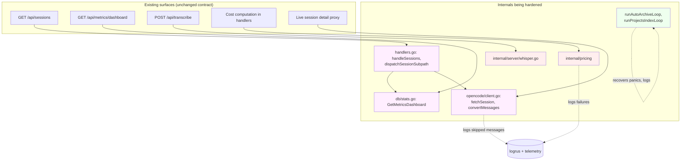

# Backend Hardening — Architecture

## Overview

This is a quality / risk-reduction pass on the Go backend. The work is
delivered as a sequence of small, self-contained steps. Each step adds
tests, makes silent failures observable, or adds a thin abstraction
around a global so it can be tested in isolation. There are no new
features, no schema changes, and no API contract changes.

The architecture document below explains the design choices that are
shared across multiple steps (the test-seam pattern, the executor
interface, the routing table), then walks each step's component design
in detail.

## Context Diagram



Red boxes have **no direct tests today**. Pink boxes are **tested only
indirectly**. Green boxes are **panic-unsafe** loops. By the end of
this spec, every box has at least one direct test, and the loops
panic-recover.

## Architectural Decisions

### AD-1: Constructor-plus-package-defaults pattern for globals

- **Status**: Decided
- **Context**: Several modules (`pricing`, `whisper`) use
  `sync.Once` + a package-level state struct. This makes them
  impossible to test in isolation: you cannot reset the `sync.Once`,
  you cannot inject a fake HTTP client or fake `exec` runner.
- **Decision**: Introduce a `New(...)` constructor on each affected
  module that returns a `*Pricing` (or `*Whisper`) value with the
  dependencies wired in. Keep the package-level functions
  (`Load`, `Lookup`, `CalcCost`, `transcribeAudio`) as **thin
  wrappers around a package-level default instance**. Tests use
  the constructor; production code keeps calling the package-level
  functions.
- **Rationale**:
  - Zero churn at call sites.
  - Tests get full isolation: each test creates its own instance.
  - The default instance is initialised lazily on first use,
    matching the current `sync.Once` behaviour.
- **Consequences**:
  - We add ~30 lines of constructor + struct boilerplate per module.
  - The `sync.Once` is preserved for the package-level default
    only.

### AD-2: Executor interface for shell-out tests

- **Status**: Decided
- **Context**: `whisper.go` shells out to `whisper` and `ffmpeg`. We
  cannot run the real binaries in tests.
- **Decision**: Introduce a small `executor` interface in
  `internal/server`:

  ```go
  type executor interface {
      LookPath(name string) (string, error)
      Run(ctx context.Context, name string, args ...string) ([]byte, []byte, error)
      // returns stdout, stderr, error
  }
  ```

  Production uses an `osExecutor` backed by `os/exec`. Tests use a
  `fakeExecutor` that records calls and returns canned output. The
  interface lives in the `server` package next to `whisper.go`. We do
  **not** create a new package for it — the interface is small and
  has only one consumer right now.
- **Rationale**:
  - Zero new dependencies.
  - Matches the existing `tmuxRunner` pattern already used in
    `tmux.go`.
- **Consequences**:
  - One new interface, two implementations, ~50 lines.
  - If a future module needs to shell out, it can reuse this
    interface or define its own — no decision is forced now.

### AD-3: Routing table for `dispatchSessionSubpath`

- **Status**: Decided
- **Context**: `dispatchSessionSubpath` is a 110-line hand-rolled URL
  router with nested switches. Every supported sub-path is encoded
  inline. There is no single place to enumerate "every route", which
  makes both code review and testing harder.
- **Decision**: Refactor `dispatchSessionSubpath` to dispatch via a
  package-level routing table:

  ```go
  type sessionSubRoute struct {
      method  string // "GET" or "POST"
      pattern string // e.g. "messages", "messages/{id}/parts"
      handler func(s *Server, w http.ResponseWriter, r *http.Request, sessionID string)
  }

  var sessionSubRoutes = []sessionSubRoute{
      {"GET",  "messages",                s.handleSessionMessages},
      {"GET",  "messages/{id}/parts/{partID}", s.handleSessionPart},
      {"POST", "send",                    s.handleSessionSend},
      // ...
  }
  ```

  `dispatchSessionSubpath` becomes a small loop that matches the
  request against the table and calls the handler.
- **Rationale**:
  - The routing table is the single source of truth FR-6 needs.
  - The test enumerates the table and exercises each route.
  - Adding a new sub-path is one line in the table.
- **Consequences**:
  - The pattern matcher is the only new code (small — supports
    literal segments and `{name}` placeholders).
  - Existing handlers' signatures change slightly (they receive
    the parsed `sessionID` and any path params as arguments
    instead of re-parsing). This is a mechanical change.
- **Alternative considered**: Keep the existing nested switch and
  test it from the outside via integration tests. Rejected because
  it does not give us the "single source of truth" property and
  every new sub-path would still require multiple edits.

### AD-4: Test-only HTTP fake for OpenCode adapter

- **Status**: Decided
- **Context**: `fetchSessionFromOpenCodeCtx` and friends call the
  OpenCode HTTP API. There is no test for the full pipeline.
- **Decision**: Add a small `httptest.Server`-based fake in
  `internal/platforms/opencode/testfake_test.go` (note: `_test.go`
  suffix — it is only built during tests). The fake exposes:

  ```go
  type opencodeFake struct {
      server   *httptest.Server
      Sessions map[string]json.RawMessage
      Messages map[string][]json.RawMessage
      // ... other endpoints as needed
  }

  func newOpencodeFake(t *testing.T) *opencodeFake { ... }
  ```

  The fake routes requests on URL prefix and returns whatever the
  test put into its maps. `httptest.Server` gives us a real
  `http.Client`-reachable URL.
- **Rationale**:
  - No need to mock at the `http.RoundTripper` level — `httptest`
    is more idiomatic and matches the existing test patterns.
  - The fake is reusable across `client_test.go`,
    `operations_test.go`, and any future test in the package.
- **Consequences**: One new test file, ~150 lines. No production
  code changes.

### AD-5: Test seams via struct fields, not package-level vars

- **Status**: Decided
- **Context**: `internal/platforms/opencode` currently uses
  package-level vars (`discoverPortsImpl`, `pendingPromptCacheTTL`,
  `pendingPromptCache`) as test seams. Tests mutate these globals,
  which is unsafe under `-race -p 4`.
- **Decision**: Move the seams onto the existing `Adapter` struct
  (or its near-equivalent — the package's main entry point). The
  seams become struct fields with sensible defaults wired in
  `New(...)`. The package-level wrappers continue to use a default
  instance.
- **Rationale**:
  - Eliminates the parallel-test data race.
  - Matches AD-1.
- **Consequences**:
  - Each test instantiates an `Adapter` (or equivalent) with the
    fakes it needs.
  - The package-level `discoverPortsImpl` global goes away.
- **Alternative considered**: Wrap the existing globals in a
  `sync.Mutex`. Rejected — it papers over the issue and keeps the
  testability problem.

### AD-6: Logrus test hooks for log assertions

- **Status**: Decided
- **Context**: FR-3, FR-9, FR-11 all require asserting that a log
  line is emitted. The project already uses `logrus`.
- **Decision**: Use `github.com/sirupsen/logrus/hooks/test` (it
  ships with logrus, no new dep). Tests register a hook on the
  logger used by the system under test, exercise the code, and
  assert the captured log entries.
- **Rationale**:
  - Zero new dependencies.
  - Standard pattern for testing logrus.
- **Consequences**: A small helper in the test package to attach
  and detach the hook. ~10 lines.

### AD-7: Coverage measurement via Makefile target only

- **Status**: Decided
- **Context**: We need to track per-package coverage to verify
  NFR-3.
- **Decision**: Add `make test-coverage` (FR-13). It runs
  `go test -cover ./internal/...` and prints the table. CI is
  **not** changed in this spec — adding coverage gating to CI is
  out of scope. The maintainer runs the target locally to verify
  the NFR-3 numbers.
- **Rationale**: Keeps the spec focused. CI changes are political
  and need their own discussion.
- **Consequences**: One new Makefile target, no CI changes.

### AD-8: Fuzz targets are short-budget by default

- **Status**: Decided
- **Context**: `convertOpenCodeMessages` benefits from fuzzing, but
  fuzz tests with no time budget run forever.
- **Decision**: The fuzz target is a normal `Fuzz*` function. By
  default `make test` does **not** run fuzzing (Go's `go test`
  does not run fuzz targets unless `-fuzz` is passed). A new
  `make test-fuzz` target runs every `Fuzz*` for `-fuzztime=10s`.
  Seed corpus is committed under `testdata/fuzz/...` per Go's
  convention.
- **Rationale**: Fuzz coverage is opt-in. Local CI stays fast.
- **Consequences**: One new Makefile target, a `testdata/` folder
  in `internal/platforms/opencode/`.

## Component Design

### Step 1 — `internal/pricing`

**New file `internal/pricing/pricing_test.go`:**

Table-driven tests for:

- `Lookup` substring-matching corner cases (FR-1, FR-2):
  - Exact match wins over partial match.
  - Longer-prefix match wins over shorter.
  - Versioned model name (`gpt-4-turbo-2024-04-09`) maps to
    its base entry (`gpt-4-turbo`).
- `CalcCost` arithmetic (FR-1):
  - All-zero inputs.
  - Input-only.
  - Output-only.
  - Cache reads / writes.
  - Mixed.
- `fetch` (FR-1, FR-3):
  - 200 with valid JSON → table populated.
  - 200 with malformed JSON → error.
  - 500 → error, table empty.
  - Network error → error, table empty.

**Refactor in `pricing.go` (FR-1, AD-1):**

```go
type Pricing struct {
    httpClient *http.Client
    url        string

    mu    sync.RWMutex
    table map[string]ModelPrice
    ready bool
}

func New(client *http.Client, url string) *Pricing { ... }

func (p *Pricing) Load(ctx context.Context) error { ... }
func (p *Pricing) Lookup(model string) (ModelPrice, bool) { ... }
func (p *Pricing) CalcCost(model string, in, out, cacheRead, cacheWrite int64) float64 { ... }

// Package-level default + thin wrappers (existing API preserved).
var defaultPricing = New(http.DefaultClient, defaultPricingURL)

func Load() error { return defaultPricing.Load(context.Background()) }
func Lookup(model string) ModelPrice {
    p, _ := defaultPricing.Lookup(model)
    return p
}
func CalcCost(model string, in, out, cacheRead, cacheWrite int64) float64 {
    return defaultPricing.CalcCost(model, in, out, cacheRead, cacheWrite)
}
```

**`Lookup` matching algorithm (FR-2):**

The current bidirectional `strings.Contains` is replaced by:

1. Try exact match.
2. If no exact match, find all table keys that are a prefix of the
   query. Return the longest one.
3. If none, return `(zero, false)`.

This fixes the `gpt-4` / `gpt-4o` ambiguity. The doc comment on
`Lookup` documents this rule explicitly.

**Logging on fetch failure (FR-3):**

`Load` calls `logger.WithError(err).WithField("url", url).Warn("pricing fetch failed")`
once per failure. The logger is the package-level `logrus.StandardLogger()`
(matches the rest of the codebase).

### Step 2 — `internal/server/whisper.go`

**New interface in `whisper.go` (AD-2):**

```go
type executor interface {
    LookPath(name string) (string, error)
    Run(ctx context.Context, name string, args ...string) (stdout, stderr []byte, err error)
}

type osExecutor struct{}

func (osExecutor) LookPath(name string) (string, error) { return exec.LookPath(name) }
func (osExecutor) Run(ctx context.Context, name string, args ...string) ([]byte, []byte, error) {
    cmd := exec.CommandContext(ctx, name, args...)
    var stdout, stderr bytes.Buffer
    cmd.Stdout, cmd.Stderr = &stdout, &stderr
    err := cmd.Run()
    return stdout.Bytes(), stderr.Bytes(), err
}
```

**Refactor `whisperState` (FR-4, AD-1):**

```go
type Whisper struct {
    exec executor

    mu      sync.RWMutex
    binary  string
    model   string
    initErr error
}

func NewWhisper(exec executor) *Whisper { ... }

func (w *Whisper) Available() bool { ... }
func (w *Whisper) Transcribe(ctx context.Context, audioPath string) (string, error) { ... }

// Package-level wrappers.
var defaultWhisper = NewWhisper(osExecutor{})

func whisperAvailable() bool { return defaultWhisper.Available() }
func transcribeAudio(ctx context.Context, audioPath string) (string, error) {
    return defaultWhisper.Transcribe(ctx, audioPath)
}
```

**New file `whisper_test.go`:**

Tests using a `fakeExecutor`:

- `Available` returns `false` when `LookPath` errors for both
  `whisper` and `ffmpeg`.
- `Available` returns `true` when both binaries are found.
- `Transcribe` invokes the executor with the expected `ffmpeg`
  args, then with the expected `whisper` args.
- An exit error from `whisper` is surfaced as a structured error
  containing the captured stderr.

### Step 3 — `internal/server/handlers.go` `handleSessions`

**No production change** in this step. Just tests.

**New tests in `handlers_test.go` (FR-5):**

Reuse the existing `fakePlatform`. New table-driven tests:

```go
func TestHandleSessions(t *testing.T) {
    tests := []struct {
        name      string
        platforms []*fakePlatform
        state     stateSetup // archived / seen / pinned IDs
        query     string     // e.g. "since=...&limit=..."
        wantCode  int
        wantBody  func(t *testing.T, body []byte) // assertions
    }{
        // ... cases enumerated in FR-5 ...
    }
    // ...
}
```

The `wantBody` function lets each case make focused assertions
(e.g. "the response array has length 3 and the first item has
`pinned=true`") without forcing a full JSON match.

### Step 4 — `dispatchSessionSubpath` routing table

**Refactor `handlers.go` (FR-6, AD-3):**

Extract the routing table:

```go
type sessionSubRoute struct {
    method  string
    pattern string
    handler func(s *Server, w http.ResponseWriter, r *http.Request, sessionID string, params map[string]string)
}

var sessionSubRoutes = []sessionSubRoute{
    // ... one entry per supported sub-path ...
}

func dispatchSessionSubpath(s *Server, w http.ResponseWriter, r *http.Request, sessionID, subpath string) {
    for _, route := range sessionSubRoutes {
        params, ok := matchSubRoute(route.pattern, subpath)
        if !ok {
            continue
        }
        if r.Method != route.method {
            http.Error(w, "method not allowed", http.StatusMethodNotAllowed)
            return
        }
        route.handler(s, w, r, sessionID, params)
        return
    }
    http.Error(w, "not found: "+r.URL.Path, http.StatusNotFound)
}

// matchSubRoute matches a path like "messages/abc/parts/xyz" against
// a pattern like "messages/{id}/parts/{partID}", returning the
// captured params.
func matchSubRoute(pattern, subpath string) (map[string]string, bool) { ... }
```

**New tests in `handlers_test.go` (FR-6):**

Two test functions:

1. `TestSessionSubRoutesUnique` — asserts no two entries in the
   table share the same `(method, pattern)`. This is a structural
   check.
2. `TestDispatchSessionSubpath` — for each entry in
   `sessionSubRoutes`, builds a synthetic request matching the
   pattern, dispatches it, and asserts the handler ran (verified
   via a stub that records the call). Plus negative cases: unknown
   sub-path → 404, wrong method → 405.

### Step 5 — OpenCode HTTP fake + live-session pipeline test

**New file `internal/platforms/opencode/testfake_test.go` (AD-4):**

```go
type opencodeFake struct {
    server   *httptest.Server
    mu       sync.Mutex
    sessions map[string]json.RawMessage
    messages map[string][]json.RawMessage
    health   int // status code
}

func newOpencodeFake(t *testing.T) *opencodeFake {
    f := &opencodeFake{
        sessions: map[string]json.RawMessage{},
        messages: map[string][]json.RawMessage{},
        health:   http.StatusOK,
    }
    f.server = httptest.NewServer(http.HandlerFunc(f.serveHTTP))
    t.Cleanup(f.server.Close)
    return f
}

func (f *opencodeFake) serveHTTP(w http.ResponseWriter, r *http.Request) {
    // route on r.URL.Path; return canned JSON or f.health on error
}
```

**New tests in `client_test.go` (FR-7):**

```go
func TestFetchSessionFromOpenCodeCtx(t *testing.T) {
    tests := []struct {
        name     string
        setup    func(*opencodeFake)
        wantErr  bool
        wantSess func(t *testing.T, s *db.Session)
    }{
        {"healthy", ..., false, ...},
        {"upstream 500", ..., true, nil},
        {"malformed JSON", ..., true, nil},
        {"pagination cutoff", ..., false, ...},
        {"missing message info skipped", ..., false, ...},
    }
    // ...
}
```

The test uses the fake's URL via the new `Adapter` struct (FR-12,
AD-5).

### Step 6 — `convertOpenCodeMessages` unit + fuzz tests

**New tests in `client_test.go` (FR-8):**

Table-driven tests for each known message role and part type.
Fixtures live inline as `json.RawMessage` literals (one per case).

**New fuzz target `client_test.go` (FR-8, AD-8):**

```go
func FuzzConvertOpenCodeMessages(f *testing.F) {
    seeds := loadSeedFixtures(t) // a handful of canonical inputs
    for _, seed := range seeds {
        f.Add(seed)
    }
    f.Fuzz(func(t *testing.T, raw []byte) {
        var msg map[string]interface{}
        if err := json.Unmarshal(raw, &msg); err != nil {
            return
        }
        // Should never panic, regardless of the input shape.
        _ = convertOpenCodeMessages([]map[string]interface{}{msg})
    })
}
```

Seed corpus committed under
`internal/platforms/opencode/testdata/fuzz/FuzzConvertOpenCodeMessages/`.

### Step 7 — Silent-error observability

**Production change in `operations.go` (FR-9):**

`AgentCatalog`, `SlashCommands` log a single WARN with the upstream
error before returning `(nil, nil)`:

```go
agents, err := fetchAgentCatalog(ctx, port)
if err != nil {
    logger.WithError(err).WithField("port", port).Warn("agent catalog fetch failed")
    return nil, nil
}
```

**Production change in `client.go` (FR-9):**

`convertOpenCodeMessages` counts skipped messages and logs a single
DEBUG line per call:

```go
skipped := 0
for _, raw := range raws {
    if raw["info"] == nil {
        skipped++
        continue
    }
    // ... convert ...
}
if skipped > 0 {
    logger.WithFields(...).Debug("skipped opencode messages with nil info")
}
```

**Test changes (FR-9, AD-6):**

Each test attaches a logrus test hook, runs the failing path, and
asserts the captured entry's level + message.

### Step 8 — `GetMetricsDashboard` tests

**New file `internal/db/stats_dashboard_test.go` (FR-10):**

Helper to build a fixture DB:

```go
func seedDashboardFixture(t *testing.T, db *DB) {
    // Insert a known set of sessions + messages spanning a fixed
    // 30-day window. All values chosen so that the expected
    // aggregates are easy to assert.
}
```

Tests:

- Hourly granularity, 24h window → expected number of buckets, all
  populated.
- Daily granularity, 30d window → 30 buckets.
- Empty DB → 30 zero-valued buckets, not nil.
- Project filter narrows the result.
- Cumulative cost is monotonic.
- Top-N session log respects `limit` and is sorted by cost.

**Optional refactor (FR-10):**

If the function's 11 parameters can be grouped into a struct without
rewriting the function body, do so:

```go
type MetricsDashboardOptions struct {
    Since        time.Time
    Until        time.Time
    Granularity  string // "hour" | "day"
    ProjectDir   string
    Platform     string
    LimitSessions int
    LimitProjects int
    // ...
}

func (d *DB) GetMetricsDashboard(opts MetricsDashboardOptions) (*MetricsDashboard, error) { ... }
```

Callers (only one — the handler) update accordingly. If the change
is more than mechanical, defer it to a follow-up and just document
the existing signature.

### Step 9 — Background-loop panic recovery

**Production change in `server.go` and `projects_index.go` (FR-11):**

Wrap each iteration body in a helper:

```go
func runWithRecover(name string, body func()) {
    defer func() {
        if r := recover(); r != nil {
            logger.WithFields(logrus.Fields{
                "loop":  name,
                "panic": r,
                "stack": string(debug.Stack()),
            }).Error("background loop panicked, continuing on next tick")
        }
    }()
    body()
}
```

Each tick calls `runWithRecover("auto-archive", s.archiveOnce)` and
similar for the projects-index loop. The loop body is extracted into
a `func()` so the test seam (FR-11) can inject a panic.

**Test (FR-11):**

```go
func TestRunAutoArchiveLoopRecoversFromPanic(t *testing.T) {
    var ticks int
    body := func() {
        ticks++
        if ticks == 1 {
            panic("boom")
        }
    }
    // Run the loop with a 1ms ticker. Stop after 2 ticks.
    // Assert: ticks == 2, no test failure, log captured.
}
```

### Step 10 — `Adapter`-scoped test seams in `opencode`

**Production change in `client.go` (FR-12, AD-5):**

The package-level `discoverPortsImpl`, `pendingPromptCacheTTL`, and
`pendingPromptCache` move onto the `Adapter` struct (or whatever
type currently aggregates the package's behaviour — confirm during
implementation; the type may need to be introduced if it does not
already exist).

```go
type Adapter struct {
    // ... existing fields ...

    discoverPorts          func(ctx context.Context) ([]int, error)
    pendingPromptCache     *promptCache
    pendingPromptCacheTTL  time.Duration
}

func New(opts Options) *Adapter {
    a := &Adapter{...}
    if opts.DiscoverPorts != nil {
        a.discoverPorts = opts.DiscoverPorts
    } else {
        a.discoverPorts = a.discoverPortsDefault
    }
    a.pendingPromptCacheTTL = opts.PendingPromptCacheTTL
    if a.pendingPromptCacheTTL == 0 {
        a.pendingPromptCacheTTL = defaultPendingPromptCacheTTL
    }
    a.pendingPromptCache = newPromptCache()
    return a
}
```

The package-level wrappers continue to use a default `Adapter` (AD-1).

**Tests:**

Existing tests in `client_test.go` migrate to instantiate an
`Adapter` per test, eliminating the global mutation. `make test-race`
passes.

### Step 11 — Makefile targets

**Edit `Makefile` (FR-13):**

```makefile
.PHONY: test-race
test-race: ## Run Go tests with the race detector.
	go test -race ./internal/...
	cd frontend && npm test

.PHONY: test-fuzz
test-fuzz: ## Run every Fuzz* target for 10s each.
	@for pkg in $$(go list ./internal/...); do \
		for fn in $$(go test -list 'Fuzz.*' $$pkg | grep '^Fuzz'); do \
			echo "==> $$pkg $$fn"; \
			go test -run='^$$' -fuzz=$$fn -fuzztime=10s $$pkg || exit 1; \
		done; \
	done

.PHONY: test-coverage
test-coverage: ## Print per-package coverage for internal/.
	go test -cover ./internal/...
```

The `make help` target picks them up automatically (it scans for
`## ` comments per existing convention).

## Data Model

No changes.

## API Design

No changes. The HTTP contract for `/api/sessions`,
`/api/metrics/dashboard`, `/api/transcribe`, and the session
sub-path routes is preserved exactly.

## File Structure

```
internal/
  pricing/
    pricing.go           # Add New(); refactor Lookup matching;
                         # log on fetch failure (Step 1)
    pricing_test.go      # NEW — table-driven tests (Step 1)

  server/
    handlers.go          # Refactor dispatchSessionSubpath into a
                         # routing table (Step 4)
    handlers_test.go     # Add TestHandleSessions (Step 3),
                         # routing-table tests (Step 4),
                         # auto-archive loop test (Step 9)
    whisper.go           # Add executor interface; refactor to
                         # NewWhisper() (Step 2)
    whisper_test.go      # NEW — fakeExecutor-based tests (Step 2)
    server.go            # Wrap loop ticks in runWithRecover (Step 9)
    projects_index.go    # Wrap loop tick in runWithRecover (Step 9)

  platforms/
    opencode/
      adapter.go         # Move test seams onto Adapter struct
                         # (Step 10) — file may be new or existing
                         # depending on current layout
      client.go          # Use Adapter-scoped test seams (Step 10);
                         # log skipped messages (Step 7)
      operations.go      # Log AgentCatalog/SlashCommands failures
                         # (Step 7)
      client_test.go     # Add fetchSession + convert tests (Step 5,
                         # 6); migrate to Adapter-per-test (Step 10)
      testfake_test.go   # NEW — opencodeFake helper (Step 5)
      testdata/
        fuzz/
          FuzzConvertOpenCodeMessages/  # NEW — seed corpus

  db/
    stats.go             # Optional: group params into options
                         # struct (Step 8)
    stats_dashboard_test.go  # NEW — GetMetricsDashboard fixtures
                             # (Step 8)

Makefile                 # Add test-race, test-fuzz, test-coverage
                         # (Step 11)
```

## Implementation Plan

The plan is ordered to minimise rework: tests first against the
existing implementation, then refactors that the tests will guard.

### Step 1 — Pricing tests + matcher fix (FR-1, FR-2, FR-3)

1. Add `New(client, url) *Pricing` and migrate package-level API to
   call a default instance (AD-1). No behaviour change yet.
2. Write `pricing_test.go` against the **current** matcher to pin
   what it does today.
3. Fix the matcher (longest-prefix-wins). Update the failing tests
   to reflect the correct behaviour, with comments explaining
   what changed.
4. Add the WARN log on fetch failure (FR-3) + test using a logrus
   hook.
5. `make test && go test -cover ./internal/pricing/...` —
   coverage ≥80%.

**Done when**: all tests green, coverage hits NFR-3, ambiguous
`gpt-4`/`gpt-4o` lookup returns the right entry.

### Step 2 — Whisper executor + tests (FR-4)

1. Add `executor` interface and `osExecutor`.
2. Refactor `whisperState` → `Whisper` struct + `NewWhisper(exec)`
   constructor. Keep package-level wrappers.
3. Write `whisper_test.go` with `fakeExecutor`.
4. `make test && go test -cover ./internal/server/...` — coverage
   contribution from `whisper.go` is measurable.

**Done when**: tests cover the four cases in FR-4, no real binary
required.

### Step 3 — `handleSessions` direct tests (FR-5)

1. Add `TestHandleSessions` table-driven test using `fakePlatform`.
2. Cover the 8 cases in FR-5.
3. `make test`.

**Done when**: pinned-session force-include, state overlay, and
multi-platform merge are all under direct test.

### Step 4 — `dispatchSessionSubpath` routing table (FR-6)

1. Extract `sessionSubRoutes` table.
2. Implement `matchSubRoute`.
3. Replace the nested switch with a loop over the table.
4. Migrate every existing handler to the new signature.
5. Add `TestSessionSubRoutesUnique` and `TestDispatchSessionSubpath`.
6. `make test && make lint`.

**Done when**: every existing route still works (existing
integration tests still pass) and the new tests cover the table
exhaustively.

### Step 5 — OpenCode HTTP fake + `fetchSessionFromOpenCodeCtx` test (FR-7)

1. Add `testfake_test.go` with `opencodeFake`.
2. Add `TestFetchSessionFromOpenCodeCtx` covering the 5 cases in
   FR-7.
3. `go test -cover ./internal/platforms/opencode/...` — confirm
   coverage rising toward 70%.

**Done when**: the live-session pipeline has a regression test for
each upstream-failure mode.

### Step 6 — `convertOpenCodeMessages` unit + fuzz (FR-8)

1. Add table-driven tests for each role + part type.
2. Add `FuzzConvertOpenCodeMessages` with a small seed corpus.
3. `make test-fuzz` (after Step 11) runs the fuzzer for 10s.

**Done when**: known-shape inputs are pinned by tests; the fuzzer
finds no panics in 10s.

### Step 7 — Silent-error observability (FR-9)

1. Add WARN log to `AgentCatalog` and `SlashCommands`.
2. Add DEBUG log + skipped counter to `convertOpenCodeMessages`.
3. Tests assert log lines via logrus hook.

**Done when**: a `(nil, nil)` return is no longer invisible.

### Step 8 — `GetMetricsDashboard` tests (FR-10)

1. Build the fixture seeder.
2. Write the 6 cases in FR-10.
3. Optional: group parameters into `MetricsDashboardOptions`. Skip
   if the change is more than mechanical.

**Done when**: the metrics aggregator has dedicated tests with
known-good fixtures.

### Step 9 — Background-loop panic recovery (FR-11)

1. Add `runWithRecover` helper.
2. Wrap auto-archive and projects-index loop bodies.
3. Add tests that inject a panic via a function variable seam.

**Done when**: a panic in the loop body is logged, not silent, and
the loop survives.

### Step 10 — `Adapter`-scoped test seams in `opencode` (FR-12)

1. Decide whether `Adapter` already exists or needs to be
   introduced. The architecture above assumes it exists; if not,
   introduce it as part of this step.
2. Move `discoverPortsImpl`, `pendingPromptCacheTTL`,
   `pendingPromptCache` onto `Adapter`.
3. Migrate tests to instantiate an `Adapter` per case.
4. Run `make test-race` (after Step 11). Confirm green.

**Done when**: `go test -race ./internal/platforms/opencode/...`
passes.

### Step 11 — Makefile targets (FR-13)

1. Add `test-race`, `test-fuzz`, `test-coverage`.
2. Run `make help` and verify the three targets are listed.
3. Run each target once to confirm it works.

**Done when**: the maintainer can run all three locally.

### Step 12 — Final coverage + race verification

1. `make test-race` — green.
2. `make test-coverage` — confirm NFR-3 numbers met.
3. `make test && make lint && make build` — green.
4. Update the Background table in `requirements.md` with the new
   coverage numbers (this is a doc-only change confirming the
   work landed).

**Done when**: every NFR is verified end-to-end.

## Risks and Mitigations

- **Risk**: The `Lookup` matcher fix (Step 1, FR-2) could change
  cost calculations for sessions in production. A model that today
  matches `gpt-4o` via the loose substring rule might match
  something else (or nothing) under longest-prefix-wins.
  - **Mitigation**: Before changing the matcher, capture the
    current behaviour in a "snapshot" test (Step 1 sub-step 2).
    Diff the snapshots before and after the fix to confirm the
    change is what we intend. If a previously-correct lookup
    starts returning nothing, expand the table fixture to cover
    that case.

- **Risk**: Refactoring `dispatchSessionSubpath` (Step 4) into a
  routing table could subtly change which handler runs for a given
  request, breaking the frontend.
  - **Mitigation**: Keep the existing integration tests passing
    throughout. The structural test (`TestSessionSubRoutesUnique`)
    catches accidental ambiguity. Each handler signature change
    is mechanical and reviewed in a single commit.

- **Risk**: Moving the OpenCode test seams onto `Adapter` (Step 10)
  could break the existing tests that depend on the globals.
  - **Mitigation**: Migrate one test at a time. Keep both the
    global and the struct field during migration, with the global
    delegating to the struct. Remove the global only in the final
    sub-step.

- **Risk**: The fuzz target (Step 6) could find a real panic that
  blocks the spec.
  - **Mitigation**: That's a feature, not a bug. If the fuzzer
    finds a panic, fix the panic — that's what we want. The fuzz
    failure becomes a follow-up commit, not a blocker on the spec.

- **Risk**: `make test-race` reveals a race we don't want to fix
  in this spec.
  - **Mitigation**: The two known race classes (the OpenCode
    globals, the cache TTLs) are addressed in Step 10. If `-race`
    surfaces a third race elsewhere, document it and decide
    case-by-case whether to fix in this spec or punt to a
    follow-up. Don't let `-race` block the spec.

- **Risk**: Step 8's optional parameter-grouping refactor balloons
  beyond what's intended.
  - **Mitigation**: It's gated as "optional" and "skip if not
    mechanical". If the diff exceeds ~50 lines, drop the refactor
    and ship the tests against the existing signature.
