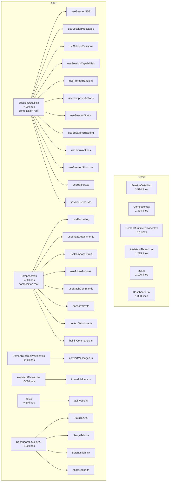
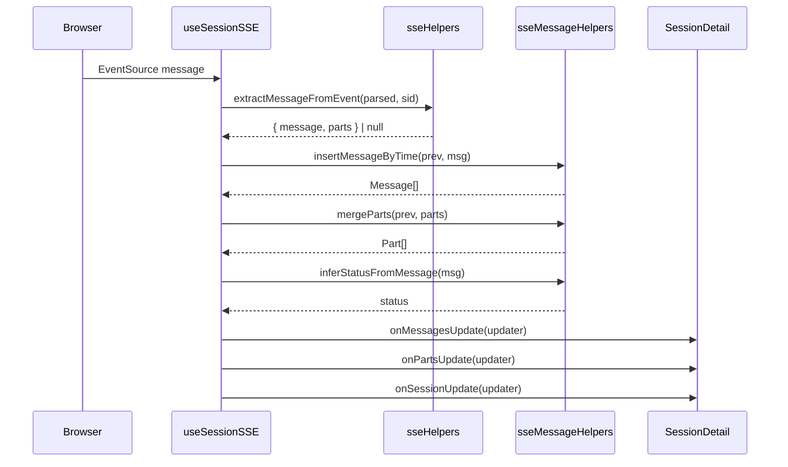
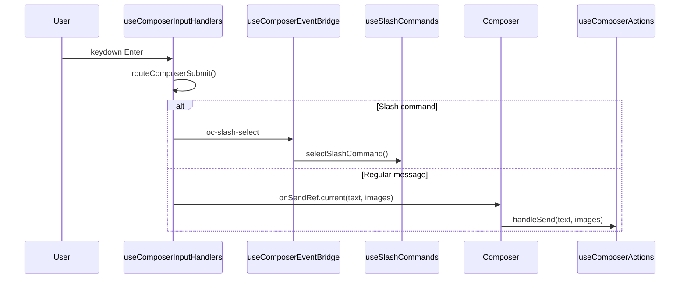

# Frontend Refactor - Architecture

## Overview

This document describes the structural decomposition of the five
largest frontend files into focused, testable modules. The refactor
is purely mechanical — no behaviour changes, no new features, no new
dependencies. Every extraction preserves the existing data flow and
is verified by the existing test suite plus new unit tests for the
extracted modules.

The strategy is bottom-up: extract pure functions first (zero risk),
then extract hooks (low risk), then rewire the composition roots
(medium risk). Each step is independently shippable.

## Context Diagram



## Architectural Decisions

### AD-1: Extract pure functions before hooks

- **Status**: Decided
- **Context**: The codebase has two kinds of extractable logic: pure
  functions (stateless, side-effect-free) and custom hooks (stateful,
  may have effects). Pure functions are zero-risk to extract and can
  be tested immediately. Hooks require more careful wiring.
- **Decision**: Extract and test all pure functions first (FR-3,
  FR-5, FR-6), then extract hooks (FR-1, FR-2, FR-4).
- **Rationale**: Pure function extraction is a safe first step that
  immediately improves testability. Hook extraction can then build
  on the tested helpers.
- **Consequences**: The implementation plan has a clear ordering.
  Early phases deliver test coverage; later phases deliver structural
  improvement.

### AD-2: Co-locate session-detail hooks in a `pages/session-detail/` directory

- **Status**: Decided
- **Context**: The hooks extracted from `SessionDetail.tsx` are
  tightly coupled to the session-detail page. Should they live in
  `lib/` (global) or next to the page?
- **Decision**: Create `pages/session-detail/` with an `index.tsx`
  re-exporting the page component. Hooks live alongside:
  ```
  pages/session-detail/
    index.tsx                  # re-exports SessionDetail
    SessionDetail.tsx          # composition root (~400 lines)
    useSessionSSE.ts
    useSessionMessages.ts
    useSidebarSessions.ts
    useSessionCapabilities.ts
    usePromptHandlers.ts
    useComposerActions.ts
    useSessionStatus.ts
    useSubagentTracking.ts
    useTmuxActions.ts
    useSessionShortcuts.ts
    sseHelpers.ts
    sessionHelpers.ts
  ```
- **Rationale**: These hooks are not reusable outside the session
  detail page. Co-location makes the dependency graph obvious and
  avoids polluting `lib/` with page-specific logic.
- **Consequences**: The existing import
  `from '../pages/SessionDetail'` must be updated to
  `from '../pages/session-detail'` in `App.tsx` (one change).

### AD-3: Co-locate composer hooks in `components/assistant/composer/`

- **Status**: Decided
- **Context**: Same question as AD-2, for `Composer.tsx`.
- **Decision**: Create `components/assistant/composer/` with an
  `index.tsx` re-exporting the component. Hooks live alongside.
- **Rationale**: Same as AD-2. The recording, draft, slash-command,
  and image-attachment hooks are composer-specific.
- **Consequences**: The existing import from
  `'../components/assistant/Composer'` becomes
  `'../components/assistant/composer'` (one change in
  `SessionDetail.tsx`).

### AD-4: Shared helpers go in `lib/`

- **Status**: Decided
- **Context**: Some extracted functions are used by multiple
  components (e.g. `inferStatusFromMessage` is used by both the SSE
  handler and the status derivation hook; `relativizePath` is used
  by both `OcmanRuntimeProvider` and `AssistantThread`).
- **Decision**: Shared pure functions go in `lib/` under descriptive
  filenames. Page-specific or component-specific functions stay
  co-located.
- **Rationale**: Avoids circular dependencies. `lib/` is the
  established location for shared utilities.
- **Consequences**: A few new files in `lib/`:
  `lib/sseMessageHelpers.ts`, `lib/sessionStatus.ts`,
  `lib/taskId.ts`, `lib/mutedTools.ts`.

### AD-5: `useSyncRef` as a shared utility

- **Status**: Decided
- **Context**: Both `SessionDetail.tsx` (14 instances) and
  `Composer.tsx` (15+ instances) use the pattern:
  ```ts
  const fooRef = useRef(foo);
  useEffect(() => { fooRef.current = foo; }, [foo]);
  ```
  This is boilerplate that obscures the real logic.
- **Decision**: Introduce `lib/useSyncRef.ts`:
  ```ts
  export function useSyncRef<T>(value: T): React.RefObject<T> {
      const ref = useRef(value);
      useEffect(() => { ref.current = value; }, [value]);
      return ref;
  }
  ```
- **Rationale**: Reduces ~60 lines of boilerplate across the two
  files to ~30 one-liners. The pattern is well-known and trivially
  correct.
- **Consequences**: A new 10-line utility with a 2-case test.

### AD-6: Preserve the CustomEvent bridge in Composer

- **Status**: Decided
- **Context**: `Composer.tsx` uses 9 CustomEvent types to bridge
  between imperative DOM handlers and React state. Should this
  pattern be replaced during the refactor?
- **Decision**: No. The bridge is relocated into dedicated hooks
  (`useComposerInputHandlers` + `useComposerEventBridge`) but the
  pattern itself is preserved.
- **Rationale**: Replacing the bridge requires a significant
  architectural change (e.g. switching to controlled components or
  `useEffectEvent`). That is a separate effort with its own risk
  profile. This refactor focuses on structural decomposition, not
  architectural redesign.
- **Consequences**: The CustomEvent pattern remains. It is now
  encapsulated in two hooks instead of being spread across the
  component body, which is an improvement in readability.

### AD-7: Types file uses re-exports for backward compatibility

- **Status**: Decided
- **Context**: Moving 50 types from `api.ts` to `api.types.ts` would
  break every file that imports types from `api.ts`.
- **Decision**: `api.ts` re-exports everything from `api.types.ts`:
  ```ts
  export type { Session, Message, Part, ... } from './api.types';
  ```
  Existing imports continue to work. New code can import from either
  location.
- **Rationale**: Zero-churn migration. No import changes needed
  across the 27 files that import from `api.ts`.
- **Consequences**: `api.ts` gains a re-export block. Over time,
  imports can be migrated to `api.types.ts` directly.

### AD-8: Dashboard tabs as lazy-loaded route components

- **Status**: Decided
- **Context**: `Dashboard.tsx` defines 5 tab components. Should they
  be split into separate route-level components or just separate
  files?
- **Decision**: Separate files, same routing structure. The tabs are
  already rendered conditionally by the `DashboardLayout` component
  based on the active tab. Each tab becomes its own file, imported
  by `DashboardLayout`.
- **Rationale**: The tabs are not heavy enough to warrant lazy
  loading. Simple file splitting is sufficient.
- **Consequences**: 5 new files under `pages/dashboard/`. The
  existing route in `App.tsx` is unchanged.

### AD-9: Test `convertMessages` via its public interface, not internals

- **Status**: Decided
- **Context**: `convertMessages` has internal caching (WeakMap) and
  complex branching. Should tests verify cache behaviour or just
  input/output?
- **Decision**: Test input/output primarily. Add one test that
  verifies referential stability (calling with the same inputs
  returns the same object references) to validate caching, but do
  not test WeakMap internals.
- **Rationale**: Testing behaviour, not implementation. The cache is
  a performance optimisation; tests should verify correctness and
  stability, not the caching mechanism.
- **Consequences**: Tests are resilient to cache implementation
  changes.

### AD-10: Shared `MUTED_TOOL_NAMES` constant

- **Status**: Decided
- **Context**: The muted-tool-name list is duplicated 3 times in
  `AssistantThread.tsx` with slight variations.
- **Decision**: Extract two constants to `lib/mutedTools.ts`:
  ```ts
  /** Tools that render as muted single-line entries. */
  export const MUTED_TOOL_NAMES = new Set([
      '__read__', 'read', 'mcp_read',
      'grep', 'mcp_grep',
      'glob', 'mcp_glob',
      'webfetch', 'mcp_webfetch', 'mcp_Webfetch',
  ]);

  /** Superset used for the muted-line rendering branch (adds __skill__). */
  export const MUTED_LINE_TOOL_NAMES = new Set([
      ...MUTED_TOOL_NAMES,
      '__skill__',
  ]);
  ```
- **Rationale**: Single source of truth. Adding a new muted tool
  requires one change instead of three.
- **Consequences**: `AssistantThread.tsx` imports the constants
  instead of inlining the lists.

### AD-11: Shared `extractTaskId` function

- **Status**: Decided
- **Context**: Task/subagent ID extraction logic is duplicated in
  `SessionDetail.tsx` (lines 2657–2687) and
  `OcmanRuntimeProvider.tsx` (lines 306–324).
- **Decision**: Extract to `lib/taskId.ts`:
  ```ts
  export function extractTaskId(partData: PartData): string | null {
      // ... unified extraction logic ...
  }
  ```
- **Rationale**: Single source of truth. Both call sites use the
  same extraction strategies (input field, regex on output, metadata
  fields).
- **Consequences**: Both files import from `lib/taskId.ts`.

## Component Design

### Extracted Hook Interfaces

#### `useSessionSSE`

```ts
interface UseSessionSSEOptions {
    sessionId: string | undefined;
    directory: string | undefined;
    onMessagesUpdate: (updater: (prev: Message[]) => Message[]) => void;
    onPartsUpdate: (updater: (prev: Part[]) => Part[]) => void;
    onSessionUpdate: (updater: (prev: Session | null) => Session | null) => void;
    onPermission: (perm: PendingPermission | null) => void;
    onQuestion: (question: PendingQuestion | null) => void;
    onSubagentTokens: (updater: (prev: Map<string, ...>) => Map<string, ...>) => void;
    onChangesDirtyTick: () => void;
    load: (signal: AbortSignal) => Promise<void>;
    listPermissions: (sid: string) => Promise<void>;
    listQuestions: (sid: string) => Promise<void>;
    debugMode: boolean;
}

interface UseSessionSSEResult {
    sseActive: boolean;
    sseDebugEvents: SseDebugEvent[];
}
```

#### `useSessionMessages`

```ts
interface UseSessionMessagesResult {
    messages: Message[];
    parts: Part[];
    totalMessages: number;
    loading: boolean;
    loadingMore: boolean;
    loadError: string | null;
    switching: boolean;
    changesDirtyTick: number;
    load: (signal: AbortSignal) => Promise<void>;
    loadMore: () => Promise<void>;
    setMessages: Dispatch<SetStateAction<Message[]>>;
    setParts: Dispatch<SetStateAction<Part[]>>;
    setChangesDirtyTick: Dispatch<SetStateAction<number>>;
}
```

#### `useSidebarSessions`

```ts
interface UseSidebarSessionsResult {
    recentSessions: Session[];
    loadingRecentSessions: boolean;
    archivingSessionIds: Set<string>;
    showArchivedRecent: boolean;
    setShowArchivedRecent: (show: boolean) => void;
    handleArchiveSession: (e: MouseEvent, target: Session) => void;
    handlePinSession: (e: MouseEvent, target: Session) => void;
    loadRecentSessions: () => Promise<void>;
    sidebarProjectGroups: SidebarGroup[];
    collapsedProjectSet: Set<string>;
}
```

#### `useSessionStatus`

```ts
interface UseSessionStatusResult {
    optimisticStatus: string;
    liveTokensPerSecond: number;
    isRunning: boolean;
    tokenStats: TokenStats;
    activeModel: string;
    activeAgent: string;
}
```

#### `usePromptHandlers`

```ts
interface UsePromptHandlersResult {
    pendingPermission: PendingPermission | null;
    answeringPermission: boolean;
    permissionError: string | null;
    pendingQuestion: PendingQuestion | null;
    answeringQuestion: boolean;
    questionError: string | null;
    handlePermissionReply: (allow: boolean) => Promise<void>;
    handleQuestionReply: (answers: string[]) => Promise<void>;
    handleQuestionReject: () => Promise<void>;
}
```

### Extracted Pure Function Modules

#### `lib/sseMessageHelpers.ts`

```ts
/** Insert a message into a sorted array, filtering temp/error IDs. */
export function insertMessageByTime(
    prev: Message[], newMsg: Message
): Message[];

/** Merge new parts into existing array, filtering temp/error IDs. */
export function mergeParts(
    prev: Part[], newParts: Part[]
): Part[];

/** Update or append a part by ID. */
export function upsertPart(prev: Part[], part: Part): Part[];

/** Infer session status from the last message's role/finish/error. */
export function inferStatusFromMessage(msg: Message): Session['status'];

/** Truncate a part field value if it exceeds MAX_OUTPUT_LEN. */
export function truncatePartField(value: unknown): unknown;

/** Extract a Message + Parts from an SSE event payload. */
export function extractMessageFromEvent(
    parsed: Record<string, unknown>, sessionId: string
): { message: Message; parts: Part[] } | null;

/** Extract a single Part from an SSE event payload. */
export function extractPartFromEvent(
    parsed: Record<string, unknown>, sessionId: string
): Part | null;
```

#### `lib/sessionStatus.ts`

```ts
/* Historical: `deriveRawStatus` was extracted here in Phase 1 and has
   since been deleted (#507). The backend settles lifecycle status from
   the agent's own turn (db.SettleSessionStatus); the frontend no longer
   re-derives one from message shape. */

/** Check if the session is currently running. */
export function isSessionRunning(lastMsg: Message | null): boolean;

/** Aggregate token/cost stats from messages. */
export function computeLiveTokens(messages: Message[]): LiveTokens;

/** Merge server-side and client-side token stats. */
export function mergeTokenStats(
    session: Session, liveTokens: LiveTokens
): TokenStats;

/** Derive the active model and agent from the message history. */
export function deriveActiveModelAndAgent(
    messages: Message[], session: Session
): { activeModel: string; activeAgent: string };
```

#### `lib/taskId.ts`

```ts
/** Extract a task/subagent session ID from part data. */
export function extractTaskId(partData: PartData): string | null;
```

#### `lib/mutedTools.ts`

```ts
/** Tool names that render as muted single-line entries. */
export const MUTED_TOOL_NAMES: ReadonlySet<string>;

/** Superset including __skill__ for the rendering branch. */
export const MUTED_LINE_TOOL_NAMES: ReadonlySet<string>;
```

#### `lib/sidebarHelpers.ts`

```ts
/** Compute a dedup hash for a sidebar session list. */
export function computeSidebarHash(sessions: Session[]): string;

/** Aggregate group status from a list of sessions. */
export function rollupGroupStatus(
    sessions: Session[]
): { pending: boolean; error: boolean; busy: boolean; waiting: boolean };
```

#### `lib/audio/encodeWav.ts`

```ts
/** Encode Float32Array PCM samples as a WAV Blob. */
export function encodeWav(
    samples: Float32Array, sampleRate: number
): Blob;
```

#### `lib/models/contextWindows.ts`

```ts
/** Static model-ID to context-window-size mapping. */
export const MODEL_CONTEXT_WINDOWS: Record<string, number>;

/** Look up the context window for a model ID (fuzzy match). */
export function getContextWindow(
    modelId: string | undefined
): number | null;

/** Format a token count as a human-readable string. */
export function formatTokenCount(n: number): string;
```

#### `lib/threadHelpers.ts`

```ts
export function escapeHtml(text: string): string;
export function inferLanguageFromPath(path: string): string | undefined;
export function inferDiffLanguage(title: string, detail: string): string | undefined;
export function parseJsonObject(text: string): Record<string, unknown> | null;
export function parseJsonObjectFromMixedText(text: string): Record<string, unknown> | null;
export function extractPatchPayload(text: string): string;
export function splitToolArgs(toolName: string, rawArgs: string): { title: string; detail: string };
export function parsePatchSections(patchText: string): { action: string; path: string }[];
export function summarizePatch(patchText: string): string;
export function shortenPatchPath(path: string): string;
export function parseQuestionAnswers(result: unknown): string[] | null;
export function parseQuestions(argsText: string): QuestionData[] | null;
```

#### `lib/chartConfig.ts`

```ts
/** Base chart options shared by all chart types. */
export const CHART_BASE: ChartOptions;

/** Build chart options by merging base + type defaults + overrides. */
export function buildChartOptions(
    type: 'bar' | 'line' | 'doughnut',
    overrides?: Partial<ChartOptions>
): ChartOptions;

/** Standard x-axis tick configuration. */
export const CHART_X_TICKS: TickOptions;

/** Standard legend label configuration. */
export const CHART_LEGEND_LABELS: LegendLabelOptions;
```

#### `lib/convertMessages.ts`

```ts
export function isImageMime(mime: string | undefined): boolean;
export function parsePart(p: Part): PartData;
export function truncate(text: string | null | undefined, max: number): string;
export function relativizePath(absPath: string, projectDir: string): string;
export function computeIsRunning(messages: Message[]): boolean;
export function convertMessages(
    messages: Message[],
    parts: Part[],
    pendingAgent: string,
    taskLiveOutput: Map<string, string>,
    projectDirectory: string,
    failedById: Map<string, FailedSend>,
): ThreadMessageLike[];
```

## File Structure

```
frontend/src/
  lib/
    api.ts                          # Reduced to ~450 lines (methods + helpers)
    api.types.ts                    # NEW: 50 type/interface definitions (~760 lines)
    useSyncRef.ts                   # NEW: shared ref-sync utility (~10 lines)
    useSyncRef.test.ts              # NEW
    sseMessageHelpers.ts            # NEW: message insert/merge/upsert/infer (~120 lines)
    sseMessageHelpers.test.ts       # NEW
    sessionStatus.ts                # NEW: status derivation, token stats (~100 lines)
    sessionStatus.test.ts           # NEW
    taskId.ts                       # NEW: shared task-ID extraction (~40 lines)
    taskId.test.ts                  # NEW
    mutedTools.ts                   # NEW: shared muted-tool constants (~15 lines)
    mutedTools.test.ts              # NEW
    sidebarHelpers.ts               # NEW: sidebar hash + rollup (~50 lines)
    sidebarHelpers.test.ts          # NEW
    convertMessages.ts              # NEW: from OcmanRuntimeProvider (~500 lines)
    convertMessages.test.ts         # NEW
    threadHelpers.ts                # NEW: from AssistantThread (~250 lines)
    threadHelpers.test.ts           # NEW
    chartConfig.ts                  # NEW: chart option factory (~80 lines)
    chartConfig.test.ts             # NEW
    audio/
      encodeWav.ts                  # NEW: WAV encoder (~35 lines)
      encodeWav.test.ts             # NEW
    models/
      contextWindows.ts             # NEW: model context windows (~60 lines)
      contextWindows.test.ts        # NEW
    commands/
      builtinCommands.ts            # NEW: slash commands + known agents (~20 lines)
      builtinCommands.test.ts       # NEW

  pages/
    session-detail/                 # NEW directory
      index.tsx                     # Re-exports SessionDetail
      SessionDetail.tsx             # Composition root (~400 lines)
      useSessionSSE.ts              # SSE lifecycle hook (~200 lines)
      useSessionMessages.ts         # Message/part state hook (~100 lines)
      useSidebarSessions.ts         # Sidebar polling/grouping hook (~150 lines)
      useSessionCapabilities.ts     # Port/model/agent state hook (~100 lines)
      usePromptHandlers.ts          # Permission/question prompt hook (~100 lines)
      useComposerActions.ts         # Send/retry/command dispatch hook (~150 lines)
      useSessionStatus.ts           # Status derivation hook (~80 lines)
      useSubagentTracking.ts        # Subagent token/task tracking hook (~60 lines)
      useTmuxActions.ts             # Tmux integration hook (~80 lines)
      useSessionShortcuts.ts        # Keyboard shortcut registration hook (~80 lines)
      sseHelpers.ts                 # SSE-specific pure functions (~150 lines)
      sseHelpers.test.ts            # NEW
      sessionHelpers.ts             # Page-specific pure functions (~80 lines)
      sessionHelpers.test.ts        # NEW
    dashboard/                      # NEW directory
      index.tsx                     # Re-exports DashboardLayout
      DashboardLayout.tsx           # Layout + tab switching (~100 lines)
      SessionsTab.tsx               # (~30 lines)
      ProjectsTab.tsx               # (~70 lines)
      StatsTab.tsx                  # (~420 lines, further split later)
      UsageTab.tsx                  # (~120 lines)
      SettingsTab.tsx               # (~140 lines)
      HeatmapChart.tsx              # (~120 lines)
      HourlyTokensChart.tsx         # (~70 lines)
      Pagination.tsx                # NEW: shared pagination controls (~40 lines)

  components/
    assistant/
      composer/                     # NEW directory
        index.tsx                   # Re-exports Composer
        Composer.tsx                # Composition root (~400 lines)
        useRecording.ts             # Voice dictation hook (~130 lines)
        useImageAttachments.ts      # Image paste/drop hook (~30 lines)
        useComposerDraft.ts         # Draft persistence hook (~40 lines)
        useTokenPopover.ts          # Token popover hook (~50 lines)
        useSlashCommands.ts         # Slash command hook (~160 lines)
        useComposerInputHandlers.ts # Mega keydown/input/paste effect (~195 lines)
        useComposerEventBridge.ts   # CustomEvent listener effect (~60 lines)
    OcmanRuntimeProvider.tsx        # Reduced to ~200 lines (provider shell)
    AssistantThread.tsx             # Reduced to ~500 lines (rendering only)
```

## Sequence Diagrams

### SSE Event Flow (after refactor)



### Composer Submit Flow (after refactor)



## Implementation Plan

### Phase 1: Foundation (no file moves, just new modules)

#### Step 1.1 — `useSyncRef` utility

1. Create `lib/useSyncRef.ts` with the hook implementation.
2. Create `lib/useSyncRef.test.ts` with 2 test cases (initial value,
   value update).
3. `make test`

**Done when**: utility exists and tests pass.

#### Step 1.2 — `lib/sseMessageHelpers.ts`

1. Extract `insertMessageByTime`, `mergeParts`, `upsertPart`,
   `inferStatusFromMessage`, `truncatePartField` from
   `SessionDetail.tsx` into the new module.
2. Write tests for each function (happy path + edge cases).
3. Update `SessionDetail.tsx` to import from the new module.
4. `make test`

**Done when**: all 4 duplicated patterns in `SessionDetail.tsx` use
the shared helpers; tests pass.

#### Step 1.3 — `lib/sessionStatus.ts`

1. Extract `deriveRawStatus` (since deleted, see above),
   `isSessionRunning`,
   `computeLiveTokens`, `mergeTokenStats`,
   `deriveActiveModelAndAgent` from `SessionDetail.tsx`.
2. Write tests for each function.
3. Update `SessionDetail.tsx` to import from the new module.
4. `make test`

**Done when**: status derivation logic is tested and shared.

#### Step 1.4 — `lib/taskId.ts`

1. Extract the shared task-ID extraction logic from both
   `SessionDetail.tsx` and `OcmanRuntimeProvider.tsx`.
2. Write tests covering all extraction strategies (input field,
   regex on output, metadata fields).
3. Update both files to import from `lib/taskId.ts`.
4. `make test`

**Done when**: task-ID extraction is deduplicated and tested.

#### Step 1.5 — `lib/mutedTools.ts`

1. Extract `MUTED_TOOL_NAMES` and `MUTED_LINE_TOOL_NAMES`.
2. Write a simple test verifying the sets contain the expected
   entries and that `MUTED_LINE_TOOL_NAMES` is a superset.
3. Update `AssistantThread.tsx` to import the constants.
4. `make test`

**Done when**: muted-tool lists are deduplicated.

#### Step 1.6 — `lib/sidebarHelpers.ts`

1. Extract `computeSidebarHash` and `rollupGroupStatus` from
   `SessionDetail.tsx`.
2. Write tests.
3. Update `SessionDetail.tsx` to import from the new module.
4. `make test`

**Done when**: sidebar helpers are tested and shared.

### Phase 2: Pure function extraction

#### Step 2.1 — `lib/threadHelpers.ts` (from `AssistantThread.tsx`)

1. Extract all 14 pure functions listed in FR-6.
2. Write tests for each function (at least happy path + one edge
   case per function).
3. Update `AssistantThread.tsx` to import from the new module.
4. `make test`

**Done when**: `AssistantThread.tsx` no longer defines any pure
functions inline; all are tested.

#### Step 2.2 — `lib/convertMessages.ts` (from `OcmanRuntimeProvider.tsx`)

1. Extract `convertMessages`, `isImageMime`, `parsePart`,
   `truncate`, `relativizePath`, `computeIsRunning`.
2. Write tests for each helper function individually.
3. Write tests for `convertMessages` covering every `switch` case
   and the `isQueued` / `msgAgent` logic.
4. Write one referential-stability test for the caching behaviour.
5. Update `OcmanRuntimeProvider.tsx` to import from the new module.
6. `make test`

**Done when**: `OcmanRuntimeProvider.tsx` is reduced to ~200 lines;
`convertMessages` has comprehensive tests.

#### Step 2.3 — SSE helper functions (from `SessionDetail.tsx`)

1. Move `extractMessageFromEvent`, `extractPartFromEvent`,
   `formatModelRef`, `isSessionStatusIdle`,
   `extractPendingPermission`, `extractPendingQuestion`,
   `normalizeQuestionItems`, `hasQuestionOutput`,
   `extractPendingQuestionFromPart`,
   `extractPendingQuestionFromParts`, `hasPendingQuestionInParts`,
   `truncateSseData` to `pages/session-detail/sseHelpers.ts`.
2. Write tests for each function.
3. Update `SessionDetail.tsx` to import from the new module.
4. `make test`

**Done when**: all 14 pure functions from `SessionDetail.tsx` are
extracted and tested.

#### Step 2.4 — Composer pure functions

1. Extract `encodeWav` to `lib/audio/encodeWav.ts`.
2. Extract `MODEL_CONTEXT_WINDOWS`, `getContextWindow`,
   `formatTokenCount` to `lib/models/contextWindows.ts`.
3. Extract `BUILTIN_COMMANDS`, `KNOWN_AGENTS` to
   `lib/commands/builtinCommands.ts`.
4. Write tests for each.
5. Update `Composer.tsx` to import from the new modules.
6. `make test`

**Done when**: `Composer.tsx` no longer defines any pure functions
or static data inline.

### Phase 3: Type extraction

#### Step 3.1 — `lib/api.types.ts`

1. Move all 50 type/interface definitions from `api.ts` to
   `api.types.ts`.
2. Add re-exports in `api.ts` so existing imports are unaffected.
3. `make test && make lint`

**Done when**: `api.ts` is ~450 lines; all imports still work.

### Phase 4: Hook extraction (SessionDetail)

#### Step 4.1 — Create `pages/session-detail/` directory structure

1. Create the directory and `index.tsx` re-export.
2. Move `SessionDetail.tsx` into the directory.
3. Update the import in `App.tsx`.
4. `make test`

**Done when**: app works with the new file location.

#### Step 4.2 — Extract `useSessionMessages`

1. Extract state variables, `load`, `loadMore`, message trimming,
   cache mirroring into the hook.
2. `SessionDetail.tsx` calls the hook and destructures the result.
3. `make test`

#### Step 4.3 — Extract `useSessionSSE`

1. Extract the SSE `useEffect`, `sseActive`, `sseDebugEvents` into
   the hook.
2. The hook receives callbacks for state mutation (from
   `useSessionMessages`, `usePromptHandlers`, etc.).
3. `make test`

#### Step 4.4 — Extract `useSidebarSessions`

1. Extract sidebar state, polling, archive/pin handlers, project
   grouping.
2. `make test`

#### Step 4.5 — Extract `useSessionCapabilities`

1. Extract port discovery, model/agent catalog, model change
   handlers.
2. `make test`

#### Step 4.6 — Extract `usePromptHandlers`

1. Extract permission/question state and reply handlers.
2. `make test`

#### Step 4.7 — Extract `useComposerActions`

1. Extract send, retry, dismiss, command dispatch, shell, compact,
   abort handlers.
2. `make test`

#### Step 4.8 — Extract `useSessionStatus`

1. Extract optimistic status, TPS computation, token stats.
2. `make test`

#### Step 4.9 — Extract `useSubagentTracking`

1. Extract subagent token map, task live output, running task
   polling.
2. `make test`

#### Step 4.10 — Extract `useTmuxActions`

1. Extract tmux switch, client picker, launch handlers.
2. `make test`

#### Step 4.11 — Extract `useSessionShortcuts`

1. Extract shortcut descriptors, ref syncs (now using `useSyncRef`),
   `useShortcut` registrations.
2. Replace all ref-sync `useEffect` patterns with `useSyncRef`.
3. `make test`

**Done when**: `SessionDetail.tsx` is ~400 lines — a composition
root that wires hooks together and renders JSX.

### Phase 5: Hook extraction (Composer)

#### Step 5.1 — Create `components/assistant/composer/` directory

1. Create the directory and `index.tsx` re-export.
2. Move `Composer.tsx` into the directory.
3. Update the import in `SessionDetail.tsx`.
4. `make test`

#### Step 5.2 — Extract `useRecording`

1. Extract recording state, mic handlers, WAV submission.
2. `make test`

#### Step 5.3 — Extract `useImageAttachments`

1. Extract image state, add/remove handlers.
2. `make test`

#### Step 5.4 — Extract `useComposerDraft`

1. Extract draft load/save logic.
2. `make test`

#### Step 5.5 — Extract `useTokenPopover`

1. Extract popover state, outside-click, cost fetch.
2. `make test`

#### Step 5.6 — Extract `useSlashCommands`

1. Extract command fetch, filter, selection, menu state.
2. `make test`

#### Step 5.7 — Extract `useComposerInputHandlers` + `useComposerEventBridge`

1. Extract the mega keydown/input/paste effect and the CustomEvent
   listener effect as two co-located hooks.
2. Replace all ref-sync patterns with `useSyncRef`.
3. `make test`

**Done when**: `Composer.tsx` is ~400 lines.

### Phase 6: Dashboard decomposition

#### Step 6.1 — Extract `lib/chartConfig.ts`

1. Extract `CHART_BASE`, `buildChartOptions`, `CHART_X_TICKS`,
   `CHART_LEGEND_LABELS`.
2. Write tests for `buildChartOptions`.
3. Update `Dashboard.tsx` to use the factory.
4. `make test`

#### Step 6.2 — Split Dashboard into per-tab files

1. Create `pages/dashboard/` directory.
2. Move each tab component to its own file.
3. Extract `HeatmapChart`, `HourlyTokensChart`, `Pagination`.
4. Move `renderModel` and `shortSessionID` to `lib/format.ts`.
5. Update `App.tsx` routing import.
6. `make test`

**Done when**: no file in `pages/dashboard/` exceeds 500 lines.

### Phase 7: Replace stub tests

#### Step 7.1 — Replace `useCapabilities.test.ts`

1. Test capability merging, defaults, per-platform overrides.
2. `make test`

#### Step 7.2 — Replace `useSessionChanges.test.ts`

1. Test debounced fetch, abort, cache.
2. `make test`

#### Step 7.3 — Replace `useSessionInfo.test.ts`

1. Test debounced fetch, abort, cache.
2. `make test`

#### Step 7.4 — Replace `useInfiniteRows.test.ts`

1. Test pagination state transitions.
2. `make test`

#### Step 7.5 — Replace `useWorkingTreeDiff.test.ts`

1. Test debounced fetch, abort.
2. `make test`

### Phase 8: Final verification

1. `make test` — all tests pass.
2. `make lint` — no lint violations.
3. `make build` — production build succeeds.
4. Manual smoke test: open a session, send a message, verify SSE
   streaming, sidebar navigation, composer slash commands, model
   picker, permission/question prompts, tmux integration.

**Done when**: all success criteria from the requirements document
are met.

## Dependencies

- **Runtime**: No new dependencies.
- **Dev**: No new dev dependencies.
- **Build**: No changes to the build pipeline.

## Risks and Mitigations

- **Risk**: Hook extraction changes closure semantics, causing stale
  state bugs.
  - **Mitigation**: Each hook extraction is followed by `make test`.
    The existing test suite catches regressions. Manual smoke testing
    after Phase 4 and Phase 5 validates SSE streaming and composer
    behaviour.

- **Risk**: Moving files breaks import paths across the codebase.
  - **Mitigation**: `index.tsx` re-exports at each new directory
    ensure existing import paths work. `make lint` (TypeScript
    typecheck) catches any broken imports immediately.

- **Risk**: The `convertMessages` extraction changes caching
  behaviour, causing performance regression.
  - **Mitigation**: The WeakMap caches are moved as-is. The
    referential-stability test (AD-9) verifies caching works
    correctly after extraction.

- **Risk**: The refactor is too large to review in one PR.
  - **Mitigation**: Each phase is independently shippable. The
    implementation plan is designed so that each step leaves the
    codebase in a working state. Multiple smaller PRs are
    recommended.
