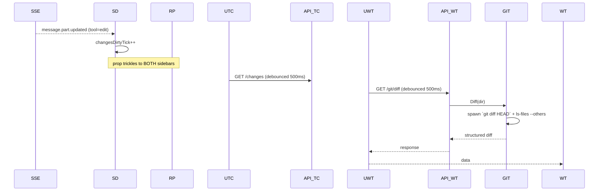

# Working-Tree Diff Sidebar — Architecture

## Overview

Adds a second view to the right-hand panel on the session detail page:
the working tree's git diff for the session's directory. The existing
"Session changes" view stays — the panel becomes a **two-tab switcher**
(Thread / Working tree). v1 covers the working tree of
`session.directory`; git worktrees work transparently because we shell
out via `git -C <dir>`.

Refresh is **SSE-driven**, not polled: when an edit/write tool part
arrives in the session's SSE stream the sidebar increments a
dirty-tick (the same signal the Session changes view already uses) and
the diff hook re-fetches with a 500 ms debounce.

## Architectural decisions

### AD-1: Right panel mode (single / split)

- **Status**: Decided
- **Decision**: The right panel can be in one of three modes:
  1. **collapsed** — narrow icon strip showing **two icons**, one
     per view (Session changes, Working tree). Clicking either icon
     opens that view as the sole occupant of the panel.
  2. **single** — one view occupies the whole panel; the panel
     header has a tab switcher to flip to the other view, plus a
     "split" button that promotes both views to **split** mode.
  3. **split** — the panel is divided **vertically** (top half /
     bottom half), Session changes on top, Working tree on bottom.
     Each half has its own header with a "make this fullscreen"
     button (reverts to single mode showing only that view) and a
     close button (reverts to single mode showing only the other
     view).
- **Rationale**: The user explicitly asked for a 2-icon collapsed
  strip where one icon opens the sidebar and the other splits the
  sidebar to show both views simultaneously. Split is *vertical*
  (stacked) because the available width is already constrained;
  splitting horizontally would halve the diff width to the point of
  unreadability.
- **Consequences**: `useUiStore` gains `changesSidebarMode:
  'collapsed' | 'single' | 'split'` and `changesSidebarTab:
  'thread' | 'working-tree'`. Both are persisted. The two existing
  flags `changesSidebarCollapsed` and toggle action become
  derived/wrapped helpers around `changesSidebarMode` to keep
  callers simple. Split mode persists across reloads — opening the
  page restores whatever the user last set.

### AD-2: Diff source = `git diff HEAD` + untracked

- **Status**: Decided
- **Options**:
  1. `git diff` (unstaged only)
  2. `git diff --cached` (staged only)
  3. `git diff HEAD` (everything not yet committed) + untracked files
  4. Two separate sub-views (staged / unstaged)
- **Decision**: Option 3.
- **Rationale**: Matches what a user means by "what's the agent done
  to my repo since the last commit". Mirrors `git status -s`'s
  combined view. Option 4 doubles UI surface for marginal benefit.
- **Consequences**: Untracked files are listed by name and (when
  small) shown with their full content as additions. We treat
  untracked files larger than `MAX_UNTRACKED_BYTES` (200 KB) as
  "binary-ish" and emit only a header.

### AD-3: Refresh trigger

- **Status**: Decided
- **Options**:
  1. Periodic poll (e.g. 5 s)
  2. SSE-driven: refetch on every edit/write part observed
  3. Manual refresh button only
- **Decision**: Option 2, debounced 500 ms — same dirty-tick
  pattern the Session changes sidebar already uses. The dirty-tick
  is currently only bumped on edit/write part updates; we'll piggy-
  back on the same hook by passing the same `dirtyTick` prop into
  the new `WorkingTreeChangesSidebar`.
- **Rationale**: The user's request. Polling is cheap but wasteful
  (and makes the page feel "alive" even when nothing happened);
  manual refresh is an annoyance for live sessions. SSE-driven hits
  the sweet spot — refreshes exactly when the agent could plausibly
  have changed something on disk.
- **Consequences**: When the user edits files in their own editor
  (outside the agent), the diff doesn't auto-update. Add a manual
  "refresh" icon next to the tab switcher for that case. Cheap.

### AD-4: Where the git logic lives

- **Status**: Decided
- **Decision**: Extend `internal/gitinfo` with a `Diff(ctx, dir)`
  function. Re-uses the same shell-out + per-dir cache pattern
  already used by `Lookup`.
- **Rationale**: One package owning all git interactions. The
  cache lets multiple sessions in the same directory share a single
  fetch.
- **Consequences**: The cache TTL for diff results must be much
  shorter than the `Lookup` TTL (we want SSE-driven refreshes to be
  honoured, not served stale). Solution: callers pass a
  `force` flag from the handler, bypassing the cache when the
  client asked for a fresh fetch (e.g. via `?fresh=1`); the cache
  just memoises within the same request burst (≤2 s), preventing
  duplicate spawns when multiple tabs/clients hit the endpoint at
  once.

### AD-5: Output format

- **Status**: Decided
- **Decision**: Backend returns a structured response with one
  entry per file:
  ```ts
  {
    repo: string;        // the worktree root
    branch: string;
    ahead: number; behind: number;
    files: Array<{
      path: string;
      status: 'modified' | 'added' | 'deleted' | 'renamed' | 'untracked';
      additions: number; deletions: number;
      // For binary files diff is empty and isBinary=true.
      diff: string;        // unified diff body for this file
      isBinary: boolean;
      oldPath?: string;    // present for renames
    }>;
    truncated: boolean;    // true if we hit the response cap
  }
  ```
  The frontend can reuse `DiffView` per file by parsing each file's
  unified diff into `before`/`after` *or* by adding a passthrough
  variant of `DiffView` that takes a raw unified diff. We pick the
  passthrough — simpler, and matches `git diff`'s native format.
- **Rationale**: Mirrors what the Session changes wire shape already
  does. Enables identical visual treatment in both tabs.
- **Consequences**: Adds a `<DiffView mode="raw">` branch (or a
  sibling `RawDiffView` component) that splits a unified-diff hunk
  into the same row format `DiffView` already produces.

### AD-6: Performance / size cap

- **Status**: Decided
- **Decision**: Cap each per-file diff at 200 KB and the total
  response at 2 MB. Anything beyond is dropped with
  `truncated: true`.
- **Rationale**: A diff against thousands of generated files (e.g.
  `dist/` not yet in `.gitignore`) would otherwise blow up the
  response. The user can expand the noisy file in their own editor.
- **Consequences**: Truncation banner in the UI when set.

## Component diagram

```mermaid
graph TD
    SD[SessionDetail page]
    RP[RightPanel]
    TS[TabSwitcher]
    TC[SessionChangesSidebar]
    WT[WorkingTreeChangesSidebar]
    DV[DiffView / RawDiffView]
    UTC[useSessionChanges]
    UWT[useWorkingTreeDiff]
    API_TC[/api/session/:id/changes]
    API_WT[/api/git/diff?dir=...]
    GIT[gitinfo.Diff]

    SD --> RP
    RP --> TS
    RP --> TC
    RP --> WT
    TC --> UTC --> API_TC
    WT --> UWT --> API_WT --> GIT
    TC --> DV
    WT --> DV
```

## Data flow on a live edit



## API design

### `GET /api/git/diff?dir=<absolute path>`

- **Auth**: shared `requireAuth`.
- **Method**: GET only.
- **Query**: `dir` (required, absolute path); `fresh=1` to bypass
  the in-process cache.
- **Response 200**: see AD-5.
- **Errors**:
  - 400 if `dir` missing/relative.
  - 404 if `dir` is not a git worktree.
  - 502 if `git` itself failed (timeout, fork error). Body has the
    git stderr first line for diagnosis.

### Why directory-scoped, not session-scoped

The diff applies to the project's working tree, not to the
specific conversation. Two sessions open in the same directory
would otherwise need to deduplicate. Keying on `dir` also keeps the
endpoint reusable from future surfaces (project view, cross-session
compare).

## File structure

New files:

- `internal/gitinfo/diff.go` — `Diff(ctx, dir, opts)` + parser.
- `internal/gitinfo/diff_test.go` — unit tests with table inputs.
- `internal/server/handlers_git.go` — `handleGitDiff`.
- `frontend/src/components/RightPanel.tsx` — tab switcher wrapper
  that hosts the existing `SessionChangesSidebar` and the new
  `WorkingTreeChangesSidebar`. Owns the collapse/expand toggle.
- `frontend/src/components/WorkingTreeChangesSidebar.tsx` — main UI.
- `frontend/src/components/RawDiffView.tsx` — renders a unified-diff
  string (one file's hunks) using the same row layout as `DiffView`.
- `frontend/src/lib/useWorkingTreeDiff.ts` — fetch hook with debounce.

Modified files:

- `frontend/src/lib/api.ts` — `WorkingTreeDiff` types + `gitDiff()`.
- `frontend/src/lib/apiStore.ts` — `getGitDiff` thunk.
- `frontend/src/lib/uiStore.ts` — `changesSidebarTab` (`'thread' |
  'working-tree'`), persisted; `changesSidebarCollapsed` already
  exists.
- `frontend/src/pages/SessionDetail.tsx` — replace direct
  `<SessionChangesSidebar>` mount with `<RightPanel>`.
- `internal/server/handlers.go` — register `/api/git/diff` route in
  the same `mux.HandleFunc` block where other top-level routes are.

## Implementation plan

1. **Backend `gitinfo.Diff`** — shell out
   `git -C <dir> diff HEAD --no-color --no-ext-diff` plus
   `git -C <dir> ls-files --others --exclude-standard`. Parse into
   the structured shape in AD-5, applying the size caps.
   Tests: not-a-repo, clean tree, modified file, added file,
   deleted file, untracked file (small + over-cap), binary file,
   renamed file. ≥8 cases.
2. **HTTP handler `handleGitDiff`** + register route.
   Tests: missing dir → 400; non-repo → 404; happy path → 200 with
   shape match.
3. **Frontend types + API client + apiStore thunk.** TS-only.
4. **`useWorkingTreeDiff` hook** — same debounce/abort pattern as
   `useSessionChanges`. Smoke test.
5. **`RawDiffView`** — render a unified-diff string into the
   `oc-diff-row` rows already styled in `AssistantThread.css`.
   Parses `@@ ... @@` headers to reset line-number counters.
6. **`WorkingTreeChangesSidebar`** — header (branch, ahead/behind,
   total `+/-`), per-file groups (reuses `FileChangeGroup`-style
   layout), truncation banner.
7. **`RightPanel`** — three render modes per AD-1:
   - **collapsed**: narrow icon strip with two icons (Thread,
     Working tree). Each icon click sets mode='single' + the
     corresponding tab. A small "split" affordance below them sets
     mode='split'.
   - **single**: tab switcher in header (Thread / Working tree),
     "split" button to promote to split mode, "collapse" button to
     return to collapsed, and a manual refresh icon that bumps a
     local nonce dirty-tick.
   - **split**: stacked vertically. Each half is a self-contained
     pane with its own header (title, "fullscreen this view"
     button, close button). Closing one pane returns to single
     mode showing the other view.
   The persisted `useUiStore.changesSidebarMode` drives the render;
   `changesSidebarTab` selects which view is shown in single mode.
8. **Mount in `SessionDetail`** — replace direct
   `<SessionChangesSidebar>` mount with `<RightPanel>`. Pass
   through `dirtyTick` so SSE edit events refresh both views.
9. **`make test` + `make lint` + `make build`.**

## Risks / mitigations

- **Risk**: `git diff` on a large monorepo blocks for seconds.
  **Mitigation**: 4-second timeout (twice the existing `gitinfo`
  budget — diff is heavier than status). Frontend shows a loading
  state; cancellation via `AbortController` already wired through
  `useApiStore`.
- **Risk**: Diff response > 2 MB.
  **Mitigation**: per-file 200 KB cap + global 2 MB cap, with a
  `truncated: true` flag rendered as a banner.
- **Risk**: `dir` query parameter abuse (path traversal).
  **Mitigation**: validate that `dir` is absolute and exists; pass
  through `git -C` which rejects non-repos cleanly. We do **not**
  enforce that the dir matches a known session's directory because
  that would prevent the future "open any project" use case;
  instead we rely on the user being authenticated.
- **Risk**: Editor-only edits don't trigger a refresh.
  **Mitigation**: a manual refresh icon in the panel header for
  v1; a future `fsnotify` watcher is out of scope.

## Open questions

- **Q1**: Should we show staged vs. unstaged separately? (Out of
  scope per AD-2; revisit if users ask.)
- **Q2**: Should the `Open` button next to a file open it in
  $EDITOR? Reuse `openVSCode`; trivial follow-up.
- **Q3**: Worktree picker (when the directory is part of a
  multi-worktree setup, show all)? Out of scope for v1.
