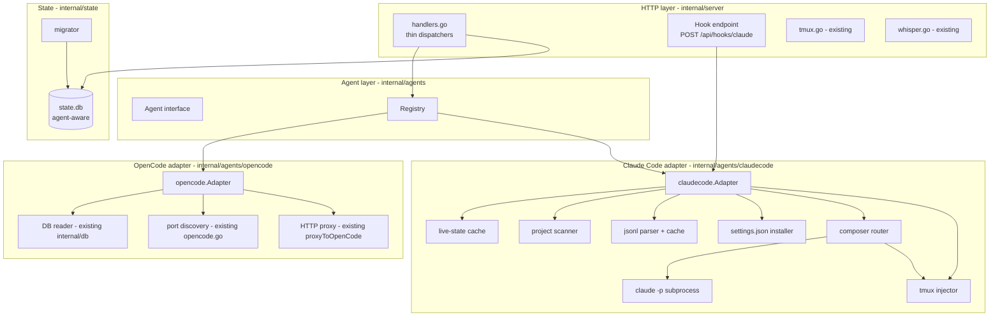
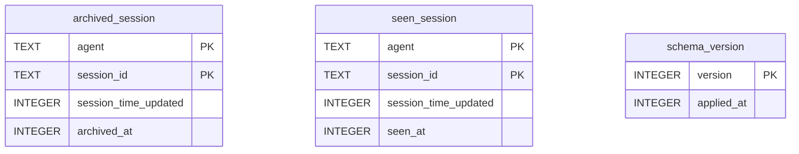
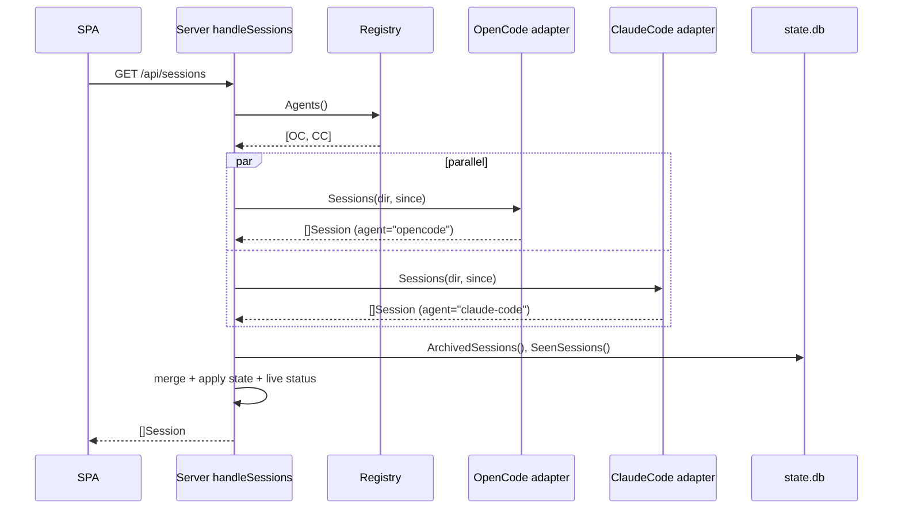
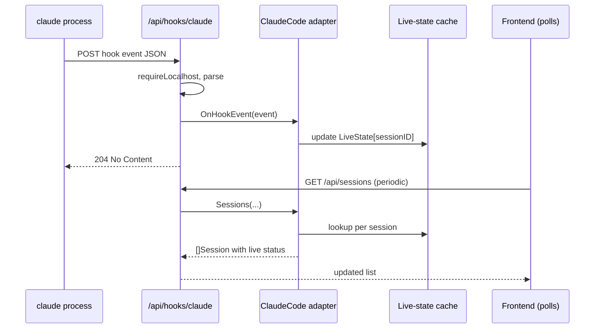
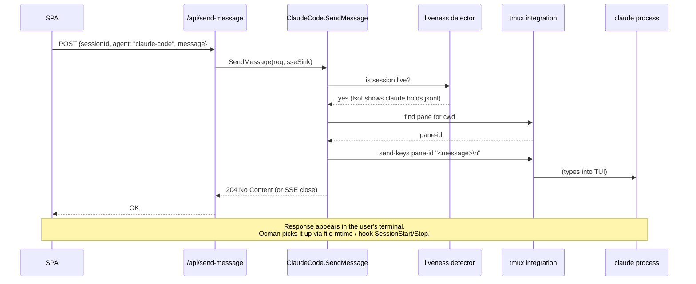
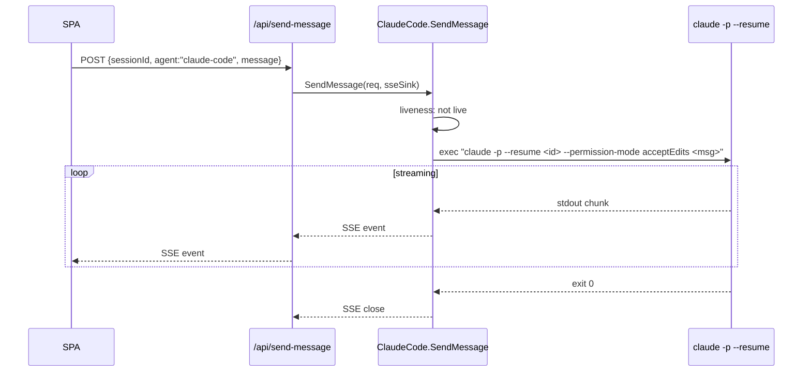

# Multi-Agent Support - Architecture

## Terminology

This document uses two distinct "agent" concepts that are easy to
confuse. The implementation resolves the ambiguity with separate terms;
map as follows:

- **Platform** — the coding-agent tool that produces a session (OpenCode,
  Claude Code, Codex, ...). In the Go source this is
  `platforms.Platform`, `platforms.ID`, `platforms.Registry`,
  `Session.Platform`, and the `?platform=<id>` HTTP param. When this
  document talks about an "Agent adapter", "agent registry",
  "agent identifier", or "adding a new agent", it means **platform**.
- **Agent** — the composer-level role within a single session
  (OpenCode's "build"/"plan"/subagent names). This concept is
  preserved in `MessageData.Agent`, the OpenCode `/agent` catalog,
  `AgentPicker`, and `agentColor`. When this document refers to
  OpenCode's agent catalog, mode switching, or per-message agent
  selection, it means **agent** in this narrower sense.

The text below was written with "agent" meaning the broader concept.
Where that reading is ambiguous, code identifiers use `platform`.
Future revisions of this doc will rewrite the prose to match.

## Overview

Ocman today is structured around a single concrete data source (`*db.DB`, the
OpenCode SQLite reader) and a single runtime surface (OpenCode's localhost
`--port` HTTP API, discovered via `lsof`). Handlers in `internal/server`
reach directly into those two collaborators.

The multi-agent work introduces an **Agent adapter** abstraction that
encapsulates everything ocman needs from a specific coding agent: session
listing, session detail, status, liveness, composer, and optional live-event
ingestion. All adapters implement the same interface. HTTP handlers become
thin dispatchers: they resolve the relevant adapter (from a `?agent=` param
or by looking up the session), then delegate.

For v1 there are two adapters:

- **`opencode`** — wraps today's SQLite reader + HTTP proxy + port discovery.
  Behavior is identical to today from an end-user perspective apart from the
  addition of an `agent` field on every session.
- **`claude-code`** — new. Reads `~/.claude/projects/<cwd>/<uuid>.jsonl`,
  writes status hooks into `~/.claude/settings.json`, receives hook callbacks
  over HTTP, and drives the composer via `tmux send-keys` (when the session
  is live) or `claude -p --resume` subprocess (when it is not).

The ocman state database (archived/seen) gains an `agent` column so state
is namespaced per agent. A migration backfills existing rows as
`agent = "opencode"`.

The UX stays mostly the same. Sessions from all detected agents appear in
one unified list with an agent badge; filter controls scope any view to a
single agent when the user wants a per-agent drill-down.

## Context Diagram

```mermaid
graph TD
    subgraph User
      Browser[Ocman SPA<br/>React]
      Term[Terminal / Tmux<br/>user types here]
    end

    subgraph Ocman[Ocman server - Go]
      API[HTTP API<br/>handlers.go]
      Registry[Agent registry]
      OCAd[OpenCode adapter]
      CCAd[Claude Code adapter]
      State[(state.db<br/>archived, seen,<br/>agent-aware)]
      LiveState[In-memory<br/>live-status cache]
    end

    subgraph OpenCode[OpenCode]
      OCDB[(opencode.db<br/>read-only)]
      OCApi[OpenCode HTTP API<br/>--port]
      OCProc[opencode processes]
    end

    subgraph Claude[Claude Code]
      CCFiles[~/.claude/projects/*.jsonl]
      CCSettings[~/.claude/settings.json]
      CCProc[claude processes]
    end

    Browser -- /api/* --> API
    API --> Registry
    Registry --> OCAd
    Registry --> CCAd
    API --> State
    API --> LiveState

    OCAd --> OCDB
    OCAd --> OCApi
    OCAd -- lsof --> OCProc

    CCAd --> CCFiles
    CCAd -- installs HTTP hooks --> CCSettings
    CCProc -- POST /api/hooks/claude --> API
    API -- update --> LiveState
    CCAd -- tmux send-keys --> Term
    CCAd -- claude -p --resume --> CCProc
```

## Architectural Decisions

### AD-1: Introduce an `Agent` adapter interface

- **Status**: Decided
- **Context**: Ocman's handlers call `s.db.*` directly (OpenCode SQLite) and
  hardcode OpenCode-specific helpers (`discoverOpenCodePort`,
  `proxyToOpenCode`). To add Claude Code and remain open for Codex, Gemini,
  etc., we need a single abstraction.
- **Options**:
  1. **Duplicate handlers per agent** (`/api/opencode/*`, `/api/claude/*`).
     Simple but multiplies surface area, forces the frontend to know which
     endpoint to call, and violates the hybrid-view goal.
  2. **Interface-based adapter layer** with a registry. Handlers resolve an
     adapter per request and delegate.
  3. **Plugin-style dynamic loading** (Go plugins, external subprocesses).
     Overkill for two adapters; no user has asked for runtime-loadable
     agents.
- **Decision**: Option 2.
- **Rationale**: Matches Go idioms, keeps the HTTP surface unified, is
  trivial to test with mock adapters, and scales linearly in adapters.
- **Consequences**: Handlers must be refactored to take an `Agent`
  parameter (resolved from request). A small registry with `Register` and
  `Get(id)` is needed. Future agents are added without touching handlers.

### AD-2: Identify the agent per-request by `?agent=` + session-ID lookup

- **Status**: Decided
- **Context**: Handlers need to know which adapter to use. Options:
  tag session IDs with a prefix (`oc_<uuid>`, `cc_<uuid>`), add an `agent`
  query parameter, or do reverse lookup.
- **Options**:
  1. **Prefix session IDs** so `getAgentFor(id)` is purely local.
     Intrusive: breaks existing URLs, existing state.db rows, shareable
     session links.
  2. **`?agent=` query param on all multi-agent endpoints**, plus a
     reverse-lookup map `sessionID -> agent` maintained from the last
     session-list call for endpoints that don't carry the parameter.
  3. **Scan every adapter** until one answers. Works but is wasteful and
     couples adapters to existence-checks.
- **Decision**: Option 2.
- **Rationale**: Backward compatible (frontend adds `?agent=` where it
  already has the session; the reverse-lookup map is a safety net). Session
  IDs stay human-readable. OpenCode and Claude Code use UUIDs, so
  collisions are astronomically unlikely, but state.db is still keyed by
  `(agent, id)` to guarantee correctness (FR-12).
- **Consequences**: `Session.Agent` must be surfaced to the frontend so it
  can include `?agent=` on follow-up calls. A small `agentBySessionID`
  cache on the server (populated from recent session lists) covers
  endpoints the frontend hits before it has a session list.

### AD-3: Claude Code ingestion is on-demand + file-mtime-driven, not a full import

- **Status**: Decided
- **Context**: Claude Code has hundreds to low-thousands of `.jsonl` files
  per user. We must decide between (a) ingesting all of them into a
  SQLite mirror on startup, (b) parsing lazily, caching in memory, and
  rereading incrementally as files change, or (c) no caching at all.
- **Options**:
  1. **SQLite mirror**: parse all jsonls on startup, write to
     `~/.local/share/ocman/claude.db`. Fast queries forever. Cost: first
     start is slow; migrations become complex; adds a third database.
  2. **Lazy parse + in-memory cache keyed by file path + mtime**.
     First-list pass reads the head of every jsonl (sessionId, timestamps,
     directory, message count) quickly. Full detail read only on
     session-open. Incremental via mtime compare + tail read.
  3. **No cache**: reparse on every request. Too slow for O(1000+) files.
- **Decision**: Option 2.
- **Rationale**: The v1 requirements do not include metrics for Claude
  Code (deferred), so we do not need relational queries over the data.
  Session-list can be built from a cheap head-scan + file-stat pass;
  session-detail is a linear JSONL parse (bounded by a single file's size).
  Incremental updates via mtime are straightforward. Avoids schema-
  evolution work in a second database.
- **Consequences**: If Claude Code metrics are added later (out of scope
  for v1), we will need to either persist aggregates or move to option 1.
  The adapter design does not preclude that change; only the internal
  storage is affected.

### AD-4: Claude Code hooks are of type `http`, auto-installed into `~/.claude/settings.json`

- **Status**: Decided
- **Context**: Per the hooks reference, Claude Code supports four hook
  handler types (`command`, `http`, `prompt`, `agent`). HTTP hooks POST
  the event JSON directly to a URL.
- **Options**:
  1. **Shell-command hooks** that wrap a `curl` call to ocman.
  2. **Native `http` hooks** pointed at `http://127.0.0.1:<ocman-port>/api/hooks/claude`.
  3. **Don't use hooks; poll file mtimes only**. Loses the crisp-signal
     requirement.
- **Decision**: Option 2.
- **Rationale**: No extra scripts to ship or keep on PATH. Uses a
  Claude-native integration that is officially documented. Non-blocking
  by default (FR-7 requires observability, not policy enforcement). A
  localhost URL satisfies NFR-3.
- **Consequences**: Ocman's listen address must be known when the hooks
  are written. If the user runs ocman on a non-default `-addr`, the
  hooks need to reflect that. Reinstalling hooks on startup (idempotent)
  solves this.

### AD-5: Hook set is scoped to what ocman actually needs

- **Status**: Decided
- **Context**: Claude Code exposes ~25 hook events. Installing all of them
  is noisy (they'll be listed in `/hooks` in the user's Claude session).
- **Options**:
  1. **Install everything**. Noisy.
  2. **Install a minimal set**: enough to drive status, pending-permission,
     pending-question.
  3. **Let the user configure**. Too much friction for a zero-config goal.
- **Decision**: Option 2. The initial set is:

  | Event | Purpose |
  |---|---|
  | `SessionStart` | know when a session starts/resumes (status -> `busy`) |
  | `UserPromptSubmit` | know when a turn starts (status -> `busy`) |
  | `Stop` | know when a turn completes (status -> `waiting`/`done`) |
  | `StopFailure` | know when a turn failed (status -> `error`) |
  | `Notification` | pending prompts (matcher: `permission_prompt`, `idle_prompt`, `elicitation_dialog`) |
  | `PermissionRequest` | pending permission (more specific than `Notification`) |
  | `SessionEnd` | clean up live-state cache entries |

- **Rationale**: Covers all four status states plus both pending signals.
  Leaves room to add more events later without breaking the protocol
  (ocman drops unknown event names).
- **Consequences**: If Anthropic renames or removes any of these events,
  the hook-set updater must handle it gracefully (idempotent
  reinstall on startup removes stale ocman-owned entries).

### AD-6: Hooks are identified by a sentinel marker for idempotent install/remove

- **Status**: Decided
- **Context**: NFR-2 requires hook install to be idempotent, repeatable,
  and removable without damaging user-authored config.
- **Options**:
  1. Match by URL (each ocman hook uses
     `http://127.0.0.1:<port>/api/hooks/claude`). Fragile if port changes.
  2. Store a marker in a custom field. The schema does not officially
     allow unknown fields, but per-hook `statusMessage` is a supported
     optional field we could stuff a sentinel into. Risky.
  3. **Use a stable, recognizable URL path suffix** that no other tool
     would reuse, e.g. `/api/hooks/claude?source=ocman`, and match by
     presence of `source=ocman`.
- **Decision**: Option 3.
- **Rationale**: Uses only officially-supported schema. The sentinel is
  in the URL itself, so install/upgrade/remove can all match on it. Port
  changes are handled by overwriting.
- **Consequences**: The server must accept and ignore the `source` query
  param. Removal strips any hook whose URL contains `source=ocman`.

### AD-7: Live-status cache is in-memory only

- **Status**: Decided
- **Context**: When a hook callback arrives, ocman updates a small piece
  of live state keyed by `sessionID`: current status, pending permission,
  pending question, last-seen timestamp. Open Question 4 in the
  requirements asks whether to persist this.
- **Options**:
  1. **In-memory only**. Lost on restart; rebuilt from file-based signals
     until hooks fire again.
  2. **Persist to state.db**. Survives restart; extra write path.
- **Decision**: Option 1.
- **Rationale**: Live state is ephemeral by nature. After a restart, a
  running session will fire its next `Stop` or `UserPromptSubmit` within
  seconds-to-minutes, and the file-mtime signal fills the gap in the
  meantime. Persisting would add complexity for no real user win.
- **Consequences**: Ocman must not rely on the live-state cache alone;
  FR-6's fallback (mtime + lsof) remains the base layer.

### AD-8: Claude Code composer strategy is liveness-routed (hybrid)

- **Status**: Decided (per Q9.1 and Q9.2)
- **Context**: Spawning `claude -p --resume <id>` against a session that is
  also open in a live TUI risks conflicting with the `~/.claude/tasks/<id>/.lock`
  flock. Tmux injection sidesteps the conflict.
- **Options**: See FR-8 in requirements.
- **Decision**: Route by liveness:
  - **Live + tmux pane for session cwd**: `tmux send-keys` to inject the
    prompt as if typed by the user.
  - **Live without tmux pane**: composer disabled with an explanatory
    error.
  - **Not live**: spawn `claude -p --resume <id> --permission-mode acceptEdits
    "<prompt>"`, capture stdout, stream to browser.
- **Rationale**: Never fights for the jsonl lock; matches how OpenCode's
  composer picks between live-API and 503.
- **Consequences**: Needs a reliable "find tmux pane for cwd" helper
  (reuse existing tmux integration). Needs error surfacing when no pane
  is found.

### AD-9: `claude -p` subprocess runs with an explicit timeout and bounded output

- **Status**: Decided
- **Context**: Headless `claude -p` can run for minutes and produce large
  output. The HTTP request should not be indefinitely long-lived.
- **Options**:
  1. **Sync**: wait for the full output, return it once. Simple but
     blocks the response for minutes.
  2. **SSE stream** over the composer response. Better UX, matches how
     OpenCode's `prompt_async` + `/event` already works.
  3. **Fire-and-forget + poll**. Complicates the frontend; skip.
- **Decision**: Option 2, with a hard upper-bound timeout
  (configurable, default ~10 minutes) and an output byte cap
  (configurable, default 10 MB). Output is streamed token-by-token via
  SSE.
- **Rationale**: Symmetrical with the OpenCode composer from the
  frontend's point of view (same streaming model). Timeouts keep a
  misbehaving run from consuming unbounded server resources.
- **Consequences**: Frontend needs to treat Claude Code composer
  responses like the OpenCode SSE stream. Adapter must use
  `exec.CommandContext` to cancel on timeout and on client disconnect.

### AD-10: State.db migration adds an `agent` column, backfills as `opencode`

- **Status**: Decided
- **Context**: Existing `archived_session` and `seen_session` tables are
  keyed by `session_id` alone.
- **Options**:
  1. **New tables** (`archived_session_v2`, etc.) with dual-write until
     migrated. Heavier.
  2. **Alter existing tables**: add `agent TEXT NOT NULL DEFAULT 'opencode'`,
     update PK to `(agent, session_id)`.
  3. **Separate state per agent** (state.db per agent). Pointless
     indirection.
- **Decision**: Option 2.
- **Rationale**: Simplest correct path. SQLite supports `ALTER TABLE ADD
  COLUMN`; primary-key change requires table rebuild. Done once, at
  startup, wrapped in a transaction.
- **Consequences**: Migration code needs to detect schema version. State
  DB gains a simple `schema_version` table (new).

### AD-11: Claude Code directory encoding is a pure dash-for-slash swap, with fallback to the event's `cwd`

- **Status**: Decided
- **Context**: Claude Code encodes a cwd by replacing `/` with `-`. This
  is not strictly reversible if the directory name itself contains `-`
  (e.g. `/Users/dries/src/github-com/...` vs. `/Users/dries/src/github/com/...`).
- **Options**:
  1. **Best-effort decode** based on dash-for-slash replacement. Works
     >99% of the time.
  2. **Read the `cwd` field from the first event** in the jsonl, which
     is always the real absolute path.
- **Decision**: Always use the event's `cwd` field for the authoritative
  path; use the dash-encoded dir name only as a grouping key in memory.
- **Rationale**: Correctness beats cleverness. The cost is one line read
  per file during session-list -- already bounded.
- **Consequences**: Session-list pass opens each file once, reads up to
  the first non-trivial event, and extracts session metadata. This is
  cheaper than full-file parsing but not zero-cost. Measurements in
  Phase 3 of the implementation plan will confirm NFR-1.

### AD-12a: Frontend is agent-agnostic; all agent-specific logic lives on the backend

- **Status**: Decided (user directive)
- **Context**: An audit of the current frontend revealed that
  OpenCode-specific assumptions, terminology, and API calls are baked
  into shared code paths. Examples:
  - `Session.hasPort` models OpenCode's `--port` concept and drives
    visual state in `SessionTable` and the composer placeholder.
  - `respondPermission` / `respondQuestion` call sites assume the
    OpenCode `/permission` + `/question` API shape.
  - `SessionDetail` unconditionally opens an SSE stream via
    `/api/events/?dir=...` (OpenCode-only passthrough).
  - `SessionDetail` unconditionally calls `/api/agents?dir=...` (the
    OpenCode `/agent` catalog) to color-code agent badges.
  - Hardcoded copy in `Composer.tsx` (`"No running OpenCode instance"`)
    and `Dashboard.tsx` (`"stored by OpenCode"`) leaks the backend
    identity into UI.
  - `lib/agentColor.ts` documents itself as an OpenCode helper despite
    being a general utility.
  - `api.agents(dir)` (frontend) + the proposed `/api/agents` registry
    endpoint (backend) collide on the same path.

  The user's requirement is explicit: **the frontend must be agent-
  agnostic; all agent-specific logic belongs on the backend.** If the
  frontend learns `"if agent === 'claude-code' then X"`, the design has
  failed.

- **Options**:
  1. Guard each agent-specific call with a frontend `agent` check
     (`if (session.agent === 'opencode') { ... }`). Puts agent logic
     in the frontend — explicitly rejected by the user.
  2. **Capabilities-driven UI**: the backend exposes a
     `Capabilities` object per agent (or per session). The frontend
     renders UI and issues API calls conditionally on capability flags,
     never on agent identity. Agent-specific copy is replaced with
     neutral copy the backend can contribute to.
  3. Split the frontend into per-agent bundles. Massive overkill.

- **Decision**: Option 2.

- **Rationale**:
  - Aligns with the user's directive.
  - Keeps every new agent addable without frontend changes (matches
    FR-1 / NFR-5).
  - Matches existing ocman patterns (`whisperAvailable`, tmux
    `{ available, ... }` responses already follow this shape).

- **Consequences**:
  - The frontend `Session` type drops OpenCode-specific fields in
    favor of agent-neutral names. Specifically:
    - `hasPort` -> `liveConnection` (bool). Populated by each
      adapter's liveness check; semantically "adapter has a live
      channel to this session's agent process." For OpenCode, this
      means a `--port` was discovered for the session's cwd. For
      Claude Code, this means the jsonl is held open by a `claude`
      process or a hook has fired recently.
    - `pendingPermission`, `pendingQuestion` stay (they are
      agent-neutral names already).
  - A new endpoint `GET /api/capabilities` returns:
    ```json
    {
      "agents": [
        {
          "id": "opencode",
          "displayName": "OpenCode",
          "capabilities": {
            "composer": true,
            "respondPermission": true,
            "respondQuestion": true,
            "abort": true,
            "compact": true,
            "events": true,
            "agentCatalog": true,
            "modelCatalog": true
          }
        },
        {
          "id": "claude-code",
          "displayName": "Claude Code",
          "capabilities": {
            "composer": true,
            "respondPermission": false,
            "respondQuestion": false,
            "abort": false,
            "compact": false,
            "events": false,
            "agentCatalog": false,
            "modelCatalog": false
          }
        }
      ]
    }
    ```
  - The frontend gates UI on the session's agent capabilities, not on
    agent ID:
    - Permission-response button: render iff
      `caps.respondPermission && session.pendingPermission`.
    - Question-response panel: render iff `caps.respondQuestion`.
    - Abort button: render iff `caps.abort`.
    - Compact button: render iff `caps.compact`.
    - SSE event stream: open iff `caps.events`.
    - Agent catalog fetch (color picker etc.): perform iff
      `caps.agentCatalog`.
    - Session-scoped model catalog fetch: perform iff
      `caps.modelCatalog`.
    - Composer "no running X instance" copy: derived from backend-
      provided reason string, not hardcoded.
  - The existing `/api/agents?dir=...` endpoint (OpenCode's agent
    catalog) **is renamed** to `/api/opencode/agents?dir=...` to free
    the `agents` noun for the cross-agent concept, and because the
    catalog is an OpenCode-specific feature guarded behind
    `caps.agentCatalog`. Frontend call sites (`AgentPicker.tsx`,
    `SessionDetail.tsx`, `OcmanRuntimeProvider.tsx`) are updated.
  - The existing `/api/session-port/{id}` endpoint is deprecated in
    favor of the `liveConnection` field on `Session`. Kept
    short-term (returns `available=false` for non-OpenCode agents)
    but the frontend stops calling it by the end of Phase 6.
  - Hardcoded UI copy is scrubbed:
    - `"No running OpenCode instance"` -> `"No live connection"` (or
      a backend-supplied reason when the composer is disabled).
    - `"stored by OpenCode"` on the dashboard cost card -> removed
      (metrics are agent-scoped by filter).
  - `lib/agentColor.ts` comments are rewritten to describe the
    concept generally ("agent-provided color string"); the function
    itself is unchanged.
  - TypeScript type names that leak OpenCode semantics
    (`AgentInfo.mode: 'primary'|'subagent'|'all'`, `builtIn`) are
    relocated into an OpenCode-scoped type
    (`OpenCodeAgentInfo`) since they describe that API's shape
    specifically. Generic agent metadata used across the UI uses a
    smaller neutral shape (`AgentMeta { id; displayName; color? }`).

### AD-12b: Sub-agent transcripts are surfaced as drill-down from the parent tool_use part

- **Status**: Decided (Open Question 1 resolved)
- **Context**: Claude Code can spawn sub-agents via `Task`; their
  transcripts live under `<sessionId>/subagents/agent-<id>.jsonl`. The
  parent session also carries `progress`-typed events that mirror the
  sub-agent transcript inline.
- **Options**:
  1. **Inline in parent timeline**, each sub-agent event marked
     `agent="subagent"`. Risk of drowning the parent view.
  2. **Drill-down from the parent `tool_use` part** (Task(...) call).
     Clicking the tool call expands to show the sub-agent transcript.
  3. **Separate top-level sessions**. Confusing -- sub-agents don't exist
     outside their parent.
- **Decision**: Option 2.
- **Rationale**: Cleanest signal-to-noise. The `Task` tool_use part is
  the natural anchor; the sub-agent transcript is conceptually the
  "result" of that tool call. Aligns with how ocman renders
  tool_result parts today.
- **Consequences**: Claude Code adapter needs a "get sub-agent
  transcript for tool_use ID" method. Frontend needs a new rendering
  for expandable tool_use (small addition to the existing tool_use UI).

### AD-13: Composer refuses to send while the target Claude Code session is `busy`

- **Context**: Phase 7 reproduced risk R1 (see
  `spec/multi-agent-support/phase7/findings.md`). When `claude -p
  --resume <id>` runs concurrently with a live `claude` TUI on the same
  session, the jsonl stays valid JSONL but the conversation tree forks:
  the composer grafts its new user turn onto the in-flight TUI prompt
  instead of onto its reply, producing two sibling branches with
  non-monotonic timestamps. Neither side notices; the TUI keeps its
  pre-composer in-memory view and the next TUI turn compounds the fork.
- **Decision**: The Claude Code adapter's `SendMessage` rejects the
  request when its `liveCache` reports `busy` for the target session,
  returning a sentinel error that the HTTP handler maps to HTTP 409
  (`Conflict`) with `{ "error": "session is currently processing a
  prompt; try again in a moment" }`. The frontend shows a toast. Idle,
  `done`, and `error` states still accept the prompt.
- **Alternatives considered**:
  - Queue the prompt until the session goes idle. Rejected: composer is
    fire-and-forget, there is no UI surface for a pending queue, and
    silently delaying breaks user expectations.
  - Render forked trees as branches in the UI. Rejected: out of scope
    for multi-agent-support v1; useful future direction.
  - Do nothing, document the hazard. Rejected: the corruption is
    repeatable and the symptom (an out-of-order conversation) is
    confusing enough to warrant a guard.
- **Consequences**: False positives are possible — the `busy` state has
  a 2-minute TTL and relies on hook delivery, so a session whose hooks
  were missed for network/permission reasons might be reported `busy`
  forever until its TTL expires. The chosen TTL is short enough that
  the user just retries; we accept the trade-off. The guard is
  applied only on Claude Code; OpenCode keeps its existing semantics.

## Component Design

### Component Diagram



### `agents` package (new: `internal/agents`)

- **Responsibility**: defines the `Agent` interface and the registry.
  Contains no agent-specific code.
- **Interfaces**: see [API Design](#api-design) below.
- **Dependencies**: `internal/db` types (`Session`, `Message`, `Part`).

### `opencode` adapter (new: `internal/agents/opencode`, refactored from existing code)

- **Responsibility**: implement `Agent` for OpenCode. Wraps the existing
  `internal/db.DB` reader and the existing port-discovery / HTTP-proxy
  helpers.
- **Interfaces**: `Agent` methods; no new public API.
- **Dependencies**: `internal/db` (unchanged); moved from
  `internal/server/opencode.go` so the package consolidates OpenCode
  concerns. The server package keeps only pure HTTP plumbing.

### `claudecode` adapter (new: `internal/agents/claudecode`)

- **Responsibility**: implement `Agent` for Claude Code. Orchestrates the
  scanner, parser, hooks installer, live-state cache, and composer.
- **Sub-components**:
  - **Scanner** (`scanner.go`): walks `~/.claude/projects/` to enumerate
    top-level `<uuid>.jsonl` files; reads the first non-trivial event of
    each for session-level metadata. Skips `<uuid>/subagents/`.
  - **Parser + cache** (`parser.go`, `cache.go`): parses jsonl events
    into `Message` + `Part`; caches parsed results keyed by
    `(path, mtime, size)`. Tail-reads on cache staleness.
  - **Hooks installer** (`hooks.go`): idempotent install/upgrade/remove
    of ocman-owned entries in `~/.claude/settings.json`. Backs up once
    before the first mutation. Uses the sentinel URL query param.
  - **Live-state cache** (`live.go`): in-memory map
    `sessionID -> LiveState{status, pendingPermission, pendingQuestion,
    lastSeen}`. Updated by the hook endpoint. TTL-evicted on
    `SessionEnd`.
  - **Composer** (`composer.go`): implements the liveness-routed
    strategy from AD-8.
  - **Subprocess runner** (`exec.go`): invokes `claude -p --resume`
    with `exec.CommandContext`, a hard timeout, and a bounded stdout
    buffer; streams stdout as SSE.
  - **Liveness detector** (`liveness.go`): uses `lsof` on the session's
    jsonl path to detect whether a `claude` process holds it open;
    filters by argv. Caches results with a short TTL, matching the
    existing OpenCode port-cache pattern.
- **Dependencies**:
  - `internal/db` types (reuse Session/Message/Part).
  - `internal/server/tmux.go` (reuse existing helpers for pane lookup
    and `send-keys`).

### `state` package (existing, extended)

- **Responsibility**: writable state.db access. Extended with an `agent`
  column on `archived_session` and `seen_session`, and a one-time
  migrator.
- **Interfaces**: existing methods gain an `agent string` parameter.
  `ArchiveSession(agent, id, timeUpdated)`, etc. Reader methods return
  `map[AgentSessionKey]int64` where `AgentSessionKey = struct{Agent, ID string}`.
- **Migrator**: `state.Migrate(db)` runs idempotent schema migrations on
  startup, wrapped in a transaction. Inserts a `schema_version` row.

### `server` package (existing, refactored)

- **Responsibility**: HTTP layer. Handlers become thin dispatchers.
- **Changes**:
  - `Server` gains an `agents.Registry` field.
  - Handlers add `agent` resolution: read `?agent=` query param; fall
    back to reverse lookup; default to `"opencode"` for backward
    compatibility on endpoints that don't specify.
  - A new hook endpoint `POST /api/hooks/claude?source=ocman` accepts
    Claude Code hook callbacks. Localhost-gated via the existing
    `requireLocalhost` wrapper.
  - `autoArchiveInactiveSessions` iterates adapters and archives stale
    sessions from each.
  - `handleSessions` iterates all registered adapters in parallel (each
    adapter returns its own slice), merges, and applies state.

## Data Model

### Extended `Session` type

`internal/db/types.go::Session` gains:

```go
Agent          string `json:"agent"`          // "opencode", "claude-code", ...
LiveConnection bool   `json:"liveConnection"` // renamed from HasPort (see AD-12a)
```

The `HasPort` field is renamed to `LiveConnection` to carry an agent-
neutral meaning ("adapter has a live channel to this session's
running agent process"). Wire-level JSON is renamed too, and the
frontend updates the corresponding `Session.liveConnection` field.

Existing fields remain. For Claude Code, unsupported fields are zero-
valued or nil per FR-14:

- `ShareURL`: nil
- `SummaryAdditions`, `SummaryDeletions`, `SummaryFiles`: nil
- `TotalCost`: 0 (pricing computation is out of scope for v1)
- `LiveConnection`, `PendingPermission`, `PendingQuestion`: populated
  from the Claude Code adapter's live-state cache where applicable.

`MessageData` is unchanged in shape; Claude Code populates what it can.

### State database schema (after migration)



### Live-state cache (Claude Code, in-memory)

```go
type LiveState struct {
    Status             string    // "busy", "waiting", "done", "error"
    PendingPermission  bool
    PendingQuestion    bool
    LastEventAt        time.Time
    ExpiresAt          time.Time // TTL; refreshed on each hook event
}
// map[sessionID]*LiveState, guarded by a sync.RWMutex
```

### Hook payload (received from Claude Code)

Per the hooks reference, all hook HTTP POSTs carry (at minimum):

```json
{
  "session_id": "e4233b80-...",
  "transcript_path": "/Users/dries/.claude/projects/.../e4233b80-....jsonl",
  "cwd": "/Users/dries/src/...",
  "permission_mode": "default",
  "hook_event_name": "Stop"
}
```

Event-specific fields (e.g. `tool_name` on `PreToolUse`, matcher key on
`Notification`) are present but optional; ocman reads only what it needs.

## API Design

### `Agent` interface (new — Go)

```go
// Package agents defines the multi-agent adapter contract.
package agents

type ID string // e.g. "opencode", "claude-code"

type Agent interface {
    ID() ID
    DisplayName() string

    // Availability reports whether this adapter has any usable data or
    // running instances. Adapters whose backing stores don't exist on
    // disk should return false and will be skipped by the registry's
    // aggregation passes.
    Available(ctx context.Context) bool

    // Sessions lists all sessions for this agent, filtered by dir
    // (empty = all) and updated-after timestamp (0 = all).
    Sessions(ctx context.Context, dir string, since int64) ([]db.Session, error)

    // Session returns full detail (messages + parts) for a session.
    Session(ctx context.Context, id string, limit, offset int) (*SessionDetail, error)

    // SessionsInactiveBefore returns archive candidates for the
    // background auto-archive job. The returned slice need not contain
    // full session metadata — ID and TimeUpdated are sufficient.
    SessionsInactiveBefore(ctx context.Context, cutoff int64) ([]db.SessionArchiveCandidate, error)

    // SendMessage invokes the composer. Writers stream stdout/SSE back
    // to the caller; non-streaming implementations may collect output
    // and write it once.
    SendMessage(ctx context.Context, req SendMessageRequest, sink SSEWriter) error

    // Optional capabilities. Implementations that don't support a
    // capability return ErrUnsupported.
    RespondPermission(ctx context.Context, req RespondPermissionRequest) error
    RespondQuestion(ctx context.Context, req RespondQuestionRequest) error
    Abort(ctx context.Context, sessionID string) error
    Compact(ctx context.Context, sessionID string) error

    // LiveStatus returns in-memory live status for a session (nil if
    // none). Cheap: does not touch disk.
    LiveStatus(sessionID string) *LiveState
}

// Capabilities discovery, used by the frontend to hide UI that the
// current agent doesn't support.
type Capabilities struct {
    Composer          bool
    RespondPermission bool
    RespondQuestion   bool
    Abort             bool
    Compact           bool
    Events            bool // SSE stream of live session events
}

type CapabilityProvider interface {
    Capabilities() Capabilities
}
```

Adapters also implement a minimal lifecycle:

```go
type Lifecycle interface {
    // Start does whatever the adapter needs on server boot (e.g. install
    // hooks, spawn watchers). Non-fatal errors are logged and returned;
    // a fatal error aborts server startup.
    Start(ctx context.Context) error
    Stop(ctx context.Context) error
}
```

### Registry

```go
type Registry struct{ ... }
func NewRegistry() *Registry
func (r *Registry) Register(a Agent)
func (r *Registry) Get(id ID) (Agent, bool)
func (r *Registry) Agents() []Agent // stable order
func (r *Registry) AgentForSession(ctx context.Context, id string) (Agent, bool)
```

`AgentForSession` is the reverse lookup. It consults an internal cache
seeded from the most recent `Sessions` calls; cache misses trigger a
fan-out to all agents.

### HTTP changes

| Endpoint | Change |
|---|---|
| `GET /api/sessions` | Fan out to all registered agents (parallel), merge, apply state. Accepts `?agent=<id>` for single-agent filter. Response uses `liveConnection` instead of `hasPort`. |
| `GET /api/session/{id}` | Accepts `?agent=<id>`; falls back to reverse lookup. Dispatches to adapter. |
| `POST /api/session/archive` | Body gains `"agent": "<id>"`; state-DB write uses `(agent, id)`. |
| `POST /api/session/seen` | Same. |
| `POST /api/send-message` | Body gains `"agent": "<id>"`; dispatches to adapter's `SendMessage`. |
| `POST /api/respond-permission` | Same; OpenCode supports, Claude Code returns `ErrUnsupported`. Frontend gates the UI on `caps.respondPermission` so it never reaches the endpoint for an unsupported agent. |
| `POST /api/respond-question`, `/api/reject-question`, `/api/abort-session`, `/api/compact-session` | Same pattern. Gated by capabilities (`caps.respondQuestion`, `caps.abort`, `caps.compact`). |
| `GET /api/events/` | Accepts `?agent=<id>`; adapter may decline. Frontend gates the subscription on `caps.events` (Claude Code returns `false` in v1). |
| `GET /api/session-port/{id}` | **Deprecated** in favor of `Session.liveConnection`. Returns `available=false` for non-OpenCode agents. Removed from frontend by end of Phase 6. |
| `GET /api/agents?dir=...` | **Renamed** to `GET /api/opencode/agents?dir=...`. Frontend call sites updated. Gated by `caps.agentCatalog`. |
| `GET /api/commands?dir=...` | Remains OpenCode-specific. Gated by a future `caps.slashCommands` flag (or combined with `caps.agentCatalog` since the two always co-exist). |
| `GET /api/session-models/{id}` | Remains; the backend already gracefully degrades when no OpenCode instance is running. Gated by `caps.modelCatalog` to avoid the call entirely for agents that have no such concept. |
| **NEW** `POST /api/hooks/claude?source=ocman` | Localhost-only. Receives hook JSON. Updates live-state cache. |
| **NEW** `GET /api/capabilities` | Returns list of registered adapters + their capabilities. Drives all capability-gated UI on the frontend. See AD-12a for the exact shape. |

### Frontend API (`frontend/src/lib/api.ts`)

- **`Session` interface**: drops `hasPort`, adds `agent: string` and
  `liveConnection: boolean`. All frontend reads of `hasPort` are
  renamed.
- **Capabilities fetch**: `api.capabilities()` is called once at app
  start (via `OcmanRuntimeProvider` or equivalent) and stored in a
  `useCapabilities()` hook. Components consume capability flags
  instead of branching on agent identity.
- **Gated call sites**: `SessionDetail.tsx` and components that
  currently unconditionally call `listPermissions`, `listQuestions`,
  `sessionPort`, `agents` (OpenCode catalog), or open an `EventSource`
  on `/api/events/` check the capability flag for the current
  session's agent first.
- **UI copy cleanup**:
  - `Composer.tsx` placeholders "No running OpenCode instance" become
    neutral ("No live connection") or render the reason string the
    backend supplies in the composer disable response.
  - `Dashboard.tsx` "stored by OpenCode" subvalue on the cost card is
    removed (metrics are agent-filterable; no need to brand the card).
  - `lib/agentColor.ts` comments are rewritten in agent-neutral terms.
- **Type name cleanup**: `AgentInfo` in `lib/api.ts` describes the
  OpenCode `/agent` catalog specifically. It is renamed to
  `OpenCodeAgentInfo` and moved behind the renamed
  `/api/opencode/agents` call. A new neutral `AgentMeta { id,
  displayName, color? }` type is introduced for cross-agent needs.
- **No agent-identity branching**: the frontend must not branch on
  `session.agent === 'opencode'` or equivalent strings. Where a
  decision genuinely depends on agent identity, it is made on the
  backend and surfaced as a capability flag or a reason string.

## Sequence Diagrams

### Listing sessions across all agents



### Claude Code hook update path



### Claude Code composer - live session with tmux pane



### Claude Code composer - not-live session



### Hook auto-install on startup

```mermaid
sequenceDiagram
    participant Main as main.go
    participant CC as ClaudeCode.Start
    participant Settings as ~/.claude/settings.json

    Main->>CC: Start(ctx)
    CC->>Settings: stat
    alt not found
        CC-->>Main: OK (no-op; Claude Code not installed)
    else found
        CC->>Settings: read + parse
        CC->>CC: strip any hook entries whose URL contains source=ocman
        CC->>CC: add current ocman hook entries for minimal event set
        CC->>Settings: backup to settings.json.ocman-YYYYMMDD-HHMMSS
        CC->>Settings: write atomically (temp + rename)
        CC-->>Main: OK
    end
```

## File Structure

```
internal/
├── agents/                         # NEW
│   ├── agent.go                    # Agent interface, capability types
│   ├── registry.go                 # Registry, AgentForSession cache
│   ├── errors.go                   # ErrUnsupported, etc.
│   ├── opencode/                   # OpenCode adapter
│   │   ├── adapter.go              # implements Agent
│   │   ├── liveness.go             # wraps discoverOpenCodePort
│   │   └── composer.go             # wraps existing proxyToOpenCode path
│   └── claudecode/                 # Claude Code adapter
│       ├── adapter.go              # implements Agent + Lifecycle
│       ├── scanner.go              # ~/.claude/projects walker
│       ├── parser.go               # jsonl -> Session/Message/Part
│       ├── cache.go                # mtime+size keyed parse cache
│       ├── liveness.go             # lsof + argv filter
│       ├── hooks.go                # settings.json installer
│       ├── live.go                 # live-state cache
│       ├── composer.go             # routes live vs. not-live
│       ├── exec.go                 # claude -p subprocess runner
│       └── tmux.go                 # pane-send helper (delegates to server/tmux)
├── db/                             # existing; Session type gains Agent field
├── server/
│   ├── server.go                   # wires up Registry, hook endpoint
│   ├── handlers.go                 # thin dispatchers
│   ├── hooks_claude.go             # NEW: hook endpoint handler
│   ├── opencode.go                 # SHRUNK: pure HTTP/proxy utils reused by adapter
│   ├── tmux.go                     # existing; now used by Claude Code composer too
│   └── whisper.go                  # existing
└── state/
    ├── db.go                       # agent column, new API signatures
    ├── migrate.go                  # NEW: schema migration
    └── db_test.go                  # updated

spec/multi-agent-support/           # already present
├── requirements.md
└── architecture.md                 # this file
```

Frontend (`frontend/src/`) changes are spread across `lib/api.ts`,
`lib/apiStore.ts`, and session list/detail components. Specific files
are left to the implementer, but the surface is small:

- Add `agent` to the `Session` interface.
- Thread `agent` through every API call that takes a session ID.
- Show an agent badge in session lists + detail headers.
- Gate capability-dependent UI on the new `/api/agents` response.

## Dependencies

### Runtime

- **`claude` CLI on `$PATH`** (new): required only for the headless
  composer path. Absence disables that path with a clear message.
- **`lsof`** (existing): reused for Claude Code liveness detection.
- **`tmux`** (existing): required for Claude Code composer when session
  is live; clearly documented as such.

### Go modules

No new top-level dependencies are required. JSON parsing uses stdlib;
file-watching uses existing patterns (mtime compare, no `fsnotify`).
If real-time push to the SPA becomes desirable later, introducing
`fsnotify` is a reasonable follow-up, but v1 relies on polling +
hook-driven updates.

### No new persistent stores

Claude Code's parsed sessions are held in an in-memory LRU/mtime cache,
not a database. This is a deliberate choice (AD-3) and may be revisited
when Claude Code metrics land.

## Implementation Plan

The work breaks into eight phases. Each phase builds on the last and
delivers a testable slice. The frontend de-coupling is pulled forward
to Phase 2 so the rest of the work can be built against an agent-
agnostic UI from day one.

1. **Scaffold `internal/agents` + refactor OpenCode into an adapter.**
   - Introduce `Agent` interface and `Registry`.
   - Extract OpenCode concerns from `internal/server/opencode.go` and
     `internal/server/handlers.go` into an `opencode` adapter.
   - Add `Session.Agent` field; populate as `"opencode"`.
   - Rename `Session.HasPort` -> `Session.LiveConnection` (backend +
     frontend + tests).
   - No user-visible behavior change expected. `go vet` + `pnpm lint`
     + `tsc -b` + `make build` must pass.
   - Why first: establishes the contract without touching any new
     agent code. If the interface is wrong, this phase surfaces it.

2. **Frontend de-OpenCode-ification (agent-agnostic UI).**
   - Add `GET /api/capabilities` backed by the Registry. OpenCode
     adapter declares all capabilities `true` for now.
   - Rename `GET /api/agents?dir=...` -> `GET /api/opencode/agents?dir=...`;
     update `api.agents(...)` call sites. Rename the TS type
     `AgentInfo` -> `OpenCodeAgentInfo`. Introduce neutral `AgentMeta`.
   - Introduce a `useCapabilities()` hook (fetched once; provided via
     a React context). Components consult capability flags instead of
     branching on agent identity. Explicitly forbid
     `session.agent === 'opencode'` checks in frontend code via a
     simple grep in CI if practical, otherwise via code review.
   - Gate call sites: `SessionDetail.tsx` guards the
     `/api/events/?dir=...` `EventSource`, `listPermissions`,
     `listQuestions`, `sessionPort`, and the renamed
     `opencodeAgents(...)` call behind the relevant capability flag.
   - Scrub hardcoded copy: remove "OpenCode" from
     `Composer.tsx` placeholders and `Dashboard.tsx` cost-card
     subvalue. Replace with neutral copy or backend-supplied
     reason strings.
   - Rewrite `lib/agentColor.ts` comments in agent-neutral terms
     (function body unchanged).
   - Deprecate `/api/session-port/{id}` and remove frontend call
     sites (substitute with `Session.liveConnection`).
   - No behavior change for OpenCode users; they should not notice
     this phase.
   - Why second: every following phase would otherwise need to
     either patch frontend coupling or accept that Claude Code is
     second-class. Doing this once up-front avoids that.

3. **State.db migration to agent-aware schema.**
   - Add `internal/state/migrate.go`.
   - Extend state-DB methods with an `agent string` parameter.
   - Backfill existing rows with `agent = "opencode"`.
   - Update OpenCode adapter / handlers to pass `"opencode"`.
   - Add a `schema_version` table.
   - Why third: Claude Code cannot archive/mark-seen until state is
     agent-aware.

4. **Claude Code read-only: scanner + parser + cache + unified list.**
   - Implement `claudecode.Adapter` with `Available`, `Sessions`,
     `Session`, `SessionsInactiveBefore`, `LiveStatus` (stubbed to nil).
   - Declare Claude Code capabilities (composer: true (comes in
     Phase 6); respondPermission/respondQuestion/abort/compact/events/
     agentCatalog/modelCatalog: false). The capabilities endpoint
     automatically picks this up from the registry.
   - Session status inferred from jsonl tail + file mtime only (no
     hooks yet).
   - Register the adapter in `main.go`.
   - Frontend: add `agent` badge; merge list renders Claude Code
     sessions with unsupported UI gracefully hidden (via the Phase 2
     capability gating — no new frontend code specific to Claude Code).
   - At end of this phase: browse, archive, seen, auto-archive work
     for Claude Code.

5. **Claude Code hooks: installer + endpoint + live-state cache.**
   - Implement `hooks.go` (idempotent install, backup, removal by
     sentinel URL).
   - Implement `POST /api/hooks/claude` handler.
   - Wire live-state cache into `Sessions` / `LiveStatus`.
   - On startup: install the minimal hook set (AD-5).
   - At end of this phase: crisp status for live Claude Code sessions;
     pending-permission and pending-question flags drive the same UI
     cues as OpenCode.

6. **Claude Code composer.**
   - Implement liveness-routed `SendMessage` (AD-8):
     - Tmux pane lookup + `send-keys` for the live+pane case.
     - `exec.CommandContext`-based `claude -p --resume` for
       not-live, streamed via SSE with timeout + output cap (AD-9).
     - Clear error for live-without-pane case.
   - Flip Claude Code's `composer` capability to `true`.
   - Frontend: send `agent` in the composer payload; handle SSE
     response identically to OpenCode's. No Claude-Code-specific
     branches.
   - At end of this phase: full composer works for Claude Code in both
     live-tmux and headless modes.

7. **Risk-test and smooth over remaining edges.** (Done)
   - Executed the R1 experiment (concurrent `claude -p --resume` vs.
     live TUI) on a throwaway session at `/tmp/ocman-r1-test`. Result:
     soft bar (jsonl integrity) **pass**, hard bar (linear
     chronological history) **fail** — the tree forks. Full
     write-up in `spec/multi-agent-support/phase7/findings.md` with
     snapshot-A (initial), snapshot-B (composer while idle — clean
     extension), snapshot-C (composer while busy — forked tree).
   - Added AD-13: composer refuses to send while the session is
     reported `busy` by the liveCache. Implemented as
     `platforms.ErrBusy` returned by `Adapter.SendMessage`, mapped to
     HTTP 409 by `writePlatformError`. Live-verified end-to-end:
     `UserPromptSubmit` hook → composer POST → 409; `Stop` hook →
     composer POST → 204 + subprocess actually runs.
   - NFR-1 and frontend copy audit: deferred to Phase 8.

8. **Polish, docs, paper design for a third adapter.** (Done)
   - `README.md` rewritten with multi-platform overview, the
     revised architecture diagram, and a dedicated Claude Code
     integration section disclosing the hook install, the busy-guard
     (AD-13), and the in-memory live-state cache.
   - `AGENTS.md` rewritten to list both adapters, the updated test
     counts (180+ Go + 81 frontend), the platform-branching lint
     rule, and the OpenCode-vs-Claude-Code operational differences.
   - **NFR-1 formally measured** via `BenchmarkSessions_1000` in
     `internal/platforms/claudecode`: 1000 synthetic sessions
     enumerated and summarised in **~28.6 ms/op** (Apple M4 Max).
     Budget was "under ~1 s" — we clear it by ~35×. Bench runs on
     demand via `go test -bench=BenchmarkSessions_1000 -benchmem
     ./internal/platforms/claudecode`.
   - Frontend copy audit: grep for `OpenCode`, `opencode`, `hasPort`
     under `frontend/src/` returns only comments, test fixtures, and
     the `PlatformBadge` label — no user-facing strings that leak
     platform identity. Live-runtime identity checks are blocked by
     `scripts/check-platform-branching.sh` which `make lint` runs.
   - Codex paper design at `spec/multi-agent-support/codex-paper.md`
     (SC-6): fits the existing `Platform` interface without any
     changes. Details the three Codex surfaces (history file, TUI,
     CLI `codex exec`), maps each to an adapter method, and calls
     out the two unresolved unknowns (history-file format, per-turn
     capture) that would need investigation before real work.

No phase introduces a schema break for OpenCode-only users. Phases 1-3
can be merged behind minor feature gating if incremental release is
preferred; Phases 4-6 should ship as a single user-visible release to
avoid a half-there experience.

## Risks and Mitigations

### R1: `claude -p --resume` behavior against a live session is not formally documented.

- **Likelihood**: medium. **Impact**: high (could corrupt the jsonl or
  block the user's interactive session).
- **Status (Phase 7 reproduced)**: the jsonl stays **syntactically
  intact** (every line is valid JSON, no events lost) but **the
  conversation tree forks** — two sibling children of the in-flight
  TUI user prompt — and disk-order timestamps go non-monotonic. Full
  write-up in `spec/multi-agent-support/phase7/findings.md` with
  before/after jsonl snapshots.
- **Mitigation (AD-13 implemented)**: the Claude Code adapter's
  `SendMessage` refuses to spawn `claude -p --resume` while its
  `liveCache` reports the target session as `busy`, returning
  `platforms.ErrBusy` which `writePlatformError` maps to HTTP 409
  Conflict. The frontend surfaces the server's message as a toast
  via the existing error path. The guard's stale-busy TTL (2 min,
  liveCache) prevents a dropped `Stop` hook from wedging the composer
  permanently; a user retry after the TTL passes works.

### R2: Hook auto-install modifies user-owned config.

- **Likelihood**: high (it's guaranteed). **Impact**: medium (could
  confuse users or collide with their own hooks).
- **Mitigation**: NFR-2 — timestamped backup, sentinel URL for
  idempotent removal, preserve pre-existing entries. Log every
  install/upgrade/remove at info level so users can audit. Document
  the behavior prominently in README.

### R3: Claude Code jsonl schema drift.

- **Likelihood**: medium (fields evolve across versions per the
  investigation). **Impact**: medium (parser errors on new fields
  are benign; missing expected fields are not).
- **Mitigation**: Parser is defensive — unknown fields are ignored;
  missing optional fields produce zero values, never panics. Log
  schema anomalies at debug level with file path + sessionId for
  post-hoc diagnosis. Do not pin on specific Claude Code versions
  in v1; react to breakages reactively.

### R4: `lsof` on macOS `Claude.app` shows spurious `claude` processes.

- **Likelihood**: high. **Impact**: low-medium (false positives in
  liveness detection).
- **Mitigation**: Filter matches by full argv (e.g. argv[0] ending in
  `/claude` and not inside a `.app` bundle path). Unit test the
  filter with realistic fixtures.

### R5: Session ID collision between OpenCode and Claude Code.

- **Likelihood**: effectively zero (both UUIDs). **Impact**: would
  corrupt state. **Mitigation**: State PK is `(agent, id)`. No
  mitigation needed beyond that.

### R6: Frontend load regression from fan-out `Sessions` aggregation.

- **Likelihood**: low–medium for users with very large Claude Code
  datasets. **Impact**: medium (slower session list).
- **Mitigation**: Claude Code scanner reads only the first event of
  each jsonl for list purposes; NFR-1 measurement gate in Phase 7.
  If necessary, paginate list server-side (out of scope as first
  solution).

### R7: Hook endpoint DoS from a misbehaving `claude` process.

- **Likelihood**: low. **Impact**: low (endpoint is localhost-only).
- **Mitigation**: `requireLocalhost` + `readAndUnmarshal` with a
  1 MB cap (existing pattern) + fire-and-forget handling. No
  synchronous work in the handler beyond the cache update.

### R8: Frontend agent-identity checks leak back in over time.

- **Likelihood**: medium (it's a discipline issue — tempting shortcut
  when fixing a bug under time pressure). **Impact**: high (erodes
  the agent-agnostic property; makes adding the next agent painful).
- **Mitigation**: Phase 2's scrub establishes the baseline. A simple
  grep in CI for `session.agent ===` (and variations) in
  `frontend/src` rejects PRs that reintroduce branching. Capability
  flags must be used instead. Code review enforcement is the
  secondary safety net.

### R9: Claude Code pending-permission UX regression if user disables hooks.

- **Likelihood**: medium (users may disable hooks globally). **Impact**:
  low (feature silently unavailable, no breakage).
- **Mitigation**: Frontend shows a small "live status unavailable —
  hooks not installed" hint when a Claude Code session is selected
  but the adapter reports `LiveStatus == nil` for an extended
  period. Surface one-click re-install in settings (nice-to-have,
  can defer).

## Open Questions

Items deferred from requirements or raised during design, flagged for
resolution during implementation:

1. **Exact `Notification` matcher values used in practice**: the docs
   list `permission_prompt`, `idle_prompt`, `auth_success`,
   `elicitation_dialog`. We subscribe to all and filter server-side.
   Confirm via live testing in Phase 4 which subset actually fires for
   relevant scenarios.

2. **Whether to expose a per-message `permission-mode` selector for
   Claude Code composer**: requirements mandate `acceptEdits` as default
   (FR-8). If user feedback post-v1 asks for per-message overrides, add
   a dropdown. Punt for now.

3. **Frontend agent filter placement**: global setting vs. per-view.
   Defer to UX review; the backend supports both via `?agent=`.

4. **How to present pending-question prompts for Claude Code** given
   Claude Code's `Notification` + `Elicitation` events don't include the
   same structured response shape as OpenCode's `/question` API. V1
   shows only an indicator ("waiting on elicitation"); interactive
   response is OpenCode-only until we design a Claude Code equivalent.

5. **Response correlation for Claude Code composer** when injected via
   tmux: ocman has no immediate "response done" signal unless the hook
   `Stop` event fires. Acceptable for v1 — frontend shows "sent" and
   relies on status badges to reflect subsequent state. Consider SSE
   of live-state changes in a follow-up.

6. **Telemetry / observability**: the `handleDebugLog` endpoint exists
   for the frontend; should the Claude Code adapter surface internal
   events (cache hit rate, parse errors) to the same sink? Low priority.

7. **Rate-limiting the hook endpoint**: a misconfigured hook could
   fire dozens of times per second on a single user action. Current
   plan (simple map update) tolerates this. If it becomes visible in
   logs, add a per-session debounce.
