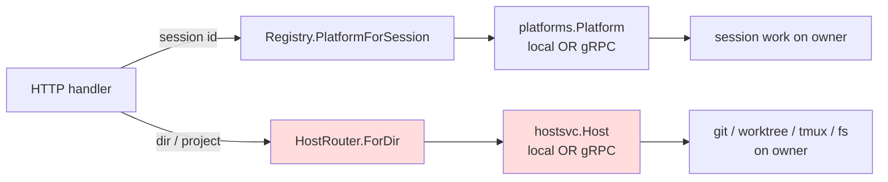
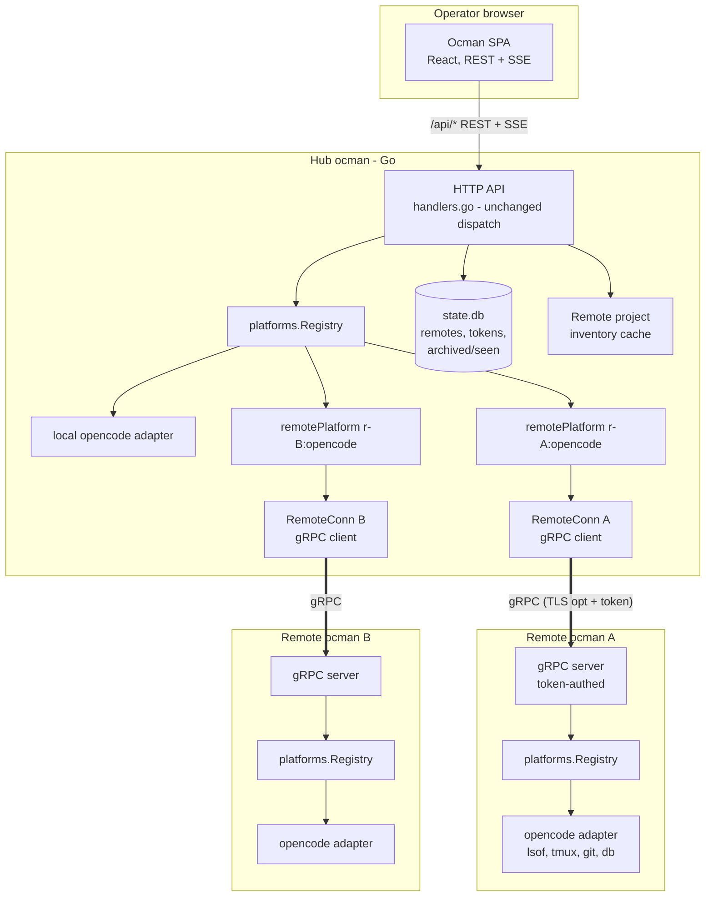
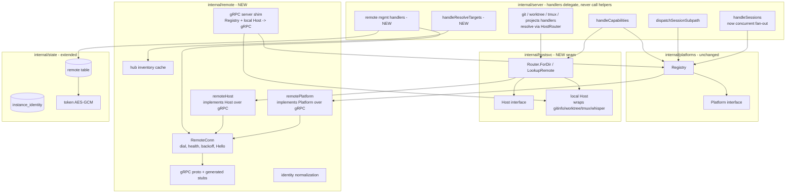
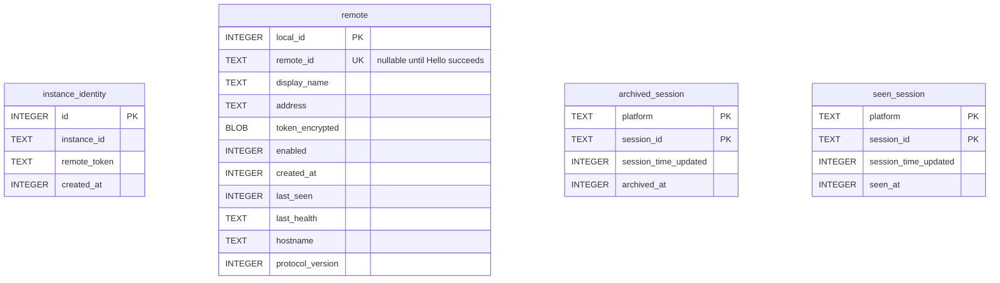
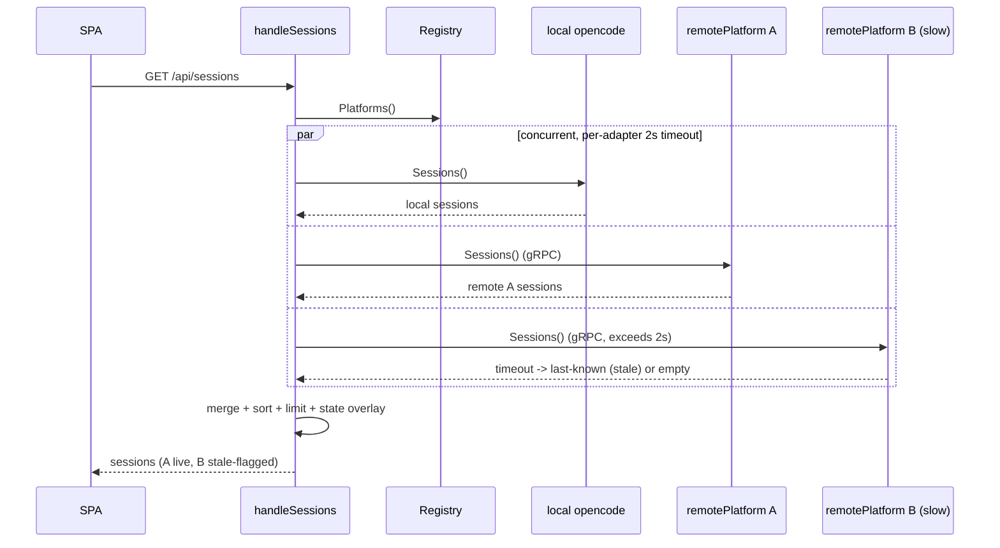
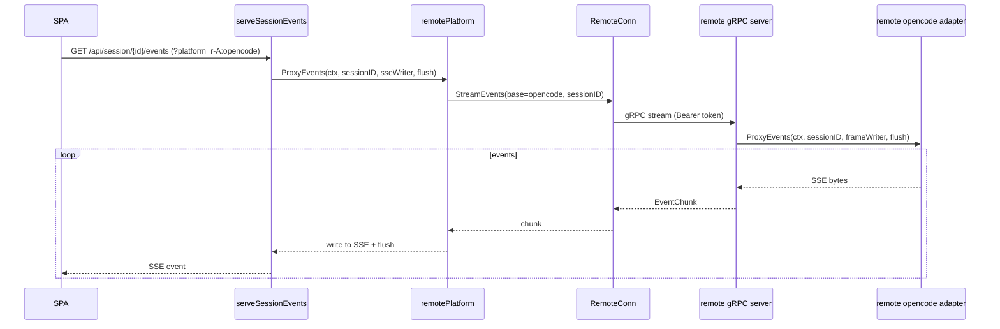
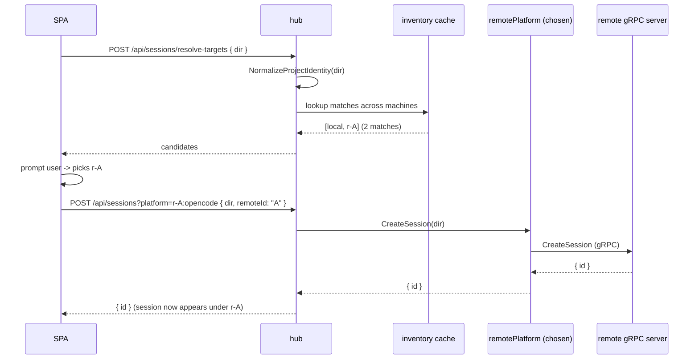
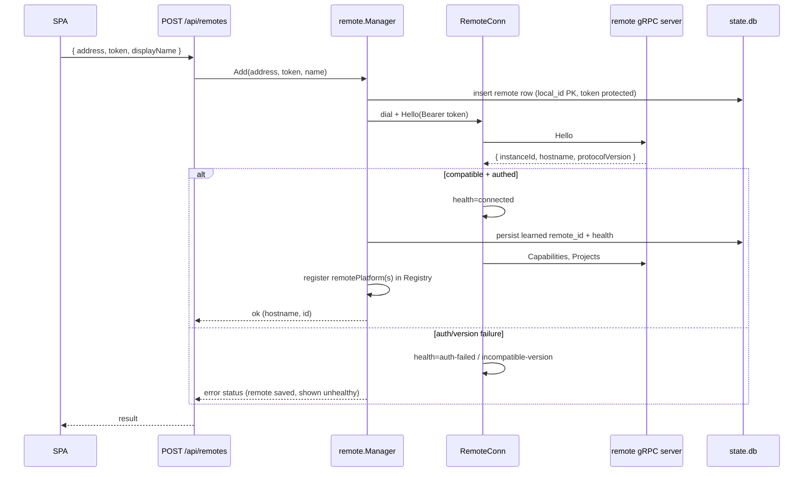

# Multi-Remote Support - Architecture

## Overview

One "hub" ocman manages coding-agent sessions running on other machines.
Each machine runs an ordinary ocman; the hub dials each remote over a
long-lived **gRPC** connection (unary commands plus server-streamed updates)
and presents every machine's sessions in one unified, host-agnostic UI.

The design's central insight: ocman already has the perfect seam. Every
session operation in the server flows through the
`platforms.Platform` interface (`internal/platforms/platform.go`) and the
`platforms.Registry` fan-out. **A remote is just more `Platform`
adapters** — each remote-platform adapter implements the same interface
by translating every method into a gRPC call to the owning remote. The
HTTP layer (session list fan-out, per-session dispatch, capabilities,
auto-archive) keeps working unchanged because it already iterates
`registry.Platforms()` and resolves a session's owner via
`registry.PlatformForSession`.

Two new packages do the heavy lifting:

- **`internal/remote`** — the gRPC contract (proto), the hub-side client
  (a `RemoteConn` that manages one channel per remote, plus a
  `remotePlatform` adapter implementing `platforms.Platform` over gRPC),
  and the remote-side **server** (a thin shim that exposes the local
  `platforms.Registry` over gRPC).
- Hub-side **remote management** state (registered remotes, tokens,
  health) lives in `internal/state` (new tables, migration v14+).

Session addressing reuses the existing `(platform, session_id)` key by
**namespacing the platform ID per remote**: a remote OpenCode session is
owned by a `Platform` whose `ID()` is `r-<remoteID>:opencode`. Local
sessions intentionally keep the existing bare `opencode` platform key for
state compatibility while carrying `remoteId = "local"` for display and
host routing. Remote session routes are platform-qualified so duplicate
session IDs on different machines cannot be misrouted.

The frontend stays host-agnostic per the existing convention (AD-12a /
`useCapabilities()`): it never branches on "is this remote." A new host
badge and the machine-picker on session creation are driven by
server-supplied fields and capability flags.

## The Abstraction Pattern (read this first)

The single most important thing about this design is **not** the gRPC
plumbing — it is the rule that keeps remote support from becoming a tax on
every future feature. State it once, enforce it, and future work never
has to think about remotes:

> **Every operation that touches a machine's filesystem, processes, git
> working tree, or agent runtime is expressed as a method on an
> *owner-resolved adapter*, never as a direct call to a package-level
> local helper from an HTTP handler.**

Ocman already proved this works for *session-scoped* operations: handlers
resolve a `platforms.Platform` for the request and delegate; whether that
adapter is in-process or gRPC-backed is invisible to the handler
(AD-1/AD-2a). Remote support is "free" for everything that goes through
`Platform`.

The danger is the **other half** of the server — the *directory/host-scoped*
operations (`git diff`, `git info`, `worktree list/create`, `tmux launch`,
`projects index`, `whisper`, future "run tests", "open editor",
"read file"). Today those handlers take a `dir` query param and call a
package-level helper (`gitinfo.*`, `worktree.*`, `launchOpencodeInTmux*`,
`whisperAvailable`) that **silently assumes the directory is on this
machine**. A new feature that copies that pattern will compile, pass tests,
work in the demo — and silently never work for a remote project. That is
exactly the "fighting the remote setup" failure we are designing out.

### Two adapter seams, one resolution rule

| Scope | Seam (interface) | "Who owns it?" resolved by |
|---|---|---|
| **Session-scoped** (a session ID) | `platforms.Platform` | `Registry.PlatformForSession(id)` — already exists |
| **Host/dir-scoped** (a path/project) | **`hostsvc.Host`** (new, generalizes the AD-6 `HostServices`) | **`HostRouter.ForDir(dir)`** (new) |

Both seams resolve an owner, then delegate. The owner is either the
in-process local implementation (local machine) or a gRPC-backed proxy
(remote machine). **Handlers never see the difference**, and never call a
local helper directly.



### The contract for future features (the part people will actually read)

When you add a feature that touches a machine, follow the decision tree:

1. **Is it scoped to a session?** → add a method to `platforms.Platform`
   (and its gRPC mirror). Done — remotes work automatically.
2. **Is it scoped to a directory/project but host-local in nature**
   (shells out, reads files, drives tmux/git)? → add a method to
   `hostsvc.Host`, implement it once in the **local** `Host` (wrapping the
   existing package helper) and have the **gRPC** `Host` proxy it. The
   handler calls `router.ForDir(dir).YourMethod(...)`. Done — remotes work
   automatically.
3. **Is it pure hub state** (settings, archived/seen, remotes table)? →
   it lives in `state.db` on the hub and is not host-scoped. No adapter
   needed.

Three concrete rules make this enforceable rather than aspirational:

- **R-A (no naked helpers in handlers):** an HTTP handler in
  `internal/server` must not import `gitinfo`, `worktree`, `whisper`, or
  call `launchOpencodeInTmux*` / `exec.*` directly. It must go through
  `HostRouter` (or `Platform`). The existing local helpers become the
  *implementation* of the local `Host`, called from `internal/hostsvc`,
  not from handlers. Enforced by a `scripts/check-host-helpers.sh` grep in
  `make lint`, mirroring `check-platform-branching.sh`.
- **R-B (capabilities, not identity):** the frontend gates host-touching
  UI on a capability flag from `Host.Capabilities()` (e.g.
  `worktrees`, `tmux`, `gitDiff`), never on `remoteId === 'local'`. Same
  rule as AD-12a, extended to host services.
- **R-C (owner executes):** a host operation always runs on the machine
  that owns the path. The hub never shells out on behalf of a remote dir;
  it asks that remote's `Host` (over gRPC) to do it. tmux panes, worktrees,
  and child processes live on the owner (FR-10).

This is the whole pattern. The rest of the document is the machinery that
implements these two seams; AD-16 formalizes the `Host` seam and AD-6 is
its first concrete consumer (worktree/tmux).

## Context Diagram



## Architectural Decisions

### AD-1: A remote is a set of `Platform` adapters reached over gRPC

- **Status**: Decided
- **Context**: The hub needs remote sessions to appear and behave like
  local ones across the entire HTTP surface (list, detail, composer,
  permissions, SSE, archive, capabilities). The server already delegates
  all of this through `platforms.Platform` + `platforms.Registry`.
- **Options**:
  1. **Per-request REST proxy**: hub forwards each `/api/*` call to the
     owning remote's REST API. Rejected by the requirements in favor of a
     persistent channel; also would re-implement dispatch outside the
     `Platform` seam.
  2. **`remotePlatform` adapter implementing `platforms.Platform` over
     gRPC.** The hub registers one such adapter per (remote × platform).
     Server code is untouched.
  3. **New parallel "remote" abstraction** alongside `Platform`. Large,
     duplicative.
- **Decision**: Option 2.
- **Rationale**: Maximum reuse. `handleSessions`, `dispatchSessionSubpath`,
  `autoArchiveInactiveSessions`, `handleCapabilities`, and every
  session-scoped handler already operate on `Platform`. Wrapping gRPC in
  a `Platform` makes remotes "just work" through all of them.
- **Consequences**: The `Platform` interface becomes the de-facto gRPC
  contract surface. Methods that stream (`ProxyEvents`) map to a gRPC
  server-stream; the rest are unary RPCs. Methods that are inherently
  host-local (worktree create, tmux) are **not** on `Platform` today and
  need a small capability extension (AD-6).

### AD-2: Session addressing via namespaced platform ID `r-<remoteID>:<platform>`

- **Status**: Decided (Architect; surfaced to user as the key design fork)
- **Context**: Sessions are keyed `(platform, session_id)` in `state.db`
  (PK), in `registry.bySID`, and in the frontend. Adding a remote
  dimension must not break those.
- **Options**:
  1. **Namespace the platform ID for remotes, keep local bare**: remote
     adapters register as `r-<remoteID>:opencode`. `Session.Platform`
     carries that compound value for remotes; local sessions keep the
     existing `opencode` key. `state.db` keeps its existing `(platform,
     session_id)` PK with no key-shape change.
  2. **Add a parallel `remoteID` field** through `Platform`, `Registry`,
     `state.db` PK (rebuild migration), and every handler signature.
     Conceptually cleaner, but touches the hot path broadly and forces a
     PK rebuild.
- **Decision**: Option 1.
- **Rationale**: Near-zero churn on proven, hot code. The compound ID is
  opaque to the server (it's just a `platforms.ID`). Local adapters can
  keep their bare ID (`opencode`) or be namespaced under the hub's own
  remote ID; we keep the bare ID for the local machine to preserve
  backward-compatible `state.db` rows (existing archived/seen rows stay
  valid with `platform = "opencode"`).
- **Consequences**:
  - `Session.Platform` for a remote session is `r-<remoteID>:opencode`.
    The frontend must treat the platform string as opaque (it already
    does, per AD-12a). For display it uses new `remoteId` / `remoteName`
    fields (AD-7), not the compound platform string.
  - The hub's registry holds N×M adapters (N remotes × M platforms each).
    For ~10 remotes × 1 platform that's ~11 adapters — trivial.
  - The local machine's sessions keep `platform = "opencode"` (its
    routing/display remote ID is the sentinel `local`). The local ocman
    still has a real persisted random `instanceID` for its own identity and
    `Hello` responses when acting as a remote, but that ID is not used to
    namespace local session state in v1. No migration of existing rows.
  - Parsing helper `splitPlatformID("r-A:opencode") -> (remoteID="A",
     base="opencode")` lives in `internal/remote`. A bare ID with no `:`
     means the local machine.

### AD-2b: Remote session routes are platform-qualified; `Owns` is cache-only

- **Status**: Decided
- **Context**: The current registry reverse lookup is `sessionID ->
  platform`. That is sufficient on one machine, but two ocman instances may
  independently produce the same `session_id`. If the hub resolves a remote
  detail/composer/SSE/control route by session ID alone, it can route to the
  wrong machine. Also, the `Platform.Owns` contract is intentionally cheap
  and forbids network/external-process work; a gRPC-backed `Owns` must not
  dial the remote during cold-cache resolution.
- **Options**:
  1. **Require remote routes to carry `?platform=`** and treat
     `PlatformForSession(sessionID)` as a best-effort fallback for legacy /
     local-only URLs.
  2. Rebuild all route keys around an explicit `(platform, sessionID)` path
     shape. Cleaner, but larger frontend/router churn.
  3. Rewrite remote session IDs on the hub. Heavy and leaks transport
     concerns into payloads.
- **Decision**: Option 1.
- **Rationale**: The session list already returns `Session.Platform`, so the
  frontend can include it on every session-scoped fetch/mutation/event URL.
  This avoids session-ID collisions without rewriting existing URL shapes.
- **Consequences**:
  - Any session row whose platform is compound (`r-...:<platform>`) must be
    opened, streamed, and mutated with `?platform=<compound>`. The frontend
    treats this as opaque route state, not a platform/remote identity branch.
  - `remotePlatform.Owns(ctx, sessionID)` may only consult a local
    in-memory ownership cache populated by `Sessions()` fan-out / event
    streams. It never performs a gRPC call. Unknown returns `false`.
  - `Registry.PlatformForSession` remains useful for local/legacy URLs and
    tests, but remote correctness depends on explicit platform qualification.

### AD-2a: Uniform model, but the local machine is served in-process (never over gRPC loopback)

- **Status**: Decided
- **Context**: The requirements model "this machine" as a built-in remote
  (C2 / FR-3) for a uniform code path. A tempting over-simplification is
  to make the hub *also* talk to its own machine over gRPC — i.e. always
  route every machine, including self, through `remotePlatform`. The
  question: should the local machine's data travel the gRPC channel too,
  for the sake of one single path?
- **Options**:
  1. **Uniform model, split transport** (chosen): the local machine is
     *modeled* as a remote (labeled `RemoteID="local"` /
     `RemoteName="This machine"`) but is *served by the existing
     in-process `Platform` adapters directly*. `remotePlatform` (gRPC) is
     used only for genuine remote hosts. The two coexist in the same
     `platforms.Registry`; the server fans out over both identically.
  2. **Uniform transport (loopback gRPC for self too)**: the hub dials its
     own gRPC server for local sessions, so there is exactly one transport.
- **Decision**: Option 1.
- **Rationale**:
  - The uniformity that matters lives at the **`Platform`/Registry seam**,
    not at the transport. The HTTP layer, fan-out, dispatch, capabilities,
    and frontend are already uniform because they only see `Platform`
    adapters — whether an adapter is in-process or gRPC-backed is invisible
    to them. Option 1 fully delivers the "one code path" goal.
  - Loopback gRPC would serialize every `db.Session` / `SessionDetail` to
    JSON and back on the hottest path (`/api/sessions` polls every few
    seconds) for zero functional gain.
  - It would also sever the local OpenCode adapter from its direct
    collaborators (read-only SQLite handle, `lsof` port discovery, local
    tmux) — or force tunneling them too.
  - Most decisively: a **single-host install** (the common case, protected
    by NFR-6) would then *require* the gRPC server to be running just to
    see its own sessions. Option 1 keeps single-host behavior byte-for-byte
    identical and leaves `-remote-listen` off by default.
- **Consequences**:
  - The registry holds a **mix**: direct local adapter(s) + one
    `remotePlatform` per connected remote. This is expected and correct,
    not a special case to remove.
  - Implementers must **not** "simplify" by routing local sessions through
    gRPC. The local path is the existing, unchanged adapter path.
  - When zero remotes are configured *and* `-remote-listen` is off, the
    only registered adapter is the local one — identical to today.

### AD-3: The remote runs a thin gRPC server over its local `platforms.Registry`

- **Status**: Decided
- **Context**: Per requirements decision 3 (clarified by A-1), the remote
  needs a server surface, but it should be as thin as possible.
- **Decision**: Add `internal/remote/server.go` — a gRPC service that, for
  each unary RPC, resolves the local adapter from the *base* platform ID
  in the request and calls the corresponding `Platform` method; for the
  event RPC it calls `ProxyEvents` and forwards chunks as stream messages.
  It is wired in `main.go` behind a flag (`-remote-listen`), defaulting
  **off** so existing single-host installs are unchanged (NFR-6).
- **Rationale**: The remote's gRPC server is a pure translation layer with
  no business logic — it reuses the exact adapters the local HTTP server
  uses. One code path, tested once.
- **Consequences**: The remote does not know it is "remote"; it just
  answers gRPC. Its REST server and localhost posture are untouched. A
  remote can itself be a hub (nesting) — out of scope but not precluded.

### AD-4: Token auth on the gRPC channel; TLS optional

- **Status**: Decided
- **Context**: NFR-3 — token mandatory, TLS recommended but optional over
  a trusted overlay.
- **Decision**:
  - Each ocman persists a random **remote-access token** in its own
    `state.db` (new `instance_identity` table, AD-5). The gRPC server
    enforces it via a per-RPC interceptor reading
    `authorization: Bearer <token>` from gRPC metadata. Missing/wrong →
    `codes.Unauthenticated`.
  - The hub maintains one long-lived `grpc.ClientConn` per configured
    remote. Command paths use unary RPCs; live events and project inventory
    updates use server-streaming RPCs over that same HTTP/2 connection.
  - TLS is enabled when the remote is started with cert/key flags
    (`-remote-tls-cert`, `-remote-tls-key`); otherwise the server uses
    `insecure` transport credentials (plaintext) and logs a warning. The
    hub dials with TLS when the configured address is `grpcs://`/`https://`
    or a `tls=true` flag on the remote record; otherwise insecure.
  - The token is compared with `subtle.ConstantTimeCompare`.
- **Rationale**: Mirrors ocman's existing posture (open-by-default on a
  trusted boundary, opt-in hardening). Bearer-in-metadata is the standard
  gRPC pattern and independent of the REST password.
- **Consequences**: The remote REST `OCMAN_AUTH_PASSWORD` and the gRPC
  token are independent secrets. Mutual TLS is deferred (OQ-2).

### AD-5: Instance identity + token persisted in each ocman's `state.db`

- **Status**: Decided (requirements C1, E2)
- **Context**: Each ocman needs a stable random ID (routing key) and a
  remote-access token, both surfaced on its own settings page.
- **Decision**: New single-row table `instance_identity (id=1,
  instance_id TEXT, remote_token TEXT, created_at INTEGER)` (migration
  v14). Generated on first startup if absent. `instance_id` is a short
  random base32 string (e.g. 12 chars); `remote_token` is a longer random
  secret (≥32 bytes base64). The settings UI shows masked token status by
  default and uses an explicit authenticated reveal/copy action to fetch the
  plaintext token for this instance only.
- **Rationale**: Reuses the established single-row-table pattern
  (`auth_secret`, `judge_settings`). Survives restarts (FR-2, FR-4).
- **Consequences**: `GET /api/settings/remote-access` (auth-gated) returns
  `{ instanceId, listening, listenAddr, tls, tokenSet: true }` for display.
  `POST /api/settings/remote-access/reveal-token` (auth-gated, explicit UI
  action) returns the plaintext token for the owning instance so the user can
  copy it. Hub-stored tokens for attached remotes are never returned in
  plaintext. Token rotation is a future item (OQ-7).

### AD-16: The `hostsvc.Host` seam + `HostRouter` (the directory-scoped abstraction)

- **Status**: Decided (formalizes "The Abstraction Pattern" above)
- **Context**: Session-scoped work has a clean owner-resolved seam
  (`Platform` + `Registry.PlatformForSession`). Directory/host-scoped work
  (git, worktree, tmux, projects, whisper, future fs/editor/test actions)
  has **none** — handlers call package-level local helpers directly,
  hard-coding the "this machine" assumption. This is the structural source
  of future friction with remote support.
- **Decision**: Introduce a second adapter seam mirroring `Platform`:
  - **`hostsvc.Host`** — an interface for directory-scoped host operations.
    v1 methods (each wrapping a helper that exists today):
    `GitInfo(ctx, dirs)`, `GitDiff(ctx, dir, opts)`,
    `ListWorktrees(ctx, dir)`, `WorktreeDefaultBaseRef(ctx, dir)`,
    `CreateWorktreeSession(ctx, req)`, `LaunchTmux(ctx, req)`,
    `TmuxSessions(ctx)`, `Projects(ctx)`, plus `Capabilities() HostCaps`.
    New host features add a method here, nowhere else.
  - **Local implementation** (`internal/hostsvc/local`): the *only* place
    that imports `gitinfo`, `worktree`, tmux helpers, `whisper`. It is a
    thin wrapper over the existing package functions — no logic moves,
    just ownership of the call site.
  - **gRPC implementation** (`internal/remote`, the `remoteHost`): proxies
    each method to the owning remote, which executes its *own* local
    `Host` (R-C). This reuses the exact same gRPC channel/auth as
    `Platform`.
  - **`hostsvc.Router`** — resolves `LookupRemote(remoteID) (Host, bool)` and
    `ForDir(dir) Host`. `LookupRemote` is the preferred path whenever the UI or
    API request already knows the owner: it **fails closed**, so a stale,
    disconnected or mistyped ID is rejected rather than silently degrading to
    the hub and running the action on the wrong machine. The permissive
    variant (`forRemote`, which degrades an unknown ID to local) is
    **unexported** and reachable only through `ForDir`, where inferred
    ownership makes the fallback correct. `ForDir` is a convenience fallback
    for local/legacy calls and consults the project-inventory cache (AD-8): a
    dir that unambiguously matches a remote's known project resolves to that
    remote's `Host`; everything else (and all paths physically under the hub)
    resolves to the local `Host`. The router is the directory analogue of
    `Registry.PlatformForSession`.
- **Options considered**:
  1. Put these methods on `Platform`. Rejected — conflates session
     semantics with host services; not every platform is a host, and a
     host is not a platform. Two orthogonal concerns deserve two seams.
  2. A grab-bag `HostServices` on the remote adapter only (the earlier,
     narrower AD-6 framing). Rejected as the *primary* abstraction because
     it leaves the **local** path still calling naked helpers from
     handlers — the friction we are eliminating. AD-6 is now re-scoped as
     the first *consumer* of `Host`, not the abstraction itself.
  3. Per-feature one-off proxies. Rejected — every feature re-litigates
     remote support.
- **Rationale**: One resolution rule per scope, one delegation pattern,
  one place that knows about local helpers, one place that knows about
  gRPC. Future host features are a single method addition with automatic
  remote support and an enforced lint rule (R-A) catching regressions.
- **Consequences**:
  - New packages `internal/hostsvc` (interface + router) and
    `internal/hostsvc/local` (local impl). The `remoteHost` lives next to
    `remotePlatform` in `internal/remote` and shares its `RemoteConn`.
  - `internal/server` handlers for git/worktree/tmux/projects are rewritten
    to resolve via `router.ForDir(dir)` and delegate. Behavior for a local
    dir is identical to today (the local `Host` calls the same helpers).
  - `scripts/check-host-helpers.sh` (new, wired into `make lint`) fails the
    build if a file under `internal/server` imports `gitinfo`/`worktree`/
    `whisper` or matches `launchOpencodeInTmux`/`exec.Command` outside the
    allowed shims — the enforcement analogue of
    `check-platform-branching.sh`.
  - `HostCaps` flags (`gitDiff`, `worktrees`, `tmux`, `projects`,
    `whisper`) feed `/api/capabilities`; the frontend gates host UI on
    them (R-B).
  - PR/Issue backend requests carry `remoteId` and resolve it strictly.
    Upstream detection and cross-fork fetches execute through the owner's
    `Host` over JSON gRPC; the hub consumes the returned normalized remotes
    with its forge clients and launches on the compound platform. Frontend
    owner selection remains a separate slice.

### AD-16b: Host operations use host-qualified directory references when owner is known

- **Status**: Decided
- **Context**: Absolute paths are meaningful only on the machine that owns
  them. Two hosts can both have `/Users/alice/src/app`, and a remote path may
  coincidentally look valid on the hub. Relying on a bare `dir` for every host
  operation creates ambiguous routing.
- **Options**:
  1. **Host-qualified refs**: requests that know the owner carry
     `{ remoteId, dir }`. Handlers resolve via `HostRouter.LookupRemote` and
     execute the path on that host, rejecting an unregistered owner.
     `ForDir` remains a compatibility / inference fallback.
  2. Bare `dir` everywhere, with inventory-based inference. Simpler request
     shapes, fragile for duplicate paths and zero-match create.
- **Decision**: Option 1.
- **Rationale**: The session list, project inventory, and machine picker all
  know the owner. Passing it explicitly avoids guessing and makes remote paths
  safe to use even when their string also exists locally.
- **Consequences**:
  - New/remote-aware host APIs accept a `remoteId` field alongside `dir` /
    `projectDir`. When absent, handlers use `ForDir` for backward-compatible
    local behavior.
  - Machine-picker candidates include `{ remoteId, remoteName, platform,
    dir }`; create/worktree/tmux actions send the chosen `remoteId` back.
  - The frontend still does not branch on remote identity for behavior; it
    simply preserves and submits opaque owner data supplied by the server.

### AD-6: Worktree + tmux are the first consumers of the `Host` seam

- **Status**: Decided (requirements B4, B5, FR-10; consumer of AD-16)
- **Context**: Worktree creation and tmux launch shell out on the host
  that owns the repo/processes (`handlers_worktree.go`,
  `launchOpencodeInProjectTmuxWindow`).
- **Decision**: Express them as `Host` methods (`CreateWorktreeSession`,
  `LaunchTmux`, `ListWorktrees`, `WorktreeDefaultBaseRef`,
  `TmuxSessions`), implemented once in the local `Host` (wrapping today's
  helpers) and proxied by `remoteHost`. The worktree/tmux handlers resolve
  `router.ForDir(projectDir)` and delegate.
- **Rationale**: They are the canonical directory-scoped, process-spawning
  operations; migrating them proves the seam and immediately satisfies
  FR-10 (worktree/tmux execute on the owner).
- **Consequences**: The hub never executes a remote's git/tmux locally; it
  asks that remote's `Host` to (R-C). tmux panes/worktrees live on the
  owner. The hub surfaces success/failure + the resulting session (which
  appears in the unified list under `r-<remoteID>:opencode`).

### AD-7: Host identity surfaced to the frontend via new neutral Session fields

- **Status**: Decided (FR-6, FR-17)
- **Context**: The UI needs a host badge but must not parse the compound
  platform ID or branch on remote identity.
- **Decision**: `db.Session` gains two display-only fields, stamped by the
  adapter:
  - `RemoteID string json:"remoteId"` — `"local"` for the hub's machine,
    else the remote's random ID.
  - `RemoteName string json:"remoteName"` — the hub-assigned display name
    (or the remote's reported hostname when unnamed); `"This machine"` for
    local.
  The frontend renders `remoteName` as a badge next to the platform badge.
  No behavior keys off these values — they are display strings only.
- **Rationale**: Consistent with AD-12a (capabilities/flags, not identity
  branching). The badge is data, not logic.
- **Consequences**: Adapters populate these on every `Session` they
  return. The `remotePlatform` adapter stamps them from its `RemoteConn`;
  local adapters stamp `local` / `This machine`.

### AD-8: Project inventory is cached on the hub, pushed by remotes

- **Status**: Decided (FR-11, D3)
- **Context**: The new-session machine-picker matches the target project
  against each machine's known projects, from a cache (not a live query
  per action).
- **Decision**: The gRPC contract has a `Projects` unary RPC returning the
  remote's project list (origin URL + basename + abs path) and a
  `WatchProjects` server-stream that pushes updates. The hub keeps a
  `map[remoteID][]ProjectIdentity` refreshed on connect, on stream push,
  and on a periodic timer (reusing `projectsScanInterval` cadence). The
  remote derives its list from its existing projects index
  (`s.db.GetProjects()` / `projectsSnapshot()`), enriched with git origin
  per directory (computed lazily + cached on the remote).
- **Rationale**: Matches the existing projects-index refresh pattern;
  avoids a live fan-out on every new-session click; survives reconnect.
- **Consequences**: First match after attaching a remote may briefly miss
  until the first inventory arrives; the picker falls back to the
  zero-match "choose a remote" path, which is acceptable.

### AD-9: Project identity = normalized git origin, basename fallback

- **Status**: Decided (FR-12)
- **Context**: "Same project across hosts" must be comparable.
- **Decision**: Compute a `ProjectIdentity` key by normalizing the git
  `origin` remote URL: lowercase host, strip `.git` suffix, canonicalize
  `git@host:org/repo` ↔ `https://host/org/repo` to `host/org/repo`. When
  no origin exists, the key is `basename:<dirBasename>`. Matching is exact
  on the normalized key. v1 treats the whole git repository as one project;
  monorepo subdirectory identity (e.g. `repo::frontend`) is deferred.
  Normalization lives in `internal/remote/identity.go` and is unit-tested
  against the URL variants in OQ-3.
- **Rationale**: Robust to ssh/https form differences; degrades to a
  sensible local-only heuristic.
- **Consequences**: Two unrelated repos sharing a basename but no origin
  would collide; acceptable for the rare no-remote case (the user is then
  prompted anyway when multiple machines "match"). Two subdirectories in the
  same monorepo are treated as the same project in v1; adding repo-relative
  subpath keys is a follow-up item (OQ-12).

### AD-10: Hub-side remote state in `state.db` (migration v14)

- **Status**: Decided (FR-14, NFR-4)
- **Context**: The hub persists registered remotes and their tokens.
- **Decision**: New table `remote` (see Data Model). The stored token is
  protected/obfuscated at rest with a key derived from the existing
  `auth_secret` HMAC key (or a new `remote_secret` row if `auth_secret` is
  absent), using AES-GCM. Tokens are never returned to the browser in
  plaintext — the settings API returns a masked indicator + "set/replace
  token" write path only.
- **Rationale**: Reuses the established single-key-in-state.db pattern;
  AES-GCM gives authenticated encryption with a stdlib-only dependency and
  prevents accidental/plaintext disclosure. Because the app-local key lives
  beside the protected data, this is **not** intended to withstand an
  attacker with full `state.db` read access. Filesystem permissions and a
  trusted operator remain part of the threat model; moving secrets to the OS
  keychain/keyring is a follow-up ticket (OQ-10).
- **Consequences**: Migration v14 also creates `instance_identity`
  (AD-5). One migration step adds both tables.

### AD-10b: Remote rows use a hub-local primary key; remote instance ID is learned later

- **Status**: Decided
- **Context**: The remote's canonical random instance ID is only known after
  a successful authenticated `Hello`. But the hub must also persist failed or
  unreachable remote configurations so the Settings page can show
  `auth-failed` / `offline` and let the user edit/reconnect them. Therefore
  `remote_id` cannot be the table's only primary key.
- **Options**:
  1. **Hub-local surrogate key** (`local_id`) as the primary key, with
     nullable unique `remote_id` populated after `Hello`.
  2. Temporary UUID PK reconciled to `remote_id` after handshake. Similar
     effect, more reconciliation logic.
- **Decision**: Option 1.
- **Rationale**: It supports all add-remote outcomes: success, bad token,
  unreachable host, and later reconnect success. `remote_id` remains the
  routing key once known; `local_id` is only the hub's management handle.
- **Consequences**:
  - REST management routes use `local_id` while a record is unverified and
    may continue using it for stability (`/api/remotes/{local_id}`).
  - `remotePlatform` / `remoteHost` are only registered after a successful
    `Hello`, when `remote_id` is known and compatible.
  - Duplicate learned `remote_id` values are rejected/merged explicitly to
    prevent configuring the same remote twice.

### AD-11: gRPC payloads reuse JSON for rich nested types

- **Status**: Decided
- **Context**: `Platform` returns rich Go types (`db.Session`,
  `db.Message`, `db.Part` with `json.RawMessage`, `SessionDetail`,
  `SessionInfo`, `LivePrompt = map[string]interface{}`). Re-modeling all
  of these in protobuf is high-effort and brittle against ocman's frequent
  type evolution.
- **Options**:
  1. Full protobuf message modeling of every type. Maximal type safety,
     maximal churn; every `db` type change needs a proto change.
  2. **Thin proto envelopes carrying `bytes` of JSON** for the rich
     payloads, with scalar fields (ids, dirs, since, limit) as typed proto
     fields. Both sides `json.Marshal/Unmarshal` the existing Go types.
- **Decision**: Option 2.
- **Rationale**: The two ends are the *same codebase/version*, so JSON
  compatibility is guaranteed and the protocol-version handshake (AD-12)
  guards mismatches. Lets the existing `db`/`platforms` types flow
  unchanged; new fields ride along automatically.
- **Consequences**: Slightly larger payloads than packed protobuf;
  negligible at this scale. The proto stays tiny and stable. Type safety
  is enforced by the shared Go types, not the proto.

### AD-12: Protocol-version handshake at connect

- **Status**: Decided (FR-16)
- **Context**: Hub and remote are both ocman but may be different builds.
- **Decision**: The first RPC after dialing is `Hello`, exchanging
  `{ protocolVersion int, instanceId, hostname, ocmanVersion }`. The hub
  rejects a remote whose `protocolVersion` is outside the hub's supported
  range and sets that remote's health to `incompatible-version`. The
  protocol version is a single integer bumped only on breaking wire
  changes (the JSON-envelope approach of AD-11 means additive `db`-type
  changes do **not** bump it).
- **Rationale**: Cheap, explicit, and surfaces mismatch as a health state
  rather than confusing runtime errors.
- **Consequences**: A small compatibility matrix to maintain across
  releases; documented in the package.

### AD-13: Non-blocking fan-out with per-remote timeout; offline = stale + flagged

- **Status**: Decided (FR-15, NFR-1, NFR-5)
- **Context**: The unified list must never block on a slow/offline remote.
- **Decision**:
  - `handleSessions` already loops adapters sequentially. Change it to
    **fan out concurrently** with a per-adapter context timeout
    (default 2s, configurable) and merge whatever returns. (Local adapter
    keeps its current latency; remote adapters get the timeout.)
  - Each `RemoteConn` tracks health (`connected`, `connecting`, `offline`,
    `auth-failed`, `incompatible-version`) and `lastSeen`. A
    `remotePlatform` whose conn is `offline` returns its **last-known
    sessions from a short-lived in-memory cache** (marked stale via a
    per-session flag the frontend renders dimmed) and a non-fatal error is
    logged. The cache is intentionally memory-only in v1; after a hub
    restart, an offline remote may show no stale sessions until it reconnects.
  - Reconnect uses exponential backoff with jitter; on reconnect the conn
    re-runs `Hello`, refreshes inventory, and resumes any event stream.
- **Rationale**: Concurrency + timeout is the standard non-blocking
  aggregation; the stale cache satisfies "shown stale with an offline
  indicator" (FR-15) without blocking.
- **Consequences**: `db.Session` gains an optional `stale bool
  json:"stale,omitempty"` display flag. The exact timeout value is
  tunable (OQ-5). Concurrency bound is ~10 (NFR-2), so a simple
  `errgroup`/`WaitGroup` fan-out suffices. Persisting last-known sessions in
  `state.db` is deferred as a follow-up ticket (OQ-11).

### AD-14: Live events bridge gRPC server-stream → existing SSE

- **Status**: Decided (FR-7, B3)
- **Context**: The frontend consumes session events as SSE via
  `serveSessionEvents` → `adapter.ProxyEvents(ctx, sessionID, w, flush)`.
- **Decision**: `remotePlatform.ProxyEvents` opens a gRPC server-stream
  (`StreamEvents(sessionID)`) to the owner; each received chunk is written
  to the SSE `io.Writer` and flushed — i.e. the remote's
  `ProxyEvents` output is tunneled verbatim. The hub's existing SSE
  machinery (auto-approve tee, idle timeout, 503-on-unreachable) is
  reused unchanged because `ProxyEvents` keeps the same signature.
- **Rationale**: The SSE handler doesn't care whether bytes come from a
  local OpenCode `/event` proxy or a gRPC tunnel. Zero frontend change.
- **Consequences**: Auto-approve currently runs on the hub by teeing the
  SSE stream. For **remote** sessions, auto-approve should run on the
  **owning remote** (it has the LLM judge + OpenCode instance). v1
  decision: auto-approve stays the owner's concern — the hub does not tee
  remote streams into its judge (gated by the remote's own settings). The
  hub's tee still runs for local sessions. (Captured as a consequence /
  OQ-8.)

### AD-14b: Approval notices are injected by the session owner

- **Status**: Decided
- **Context**: Today `handleSession` injects persisted auto-approve notice
  messages from the hub's `state.db` after fetching a session detail. For a
  remote session, the approval decisions and notice records live in the
  remote's `state.db`, not the hub's. Injecting on both sides would be
  ambiguous and could produce missing or duplicate notices.
- **Options**:
  1. **Owner injects notices**: the remote gRPC `Session` RPC calls the
     remote's normal session-detail path, including its local approval notice
     injection, and the hub skips hub-side injection for `remotePlatform`.
  2. Hub injects for all sessions. Incorrect for remotes because it reads the
     wrong DB.
  3. Replicate remote notice state into the hub. Duplicative and out of
     scope.
- **Decision**: Option 1.
- **Rationale**: Consistent with AD-14: auto-approve is the owner's
  responsibility. The owner has the correct state DB, judge settings, and
  platform adapter.
- **Consequences**:
  - `remotePlatform.Session` returns detail already enriched by the remote.
  - Hub `handleSession` detects remote/compound platforms (or a marker
    interface) and does not call `injectApprovalNotices` for them.
  - Local sessions keep the existing hub-side injection behavior unchanged.

### AD-15: New-session machine picker is a hub-side resolver feeding the existing create flow

- **Status**: Decided (FR-13)
- **Context**: Creating a session must pick a machine by project identity,
  prompting on multiple/zero matches.
- **Decision**: Add `POST /api/sessions/resolve-targets` (hub-side):
  given `{ dir | projectIdentity, remoteId? }`, the hub computes the identity
  (AD-9) and returns the list of candidate machines from the inventory
  cache (AD-8): `[{ remoteId, remoteName, platform, dir }]`. The frontend:
  - 1 candidate → calls create directly against that target.
  - >1 → shows a chooser, then creates against the chosen target.
  - 0 → shows a "pick a machine" list (all enabled remotes) and creates
    against the chosen one.
  Creation reuses the existing create path: `POST /api/sessions` already
  selects a platform via `?platform=`; here the platform param is the
  **compound** `r-<remoteID>:opencode`, so `CreateSession` dispatches to
  the `remotePlatform`, which forwards over gRPC to the owner's
  `CreateSession`. When a worktree is requested, the worktree handler
  instead sends `{ remoteId, projectDir, ... }`; the handler resolves
  `router.LookupRemote(remoteId)` when supplied (preferred; a
  non-connected owner is rejected) or falls back to
  `router.ForDir(projectDir)` for backward-compatible local behavior, then
  calls `Host.CreateWorktreeSession` (AD-6/AD-16/AD-16b).
- **Rationale**: Keeps creation on the proven `Platform.CreateSession`
  path; the only new server code is the resolver. The UI owns the
  prompting (it has the modal infrastructure already used by `/wt`).
- **Consequences**: The frontend gains a small chooser; the resolver is
  pure cache lookup (fast, no fan-out). "Project not checked out anywhere"
  (D4) is the zero-match path.

### AD-17: Capabilities response changes are additive and backward-compatible

- **Status**: Decided
- **Context**: Existing frontend code and tests consume `/api/capabilities`
  as `{ platforms, worktreeSessions, mcpServer }`. Multi-remote support adds
  host-scoped capabilities (`HostCaps`) and host labels, but a wholesale
  response restructure would create avoidable frontend churn and breakage.
- **Options**:
  1. **Additive `hosts[]` block** while preserving existing top-level fields.
  2. Fully restructure capabilities around machines/hosts and migrate all
     consumers in one step.
- **Decision**: Option 1.
- **Rationale**: It lets implementation migrate UI affordances gradually.
  Platform-scoped UI keeps reading `platforms[]`; host-scoped UI begins
  reading `hosts[]`. Existing `worktreeSessions` remains during the
  transition.
- **Consequences**:
  - `/api/capabilities` returns the exact additive shape documented in the
    API Design section.
  - `capabilityEntry` may grow optional `remoteId` / `remoteName` fields for
    display, but existing fields remain stable.
  - The frontend gates behavior on capability flags only; it may preserve and
    submit opaque `remoteId` values supplied by the server, but must not
    branch behavior on specific host identities.

## Component Design

### Component Diagram



### `internal/remote` (new)

- **Responsibility**: the gRPC contract and both ends of the channel.
- **Sub-components**:
  - `proto/remote.proto` + generated stubs: the service (unary RPCs
    mirroring `Platform` + `Host`, a `StreamEvents` server-stream,
    `Hello`, `Projects`, `WatchProjects`). Rich payloads are JSON `bytes`
    (AD-11).
  - `conn.go` (`RemoteConn`): owns one `grpc.ClientConn` per remote;
    handles dial, `Hello`, health state machine, backoff reconnect,
  inventory subscription. Shared by `remotePlatform` and `remoteHost`.
  This is one long-lived gRPC client connection per remote: commands are
  unary RPCs and event/project updates are server-streaming RPCs over the
  same HTTP/2 connection.
  - `platform.go` (`remotePlatform`): implements `platforms.Platform` by
    marshaling args, calling `RemoteConn`, unmarshaling results. Stamps
    `RemoteID`/`RemoteName`/`stale` on returned sessions. `ID()` returns
    `r-<remoteID>:<base>`.
  - `host.go` (`remoteHost`): implements `hostsvc.Host` over the same
    `RemoteConn` (AD-16). The directory analogue of `remotePlatform`.
  - `server.go` (`Server`): the remote-side gRPC service. Each unary RPC
    resolves either the local `Platform` (by base id) or the local
    `hostsvc.Host` and calls the matching method; `StreamEvents` calls
    `ProxyEvents` with a writer that frames output into stream messages.
  - `identity.go`: `NormalizeProjectIdentity`, `splitPlatformID`.
  - `auth.go`: bearer-token interceptor (server) + per-call credentials
    (client); constant-time compare.
- **Dependencies**: `internal/platforms`, `internal/hostsvc`,
  `internal/db` types, `google.golang.org/grpc`, stdlib `crypto`.

### `internal/hostsvc` (new — the directory-scoped seam, AD-16)

- **Responsibility**: the `Host` interface, the `Router`, and the local
  implementation. The directory analogue of `internal/platforms`.
- **Sub-components**:
  - `host.go`: the `Host` interface + `HostCaps`.
  - `router.go`: `Router.LookupRemote(id)` (strict, for explicit owner
    refs) / `ForDir(dir)` (inference against the inventory cache);
    defaults to the local `Host` when no remote owner is
    supplied/inferred, and rejects an explicit owner that is not
    registered.
  - `local/`: the local `Host` — the **only** package that imports
    `gitinfo`, `worktree`, tmux helpers, and `whisper`. Thin wrappers; no
    logic moves out of those packages.
- **Gating**: `HostCaps` (`gitDiff`, `worktrees`, `tmux`, `projects`,
  `whisper`) surfaced via `/api/capabilities`; the frontend gates host UI
  on these flags, never on remote identity (R-B). v1: local and remote
  OpenCode hosts report all `true`.

### `internal/server` (extended, minimal)

- `handleSessions` / `handleSessionsNotify`: switch the adapter loop to a
  bounded-concurrency fan-out with per-adapter timeout (AD-13). Merge +
  existing sort/limit/state overlay unchanged.
- New handlers:
  - `GET/POST/PUT/DELETE /api/remotes` — remote CRUD + reconnect + enable.
  - `GET /api/settings/remote-access` — this instance's id + remote-listen
    status; `POST /api/settings/remote-access/reveal-token` for explicit
    token copy.
  - `POST /api/sessions/resolve-targets` — machine picker resolver (AD-15).
- **git / worktree / tmux / projects handlers are migrated onto the seam**:
  they resolve `router.LookupRemote(remoteId)` when the request is
  host-qualified, otherwise `router.ForDir(dir)`, and delegate to `Host`
  instead of calling `gitinfo.*` / `worktree.*` /
  `launchOpencodeInTmux*` directly
  (AD-16, R-A). The local path is behavior-identical to today because the
  local `Host` calls the same helpers. This migration is the refactor that
  prevents future features from re-introducing the local-only assumption.
- `Server` gains `remotes *remote.Manager` (owns `RemoteConn`s + inventory
  cache, registers/unregisters `remotePlatform`s and exposes `remoteHost`s
  to the `Router` as remotes connect/disconnect) and a `hostRouter
  *hostsvc.Router`.

### `internal/state` (extended)

- Migration v14: `instance_identity` + `remote` tables (Data Model).
- `remote` CRUD methods; token protect/unprotect with AES-GCM.
- `InstanceIdentity()` (get-or-create), `RemoteToken()`.
- Existing archived/seen/pinned APIs unchanged — they key on the compound
  platform string transparently.

### `main.go` (extended)

- New flags: `-remote-listen` (gRPC bind addr for the remote server; empty
  = disabled, the default → NFR-6), `-remote-tls-cert`, `-remote-tls-key`.
- On startup: ensure instance identity; if `-remote-listen` set, start the
  `remote.Server`; always start the hub-side `remote.Manager` which loads
  saved remotes from `state.db` and begins dialing them (registering
  `remotePlatform`s as they connect).

## Data Model

### Extended `db.Session` (display-only additions)

```go
RemoteID   string `json:"remoteId"`             // "local" or remote random ID
RemoteName string `json:"remoteName"`           // display label / hostname
Stale      bool   `json:"stale,omitempty"`      // last-known data from an offline remote
```

`Platform` continues to hold the owning adapter ID, now possibly compound
(`r-<remoteID>:opencode`). No other `Session` change.

### State database (after migration v14)



`archived_session` / `seen_session` are unchanged; for remote sessions
`platform` is the compound `r-<remoteID>:opencode` value. `remote.local_id`
is the hub management key used by `/api/remotes/{id}`; `remote.remote_id` is
the learned random instance ID used for routing once connected.

### Hub inventory cache (in-memory)

```go
type ProjectIdentity struct {
    Key      string // normalized origin or "basename:<x>"
    Origin   string
    Basename string
    Dir      string // absolute path on the owning host
}
// remote.Manager: map[remoteID][]ProjectIdentity, RWMutex-guarded,
// refreshed on connect / WatchProjects push / periodic timer.
```

### RemoteConn health states

```
connecting -> connected            (Hello ok)
connecting -> auth-failed           (Unauthenticated)
connecting -> incompatible-version  (Hello version out of range)
connected  -> offline               (transport error; backoff begins)
offline    -> connecting            (backoff elapsed)
```

## API Design

### gRPC service (sketch — JSON envelopes per AD-11)

```proto
service Ocman {
  rpc Hello(HelloReq) returns (HelloResp);

  // Session reads (base platform id in PlatformRef)
  rpc Sessions(SessionsReq) returns (JsonResp);          // []db.Session
  rpc Session(SessionReq) returns (JsonResp);            // SessionDetail
  rpc SessionsInactiveBefore(CutoffReq) returns (JsonResp);
  rpc SessionChanges(SessionRef) returns (JsonResp);
  rpc SessionInfo(SessionRef) returns (JsonResp);
  rpc AgentCatalog(SessionRef) returns (JsonResp);
  rpc SlashCommands(SessionRef) returns (JsonResp);
  rpc SessionModels(SessionRef) returns (JsonResp);
  rpc ListPermissions(SessionRef) returns (JsonResp);
  rpc ListQuestions(SessionRef) returns (JsonResp);
  rpc Capabilities(PlatformRef) returns (JsonResp);

  // Session mutations
  rpc SendMessage(JsonReq) returns (Empty);
  rpc ExecuteCommand(JsonReq) returns (Empty);
  rpc RunShell(JsonReq) returns (Empty);
  rpc RespondPermission(JsonReq) returns (Empty);
  rpc RespondQuestion(JsonReq) returns (Empty);
  rpc RejectQuestion(JsonReq) returns (Empty);
  rpc Abort(JsonReq) returns (Empty);
  rpc RenameSession(JsonReq) returns (Empty);
  rpc Compact(JsonReq) returns (Empty);
  rpc CreateSession(JsonReq) returns (JsonResp);          // CreateSessionResponse

  // Streaming events (tunneled to hub SSE)
  rpc StreamEvents(SessionRef) returns (stream EventChunk);

  // Host services (worktree / tmux)
  rpc ListWorktrees(JsonReq) returns (JsonResp);
  rpc CreateWorktreeSession(JsonReq) returns (JsonResp);
  rpc LaunchTmux(JsonReq) returns (JsonResp);
  rpc TmuxSessions(Empty) returns (JsonResp);

  // Project inventory
  rpc Projects(Empty) returns (JsonResp);                 // []ProjectIdentity
  rpc WatchProjects(Empty) returns (stream JsonResp);
}
```

`PlatformRef { string platform }` and `SessionRef { string platform;
string session_id }` carry the **base** platform id (the hub strips the
`r-<remoteID>:` prefix before the call). `JsonReq`/`JsonResp` wrap
`bytes payload`. All RPCs require the bearer token.

### REST (hub) — additions

| Endpoint | Purpose |
|---|---|
| `GET /api/remotes` | List remotes (local + configured) with health, hostname, counts. Tokens never returned. Each configured remote includes `localId`; connected remotes also include learned `remoteId`. |
| `POST /api/remotes` | Add remote `{ address, token, displayName? }`; dials + Hello; returns result. |
| `PUT /api/remotes/{localId}` | Edit name / address / replace token / enable-disable. |
| `DELETE /api/remotes/{localId}` | Remove a remote (not allowed for `local`). |
| `POST /api/remotes/{localId}/reconnect` | Force a reconnect attempt. |
| `GET /api/settings/remote-access` | This instance's `{ instanceId, listening, listenAddr, tls, tokenSet }`. Auth-gated; no plaintext token. |
| `POST /api/settings/remote-access/reveal-token` | Explicit authenticated reveal action returning this instance's plaintext token for copy-to-clipboard. Never returns stored tokens for attached remotes. |
| `POST /api/sessions/resolve-targets` | `{ dir, remoteId? }` → candidate machines for the new-session picker. |

Existing session-scoped endpoints are **unchanged** — they already accept
`?platform=` and dispatch via the registry, which now resolves a
`remotePlatform` when the platform id is compound. For remote/compound
platforms, the frontend must include `?platform=<compound>` on detail,
events, composer, permission/question, abort, compact, shell, and related
session-scoped routes (AD-2b).

### Capabilities

`handleCapabilities` remains backward-compatible and adds host capabilities
additively. The response shape is:

```json
{
  "platforms": [
    {
      "id": "opencode",
      "displayName": "OpenCode",
      "available": true,
      "capabilities": {}
    },
    {
      "id": "r-abc123:opencode",
      "displayName": "OpenCode",
      "available": true,
      "capabilities": {},
      "remoteId": "abc123",
      "remoteName": "Workstation"
    }
  ],
  "hosts": [
    {
      "remoteId": "local",
      "remoteName": "This machine",
      "capabilities": {
        "gitDiff": true,
        "worktrees": true,
        "tmux": true,
        "projects": true,
        "whisper": true
      }
    }
  ],
  "worktreeSessions": true,
  "mcpServer": { "enabled": true, "url": "http://localhost:8228/mcp" }
}
```

The existing top-level `platforms`, `worktreeSessions`, and `mcpServer`
fields remain until all frontend consumers are migrated; `hosts` is purely
additive.

`handleCapabilities` enumerates two seams now:

- **Platform capabilities** — `registry.Platforms()` →
  `platforms.Capabilities` per adapter (unchanged). `remotePlatform`
  returns the **remote's** capabilities (fetched via the `Capabilities`
  RPC at connect, cached).
- **Host capabilities** — the resolved `hostsvc.Host` per machine →
  `hostsvc.HostCaps` (`gitDiff`, `worktrees`, `tmux`, `projects`,
  `whisper`). `remoteHost` returns the remote's `HostCaps`.

`platforms.Capabilities` is **not** extended with host flags — host
concerns live in `HostCaps`, keeping the two seams cleanly separated. The
response groups both under each machine so the frontend gates session UI
on platform caps and host UI on host caps. No frontend identity branching
(R-B): UI gates on flags, never on `remoteId`.

## Sequence Diagrams

### Unified session list (concurrent fan-out, one remote slow)



### Opening + streaming a remote session



### New session — machine picker



### Adding a remote



## File Structure

```
internal/
├── hostsvc/                        # NEW — directory-scoped seam (AD-16)
│   ├── host.go                     # Host interface + HostCaps
│   ├── router.go                   # Router.ForDir / LookupRemote
│   └── local/                      # the ONLY importer of gitinfo/worktree/tmux/whisper
│       ├── host.go                 # local Host wrapping existing helpers
│       └── *_test.go
├── remote/                         # NEW
│   ├── proto/
│   │   ├── remote.proto
│   │   └── remote.pb.go            # generated (committed)
│   ├── conn.go                     # RemoteConn: dial, Hello, health, backoff (shared)
│   ├── manager.go                  # Manager: load remotes, register adapters + hosts, inventory cache
│   ├── platform.go                 # remotePlatform implements platforms.Platform
│   ├── host.go                     # remoteHost implements hostsvc.Host
│   ├── server.go                   # remote-side gRPC service over local Registry + local Host
│   ├── auth.go                     # bearer interceptor + client creds
│   ├── identity.go                 # NormalizeProjectIdentity, splitPlatformID
│   ├── envelope.go                 # JSON marshal/unmarshal helpers
│   └── *_test.go
├── platforms/
│   └── platform.go                 # unchanged (Host caps live in hostsvc, not here)
├── db/
│   └── types.go                    # Session +RemoteID/+RemoteName/+Stale
├── state/
│   ├── migrate.go                  # +v14 (instance_identity, remote)
│   ├── remote.go                   # NEW: remote CRUD + token crypto
│   └── identity.go                 # NEW: instance identity get-or-create
└── server/
    ├── server.go                   # wire remote.Manager + hostsvc.Router; concurrent fan-out; new routes
    ├── handlers_remotes.go         # NEW: /api/remotes CRUD
    ├── handlers_sessions.go        # concurrent fan-out; resolve-targets
    ├── handlers_settings.go        # +/api/settings/remote-access
    ├── handlers_git.go             # MIGRATED: resolve via router.ForDir, no naked gitinfo.*
    ├── handlers_worktree.go        # MIGRATED: resolve via router.ForDir, delegate to Host
    └── handlers_system.go          # handleProjects: via router/Host

main.go                             # -remote-listen / TLS flags; start server + manager + router

scripts/
└── check-host-helpers.sh           # NEW: fails build on naked host-helper imports in server (R-A)

spec/multi-remote-support/
├── requirements.md
└── architecture.md                 # this file
```

## Dependencies

### Go modules (new)

- `google.golang.org/grpc` and `google.golang.org/protobuf` — gRPC
  transport + generated stubs. These are the only new top-level deps.
- `protoc` + `protoc-gen-go` / `protoc-gen-go-grpc` as **build-time**
  tooling (added to `mise`/Makefile); generated `*.pb.go` is committed so
  CI/`make build` doesn't require `protoc`.

### Runtime

- Network reachability between hub and remotes is the operator's
  responsibility (Tailscale/WireGuard/VPN or direct). Not managed by
  ocman (out of scope).
- TLS certs only when the operator opts into `-remote-tls-*`.

### No new persistent stores

Hub remote state lives in the existing `state.db`. The inventory cache is
in-memory (rebuilt on reconnect).

## Implementation Plan

Each phase is independently testable and leaves `main` shippable. A
zero-remote install stays behaviorally identical throughout (NFR-6).

1. **Instance identity + token plumbing (state).**
   - Migration v14: `instance_identity`, `remote` tables. AES-GCM token
     protection reusing the auth secret; `remote.local_id` is the PK and
     `remote.remote_id` is nullable until `Hello` succeeds (AD-10b).
     `InstanceIdentity()` get-or-create.
   - `GET /api/settings/remote-access` for instance/listen status plus
     explicit `POST /api/settings/remote-access/reveal-token` for token
     copy. Surface whether `-remote-listen` is active and whether TLS is on.
   - Why first: everything else needs a stable instance ID and a token to
     exchange. No networking yet; fully unit-testable.

2. **Introduce the `hostsvc.Host` seam + migrate existing handlers (no gRPC yet).**
   - Define `hostsvc.Host` + `HostCaps` + `Router`. Implement the **local**
     `Host` in `internal/hostsvc/local`, wrapping today's `gitinfo`,
     `worktree`, tmux, and `whisper` helpers verbatim.
   - Migrate `handlers_git.go`, `handlers_worktree.go`, the tmux launch
     handlers, and `handleProjects` to resolve `router.ForDir(dir)` and
     delegate. `Router.ForDir` returns the local `Host` for everything
     (no remotes exist yet), so behavior is **identical to today**.
   - Add `scripts/check-host-helpers.sh` to `make lint` (R-A): no
     `internal/server` file may import `gitinfo`/`worktree`/`whisper` or
     call `launchOpencodeInTmux*`/`exec.Command` outside the local `Host`.
   - Surface `HostCaps` in `/api/capabilities`; gate frontend host UI on
     the flags (R-B) — still all `true`, still no visible change.
   - Test: existing git/worktree/tmux/projects tests pass unchanged
     against the seam; the lint script flags a deliberately-added naked
     helper call.
   - **Why this is second and not deferred**: this is the friction-
     prevention refactor. Doing it *before* any remote code means the seam
     is exercised by the local path first (low risk, no behavior change),
     and every later phase — and every future feature — builds on the seam
     instead of around it. Skipping it would leave the local-only
     assumption baked into handlers for remotes to fight later.

3. **gRPC contract + remote-side server.**
   - Define `remote.proto`, generate stubs, commit them; add Makefile
     target. JSON-envelope helpers (AD-11). Bearer interceptor (AD-4).
   - `remote.Server` over the local `Registry` **and the local `Host`**;
     `Hello`, `Capabilities`, all unary `Platform` RPCs, `StreamEvents`,
     `Projects`, plus the `Host` RPCs.
   - `-remote-listen` flag (default off) wires it in `main.go`.
   - Test: spin the server in-process, call each RPC against a
     `fakePlatform` + fake `Host`; assert round-trip equality of payloads.
   - Why third: gives a concrete, testable wire before any hub client.

4. **Hub client: RemoteConn + remotePlatform + remoteHost + Manager (read path).**
   - `RemoteConn` (dial, Hello, health, backoff). `remotePlatform`
     (read-only `Platform` methods + `Capabilities`) and `remoteHost`
     (read-only `Host` methods) over the shared conn.
   - `Manager` loads saved remotes, dials, registers `remotePlatform`s in
     the registry and exposes `remoteHost`s to the `Router`.
     `splitPlatformID` + `RemoteID/RemoteName` stamping (AD-2, AD-7).
     `remotePlatform.Owns` is cache-only and never makes gRPC calls (AD-2b).
   - End-to-end test: hub Manager ↔ in-process remote Server; assert a
     remote session shows up via `handleSessions` and a remote dir's
     git info resolves via `router.ForDir`.
   - Why fourth: delivers the headline read experience over a real channel,
     for both seams at once.

5. **Concurrent, non-blocking fan-out + offline/stale handling.**
   - Convert `handleSessions`/`Notify` loops to bounded-concurrency with
     per-adapter timeout; add `Session.Stale` + last-known cache in
     `remotePlatform`; health surfaced.
   - Test: a deliberately slow fake remote doesn't delay the list; an
     offline remote yields stale-flagged rows.
   - Why now: satisfies FR-15/NFR-1 before exposing more surface.

6. **Remote management UI + endpoints.**
   - `/api/remotes` CRUD + reconnect/enable; settings page (add form,
     per-remote health/counts, edit/remove). Local shown as non-removable
     "This machine".
   - Frontend host badge from `remoteName` (AD-7); `useCapabilities`
     extended for additive `hosts[]` / `HostCaps` flags while preserving the
     existing top-level capabilities fields (AD-17).
   - Why now: the read path + health exist; this makes them manageable.

7. **Interactive controls over gRPC (composer + permissions + events).**
   - Implement the mutating `Platform` RPCs in `remotePlatform`;
     `ProxyEvents` gRPC→SSE bridge (AD-14). Remote session detail returns
     approval notices injected by the owner; hub-side injection is skipped for
     remote platforms (AD-14b). Confirm auto-approve stays the owner's
     concern for remote sessions (OQ-8).
   - Test: send-message, respond-permission, abort, and a live event
     stream against the in-process remote.
   - Why now: completes "drive any session" (FR-7/8/9).

8. **Project inventory + new-session machine picker.**
   - `Projects`/`WatchProjects` RPCs; remote origin enrichment;
      `Manager` inventory cache; `NormalizeProjectIdentity` (AD-9; v1 treats
      the whole repo as one project, monorepo subdir keys deferred);
      `Router.ForDir` upgraded to consult the cache, while remote-aware calls
      pass explicit `{ remoteId, dir }` and resolve with `LookupRemote`;
      `POST /api/sessions/resolve-targets`; frontend chooser.
   - Test: identity normalization table; resolver returns correct
     candidates for 0/1/many matches, including preservation of opaque
     `remoteId` owner fields.
   - Why now: the create path + inventory pieces are all available.

9. **Worktree/tmux-on-owner end-to-end + TLS.**
   - Wire the mutating `Host` RPCs (`CreateWorktreeSession`, `LaunchTmux`)
     through `remoteHost` so the new-session worktree case runs on the
     owning remote (AD-6/FR-10). The seam and local path already exist from
     Phase 2 — this phase only adds the remote execution leg.
   - `-remote-tls-*`; hub TLS dialing.
   - Why last: depends on the create path; TLS is an orthogonal hardening
     pass. Note the *abstraction* shipped in Phase 2; this is just the
     remote wiring of the mutating subset.

## Risks and Mitigations

- **R1 — gRPC type drift between hub and remote builds.** Mitigated by
  the JSON-envelope approach (additive `db` changes are wire-compatible)
  plus the `Hello` protocol-version gate (AD-12) for breaking changes.
- **R2 — A slow/offline remote degrading the whole UI.** Mitigated by
  concurrent fan-out + per-adapter timeout + stale cache (AD-13).
- **R3 — Token leakage.** Hub-stored remote tokens are protected with
  AES-GCM and an app-local secret, never returned to the browser, masked in
  UI, and constant-time compared. This does not defend against full DB read
  access; filesystem permissions plus TLS/trusted overlay remain part of the
  threat model. Moving storage to the OS keychain/keyring is a follow-up
  ticket (OQ-10).
- **R4 — Auto-approve double-execution for remote sessions.** Resolved by
  AD-14: auto-approve runs only on the owner; the hub does not tee remote
  streams into its judge. Documented as OQ-8 for revisiting.
- **R5 — `remotePlatform` count growth.** Bounded by ~10 remotes (NFR-2);
  registry ops are O(adapters) and cheap.
- **R6 — Event-stream reconnect gaps.** On reconnect the frontend's
  existing EventSource retry + a fresh session-detail fetch re-syncs;
  exact replay semantics deferred (OQ-4).
- **R7 — `protoc` tooling friction in CI.** Mitigated by committing
  generated `*.pb.go` and only requiring `protoc` for regeneration.
- **R8 — Future features bypassing the seam (the "fighting remote setup"
  risk).** This is the risk the whole "Abstraction Pattern" section exists
  to kill. Mitigated by: (a) migrating the *existing* host handlers onto
  `hostsvc.Host` in Phase 2 so the seam is the path of least resistance;
  (b) the `check-host-helpers.sh` lint gate (R-A) that fails the build when
  a handler calls a host helper directly; (c) capability-flag gating (R-B)
  so the frontend can't grow `remoteId === 'local'` branches. The pattern
  is documented at the top of this file as the first thing an implementer
  reads.
- **R9 — Cross-host session ID collisions.** Mitigated by AD-2b: remote
  session URLs and mutations are platform-qualified, and `remotePlatform.Owns`
  is cache-only rather than doing slow gRPC ownership checks.

## Open Questions

- **OQ-1 (resolved here):** Proto shape — JSON envelopes + scalar refs
  (AD-11); service sketch above.
- **OQ-2:** Mutual TLS (client certs) in addition to the bearer token —
  deferred; bearer + optional server TLS for v1 (AD-4).
- **OQ-3:** Final origin-normalization rules (host aliases, ports). Captured
  in `identity.go` tests (AD-9). Monorepo subdirectory identity is deferred
  to OQ-12.
- **OQ-4:** Event ordering/replay across reconnect — v1 re-fetches detail
  on reconnect rather than replaying buffered events (R6).
- **OQ-5:** Exact per-remote fan-out timeout value and whether offline
  sessions are dimmed vs. omitted (default: dim + `stale` flag, 2s
  timeout).
- **OQ-6:** Follow-up ticket — cross-host metric/cost aggregation on the
  dashboard (deferred from v1 per requirements G2).
- **OQ-7:** Token rotation from the settings page and propagation to hubs
  holding the old token (re-enter on the hub for v1).
- **OQ-8:** Whether the hub should ever run auto-approve for remote
  sessions, or it always stays the owner's responsibility (v1: owner-only,
  AD-14).
- **OQ-9:** Should the local machine's adapters be re-namespaced under
  `local:opencode` for full uniformity, accepting a state.db backfill, or
  keep the bare `opencode` id (v1 choice) to avoid migrating existing
  archived/seen rows? (AD-2 keeps bare ID.) Note this is purely an
  *identity-label* question; the *transport* question — should the hub
  serve its own machine over gRPC loopback — is resolved No (AD-2a):
  local is always served by the in-process adapters.
- **OQ-10 / follow-up ticket:** Move hub-stored remote tokens from app-local
  `state.db` protection to the OS keychain/keyring.
- **OQ-11 / follow-up ticket:** Persist last-known remote sessions in
  `state.db` so stale offline sessions survive hub restarts.
- **OQ-12 / follow-up ticket:** Add repo-relative subpath to project identity
  for monorepo projects (`host/org/repo::subdir`) if v1 whole-repo matching
  proves too coarse.

## Follow-up Tickets

These are explicitly out of v1 implementation scope but should be filed in
the project tracker before/alongside implementation:

1. **Store hub remote tokens in OS keychain/keyring** — replace app-local
   `state.db` AES-GCM protection with platform keychain/keyring storage while
   preserving the existing masked/settings UX.
2. **Persist stale remote session snapshots** — store last-known remote
   session lists in `state.db` so offline remotes can still show dimmed stale
   sessions after a hub restart.
3. **Support monorepo subdirectory project identity** — extend
   `ProjectIdentity` from whole-repo matching to optional repo-relative
   subpath keys such as `host/org/repo::frontend`.
