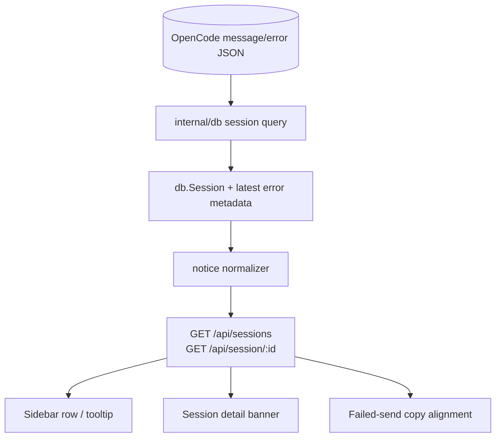

# OpenCode Rate-Limit Surfacing - Architecture

## Overview

This feature promotes OpenCode's retryable rate-limit failures from raw
assistant-message detail into a normalized session-level `notice` that
both the sidebar and the active session view can render.

The design keeps the frontend platform-agnostic:

1. The backend inspects the latest assistant error.
2. It classifies recognized OpenCode rate-limit wording.
3. It emits a generic `SessionNotice` object on the session payload.
4. The frontend renders that notice wherever useful.

No new persistence, no new routes, and no new polling loops.

## Context Diagram



## Architectural Decisions

### AD-1: Use a normalized `SessionNotice` instead of exposing raw OpenCode errors

- **Status**: Decided
- **Context**: The sidebar and session detail page need a simple signal,
  but the raw OpenCode error payload is platform-specific and noisy.
- **Decision**: Add an optional `SessionNotice` to the session API.
- **Rationale**: Keeps the frontend free of OpenCode-specific parsing
  and complies with the no-platform-branching rule.
- **Consequences**: Backend owns classification logic; the wire contract
  becomes slightly richer.

### AD-2: Keep `status=error`; add explanation rather than a new status bucket

- **Status**: Decided
- **Context**: A rate-limited session is still in an error state from
  the user's perspective, but it is a *temporary* one.
- **Decision**: Reuse the existing `error` status and layer a notice on
  top.
- **Rationale**: Avoids ripple effects through status badges,
  aggregation rules, filters, and tests.
- **Consequences**: Sidebar aggregates remain unchanged; UX improves via
  better messaging.

### AD-3: Derive the notice from the latest assistant error only

- **Status**: Decided
- **Context**: The session should reflect the current blocking reason,
  not stale historical failures.
- **Decision**: Only the latest assistant message/error participates in
  notice derivation.
- **Rationale**: Matches existing session-status inference and ensures a
  later successful turn clears the notice automatically.
- **Consequences**: No history scan is needed.

### AD-4: Parse retry hints best-effort from known OpenCode wording

- **Status**: Decided
- **Context**: OpenCode currently embeds retry metadata in free text
  such as `[retrying in 5m attempt 1]`.
- **Decision**: Add a small parser that recognizes the known phrase and
  extracts duration + attempt when present.
- **Rationale**: Low-complexity, high-value. The UI gets actionable data
  without waiting for an upstream schema change.
- **Consequences**: Parsing must fail safely and degrade to generic
  error UX.

### AD-5: Enrich existing session payloads; do not add per-session sidebar fetches

- **Status**: Decided
- **Context**: The sidebar already polls `/api/sessions`; adding N+1
  fetches for errored rows would be wasteful and complicate state.
- **Decision**: Compute notices during the existing backend session
  assembly path.
- **Rationale**: Keeps the frontend simple and efficient.
- **Consequences**: `internal/db` / `internal/server` gain a small amount
  of enrichment logic.

## Data Model

### API shape

Add an optional notice object to `db.Session`:

```go
type SessionNotice struct {
    Kind    string `json:"kind"`    // currently "rate_limit"
    Message string `json:"message"` // user-facing summary
    RetryAt int64  `json:"retryAt"` // unix ms, 0 when unknown
    Attempt int    `json:"attempt"` // 0 when unknown
}

type Session struct {
    // existing fields...
    Notice *SessionNotice `json:"notice,omitempty"`

    // internal-only enrichment inputs; not serialized
    LastErrorName    string `json:"-"`
    LastErrorMessage string `json:"-"`
    LastErrorAt      int64  `json:"-"`
}
```

### Classification rules

A session receives `Notice{Kind:"rate_limit"}` when all are true:

1. The session's latest assistant state is already classified as
   `status=error`.
2. The latest error message or name matches a known OpenCode
   rate-limit signature.

Initial signatures:

- message contains `rate limit`
- message contains `would exceed your account`
- optional retry suffix pattern:
  `\[retrying in (?P<delay>[^\]]+?)(?: attempt (?P<attempt>\d+))?\]`

If `delay` parses successfully, compute:

```text
retryAt = lastErrorAt + parsedDelay
```

If parsing fails, keep the notice with `retryAt=0`.

## Component Design

### `internal/db/sessions.go`

Extend the existing session query to capture enough metadata from the
latest assistant message to support normalization.

Suggested additions to the session query/subqueries:

- latest assistant error name: `json_extract(data, '$.error.name')`
- latest assistant error message:
  `json_extract(data, '$.error.data.message')`
- latest assistant error timestamp (or reuse the latest message's
  `time_created` when the errored message is the last message)

This metadata is carried on `db.Session` as internal-only fields.

### `internal/server/session_notice.go` (new helper)

Add a small helper responsible for normalization:

```go
func applySessionNotice(sessions []db.Session) {
    for i := range sessions {
        sessions[i].Notice = deriveSessionNotice(sessions[i])
    }
}
```

`deriveSessionNotice`:

1. Returns `nil` unless `session.Status == "error"`.
2. Reads `LastErrorName`, `LastErrorMessage`, `LastErrorAt`.
3. Calls a parser such as `parseRateLimitNotice(...)`.
4. Returns `nil` on no match.

This helper runs from the existing session assembly path after the base
session structs are built.

### Parser helper

Add a small parser under either:

- `internal/server/session_notice.go`, or
- `internal/platforms/opencode/ratelimit.go`

Recommended behaviour:

```go
type parsedRateLimit struct {
    Message string
    RetryAt int64
    Attempt int
}

func parseOpenCodeRateLimit(msg string, at int64) (*parsedRateLimit, bool)
```

Implementation notes:

- Match case-insensitively.
- Support compact durations (`5m`, `2h`, `30s`).
- Preserve the human message; remove the retry suffix only if needed to
  avoid duplicate copy in the UI.
- Never return an error for unparseable input; use `(nil, false)` or a
  partial result.

### `internal/server/handlers.go`

In both the sessions-list and single-session handlers, ensure the notice
normalizer runs before writing JSON.

Pseudo-flow:

```go
sessions, err := ...
if err != nil { ... }
if err := s.applySessionState(sessions); err != nil { ... }
applySessionNotice(sessions)
writeJSON(w, sessions)
```

For the single-session handler, apply the same normalization to the one
returned session struct.

### `frontend/src/lib/api.ts`

Add the typed notice shape:

```ts
export interface SessionNotice {
  kind: 'rate_limit' | string;
  message: string;
  retryAt: number;
  attempt: number;
}

export interface Session {
  // existing fields...
  notice?: SessionNotice;
}
```

### `frontend/src/pages/SessionDetail.tsx`

Render a banner when `session.notice?.kind === 'rate_limit'`.

Suggested placement:

- above the composer, or
- below the session header and above the thread

Suggested copy:

- title: `Rate limited`
- body: normalized message
- secondary line: relative retry countdown when `retryAt > Date.now()`

The banner is passive information only; retry behaviour stays manual.

### Sidebar row hint

Keep the current status-dot semantics, but add discoverability:

- `title={session.notice?.message}` on the row or error badge, and/or
- a compact inline label/icon for rate-limited rows

This avoids large layout changes while still surfacing the reason from
the overview screen.

### Failed-send copy alignment

If `api.sendMessage()` receives a 422 whose body matches the same
rate-limit parser, convert the thrown error message into the normalized
copy used by the banner/notice.

This is deliberately lightweight: no new error class is required unless
implementation complexity justifies one.

## Testing Strategy

### Go tests

1. **Parser unit tests**
   - matches canonical sample string
   - extracts retry delay and attempt
   - handles missing retry suffix
   - ignores unrelated errors
   - survives malformed bracket suffix

2. **Session enrichment tests**
   - errored session with matching message gets `notice`
   - successful/later session clears stale notice
   - non-rate-limit errors keep `notice=nil`

3. **Handler tests**
   - `/api/sessions` includes the notice in JSON
   - `/api/session/{id}` includes the notice in JSON

### Frontend tests

1. Session detail renders the banner for `notice.kind=rate_limit`
2. Banner shows retry text when `retryAt` is present
3. Sidebar row exposes the hint/tooltip
4. Existing non-rate-limit error rendering remains unchanged

## Implementation Plan

1. Extend `db.Session` with internal last-error fields + public
   `SessionNotice`.
2. Update DB query / single-session path to populate latest assistant
   error metadata.
3. Implement parser + notice normalizer.
4. Wire normalization into session handlers.
5. Add frontend typing.
6. Render session-detail banner.
7. Add sidebar hint.
8. Align failed-send copy.
9. Add tests and run `make test`, `make lint`, `make build`.

## Risks and Mitigations

### Risk: OpenCode wording changes

- **Mitigation**: Keep matching broad enough for known phrasing (`rate
  limit`, `would exceed your account`) and fail safely to the existing
  generic error UX.

### Risk: Single-session endpoint misses normalization

- **Mitigation**: Centralize normalization in a shared helper used by
  both list and detail handlers.

### Risk: Over-rendering the sidebar

- **Mitigation**: Reuse existing payloads and add only a small optional
  field; no new polling or derived global state.

## Alternatives Considered

### Alternative A: Parse the message only in the frontend thread view

- **Rejected**: Would not help the sidebar and would require the detail
  page to load/open before the user sees the reason.

### Alternative B: Add a new session status `rate_limited`

- **Rejected**: Too invasive for little benefit. It would ripple across
  badge rendering, aggregation, tests, and any future status logic.

### Alternative C: Persist notices in `state.db`

- **Rejected**: The notice is derived from existing session history and
  should clear automatically when the latest assistant state changes.
