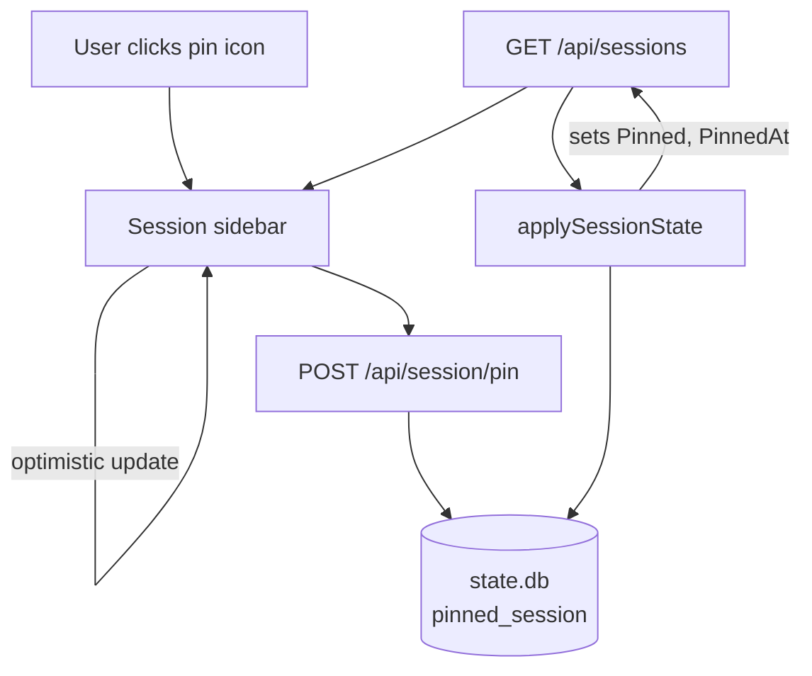
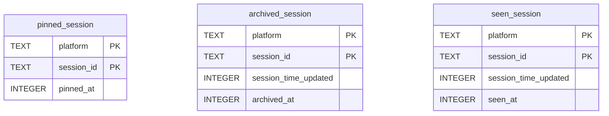

# Pinned Sessions - Architecture

## Overview

Pinned sessions let the user stick important sessions to the top of
the sidebar. The feature is a thin extension of the existing session
state machinery (`archived`, `seen`) — one new table in `state.db`,
one new endpoint, a small overlay in `applySessionState`, and
frontend grouping changes.

No new packages. No new platform code. The design follows the
`archived_session` / `seen_session` pattern exactly.

## Context Diagram



## Architectural Decisions

### AD-1: Follow the archived/seen pattern exactly

- **Status**: Decided
- **Context**: The codebase has a well-established pattern for
  per-session boolean state: a table in `state.db` keyed by
  `(platform, session_id)`, a bulk-read method returning
  `map[Key]int64`, and an overlay step in `applySessionState`.
- **Decision**: Pinned sessions use the same pattern. New table
  `pinned_session`, new methods `PinSession` / `UnpinSession` /
  `PinnedSessions`, overlay in `applySessionState`.
- **Rationale**: Consistency. The pattern is proven, tested, and
  understood. No new abstractions needed.
- **Consequences**: The implementation is small and predictable.

### AD-2: Pinned sessions appear in both the "Pinned" group and their project group

- **Status**: Decided
- **Context**: In the project-grouped sidebar view, should a pinned
  session be removed from its project group and only shown in the
  "Pinned" group?
- **Decision**: Show in both places. The "Pinned" group is an
  additional view, not a replacement.
- **Rationale**: Removing from the project group would be confusing
  — the user might think the session disappeared. Showing in both
  places is consistent with how most "favorites" features work
  (e.g. macOS Finder sidebar favorites don't remove files from
  their original folder).
- **Consequences**: A pinned session appears twice in the projects
  view. The pin indicator on the project-group row makes this
  obvious.

### AD-3: In the flat "recent" view, pinned sessions are deduplicated

- **Status**: Decided
- **Context**: The flat view is a single chronological list. Showing
  pinned sessions both at the top and in their chronological
  position would be redundant.
- **Decision**: Pinned sessions appear only in the pinned section at
  the top; they are filtered out of the chronological section below.
- **Rationale**: The flat view has no grouping context, so
  duplication would just be noise.

### AD-4: `pinnedAt` is used for sort order within the pinned group

- **Status**: Decided
- **Context**: How should pinned sessions be ordered?
- **Decision**: By `pinned_at` descending (most recently pinned
  first).
- **Rationale**: Simple, predictable, matches user expectation
  ("I just pinned this, it should be at the top"). Manual
  reordering is out of scope for v1.

### AD-5: Pinned sessions survive the `since` time window via frontend inclusion

- **Status**: Decided
- **Context**: The sidebar fetches sessions with a `since` parameter
  (e.g. last 48 hours). Pinned sessions older than that window
  would not appear.
- **Decision**: The backend returns pinned session IDs via
  `applySessionState` on whatever sessions the adapters return.
  Additionally, the frontend ensures pinned sessions that fall
  outside the time window are fetched separately. The simplest
  approach: the frontend stores pinned session IDs locally (from
  the last full fetch) and, if any are missing from the sidebar
  list, fetches them individually via `GET /api/session/{id}`.
  Alternatively, the backend can accept a `pinnedIds` query
  parameter on `/api/sessions` to force-include specific sessions.
- **Chosen approach**: Backend-side. Add a step in `handleSessions`
  that reads `PinnedSessions()` and, for any pinned session not
  already in the result set, fetches it from the adapter and
  appends it. This keeps the frontend simple and ensures pinned
  sessions always appear.
- **Rationale**: The pinned set is small (typically <10 sessions).
  The extra adapter lookups are negligible. The frontend doesn't
  need to manage a secondary fetch path.
- **Consequences**: `handleSessions` gains a small post-processing
  step. Pinned sessions that have been deleted from the underlying
  platform are silently skipped (no error).

### AD-6: Archive takes precedence over pin

- **Status**: Decided
- **Context**: What happens when a session is both pinned and
  archived?
- **Decision**: Archived sessions are hidden from the sidebar
  regardless of pin state (unless "show archived" is enabled).
  The pin is preserved in `state.db` — if the session is later
  unarchived (e.g. by new activity), it reappears as pinned.
- **Rationale**: Archive is the user's explicit "hide this" action;
  pin should not override it.

### AD-7: Single endpoint for pin/unpin (toggle pattern)

- **Status**: Decided
- **Context**: Should pin/unpin be separate endpoints or a single
  toggle?
- **Decision**: Single endpoint `POST /api/session/pin` with a
  `pinned: bool` field, matching the `handleArchiveSession` pattern
  (`archived: bool`).
- **Rationale**: Consistency with the existing archive endpoint.
  One handler, one route, simple.

## Component Design

### `internal/state/migrate.go` — migration v5

```go
func migrateToV5(tx *sql.Tx) error {
    _, err := tx.Exec(`
        CREATE TABLE pinned_session (
            platform   TEXT    NOT NULL,
            session_id TEXT    NOT NULL,
            pinned_at  INTEGER NOT NULL,
            PRIMARY KEY (platform, session_id)
        )
    `)
    return err
}
```

- Bump `latestSchemaVersion` to `5`.
- Add `case 5: return migrateToV5(tx)` to `applyMigration`.

### `internal/state/db.go` — CRUD methods

```go
// PinSession marks a session as pinned. Idempotent: repeated calls
// are no-ops (pinned_at is not updated).
func (d *DB) PinSession(platform, sessionID string) error {
    _, err := d.db.Exec(`
        INSERT INTO pinned_session (platform, session_id, pinned_at)
        VALUES (?, ?, ?)
        ON CONFLICT(platform, session_id) DO NOTHING
    `, platform, sessionID, time.Now().UnixMilli())
    return err
}

// UnpinSession removes a session's pinned marker.
func (d *DB) UnpinSession(platform, sessionID string) error {
    _, err := d.db.Exec(
        `DELETE FROM pinned_session WHERE platform = ? AND session_id = ?`,
        platform, sessionID,
    )
    return err
}

// PinnedSessions returns every pinned session's pinned_at timestamp,
// keyed by (platform, session_id).
func (d *DB) PinnedSessions() (map[Key]int64, error) {
    rows, err := d.db.Query(
        `SELECT platform, session_id, pinned_at FROM pinned_session`,
    )
    // ... same pattern as ArchivedSessions / SeenSessions
}
```

### `internal/db/types.go` — new fields on `Session`

```go
type Session struct {
    // ... existing fields ...
    Pinned   bool  `json:"pinned"`
    PinnedAt int64 `json:"pinnedAt"`
}
```

### `internal/server/handlers.go` — overlay + endpoint

**`applySessionState` extension:**

```go
func (s *Server) applySessionState(sessions []db.Session) error {
    // ... existing archived + seen logic ...

    pinned, err := s.stateDB.PinnedSessions()
    if err != nil {
        return err
    }

    for i := range sessions {
        key := state.Key{Platform: sessions[i].Platform, SessionID: sessions[i].ID}
        if pinnedAt, ok := pinned[key]; ok {
            sessions[i].Pinned = true
            sessions[i].PinnedAt = pinnedAt
        }
    }

    return nil
}
```

**`handleSessions` extension (AD-5):**

After the existing adapter fan-out and before `applySessionState`,
read `PinnedSessions()` and check which pinned IDs are missing from
`all`. For each missing one, look it up via the registry and append:

```go
// Ensure pinned sessions are included even if outside the time window.
pinned, _ := s.stateDB.PinnedSessions()
have := make(map[state.Key]bool, len(all))
for _, sess := range all {
    have[state.Key{Platform: sess.Platform, SessionID: sess.ID}] = true
}
for key := range pinned {
    if have[key] {
        continue
    }
    adapter, ok := s.registry.Get(platforms.ID(key.Platform))
    if !ok {
        continue
    }
    sess, err := adapter.Session(ctx, key.SessionID)
    if err != nil || sess == nil {
        continue // deleted or inaccessible — skip silently
    }
    all = append(all, *sess)
}
```

**New handler `handlePinSession`:**

```go
func (s *Server) handlePinSession(w http.ResponseWriter, r *http.Request) {
    var req struct {
        Platform  string `json:"platform"`
        SessionID string `json:"sessionId"`
        Pinned    bool   `json:"pinned"`
    }
    // ... validate, resolve platform (same pattern as handleArchiveSession) ...

    if req.Pinned {
        err = s.stateDB.PinSession(platform, req.SessionID)
    } else {
        err = s.stateDB.UnpinSession(platform, req.SessionID)
    }
    // ... error handling, writeJSON ...
}
```

**Route registration** in `server.go`:

```go
mux.HandleFunc("/api/session/pin", s.requireAuth(requirePOST(s.handlePinSession)))
```

### `frontend/src/lib/api.ts` — typed client

```ts
export interface Session {
    // ... existing fields ...
    pinned: boolean;
    pinnedAt: number;
}

// In the api object:
pinSession: async (platform: string, sessionId: string, pinned: boolean) => {
    await fetch('/api/session/pin', {
        method: 'POST',
        body: JSON.stringify({ platform, sessionId, pinned }),
    });
},
```

### `frontend/src/pages/SessionDetail.tsx` — sidebar changes

**`renderRow` extension:**

Add a pin button next to the existing archive button:

```tsx
<button
  type="button"
  className="session-pin-btn session-sidebar-pin-btn"
  onClick={(e) => handlePinSession(e, sib)}
  title={sib.pinned ? 'Unpin session' : 'Pin session'}
  aria-label={sib.pinned ? 'Unpin session' : 'Pin session'}
>
  <PinIcon pinned={sib.pinned} />
</button>
```

The pin button is always visible when pinned (persistent indicator),
and visible on hover when unpinned (like the archive button).

**`sidebarProjectGroups` extension:**

Before building the project buckets, partition pinned sessions into
a dedicated "Pinned" group:

```tsx
const sidebarProjectGroups = useMemo(() => {
    const pinnedSessions = recentSessions
        .filter(s => s.pinned)
        .sort((a, b) => b.pinnedAt - a.pinnedAt);

    // ... existing bucketing logic (unchanged) ...

    const groups = [...];

    // Prepend the "Pinned" group if non-empty
    if (pinnedSessions.length > 0) {
        groups.unshift({
            directory: '__pinned__',
            sessions: pinnedSessions,
            lastUpdated: pinnedSessions[0]?.timeUpdated ?? 0,
            aggregate: rollup(pinnedSessions),
            isPinned: true,
        });
    }

    return groups;
}, [recentSessions, id, optimisticStatus]);
```

The rendering code checks `group.isPinned` to:
- Use a "Pinned" label instead of a directory path.
- Skip the collapse toggle (always expanded).
- Use a pin icon in the group header.

**Flat "recent" view extension:**

```tsx
const pinnedSessions = recentSessions
    .filter(s => s.pinned)
    .sort((a, b) => b.pinnedAt - a.pinnedAt);
const unpinnedSessions = recentSessions
    .filter(s => !s.pinned);

return (
    <>
        {pinnedSessions.map(sib => renderRow(sib, false))}
        {pinnedSessions.length > 0 && unpinnedSessions.length > 0 && (
            <div className="session-sidebar-divider" />
        )}
        {unpinnedSessions.map(sib => renderRow(sib, false))}
    </>
);
```

**`handlePinSession` handler:**

```tsx
const handlePinSession = useCallback((e: React.MouseEvent, target: Session) => {
    e.stopPropagation();
    const nextPinned = !target.pinned;

    // Optimistic update
    setRecentSessions(prev => prev.map(s =>
        s.id === target.id
            ? { ...s, pinned: nextPinned, pinnedAt: nextPinned ? Date.now() : 0 }
            : s
    ));

    // Backend call
    api.pinSession(target.platform, target.id, nextPinned).catch(err => {
        console.error('Failed to pin/unpin session', err);
        // Revert on failure
        setRecentSessions(prev => prev.map(s =>
            s.id === target.id
                ? { ...s, pinned: !nextPinned, pinnedAt: target.pinnedAt }
                : s
        ));
    });
}, []);
```

## Data Model



The `pinned_session` table is structurally simpler than
`archived_session` / `seen_session` because it doesn't need a
`session_time_updated` column — pinning is not time-sensitive (it
doesn't auto-expire based on session activity).

## API Design

### `POST /api/session/pin`

- **Auth**: standard ocman auth chain.
- **Request body**:
  ```json
  {
      "platform": "opencode",
      "sessionId": "abc123",
      "pinned": true
  }
  ```
- **Response 200**:
  ```json
  { "ok": true }
  ```
- **Errors**:
  - `400` — invalid session ID or missing fields.
  - `404` — session not found (platform lookup failed).

### `GET /api/sessions` (extended)

- **Response** gains two fields per session:
  ```json
  {
      "pinned": true,
      "pinnedAt": 1714761234567
  }
  ```
- Pinned sessions outside the `since` window are force-included
  (AD-5).

## File Structure

```
internal/
  state/
    migrate.go          # Add migrateToV5, bump latestSchemaVersion
    db.go               # Add PinSession, UnpinSession, PinnedSessions
    db_test.go          # Add tests for pin CRUD
  db/
    types.go            # Add Pinned, PinnedAt to Session
  server/
    handlers.go         # Extend applySessionState, handleSessions; add handlePinSession
    handlers_test.go    # Add tests for pin endpoint + overlay
    server.go           # Wire /api/session/pin route

frontend/src/
  lib/
    api.ts              # Add pinned, pinnedAt to Session; add pinSession method
    sessionVisibility.ts # (no change — pinned sessions are not filtered)
  pages/
    SessionDetail.tsx   # Extend renderRow, sidebarProjectGroups, flat view
    SessionDetail.css   # Add pin button + pinned group styles
```

## Implementation Plan

### Step 1 — Schema migration + state DB methods

1. Add `migrateToV5` in `migrate.go` creating `pinned_session`.
2. Bump `latestSchemaVersion` to `5`.
3. Add `PinSession`, `UnpinSession`, `PinnedSessions` to `db.go`.
4. Add table-driven tests in `db_test.go`: pin, unpin, idempotent
   pin, list empty, list with entries.
5. `go test ./internal/state/...`

**Done when**: migration runs, CRUD methods work, tests pass.

### Step 2 — Session type + applySessionState overlay

1. Add `Pinned bool` and `PinnedAt int64` to `db.Session`.
2. Extend `applySessionState` to read `PinnedSessions()` and set
   the fields.
3. Add test: session with a pinned row gets `Pinned=true`.
4. `go test ./internal/server/...`

**Done when**: `/api/sessions` returns `pinned` and `pinnedAt`.

### Step 3 — Pin endpoint + force-include in handleSessions

1. Add `handlePinSession` handler.
2. Wire route in `server.go`.
3. Add the force-include step in `handleSessions` (AD-5).
4. Handler tests: pin, unpin, idempotent, invalid ID.
5. `go test ./internal/server/...`

**Done when**: `curl -X POST /api/session/pin` works; pinned
sessions appear in `/api/sessions` even outside the time window.

### Step 4 — Frontend API + Session type

1. Add `pinned` and `pinnedAt` to the `Session` interface.
2. Add `api.pinSession()` method.
3. `pnpm test`

**Done when**: types compile, API method exists.

### Step 5 — Sidebar UI: pin button + grouped view

1. Add pin button to `renderRow`.
2. Add `handlePinSession` callback with optimistic update.
3. Extend `sidebarProjectGroups` to prepend a "Pinned" group.
4. Add CSS for pin button, pinned indicator, pinned group header.
5. `pnpm test`

**Done when**: clicking pin moves the session to the "Pinned" group.

### Step 6 — Flat view + polish

1. Extend the flat "recent" view to partition pinned/unpinned.
2. Add a subtle divider between pinned and unpinned sections.
3. Manual smoke test: pin, unpin, reload, verify persistence.
4. `make test && make lint`

**Done when**: both sidebar views work correctly with pinned
sessions; all tests and lint pass.

## Risks and Mitigations

- **Risk**: Force-including pinned sessions in `handleSessions`
  could be slow if many sessions are pinned and the adapter lookup
  is expensive.
  - **Mitigation**: The pinned set is expected to be <10 sessions.
    Each adapter lookup is a single DB query or cache hit. If this
    becomes a problem, batch the lookups.

- **Risk**: A pinned session that has been deleted from the
  underlying platform causes errors.
  - **Mitigation**: The force-include step silently skips sessions
    that can't be fetched (AD-5). The pin row remains in `state.db`
    but is harmless.

- **Risk**: Pinned sessions appearing in both the "Pinned" group
  and their project group could be confusing.
  - **Mitigation**: The pin indicator on the row makes it clear why
    the session appears twice. If user feedback suggests this is
    confusing, we can revisit AD-2.
