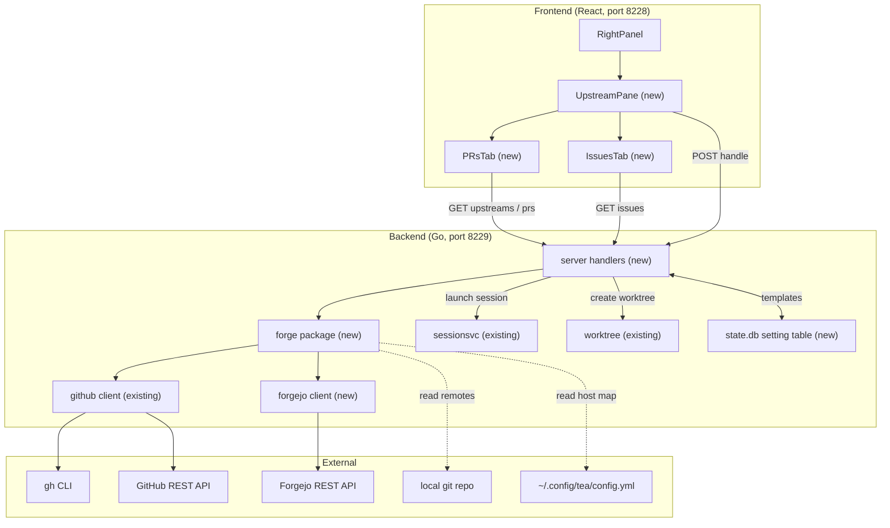
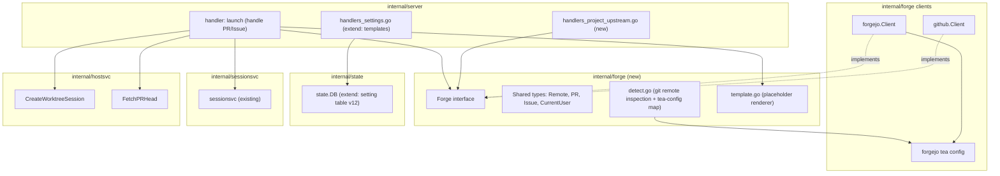
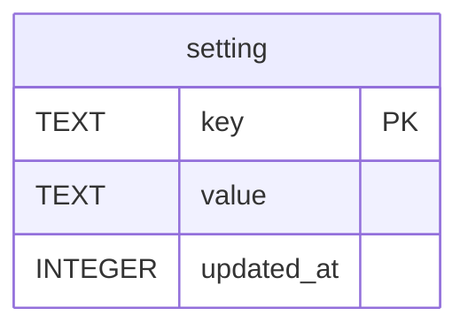
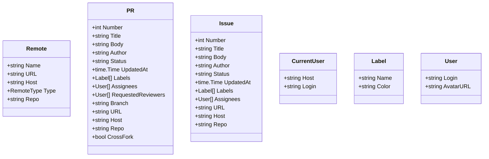
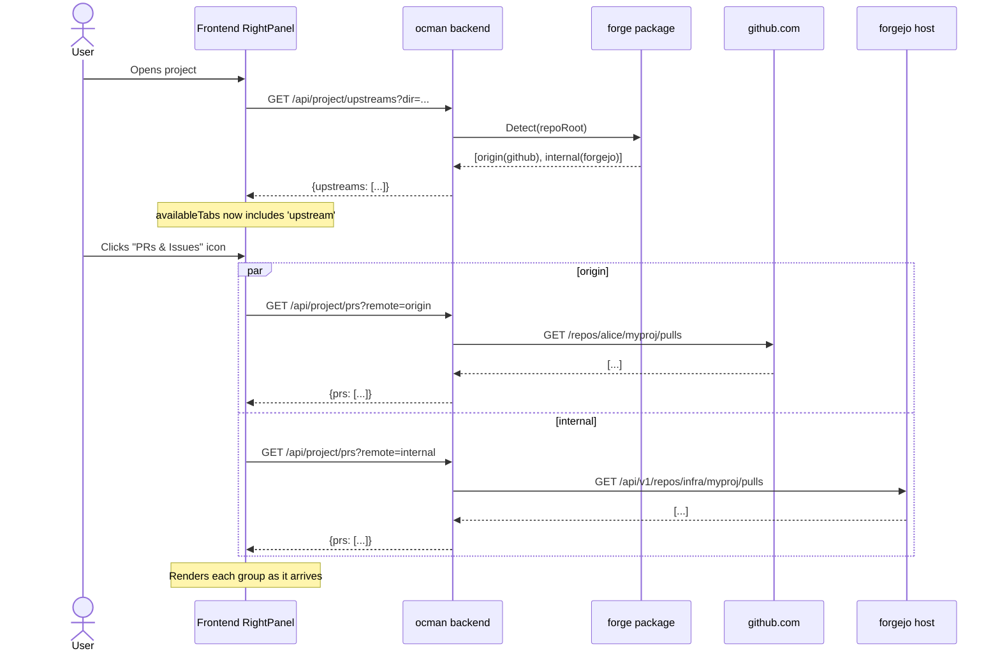
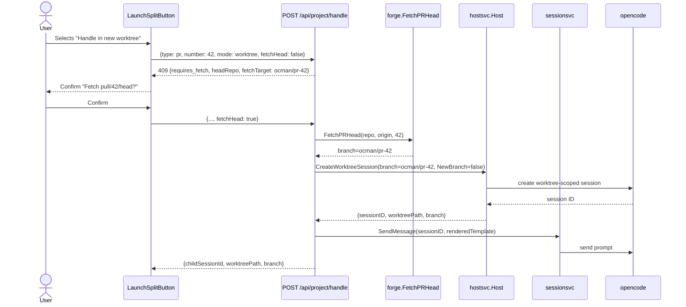
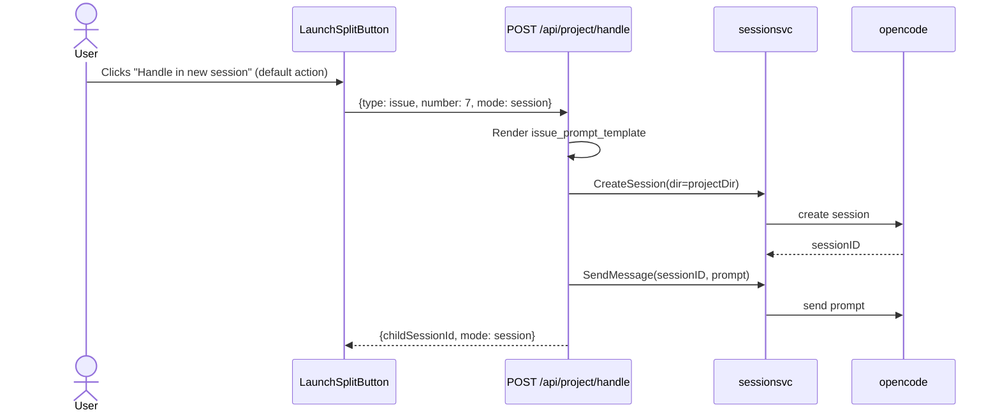

# PR & Issue Sidebar - Architecture

## Overview

The PR & Issue Sidebar is delivered as **three layers** that lean
heavily on primitives already present in ocman:

1. A new **`internal/forge`** package that abstracts a forge
   (GitHub or Forgejo) behind a single `Forge` interface, with
   per-host clients in `internal/forge/github` and
   `internal/forge/forgejo`. Token discovery follows
   ocman's existing **env → CLI** order.
2. A **set of per-project HTTP handlers** under `internal/server`
   that detect upstreams, list PRs/issues, and trigger a launch.
   Launches reuse the existing `sessionsvc` and `worktree.Create`
   paths — the new endpoints are *thin orchestrators*, not parallel
   implementations.
3. A **new pane in the existing `RightPanel`** on the frontend, made
   discoverable by a new entry in `ChangesSidebarTab` and gated by a
   per-project upstream-detection query.

Design philosophy:

- **Reuse what already exists.** ocman already has a GitHub client
  with `gh`/env token discovery, forge clients, and owner-routed
  session/worktree launch services, plus
  a `react-markdown` renderer. The feature must compose these,
  not duplicate them.
- **Stateless on the ocman side.** PR/Issue payloads never touch
  `state.db`. The only persisted bits are the PR, issue, and review prompt templates,
  stored in a small new `setting` key/value table.
- **Per-remote isolation.** Each remote (and each forge) is a
  failure domain of its own. One broken host never blocks the rest
  of the UI.
- **Capability-shaped detection, not platform branching.** The
  sidebar pane appears when a per-project `upstreams` query returns
  a non-empty list. The frontend never inspects `session.platform`.

## Context Diagram



## Architectural Decisions

### AD-1: One handler surface for both forges via a `Forge` interface

- **Status**: Decided
- **Context**: The sidebar must support GitHub and Forgejo, and may
  grow to others (GitLab, Bitbucket). The current
  `internal/forge/github` is a concrete client. We need a
  way to add Forgejo without duplicating handler logic or scattering
  if/else on host type.
- **Options**:
  1. **Concrete clients, branching at the handler level.** Add a
     `forgejo` client; handlers do `if remote.type == 'github'
     {...} else if 'forgejo' {...}`.
  2. **`Forge` interface in a new `internal/forge` package.**
     Both clients satisfy a `Forge` interface (`ListPRs`,
     `ListIssues`, `CurrentUser`, `Authenticated`, ...). Handlers
     loop over a list of `Forge` values and stay forge-agnostic.
  3. **Use `go-gitea` SDK for Forgejo.** Forgejo is API-compatible
     with Gitea, so a third-party SDK could supply the client.
- **Decision**: Option 2.
- **Rationale**: Handler code is the bulk of the feature (FR-1, 5,
  8, 9, 11, 12). Keeping it forge-agnostic is the single biggest
  payoff. The existing `github` package already covers most of what
  we need; a thin `Forge` adapter over it is cheap. Pulling in a
  full SDK (option 3) for the Forgejo subset we use (list pulls,
  list issues, current user) is overkill and would diverge from
  the lean `net/http` style of the existing `github.Client`.
- **Consequences**:
  - New `internal/forge` package owns the interface + shared
    types (`Remote`, `PR`, `Issue`, `CurrentUser`, errors).
  - `internal/forge/github` and `internal/forge/forgejo` implement
    `Forge` directly.
  - Tests are table-driven against the interface; per-forge tests
    only cover the parsing differences.

### AD-2: Token discovery uses env-first ordering across both forges

- **Status**: Decided (resolves OQ-7 in requirements)
- **Context**: FR-11 says env wins, CLI is fallback. The existing
  GitHub client already implements this order, except it puts both
  env-var checks before any CLI calls, which is what we want.
- **Options**:
  1. **Reuse `github.discoverToken()` as-is**; add an equivalent
     `forgejo.discoverToken()` mirroring its shape.
  2. **Promote token discovery into the `forge` package.**
- **Decision**: Option 1. Keep token discovery inside each
  per-forge client package; the `forge` package just declares the
  interface and shared types.
- **Rationale**: Token sources are forge-specific (gh CLI vs tea
  config) and unlikely to share code in a useful way. Keeping them
  next to the per-forge client is more cohesive.
- **Consequences**: A new `forgejo.discoverToken()` is added that
  checks, in order: `FORGEJO_TOKEN`, `GITEA_TOKEN`, then `tea`'s
  `~/.config/tea/config.yml`. The Forgejo *host URL* discovery is
  always done through `tea` config (see AD-3).

### AD-3: Forgejo host URLs come from `tea`'s config, even when token comes from env

- **Status**: Decided
- **Context**: An env-var token carries no host information.
  Forgejo is self-hostable, so we cannot hardcode an API base.
- **Options**:
  1. Require the user to also set `FORGEJO_URL` env var.
  2. Always read `~/.config/tea/config.yml` for host URLs;
     env var only contributes the token.
- **Decision**: Option 2.
- **Rationale**: `tea` users will already have a login configured
  for the host they care about; that's the same source we use for
  upstream detection (FR-1). It also matches the requirements
  spec (FR-11 acceptance criteria).
- **Consequences**:
  - The Forgejo client constructor takes a host URL explicitly.
  - The `tea` config parser is shared between detection (FR-1)
    and client construction (FR-11).
  - If a remote points at a Forgejo host that has no `tea`
    login, detection ignores it (no API base to call against).

### AD-4: Stateless data plane; only prompt templates are persisted

- **Status**: Decided
- **Context**: FR-6 says no caching of PR/Issue data; FR-10 says
  prompt templates are user-customizable; OQ-1 resolved to
  `state.db`.
- **Options**:
  1. New dedicated table per setting (`pr_prompt_template`,
     `issue_prompt_template`).
  2. **Generic key/value `setting` table.**
- **Decision**: Option 2 — add a generic `setting (key TEXT
  PRIMARY KEY, value TEXT NOT NULL, updated_at INTEGER NOT NULL)`
  table in migration v12.
- **Rationale**: The two templates are the first true "setting"
  in ocman that has no other natural home (unlike auto-approve or
  judge-delay, which already have dedicated tables). A generic
  table keeps future small settings from adding migrations every
  time.
- **Consequences**:
  - New migration v12 in `internal/state/migrate.go`.
  - New `state.DB.GetSetting(key) / SetSetting(key, value)`
    methods.
  - New GET/POST handler `/api/settings/prompt-templates` with
    sensible defaults baked into the Go binary.

### AD-5: Launch reuses `sessionsvc` directly

- **Status**: Decided
- **Context**: Session creation needs to go through the shared
  session mutation service to ensure consistent validation and
  side effects.
- **Options**:
  1. **Call `sessionsvc` directly from the new HTTP handler.**
  2. Duplicate session creation logic in the handler.
- **Decision**: Option 1.
- **Rationale**: The session service is the single mutation path
  for all session creation (REST, workflows, scheduled prompts).
  Reusing it keeps validation, permission inheritance, and
  side-effect hooks consistent.
- **Consequences**:
  - The new handler imports `internal/sessionsvc` and delegates
    session creation to it.
  - The launch handler composes the prompt from the PR/Issue
    template and passes it to the session service.

### AD-6: Cross-fork worktrees use a deterministic local ref `ocman/pr-<n>`

- **Status**: Decided (refines FR-9a)
- **Context**: For PRs whose head lives on a fork we need a local
  branch ocman can pass to `worktree.Create`. The PR ref
  `pull/<n>/head` exists on the upstream remote but isn't a
  branch.
- **Options**:
  1. Fetch into a detached ref and `git worktree add` with the SHA.
  2. **Fetch into a deterministic local branch name
     `ocman/pr-<n>` on the upstream remote's repo, then pass that
     branch to `worktree.Create` with `NewBranch=false`.**
  3. Use git's `pr` aliases as in `gh pr checkout`.
- **Decision**: Option 2.
- **Rationale**:
  - Deterministic name → idempotent: re-running re-uses the
    branch instead of accumulating refs.
  - `worktree.Create` already knows how to attach an existing
    branch (`NewBranch=false`).
  - Distinguishable from real branches by the `ocman/` prefix,
    so it doesn't pollute the user's branch namespace ambiguously.
- **Consequences**:
  - The fetch step runs `git fetch <upstream-remote>
    pull/<n>/head:ocman/pr-<n>` for GitHub. Forgejo's equivalent
    is the same shape (`refs/pull/<n>/head` is mirrored).
  - The cross-fork confirmation prompt is part of the frontend
    only — there's no separate backend "confirm" round trip;
    the frontend just calls the launch endpoint with
    `fetchHead=true`.
  - The handler returns `cross_fork: true` in the PR row so the
    frontend knows whether to show the confirmation.

### AD-7: A new `'upstream'` pane is added to `RightPanel`, gated by detection

- **Status**: Decided (resolves OQ-2 in requirements)
- **Context**: Requirements pinned the placement to the existing
  `RightPanel` (alongside `info` / `session` / `working-tree`).
  We need to integrate without disrupting the existing pane
  resizing / persistence behavior.
- **Options**:
  1. **Extend `ChangesSidebarTab` with a new `'upstream'` value,
     add a render branch in `Pane`, conditionally include the new
     tab in `ALL_TABS` based on a hook (`useUpstreams`).**
  2. Build a separate sibling panel that lives next to
     `RightPanel`.
- **Decision**: Option 1.
- **Rationale**: The `RightPanel` code itself says *"adding a third
  entry to ALL_TABS + a render branch is enough"* — the design
  already anticipates this. We get pane resizing, header summary,
  refresh button, and error boundaries for free.
- **Consequences**:
  - `ChangesSidebarTab` in `uiStore.ts` gains `'upstream'`.
  - `ALL_TABS` becomes a *derived* array: hooks consume
    `useUpstreams(directory)` and prepend `'upstream'` to the
    static list when the project has at least one supported
    remote.
  - The icon strip on the right also derives from the same
    list, so the icon only appears when the pane is available
    (no dimmed/unclickable affordance).
  - `TAB_LABELS` and `TAB_ICONS` records gain entries for
    `'upstream'`.

### AD-8: Per-remote, paginated, parallel fan-out at fetch time

- **Status**: Decided
- **Context**: FR-8 (pagination) and NFR-1 (parallel fetch, first
  result paints early) interact with multi-remote groups.
- **Options**:
  1. Backend aggregates all remotes serially, then returns one
     payload.
  2. **Backend exposes a per-remote endpoint** (the frontend calls
     it once per detected remote and shows each group as soon as
     it returns).
  3. Backend fans out in parallel server-side and returns chunked
     JSON.
- **Decision**: Option 2.
- **Rationale**: Per-remote queries map cleanly to per-remote UI
  groups, per-remote errors, per-remote pagination state, and
  per-remote rate-limit countdowns (FR-12). The frontend already
  knows the remote list from the `upstreams` endpoint; a fan-out
  loop on the client is trivial. The backend stays simple — each
  call is a stateless proxy plus normalization.
- **Consequences**:
  - Endpoints take a `remote` query parameter (the name from `git
    remote -v`) so the backend can resolve the right
    host/token/repo triple.
  - Pagination state (cursor or page number) lives in the
    frontend, one set per (remote, tab).
  - Rate-limit / auth errors are scoped to one group; other
    groups in the same tab keep rendering normally.

## Component Design

### Component Diagram



### `internal/forge` (new package)

- **Responsibility**: Forge-agnostic types and the `Forge`
  interface that handlers code against. Houses upstream detection
  (`detect.go`) and the prompt template renderer (`template.go`).
- **Key types**:
  ```go
  type RemoteType string // "github" | "forgejo"

  type Remote struct {
      Name string       // "origin", "upstream", ...
      URL  string       // raw url from `git remote -v`
      Host string       // "github.com", "code.example.com"
      Type RemoteType
      Repo string       // "owner/name"
  }

  type PR struct {
      Number             int
      Title, Body        string
      Author             string
      Status             string // "open" | "draft" | "merged" | "closed"
      UpdatedAt          time.Time
      Labels             []Label
      Assignees          []User
      RequestedReviewers []User
      Branch             string
      URL                string
      Host, Repo         string
      CrossFork          bool  // head repo != base repo
  }

  type Issue struct { /* similar shape minus Branch/RequestedReviewers/CrossFork */ }

  type ListOptions struct {
      State string // "open" | "closed" | "all"
      Page  int    // 1-based
      Perpage int
  }

  type Forge interface {
      ListPRs(ctx context.Context, repo string, opts ListOptions) ([]PR, RateLimit, error)
      ListIssues(ctx context.Context, repo string, opts ListOptions) ([]Issue, RateLimit, error)
      CurrentUser(ctx context.Context) (CurrentUser, error)
      Authenticated() bool
      // FetchPRHead fetches the PR head ref into a deterministic
      // local branch (`ocman/pr-<n>`) on the given repo root.
      // The branch is created idempotently. Returns the local
      // branch name.
      FetchPRHead(ctx context.Context, repoRoot string, remoteName string, prNumber int) (branch string, err error)
  }

  // RateLimit captures Retry-After / X-RateLimit-Reset for FR-12.
  type RateLimit struct {
      Limited bool
      ResetAt time.Time // zero if not limited
  }
  ```
- **Detection (`detect.go`)**:
  ```go
  func Detect(ctx context.Context, repoRoot string, hosts ForgejoHostMap) ([]Remote, error)
  ```
  Runs `git -C <repoRoot> remote -v`, parses host from each URL,
  classifies as `github` (host == `github.com`) or `forgejo`
  (host found in `hosts` map). Unsupported remotes are dropped.
- **Template (`template.go`)**:
  ```go
  func RenderPrompt(template string, vars map[string]string) string
  ```
  Replaces `{number}`, `{title}`, `{body}`, `{url}`, `{branch}`,
  `{author}`, `{host}`, `{repo}`. Unknown placeholders are left
  as literal text (FR-10).
- **Dependencies**: only stdlib + the `Forge` adapters supplied
  by the caller. No HTTP code lives here.

### `internal/forge/forgejo`

- **Responsibility**: Forgejo REST client + `tea` config parser.
  Mirrors the shape of `internal/forge/github`.
- **Key surface**:
  ```go
  type Client struct {
      baseURL string
      token   string
      http    *http.Client
  }

  func NewClient(baseURL, token string) *Client
  func DiscoverToken() string        // FORGEJO_TOKEN, GITEA_TOKEN, tea config
  type Login struct { Host, URL, Token string }
  func TeaLogins() ([]Login, error)  // parses ~/.config/tea/config.yml
  ```
- **Methods**: `ListPRs`, `ListIssues`, `CurrentUser`, `GetPR`,
  `FetchPRHead` (shells out to `git fetch`).
- **Token order**: `FORGEJO_TOKEN` env → `GITEA_TOKEN` env → token
  from `tea` config for the matching host.

### `internal/forge/github`

- **Responsibility**: Adds the list/current-user methods needed
  by the `Forge` interface.
- **New methods** (additive — existing `GetPR`/`GetIssue` keep
  their map-based shape so `handlers_integrations.go` is
  unchanged):
  ```go
  func (c *Client) ListPRs(ctx, repo, opts) ([]forge.PR, forge.RateLimit, error)
  func (c *Client) ListIssues(ctx, repo, opts) ([]forge.Issue, forge.RateLimit, error)
  func (c *Client) CurrentUser(ctx) (forge.CurrentUser, error)
  func (c *Client) FetchPRHead(ctx, repoRoot, remoteName, n int) (string, error)
  ```
- **No new token discovery code**: the existing `discoverToken()`
  already satisfies FR-11 for GitHub.

### Server forge clients

- **Responsibility**: `server.forgeClients` holds one `*github.Client` plus a
  Forgejo host map.
- **Surface** after the extension:
  ```go
  type forgeClients struct {
      GitHub          *github.Client
      Forgejo         forge.ForgejoHostMap
  }
  ```
- **Construction**: at server startup; the `forgejo.Registry`
  enumerates `tea` logins once and constructs a client per host.
  Reconstruction on file changes is **out of scope for v1** —
  restart ocman to pick up new `tea` logins.

### `internal/server` handlers (new file: `handlers_project_upstream.go`)

- **Responsibility**: Expose the upstream + PR/Issue + launch
  endpoints. Pure orchestration: no API logic, no template
  rendering — those live in `internal/forge` and the per-forge
  packages.
- **Endpoints**:

  | Method + Path | Purpose |
  |---|---|
  | `GET /api/project/upstreams?dir=<abs>&remoteId=<owner>` | FR-1: list owner-detected remotes |
  | `GET /api/project/prs?dir=<abs>&remote=<name>&remoteId=<owner>&state=<open\|closed\|all>&mine=<login>&page=<n>` | FR-3/5/8: list PRs for one remote |
  | `GET /api/project/issues?dir=<abs>&remote=<name>&remoteId=<owner>&state=...&mine=...&page=...` | FR-3/5/8: list issues |
  | `GET /api/project/pr-checks?...&remoteId=<owner>` | list PR checks after owner detection |
  | `GET /api/project/forge-user?...&remoteId=<owner>` | current forge user after owner detection |
  | `POST /api/project/handle` | FR-9/9a: launch a session or worktree |
  | `GET /api/settings/prompt-templates` | FR-10: read templates |
  | `POST /api/settings/prompt-templates` | FR-10: update templates |

- **POST /api/project/handle request body**:
  ```json
  {
    "dir": "/abs/project/dir",
    "remote": "origin",
    "remoteId": "local",
    "type": "pr" | "issue",
    "number": 123,
    "mode": "session" | "worktree",
    "fetchHead": false,                // true for cross-fork worktree launches
    "intent": "optional override"      // empty = render template only
  }
  ```

  `remoteId` defaults to `local`; a named disconnected owner fails closed.
  Detection and filesystem git operations run on that owner. Forge metadata
  is fetched by the hub. Successful launches return `platform` and
  `remoteId`, which the frontend stores on the optimistic session row; an
  initial prompt-send failure returns HTTP 502. Upstream detection is cached
  briefly per owner and directory, and the frontend shares one owner-scoped
  git-info poll across all remote groups.

  - For `mode: "session"`: renders the template and creates the session on
    the owner's compound platform.
	- For `mode: "worktree"`:
	  - PR with same-repo head: passes the PR branch with
	    `NewBranch=false` to `hostsvc.Host.CreateWorktreeSession`.
    - PR with cross-fork head AND `fetchHead=true`: calls the owner's
      `hostsvc.Host.FetchPRHead` first, then passes the resulting
      `ocman/pr-<n>` branch with `NewBranch=false`.
    - PR with cross-fork head AND `fetchHead=false`: returns 409
      with `{"error":{"code":"requires_fetch"}}` so the frontend shows the
      confirm prompt.
    - Issue: uses `ResolveBaseRef` and creates a new branch like
      `issue/<n>-<slug-of-title>` via `NewBranch=true`.

- **Security posture**:
  - All five GET endpoints use `s.get(...)` (auth-required).
  - `POST /api/project/handle` is `requirePOST + requireLocalhost`
    — same as `/api/worktree/create-and-launch` because it spawns
    tmux/opencode.
  - The settings POST is `s.requireAuth(...)` since it just writes
    `state.db`.

### `internal/state` (extended)

- **Migration v12** adds:
  ```sql
  CREATE TABLE setting (
      key        TEXT    PRIMARY KEY,
      value      TEXT    NOT NULL,
      updated_at INTEGER NOT NULL
  );
  ```
- **New methods**:
  ```go
  func (d *DB) GetSetting(key string) (value string, ok bool, err error)
  func (d *DB) SetSetting(key, value string) error
  ```
- Keys reserved by this feature: `pr_prompt_template`,
  `issue_prompt_template`. Defaults are not stored in the table —
  if `GetSetting` returns `ok=false`, the handler falls back to
  the constant baked into the Go binary.

### Frontend

#### `RightPanel` extension

- **Files touched**:
  - `frontend/src/lib/uiStore.ts`: extend `ChangesSidebarTab` to
    include `'upstream'`. Defaults: not in `changesSidebarOpenTabs`
    on first load (matches `info` / `working-tree` defaults).
  - `frontend/src/components/RightPanel.tsx`:
    - Add `'upstream'` to a *base* `ALL_TABS` constant.
    - Replace the existing `ALL_TABS` array with a runtime
      `availableTabs` derived from `useUpstreams(directory)`:
      ```ts
      const upstreams = useUpstreams(directory); // [] when unavailable
      const availableTabs = useMemo(() =>
          ALL_TABS.filter(t => t !== 'upstream' || upstreams.length > 0),
          [upstreams.length]);
      ```
    - Pass `availableTabs` everywhere the file currently uses
      `ALL_TABS`.
    - Add a render branch in `Pane`:
      ```tsx
      {tab === 'upstream' && (
        <UpstreamPane directory={directory} upstreams={upstreams} embedded ... />
      )}
      ```
  - `TAB_LABELS['upstream'] = 'PRs & Issues'`; `TAB_ICONS['upstream']
    = 'bi-git-pull-request'` (Bootstrap Icons).

#### New components (`frontend/src/components/upstream/`)

- `UpstreamPane.tsx` — pane shell with the two-tab switcher
  (`prs` / `issues`), refresh button, current sub-tab state.
- `PRList.tsx` / `IssueList.tsx` — render the per-remote groups
  (only one group rendered without a header when there's exactly
  one detected remote). Filters live here.
- `PRRow.tsx` / `IssueRow.tsx` — collapsed row + expanded detail
  (markdown body via `react-markdown` + `remark-gfm`, link, launch
  control).
- `LaunchSplitButton.tsx` — split button with the
  session/worktree dropdown. Owns the cross-fork confirmation
  dialog state.
- `RemoteErrorBanner.tsx` — auth / rate-limit / network error
  surface with retry. Reads `Retry-After` / `X-RateLimit-Reset`
  from the backend's error payload to drive the live countdown.

#### New hooks (`frontend/src/lib/`)

- `useUpstreams(directory)` — calls `/api/project/upstreams`;
  returns `[]` until detection completes (so `availableTabs`
  starts without `'upstream'` and updates as soon as the server
  responds).
- `usePrs(directory, remote, state, mine, page)` — calls
  `/api/project/prs`; one hook instance per remote.
- `useIssues(directory, remote, state, mine, page)` — symmetric.
- `useCurrentForgeUser(host)` — resolves the "mine" identity for a
  host so the row-render layer can highlight ownership.

#### Settings UI

- A small section added to the existing settings page (the same
  page that hosts judge-delay / prompt-sections — see
  `/api/settings/judge-delay` for the existing pattern).
- Two `<textarea>` fields with reset-to-default buttons. Saves via
  the new `POST /api/settings/prompt-templates`. Sensible defaults
  are constants both in Go (for the handler's fallback) and in TS
  (for the UI's reset button).

## Data Model

### Persisted (state.db)



- Single new table; two keyed rows owned by this feature
  (`pr_prompt_template`, `issue_prompt_template`).
- No foreign keys; no relations.

### In-memory only (no persistence)



## API Design

### Request / response shapes

`GET /api/project/upstreams?dir=/abs/path`:
```json
{
  "upstreams": [
    {"remote": "origin",   "host": "github.com",       "type": "github",  "repo": "alice/myproj"},
    {"remote": "internal", "host": "code.example.com", "type": "forgejo", "repo": "infra/myproj"}
  ]
}
```

`GET /api/project/prs?dir=...&remote=origin&state=open&mine=false&page=1`:
```json
{
  "prs": [
    {
      "number": 42,
      "title": "Tighten the worktree slug rules",
      "body": "...markdown...",
      "author": "alice",
      "status": "open",
      "updatedAt": "2026-05-21T14:03:11Z",
      "labels": [{"name": "infra", "color": "fef2c0"}],
      "assignees": [{"login": "alice", "avatarUrl": "..."}],
      "requestedReviewers": [],
      "branch": "tighten-slug",
      "url": "https://github.com/alice/myproj/pull/42",
      "host": "github.com",
      "repo": "alice/myproj",
      "crossFork": false
    }
  ],
  "pagination": {"page": 1, "hasMore": true},
  "rateLimit": {"limited": false}
}
```

Error envelope (used by all endpoints):
```json
{
  "error": {
    "code": "auth_required" | "rate_limited" | "network" | "upstream_status",
    "message": "human readable",
    "retryAfter": "2026-05-21T14:08:00Z", // only when code = rate_limited
    "status": 429                          // only when code = upstream_status
  }
}
```

`POST /api/project/handle` success:
```json
{
  "childSessionId": "...uuid...",
  "mode": "session" | "worktree",
  "worktreePath": "/.../.worktrees/myproj/pr-42",   // worktree mode only
  "branch": "tighten-slug",                          // worktree mode only
  "tmuxTarget": "...:..."                            // worktree mode only
}
```

`POST /api/project/handle` cross-fork confirmation needed (HTTP 409):
```json
{
  "error": {
    "code": "requires_fetch",
    "message": "This PR is from a fork. Fetch pull/42/head and create a worktree?",
    "headRepo": "carol/myproj-fork",
    "fetchTarget": "ocman/pr-42"
  }
}
```

`GET /api/settings/prompt-templates`:
```json
{
  "pr":    "Please handle PR #{number}: {title}\n\nDescription:\n{body}\n\nLink: {url}\nBranch: {branch}",
  "issue": "Please handle issue #{number}: {title}\n\nDescription:\n{body}\n\nLink: {url}"
}
```
The same keys are accepted on POST. Missing keys are left at their
prior value.

## Sequence Diagrams

### List PRs for the current project (parallel per-remote fan-out)



### Handle a PR in a new worktree (cross-fork)



### Handle an issue in the current session directory (default)



## File Structure

New files (existing files in *italics* are extended, not rewritten):

```
internal/
  forge/
    forge.go              # Forge interface + shared types
    detect.go             # Remote detection from git + tea config
    template.go           # Prompt placeholder renderer
    forge_test.go
    detect_test.go
    template_test.go

  integrations/
    forgejo/
      forgejo.go          # Client (REST)
      tea_config.go       # ~/.config/tea/config.yml parser
      adapter.go          # forge.Forge implementation
      forgejo_test.go
      tea_config_test.go
    github/
      adapter.go          # new — wraps existing Client into a forge.Forge
      list.go             # new — ListPRs / ListIssues / CurrentUser
      list_test.go
    integrations.go       # extended: adds Forgejo *forgejo.Registry

  server/
    handlers_project_upstream.go        # new — all endpoints
    handlers_project_upstream_test.go
    handlers_settings.go                # extended — prompt-templates handler
    server.go                            # extended — route wiring

  state/
    migrate.go            # extended — migrateToV12 adds `setting` table
    db.go                 # extended — GetSetting / SetSetting

frontend/src/
  components/upstream/
    UpstreamPane.tsx
    PRList.tsx
    IssueList.tsx
    PRRow.tsx
    IssueRow.tsx
    LaunchSplitButton.tsx
    RemoteErrorBanner.tsx
    UpstreamPane.css
    __tests__/             # vitest

  lib/
    useUpstreams.ts
    usePrs.ts
    useIssues.ts
    useCurrentForgeUser.ts
    uiStore.ts             # extended — ChangesSidebarTab includes 'upstream'

  components/
    RightPanel.tsx         # extended — render branch + availableTabs

  pages/
    SettingsView.tsx       # extended — two textareas for templates

  e2e/
    upstream-sidebar.spec.ts  # Playwright (uses data-testid)
```

## Dependencies

- **Go**: only stdlib + existing modules in `go.mod`. The
  `gopkg.in/yaml.v3` dependency is already present (used by
  `github.tokenFromGhCLI`) and is reused for parsing
  `~/.config/tea/config.yml`. No new Go modules.
- **Frontend**: only existing deps. `react-markdown` and
  `remark-gfm` (already in `package.json`) are reused for rendering
  PR/Issue bodies.
- **External binaries** (already required by ocman):
  - `git` — for `remote -v` and the cross-fork `fetch`.
  - `tmux` + `opencode` — for the launch path (already required by
    the existing worktree feature).
  - `gh` CLI (optional, fallback) — for GitHub tokens.
  - `tea` config file (optional, fallback) — Forgejo URLs/tokens.

## Implementation Plan

Suggested order; each step is shippable on its own and tested before
the next begins.

1. **State migration v12 (`setting` table)** in `internal/state/`,
   plus `GetSetting` / `SetSetting`. Smallest, riskiest-to-revert
   change first.
2. **`internal/forge` package skeleton**: `Forge` interface, shared
   types, `template.go` with table-driven tests. No HTTP, no
   detection yet.
3. **GitHub client**: add `internal/forge/github` with
   `ListPRs` / `ListIssues` / `CurrentUser` / `FetchPRHead`.
   Unit-test against `httptest.Server`.
4. **Forgejo client**: add the
   `internal/forge/forgejo` package, including the `tea`
   config parser. Same shape as the GitHub adapter, including the
   `httptest.Server` tests.
5. **Detection (`internal/forge/detect.go`)**: pure function over
   raw `git remote -v` output and a host map. Table-driven tests
   for the SSH/HTTPS URL parsing edge cases.
6. **Settings endpoint** for prompt templates
   (`/api/settings/prompt-templates`), with the default templates
   defined as a Go constant. Integration test reuses the existing
   `fakePlatform` pattern.
7. **Read endpoints** (`/api/project/upstreams`, `/prs`, `/issues`)
   wired into `server.go`. Integration tests with fake `Forge`
   implementations. Includes the rate-limit error envelope.
8. **Frontend hooks + skeleton pane**: `useUpstreams`, `usePrs`,
   `useIssues`, an `UpstreamPane` that renders a flat list (no
   pagination, no filters yet). Validates the `RightPanel`
   extension end-to-end.
9. **Filter and pagination UI**: state filter, "mine" toggle,
   per-remote pagination controls; backend `mine` filtering
   delegated to the forge API where available, post-filtered
   client-side where not.
10. **Inline expansion + markdown body**: `PRRow` / `IssueRow`
    with `react-markdown` + `remark-gfm`. Verify CSS scoping
    (e.g. PR body code blocks shouldn't blow up the pane width).
11. **Launch path — session mode**: `POST /api/project/handle`
    with `mode: "session"` calling `sessionsvc.CreateSession`.
    Frontend split-button default action.
12. **Launch path — worktree mode, same-repo PRs and issues**:
	plumbs through `hostsvc.Host.CreateWorktreeSession`.
    Worktree path for issues uses `issue/<n>-<slug>`.
13. **Cross-fork PR fetch (FR-9a)**: `forge.FetchPRHead`, the
    `409 requires_fetch` response, the frontend confirmation
    dialog, then a second POST with `fetchHead=true`.
14. **Error & rate-limit polish**: parse `Retry-After` and
    `X-RateLimit-Reset` in both adapters; live countdown in the
    `RemoteErrorBanner`.
15. **Settings UI**: textareas with reset-to-default in the
    existing settings page.
16. **Tests**: tighten Go integration tests, add vitest coverage
    for the hooks, write the Playwright e2e (using
    `data-testid="upstream-pane"`, `data-testid="pr-row-<n>"`,
    `data-testid="launch-split-button"`).
17. **Documentation pass**: README + AGENTS.md (sidebar
    description), platform-branching check still green.

## Risks and Mitigations

| Risk | Mitigation |
|---|---|
| `~/.config/tea/config.yml` schema drift | Parser is forgiving (uses `yaml.v3`'s loose decode), tolerates unknown fields, skips logins missing required `url`+`token`. Test corpus pinned to `tea`'s documented format. |
| GitHub API rate limits during initial implementation | Tests run against `httptest.Server`; manual testing uses an authenticated token; FR-12's countdown surfaces the wait without ambiguity. |
| Cross-fork PR fetch leaves stale `ocman/pr-<n>` branches | Deterministic name + idempotent fetch. A follow-up cleanup tool can prune `ocman/pr-*` branches; not in v1. |
| Pane added to `RightPanel` interferes with existing resizers | The `RightPanel` design already anticipates N panes (`ALL_TABS`, pane resizer addresses by index). Add `'upstream'` to a base list, derive `availableTabs`, no resizer logic changes. |
| Forgejo client confused by Gitea-vs-Forgejo divergence | Limit v1 to the small surface we actually use (`list pulls`, `list issues`, `get user`, `get pull` for cross-fork detection); these endpoints are stable across Gitea/Forgejo. |
| User has many remotes (e.g. fork chains) — UI clutter | Group headers collapse when there's a single remote; otherwise each group is independently collapsible. v1 doesn't add per-remote opt-out, but the architecture leaves room (a future setting could whitelist remotes). |
| `mine` filter exposes inconsistent semantics across forges | "Author OR assignee OR (PR) requested reviewer" is implementable on both forges using their list endpoints with `creator=` / `assignee=` / `requested_reviewer=` parameters (or, where unsupported, post-filter on the page). Documented in `forge.Adapter` per-forge tests. |
| Long PR bodies hurt sidebar layout | CSS uses `overflow-y: auto` on the expanded detail; `react-markdown` is configured (per `EmbeddedThread.tsx` precedent) with code-block wrapping. |

## Open Questions

- **OQ-A**: ~~Should the launch handler stream tmux launch progress
  to the frontend (similar to the worktree-launch SSE)?~~
  **Resolved:** v1 treats the launch synchronously and returns once
  the session is created. If tmux launch latency becomes annoying, a
  future iteration can adopt SSE.
- **OQ-B**: ~~When a project has both a GitHub origin and a Forgejo
  mirror with the same number, the UI shows two `#123`s in the same
  tab.~~ **Resolved:** acceptable for v1 — the host group header
  disambiguates. Revisit only if it proves confusing in practice.
- **OQ-C**: ~~Should `useUpstreams` cache its result for the lifetime
  of the project view?~~ **Resolved:** yes — single `useMemo` keyed
  on `directory`. Cheap and avoids re-detecting on every
  `RightPanel` remount.
- **OQ-D**: ~~Surface a link to the settings page from the pane?~~
  **Resolved:** no — templates are edited from the settings page
  only; the pane stays focused on browsing and launching.
