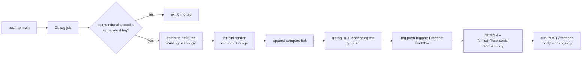

# Architecture: Release Changelog Generation

## Overview

`git-cliff` renders a Markdown changelog from the conventional commits
in `<previous-tag>..HEAD`. The existing `tag` job in
`.github/workflows/ci.yml` keeps its semver-bump logic but, after
deciding `next_tag`, also runs `git-cliff` and writes the rendered
body into the **annotated tag's message**. That tag is then the
single source of truth: when the tag push triggers the `release`
workflow, the release job recovers the body via
`git tag -l --format='%(contents)' "${TAG_NAME}"` and uses it as the
Forgejo release body.

We deliberately do not pass the changelog between workflows as an
`actions/upload-artifact`: artifacts are scoped to a single workflow
run, and CI → Release is a separate run. Reading from the annotated
tag is host-agnostic, race-free, and means `git show vX.Y.Z` and the
release body are guaranteed to match.



## Components

### `cliff.toml`

A single template + commit-parsers config at the repo root. Key
points:

- `[changelog].header` is empty (the release body has no top-level
  heading; the tag itself is the heading on Forgejo).
- `[changelog].body` is a Tera template that:
  - skips empty groups
  - prints `### <Group>` headings
  - per commit, renders `- **<scope>**: <subject> (<short_sha>)` when
    a scope is present, otherwise `- <subject> (<short_sha>)`
- `[changelog].footer` is empty. The `**Full changelog**: <compare>`
  line is appended by the workflow after rendering, because it is
  the workflow that knows the Forgejo host (it already builds API
  URLs from `FORGEJO_API_URL` + `REPOSITORY`). Keeping the template
  host-agnostic means `cliff.toml` works unchanged if the project
  ever moves between Forgejo / GitHub / GitLab.
- `[git].commit_parsers` map conventional-commit types → group:
  - `feat` → `Features`
  - `fix` → `Bug fixes`
  - `perf` → `Performance`
  - `refactor` → `Maintenance`
  - everything else (`chore`, `docs`, `test`, `ci`, `build`, `style`,
    `lint`, unmatched) → `skip = true`
- A separate parser sets `breaking = true` for `BREAKING CHANGE:`
  footers and `<type>!:` subjects; the template hoists those into a
  top **Breaking changes** group regardless of the original type.
- `[git].conventional_commits = true`, `filter_commits = true`,
  `tag_pattern = "v[0-9]*"`.

### `tag` job changes (`.github/workflows/ci.yml`)

Before the `git tag ... && git push` step:

1. Install `git-cliff` via `orhun/git-cliff-action@v3`.
2. Resolve `previous_tag` (already known: `latest_tag`) and the new
   `next_tag`.
3. Run:
   ```sh
   git cliff \
     --config cliff.toml \
     --tag "${next_tag}" \
     "${latest_tag}..HEAD" \
     --output changelog.md
   ```
   then append the `**Full changelog**: ...` line to
   `changelog.md` if `latest_tag` is non-empty, using the same
   `${FORGEJO_API_URL}` / `${REPOSITORY}` derivation already in the
   workflow (host = `${FORGEJO_API_URL%/api/*}`).
4. Replace `git tag "${next_tag}" "${TARGET_SHA}"` with
   `git tag -a -F changelog.md --cleanup=verbatim "${next_tag}" "${TARGET_SHA}"`.
   `--cleanup=verbatim` is **load-bearing**: without it, git strips
   any line beginning with `#` from the tag message as a comment,
   which would erase the `### Features` / `### Bug fixes` headings.
5. After the push, `actions/upload-artifact@v3` uploads
   `changelog.md` under name `release-changelog`.

The bump decision (R9) still gates everything: if no releasable
commits, the job exits before rendering, exactly as today.

### `release` job changes (`.github/workflows/release.yml`)

1. Add an `actions/checkout@v4` step with `fetch-depth: 0` and
   `fetch-tags: true` so the workflow can read the annotated tag
   message. (The current `release` job has no checkout step at all
   — it only consumes uploaded build artifacts. Adding one is
   cheap.)
2. Recover the changelog: `git tag -l --format='%(contents)'
   "${TAG_NAME}" > changelog.md`. Strip the trailing
   `-----BEGIN PGP SIGNATURE-----` block if any (we don't sign tags
   today, but `%(contents)` includes signatures when present, so
   guard against future signing).
3. Build the create-release JSON payload with `python3 -c 'import
   json, os; ...'` reading `changelog.md` for the `body` field.
   The workflow already uses `python3` for response parsing — no
   new dependency.
4. Existing 409-on-already-exists branch must also PATCH the body
   so that re-runs (or release-published-then-re-tagged scenarios)
   end up with the rendered changelog instead of any stale
   placeholder.

### `mise.toml`

Add `git-cliff = "latest"` so local maintainers running
`mise install` get the same binary CI uses. Already done in this
spec's prep step.

## Data shape

The artefact `changelog.md` is plain UTF-8 Markdown, e.g.:

```markdown
### Features

- **server**: add live countdown to rate-limit banner (eb832e9)
- close gaps between UI stats and Grafana dashboard (ab1341c)

### Bug fixes

- **frontend**: stabilize render cascades (c354dbb)

**Full changelog**: https://github.example/owner/repo/compare/v0.21.3...v0.22.0
```

## Edge cases

- **First-ever tag.** `latest_tag` is empty. `cliff.toml` falls back
  to the configured `tag_pattern` and walks the whole history. The
  footer template's `previous_tag` will be empty; the template
  handles `` to omit the compare link in that
  case.
- **Re-running the workflow on the same SHA.** The `tag` job already
  short-circuits when the tag exists. We don't regenerate the
  changelog in that path, so no stale artefact.
- **Forgejo create returns 409 (release already exists).** The
  existing branch fetches the release and uploads assets. We extend
  it to also PATCH the body to the rendered changelog so the body
  doesn't drift from the tag's annotated message.
- **Range contains only hidden commits** (e.g. only `chore:`). The
  bump logic already exits early in this case (no `feat`/`fix`/
  `perf`/`refactor`/breaking match), so `git-cliff` is never invoked
  with an empty visible set.

## Implementation plan

1. Add `cliff.toml` at repo root.
2. Add `git-cliff = "latest"` to `mise.toml` (done).
3. Verify locally: `mise exec -- git-cliff --config cliff.toml
   --unreleased --tag v0.22.0` against current `main`. Adjust
   templates until the output is what we want.
4. Edit `.github/workflows/ci.yml` `tag` job: add `git-cliff-action`
   step, render `changelog.md`, switch to annotated tag, upload
   artefact.
5. Edit `.github/workflows/release.yml` `release` job: download
   artefact, rebuild create-release payload from the file, extend
   the 409 branch to PATCH the body.
6. Push a feature branch, watch a CI dry run (or trigger a tag
   manually on a throwaway branch) to confirm the artefact handoff.

## Verification

- `git cliff --unreleased --tag vX.Y.Z` locally produces the
  expected categorisation.
- After merging this spec, the next merge to `main` that triggers
  a tag should:
  - produce an annotated tag whose `git show` output is the
    changelog,
  - produce a Forgejo release whose body is the same changelog,
  - leave the bump decision unchanged.
