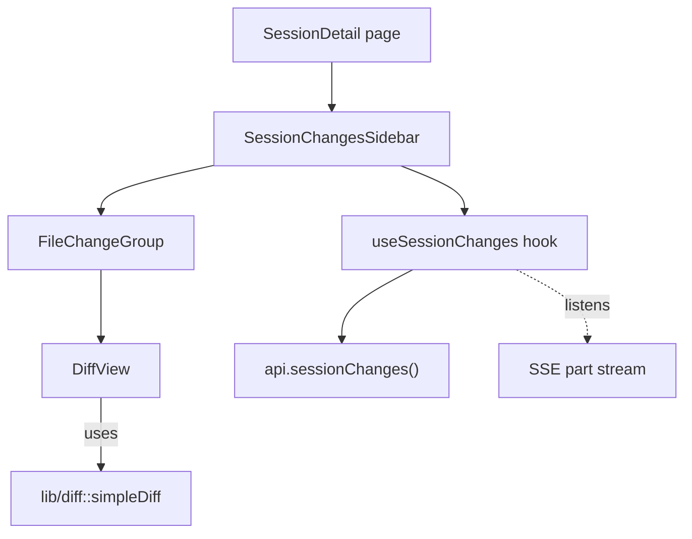
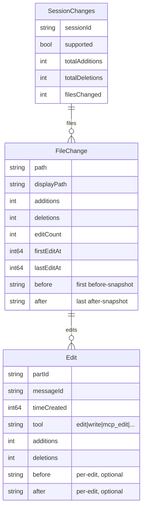
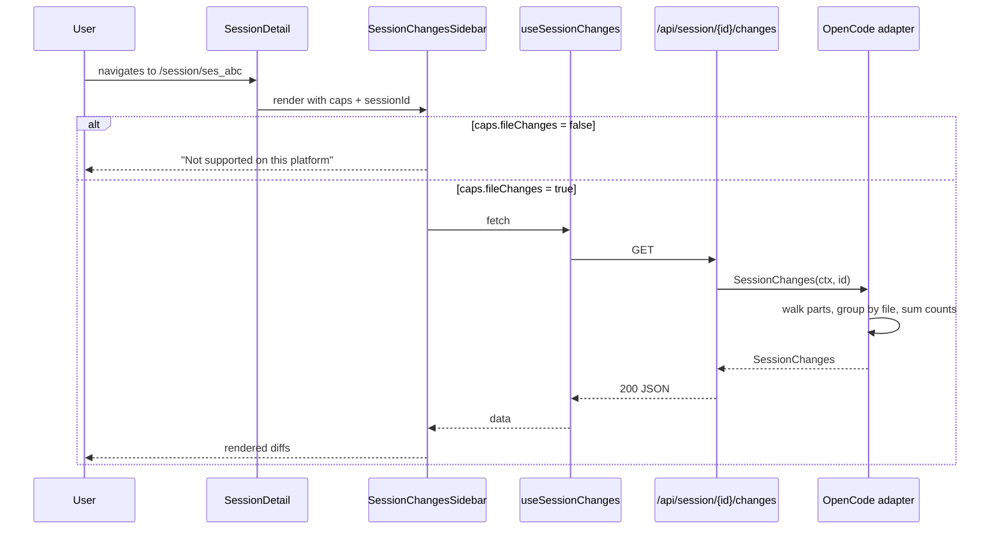
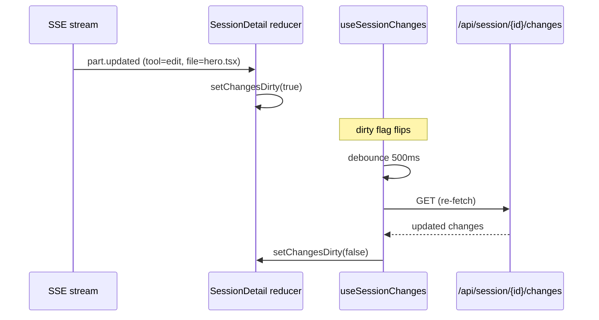

# Session Changes Sidebar - Architecture

## Overview

A right-hand sidebar on the session detail page that summarises every file
edit performed during the thread. It groups edits by file, shows
per-file additions/deletions and a unified diff with surrounding
context, and links to the actual conversation turn that produced each
change.

The feature is **OpenCode-only** in v1. Claude Code sessions render a
"Not supported" empty state in the same surface; the affordance is gated
by a new `FileChanges` capability flag rather than by branching on
platform identity (per AD-12a).

The implementation is heavily front-end weighted: the wire data we need
(`state.metadata.filediff.before/after` plus `additions`/`deletions`)
already crosses `/api/session/{id}` for OpenCode today. The only
backend addition is a new aggregation endpoint that walks **all** parts
in a session (not just the paginated window the thread view uses) so
long sessions don't lose early edits.

## Context Diagram

```mermaid
graph TD
    subgraph Browser
        SD[SessionDetail page]
        TS[SessionChangesSidebar]
        DR[DiffRenderer]
    end

    subgraph Backend
        H["/api/session/{id}/changes"]
        ADAPT["Platform adapter<br/>(OpenCode)"]
        AGG[changeAggregator]
    end

    subgraph Storage
        DB[(OpenCode SQLite<br/>session/message/part)]
        LIVE[OpenCode HTTP API<br/>/session/{id}/message]
    end

    SD --> TS
    TS --> DR
    TS -- GET --> H
    H --> ADAPT
    ADAPT --> AGG
    AGG --> DB
    AGG --> LIVE
```

## Architectural Decisions

### AD-1: Where to compute file aggregation

- **Status**: Decided
- **Context**: A "files changed" sidebar needs to collapse N tool-calls
  to M files and sum additions/deletions. Today's
  `/api/session/{id}` is paginated (default `limit=30`, frontend asks
  for 50) so the parts the frontend already has are not the full
  picture in long sessions.
- **Options**:
  1. **Aggregate on the frontend from existing parts** — reuse the
     paginated `/api/session/{id}` payload, walk parts, group by file.
     No backend work.
  2. **New backend endpoint** `GET /api/session/{id}/changes` that
     walks every part for the session (no pagination) and returns a
     compact `[{file, additions, deletions, edits[]}]` shape.
  3. **Hybrid**: extend `/api/session/{id}` with an optional
     `?includeChangeSummary=1` flag computed across all parts.
- **Decision**: Option 2.
- **Rationale**: The thread view's pagination is non-negotiable
  (memory + scroll behaviour). Computing aggregation client-side from
  paginated data silently loses early edits in long sessions, which
  would be a confusing bug. A dedicated endpoint keeps the aggregation
  logic in one Go function (testable, fast — it's a SELECT on
  `part.data` we already have indexed by `session_id`) and lets the
  frontend cache the result independently of the message stream.
- **Consequences**: One new handler, one new adapter method. The
  endpoint may be slow on huge sessions; mitigation is in AD-5.

### AD-2: Capability gating vs. platform branching

- **Status**: Decided
- **Context**: Claude Code is explicitly out of scope; how does the
  frontend know to render the "Not supported" state without violating
  AD-12a (no `platform === 'opencode'` checks in the UI)?
- **Options**:
  1. Add a new `FileChanges bool` flag to `platforms.Capabilities` and
     check `caps.fileChanges` in the sidebar.
  2. Have `/api/session/{id}/changes` return HTTP 501 / a sentinel
     `{ supported: false }` for unsupported platforms; the sidebar
     reads that.
  3. Use a generic "feature flag" lookup in the frontend.
- **Decision**: Option 1, **plus** Option 2 as a defensive backstop
  (the endpoint also returns `supported: false` for adapters that
  don't implement it). The frontend gates the UI on `caps.fileChanges`.
- **Rationale**: Capability flags are the established pattern
  (`Composer`, `Abort`, `Compact`, ...) and `make lint` enforces no
  platform branching. Returning `supported: false` from the endpoint
  too means a stale capabilities cache can't crash the page.
- **Consequences**: One new field on `Capabilities`, one new method
  on `Platform`, default-false for adapters that don't implement it.

### AD-3: Per-file diff strategy when multiple edits touch the same file

- **Status**: Decided
- **Context**: An OpenCode session may edit `hero.tsx` three times.
  The mockup shows one entry per file with a single combined diff,
  not three accordion rows. How do we collapse them?
- **Options**:
  1. **First-before / last-after**: take the `filediff.before` of the
     earliest edit on the file and the `filediff.after` of the latest,
     then run `simpleDiff` between them. One clean unified diff per
     file.
  2. **Concatenate per-edit hunks**: render each edit's diff in order,
     under one collapsible file header.
  3. **Sum counts only, no diff**: show `+9 -6` per file, click to
     drill into per-edit hunks.
- **Decision**: Option 1 (first-before / last-after) for the
  primary diff view, with a secondary "Show individual edits"
  disclosure that lists each per-edit hunk in order. The summed
  `+`/`-` counts displayed next to the filename are the authoritative
  totals from the backend aggregation, **not** the line counts of the
  collapsed diff (those can differ when an edit is later reverted).
- **Rationale**: Matches the mockup. The full file before/after is
  available for OpenCode (`filediff.before/after`) so a real
  contextual unified diff is cheap and accurate. The disclosure
  preserves traceability for users who want to see the actual sequence.
- **Consequences**: Backend returns both `summary` (sum of counts) and
  per-edit `edits[]`; the frontend computes the collapsed diff. We
  must order edits by `part.timeCreated` consistently.

### AD-4: Counting additions/deletions for the summary

- **Status**: Decided
- **Context**: The header in the mockup says "2 files changed +9 -6".
  Where do those numbers come from?
- **Options**:
  1. Sum `state.metadata.filediff.additions` and `.deletions` across
     all `tool: edit|write` parts.
  2. Use `Session.SummaryAdditions` / `SummaryDeletions` already
     populated by OpenCode on the session row.
  3. Recompute from `before`/`after` line counts.
- **Decision**: Option 1.
- **Rationale**: `Session.Summary*` are session-row totals managed by
  OpenCode itself and don't tell us per-file. Summing the
  pre-computed `filediff.additions`/`.deletions` is exact (those are
  the same numbers OpenCode shows in its own UI), and they're
  per-edit, so the same walk produces both the per-file totals and
  the header total. Falling back to "compute from line counts" is
  a third-tier safety net for edits that arrive without `filediff`
  metadata.
- **Consequences**: The aggregation endpoint must dereference
  `state.metadata.filediff` per part; if absent (older OpenCode
  versions, MCP edit tools), fall back to recomputing from
  `oldString`/`newString` line counts.

### AD-5: Caching and performance

- **Status**: Decided
- **Context**: The endpoint walks every part of a session. For a
  multi-day session that could be thousands of parts of which a
  dozen are edits.
- **Options**:
  1. Recompute on every request.
  2. Cache the result in the OpenCode adapter, keyed by
     `(sessionID, lastPartTimeCreated)`.
  3. Stream / paginate.
- **Decision**: Option 1 for v1, with an explicit budget: the SQL
  query filters parts by `json_extract(data, '$.type') = 'tool'` and
  `json_extract(data, '$.tool') IN (...)` so we only scan edit/write
  parts. If profiling shows this is too slow we'll revisit (Option 2).
- **Rationale**: Keep it simple. The number of edit parts in a
  session is small relative to the total parts; SQLite + JSON
  extraction handles thousands of rows in milliseconds. Caching adds
  invalidation complexity (live sessions still receive new parts).
- **Consequences**: If a session has thousands of edits the endpoint
  may take >100ms. Acceptable for v1.

### AD-6: Live updates while a session is busy

- **Status**: Decided
- **Context**: When the user is watching a live OpenCode session, new
  edits arrive via SSE. Should the sidebar re-fetch?
- **Options**:
  1. Re-fetch on a debounce whenever new tool parts of type
     `edit`/`write` arrive in the SSE stream.
  2. Re-fetch on a fixed interval.
  3. Re-fetch only on session change.
- **Decision**: Option 1.
- **Rationale**: We already track parts in `SessionDetail`; the
  existing `ssePartUpdated` reducer can flip a `changesDirty` flag
  when an edit/write part is added or updated, and a 500 ms debounce
  triggers a re-fetch. Cheap and predictable.
- **Consequences**: One extra dependency between the SSE reducer and
  the sidebar's data hook. Documented in `useSessionChanges`.

### AD-7: Open / Commit actions

- **Status**: Open (deferred)
- **Context**: The mockup shows `Open` and `Commit` buttons in the
  header, plus per-file accept (✓) / reject (✕) controls.
- **Options**: Many — opening a file in VS Code (already wired via
  `openVSCode`), running `git commit` shell-out, undoing an edit by
  writing the `before` content back, etc.
- **Decision**: **Out of scope for v1.** The sidebar is read-only.
  The per-file `✕`/`✓` glyphs in the mockup are aspirational and
  not part of this delivery. The header `Open`/`Commit` buttons are
  not rendered.
- **Rationale**: Each action is a feature on its own (auth,
  side-effects on the user's worktree, conflict handling). Ship the
  view first.
- **Consequences**: Capture as future work in Open Questions.

## Component Design

### Component Diagram



### `SessionChangesSidebar` (frontend)

- **Responsibility**: Renders the right-hand panel. Owns layout,
  empty / loading / "not supported" states, and the
  expand/collapse-per-file UI.
- **Interfaces**:
  - Props: `{ sessionId: string; platformCaps: PlatformCapabilities }`.
  - Internal state: which file groups are expanded, whether
    "individual edits" disclosure is open per file.
- **Dependencies**: `useSessionChanges`, `FileChangeGroup`,
  `usePlatformCapabilities` (already in the page).

### `useSessionChanges` (frontend hook)

- **Responsibility**: Fetches `/api/session/{id}/changes`, exposes
  `{ data, loading, error, supported }`. Subscribes to a `dirty` flag
  exposed by the SSE reducer in `SessionDetail` so it re-fetches on
  new edit parts (debounced 500 ms).
- **Interfaces**:
  - `useSessionChanges(sessionId: string, options?: { enabled: boolean })`.
  - Returns `SessionChanges | null`.
- **Dependencies**: `apiStore.getSessionChanges`, the SSE reducer.

### `FileChangeGroup` (frontend)

- **Responsibility**: One row per changed file: header with path,
  `+N -M` counts, expand toggle, optional "Show individual edits"
  disclosure listing per-edit hunks.
- **Interfaces**: Props `{ change: FileChange }`.
- **Dependencies**: `DiffView`.

### `DiffView` (frontend)

- **Responsibility**: Render a unified diff string into a syntax-aware
  view. Reuse the existing rendering already in
  `OcmanRuntimeProvider.tsx` (extract into a standalone component) so
  the inline-thread diffs and the sidebar diffs look identical.
- **Interfaces**: Props `{ before: string; after: string; startLine?: number; }`
  internally calls `simpleDiff`.
- **Dependencies**: `lib/diff::simpleDiff`, `react-markdown`/highlight.

### `changeAggregator` (backend, in OpenCode adapter)

- **Responsibility**: Walk every part of a session, filter to
  `tool: edit|write|mcp_edit|mcp_write|mcp_Write`, group by file
  path, sum additions/deletions, and return the flat structure below.
- **Interfaces**:
  - `(p *OpenCode) SessionChanges(ctx, sessionID) (*platforms.SessionChanges, error)`.
- **Dependencies**: existing `db.GetSessionParts` (or a new
  `db.GetSessionEditParts` that filters in SQL — see Implementation
  Plan step 1).

### `Platform.SessionChanges` (interface addition)

- **Responsibility**: Capability-gated method. Returns
  `*platforms.SessionChanges` for adapters that support it,
  `nil, ErrUnsupported` otherwise. Default Claude Code implementation
  is the latter.
- **Interfaces**:
  ```go
  SessionChanges(ctx context.Context, sessionID string) (*SessionChanges, error)
  ```

## Data Model

### Wire shape returned by `GET /api/session/{id}/changes`



### Go types (`internal/platforms/types.go`)

```go
type SessionChanges struct {
    SessionID       string        `json:"sessionId"`
    Supported       bool          `json:"supported"`
    TotalAdditions  int           `json:"totalAdditions"`
    TotalDeletions  int           `json:"totalDeletions"`
    FilesChanged    int           `json:"filesChanged"`
    Files           []FileChange  `json:"files"`
}

type FileChange struct {
    Path        string  `json:"path"`         // absolute or repo-relative as captured
    DisplayPath string  `json:"displayPath"`  // path relative to session.directory if possible
    Additions   int     `json:"additions"`
    Deletions   int     `json:"deletions"`
    EditCount   int     `json:"editCount"`
    FirstEditAt int64   `json:"firstEditAt"`
    LastEditAt  int64   `json:"lastEditAt"`
    Before      string  `json:"before"`       // first edit's filediff.before
    After       string  `json:"after"`        // last edit's filediff.after
    Edits       []Edit  `json:"edits"`
}

type Edit struct {
    PartID      string `json:"partId"`
    MessageID   string `json:"messageId"`
    TimeCreated int64  `json:"timeCreated"`
    Tool        string `json:"tool"`
    Additions   int    `json:"additions"`
    Deletions   int    `json:"deletions"`
    Before      string `json:"before,omitempty"`
    After       string `json:"after,omitempty"`
}
```

The `Before` / `After` fields are optional per-edit (saves payload
size; `FileChangeGroup`'s "individual edits" disclosure can compute
its hunk from `oldString`/`newString` if absent).

## API Design

### `GET /api/session/{id}/changes`

- **Auth**: shared `requireAuth` like every other session route.
- **Method**: `GET` only (`requireGET`).
- **Path dispatch**: added in `dispatchSessionSubpath` next to
  `/agents`, `/commands`, `/models`.
- **Resolves platform**: via `s.resolvePlatformForSession`.
- **Response (200)**:
  ```json
  {
    "sessionId": "ses_abc",
    "supported": true,
    "totalAdditions": 9,
    "totalDeletions": 6,
    "filesChanged": 2,
    "files": [
      {
        "path": "src/hero.tsx",
        "displayPath": "src/hero.tsx",
        "additions": 8,
        "deletions": 5,
        "editCount": 1,
        "firstEditAt": 1714000000000,
        "lastEditAt": 1714000000000,
        "before": "...full file before...",
        "after": "...full file after...",
        "edits": [ /* one entry */ ]
      }
    ]
  }
  ```
- **Response when adapter doesn't support it**:
  ```json
  { "sessionId": "ses_abc", "supported": false, "files": [],
    "totalAdditions": 0, "totalDeletions": 0, "filesChanged": 0 }
  ```
  (HTTP 200, not 501, so the frontend has one shape to handle.)

### Capability flag

Add to `platforms.Capabilities`:

```go
FileChanges bool `json:"fileChanges"`
```

OpenCode reports `true`. Claude Code (and any future adapter without
this method) reports `false`.

### Frontend API client

Add to `frontend/src/lib/api.ts`:

```ts
export interface SessionEdit {
  partId: string;
  messageId: string;
  timeCreated: number;
  tool: string;
  additions: number;
  deletions: number;
  before?: string;
  after?: string;
}

export interface FileChange {
  path: string;
  displayPath: string;
  additions: number;
  deletions: number;
  editCount: number;
  firstEditAt: number;
  lastEditAt: number;
  before: string;
  after: string;
  edits: SessionEdit[];
}

export interface SessionChanges {
  sessionId: string;
  supported: boolean;
  totalAdditions: number;
  totalDeletions: number;
  filesChanged: number;
  files: FileChange[];
}

// in `api`:
sessionChanges: (sessionId, signal) =>
  fetchJSON<SessionChanges>(`/api/session/${sessionId}/changes`, signal),
```

## Sequence Diagrams

### Initial load



### Live update during a busy session



## File Structure

New files:

- `frontend/src/components/SessionChangesSidebar.tsx`
- `frontend/src/components/SessionChangesSidebar.css`
- `frontend/src/components/FileChangeGroup.tsx`
- `frontend/src/components/DiffView.tsx` *(extracted from existing
  inline diff in `OcmanRuntimeProvider.tsx`; that file then imports
  from here so behaviour stays identical)*
- `frontend/src/lib/useSessionChanges.ts`
- `frontend/src/lib/useSessionChanges.test.ts`

Modified files:

- `frontend/src/lib/api.ts` — types + `sessionChanges` method.
- `frontend/src/lib/apiStore.ts` — `getSessionChanges` thunk.
- `frontend/src/lib/useCapabilities.ts` — no change; consumers use
  the new `fileChanges` field as already plumbed.
- `frontend/src/pages/SessionDetail.tsx` — mount sidebar in the
  right column; expose `changesDirty` flag from the SSE reducer.
- `frontend/src/pages/SessionDetail.css` — adjust grid to fit a third
  column (mockup shows nav-left / thread-center / changes-right).
- `internal/platforms/platform.go` — `Capabilities.FileChanges`,
  `Platform.SessionChanges`.
- `internal/platforms/types.go` — `SessionChanges`, `FileChange`,
  `Edit` types (or a new `internal/platforms/changes.go`).
- `internal/platforms/opencode/changes.go` *(new)* — aggregation logic.
- `internal/platforms/opencode/changes_test.go` *(new)* —
  table-driven aggregation tests.
- `internal/platforms/claudecode/claudecode.go` —
  `SessionChanges` returns `nil, platforms.ErrUnsupported`;
  `Capabilities().FileChanges = false`.
- `internal/server/handlers.go` — `handleSessionChanges` + dispatch
  in `dispatchSessionSubpath`.
- `internal/server/handlers_test.go` / `integration_test.go` —
  fakePlatform support + endpoint test.
- `internal/db/parts.go` *(maybe — see Implementation Plan step 1)*
  — `GetSessionEditParts` helper that pre-filters by JSON tool type.

## Dependencies

No new external dependencies. Everything is built on:

- Existing `simpleDiff` in `frontend/src/lib/diff.ts`.
- Existing `json_extract`-based queries in `internal/db/`.
- Existing capability + adapter machinery.

## Implementation Plan

The order is chosen so each step is independently verifiable.

1. **Backend types & capability flag.**
   Add `Capabilities.FileChanges` and the `SessionChanges` /
   `FileChange` / `Edit` types under `internal/platforms`. Add a
   `SessionChanges(ctx, sessionID)` method to the `Platform`
   interface, defaulting Claude Code's implementation to
   `nil, ErrUnsupported` and reporting `FileChanges: false`. Confirm
   `make lint` and `go test ./...` pass with the unimplemented
   OpenCode method (returning `ErrUnsupported`).

2. **OpenCode aggregator (`internal/platforms/opencode/changes.go`).**
   Walk parts via `db.GetSessionParts` (no pagination — call with
   `limit=-1` or add a new `GetAllSessionParts(sessionID)` helper).
   Filter on `data.type == "tool"` and a small allowlist of tool
   names. For each, parse `state.input.{filePath, oldString,
   newString, content}` and `state.metadata.filediff`. Group by
   absolute path; track per-file `firstEditAt` / `lastEditAt`,
   `Before` (first edit's `filediff.before` or empty), `After`
   (last edit's `filediff.after` or content). Counts: sum
   `filediff.{additions,deletions}`, falling back to a line-count
   diff of `oldString`/`newString` when absent. Live OpenCode path
   (`fetchSessionFromOpenCode`) is **not** used here — we always read
   from the DB so we get every edit; live edits flush to the DB
   within seconds.
   - Tests: table-driven, covering: single edit; multiple edits same
     file; write tool (no before); MCP-prefixed tool name; missing
     `filediff` metadata (fallback path); zero edits.

3. **HTTP handler.**
   `handleSessionChanges` in `handlers.go`: `requireGET`,
   `resolvePlatformForSession`, call `adapter.SessionChanges`. On
   `ErrUnsupported`, return the `supported: false` shape with HTTP
   200. Wire into `dispatchSessionSubpath`. Add an integration test
   exercising both the OpenCode and `fakePlatform` paths.

4. **Frontend API client + types.**
   Extend `frontend/src/lib/api.ts` with the types and the
   `sessionChanges` method. Extend `apiStore.ts` with a
   `getSessionChanges(sessionId)` thunk. No UI yet — verify with
   browser devtools.

5. **Extract `DiffView`.**
   Pull the diff rendering chunk out of
   `OcmanRuntimeProvider.tsx` (lines ~152-191) into a
   `DiffView` component that takes either `(before, after)` or
   `(diffString)`. Have the runtime provider import it. No behaviour
   change; confirm vitest snapshots/visual still pass.

6. **`useSessionChanges` hook.**
   Calls `getSessionChanges` on mount and whenever a `dirty` flag
   passed in via options flips. Debounce 500 ms. Disabled when
   `caps.fileChanges` is false (returns
   `{ supported: false, ...zero }` synchronously). Vitest unit test
   for the debounce + dirty cycle.

7. **`FileChangeGroup` + `SessionChangesSidebar`.**
   Static layout matching the mockup: header with `N files changed
   +X -Y`, one collapsible `FileChangeGroup` per file. Inside each
   group: filename + `+N -M`, the collapsed diff via `DiffView`, and
   a "Show individual edits" disclosure that lists per-edit hunks.
   "Not supported" empty state when `supported === false`. Loading
   skeleton + error toast on fetch failure.

8. **Mount in `SessionDetail`.**
   Add a third column to `oc-detail-grid`. Mount
   `<SessionChangesSidebar sessionId={id} />` (capabilities resolved
   inside the sidebar via `usePlatformCapabilities`). Wire a
   `changesDirty` boolean state in `SessionDetail`; flip it `true`
   inside the existing SSE reducer when an edit/write part is added
   or updated; pass it into `useSessionChanges` and let the hook
   reset it after a successful re-fetch.

9. **Polish.**
   - Resizable column width (use `SidebarResizer` pattern).
   - Persist expand/collapse state in `useUiStore` so it survives
     navigation (optional; can be a follow-up).
   - Handle `displayPath` resolution (relativise against
     `session.directory` like the existing `relativizePath`).

10. **Lint & tests.**
    `make test` (Go + vitest), `make lint` (incl. the platform
    branching guard), and the production build (`make build`) all
    green. Add a vitest covering the "Claude Code shows not
    supported" rendering path with a stubbed capabilities response.

## Risks and Mitigations

- **Risk**: Aggregation slow on huge sessions (5k+ parts).
  **Mitigation**: SQL pre-filter on `json_extract(data,'$.type')='tool'`.
  If still too slow, add an in-process LRU cache keyed by
  `(sessionID, lastPartTimeCreated)` — see AD-5.

- **Risk**: `state.metadata.filediff` is missing for some edit tool
  variants (older OpenCode versions, MCP edit tools).
  **Mitigation**: fallback to recomputing from `oldString` /
  `newString` line counts. The fallback is exercised by a unit test.

- **Risk**: First-before / last-after collapsed diff (AD-3) can look
  surprising when an edit is later reverted (the squashed diff hides
  intermediate state).
  **Mitigation**: the `+N -M` counts come from the authoritative
  per-edit sum (AD-4), and the "Show individual edits" disclosure
  surfaces the real sequence. Document this in the component file.

- **Risk**: Non-text edits (binary files, very large content)
  produce gigantic payloads.
  **Mitigation**: cap each `before`/`after` string at `MAX_OUTPUT_LEN`
  (200 KB, matches `truncatePartOutput` in
  `internal/platforms/opencode/client.go`), append `\n... (truncated)`.
  Strictly larger files mean the diff is likely useless anyway.

- **Risk**: Frontend `useSessionChanges` re-fetch storm during a busy
  session that's writing many small edits.
  **Mitigation**: 500 ms debounce, plus dirty-flag coalesces multiple
  events into one fetch. AbortController on unmount.

## Open Questions

- **Q1 (deferred — AD-7):** Should `Open` and `Commit` actions in the
  header be implemented? `Open` is trivial (reuse `openVSCode`);
  `Commit` is a feature on its own. Leaving for a future spec.
- **Q2:** Per-file accept/reject (✓ / ✕ in the mockup) — what does
  "reject" mean? Roll back to `before`? Skip from a future commit?
  Out of scope for v1; capture as a follow-up if needed.
- **Q3:** Should the sidebar be collapsible (header strip only) like
  the recent-sessions sidebar? Suggested yes, but not blocking.
- **Q4:** Do we want to expose this data on the session list (e.g. an
  expandable row showing changed files)? Same backend endpoint would
  serve it; UI work is independent.
