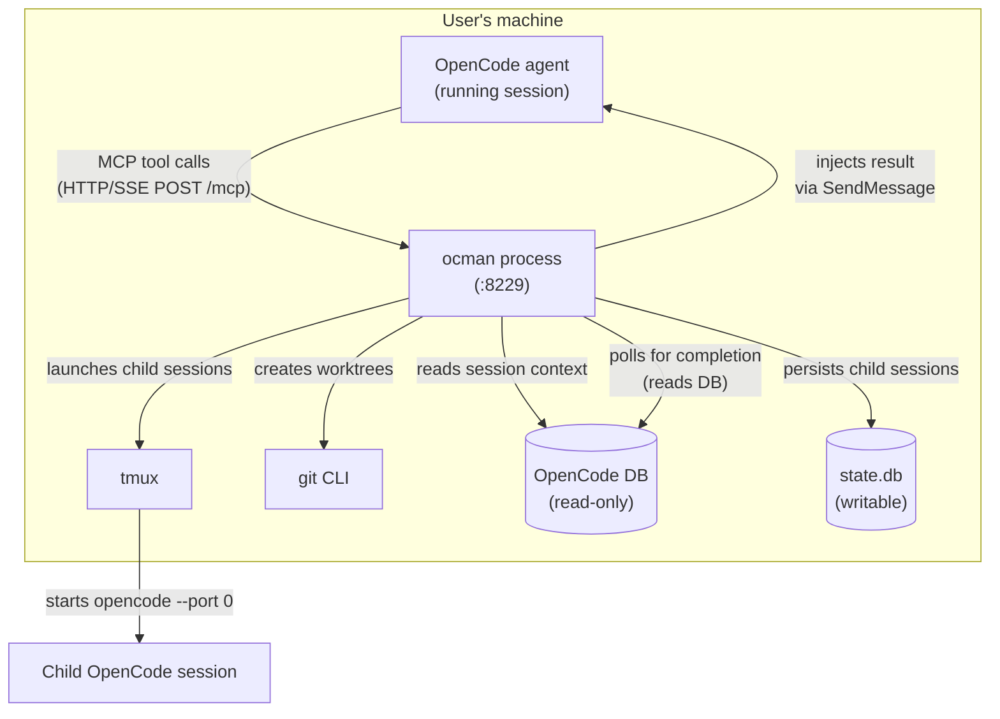
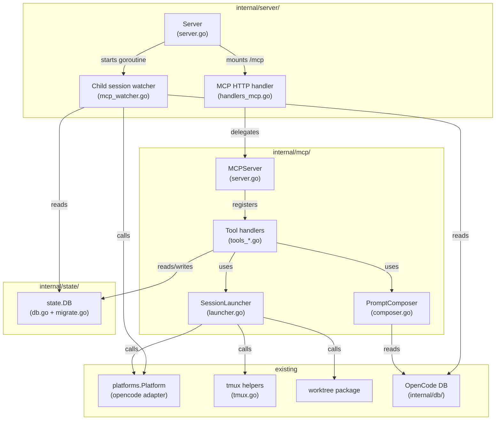
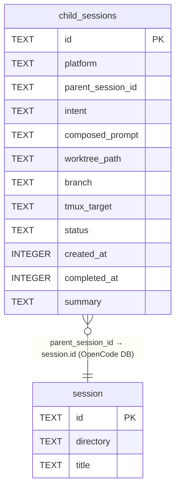
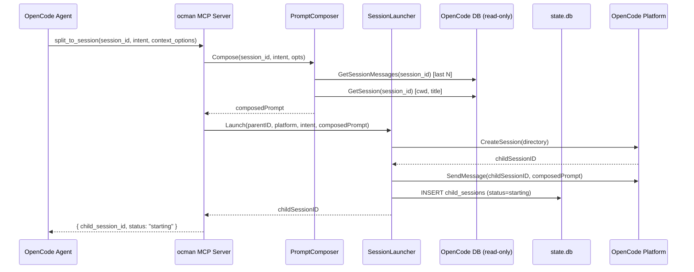
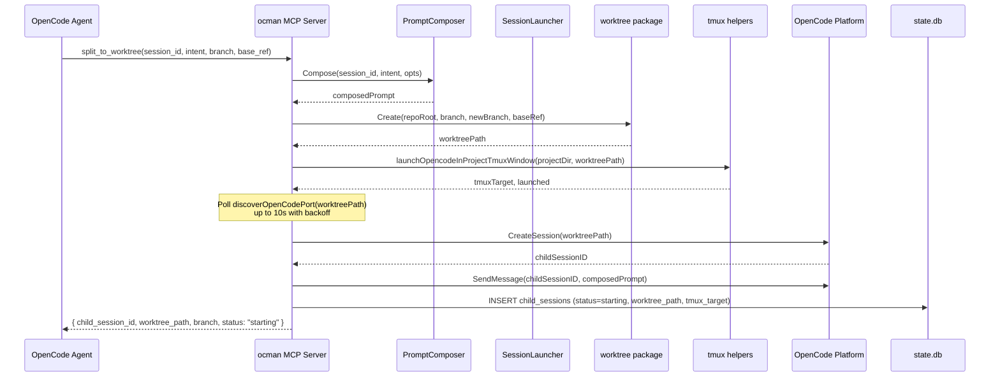
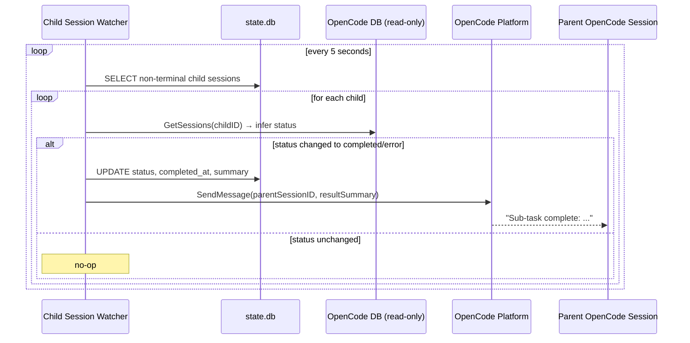

# Session Split MCP - Architecture

## Overview

The Session Split MCP embeds an MCP (Model Context Protocol) server directly
into the ocman process. It exposes five tools that allow an AI coding agent
(or a human user via the agent) to split work from an active session into new
parallel sessions or isolated git worktrees, with automatic prompt enrichment
and result injection back into the parent session.

The design philosophy is **additive and minimal**: no existing code is
modified beyond what is strictly necessary. The MCP server is a new handler
mounted on the existing HTTP mux, backed by a new `internal/mcp/` package and
a single new `state.db` migration. All session-launch logic is delegated to
the existing tmux and worktree helpers.

---

## Context Diagram



---

## Architectural Decisions

### AD-1: MCP library choice

- **Status**: Decided
- **Context**: We need a Go library to implement the MCP server. Two mature
  options exist.
- **Options**:
  1. `github.com/mark3labs/mcp-go` — community library, ~8700 stars, 80+
     releases, MIT license, built-in `mcptest` package, OTel subpackage,
     ergonomic functional-options API.
  2. `github.com/modelcontextprotocol/go-sdk` — official Anthropic/Google SDK,
     ~4600 stars, generic `AddTool` with auto-schema from struct tags,
     Apache-2.0 license.
- **Decision**: `github.com/mark3labs/mcp-go`
- **Rationale**: More community adoption, MIT license (consistent with the
  rest of the project), built-in test helpers, and an OTel integration package
  that aligns with ocman's existing telemetry. The functional-options API
  matches the style already used in the codebase.
- **Consequences**: Add one direct dependency. The library's `NewStreamableHTTPServer`
  returns an `http.Handler` that mounts cleanly into the existing `net/http`
  mux.

---

### AD-2: MCP transport

- **Status**: Decided
- **Context**: MCP supports two transports: stdio (subprocess) and Streamable
  HTTP (single endpoint, POST + GET/SSE). OpenCode's `opencode.json` supports
  both via `"type": "local"` (stdio) and `"type": "remote"` (HTTP).
- **Options**:
  1. **Streamable HTTP** — server runs as part of ocman's HTTP process; OpenCode
     connects as a remote MCP client via `"type": "remote"` in `opencode.json`.
  2. **stdio** — ocman exposes a separate binary or subcommand that OpenCode
     launches as a subprocess via `"type": "local"`.
- **Decision**: Streamable HTTP (`"type": "remote"`)
- **Rationale**: ocman is already a persistent daemon. Embedding the MCP
  endpoint in the same process avoids a second binary, shares the existing DB
  handles and registry, and requires zero process-management logic. The user
  configures OpenCode once with a static URL (`http://localhost:8229/mcp`).
- **Consequences**: The MCP endpoint is mounted at `/mcp` on the existing mux.
  It is localhost-only (same as tmux/worktree endpoints). OpenCode's
  `opencode.json` needs a one-time `"type": "remote"` entry pointing at
  `http://localhost:8229/mcp`.

---

### AD-3: Prompt composition approach

- **Status**: Decided
- **Context**: The composed prompt must be rich enough for a fresh OpenCode
  session to act on without additional context. The caller provides a brief
  intent; the MCP enriches it automatically.
- **Options**:
  1. **Pure template** — fixed Markdown template with slots for each context
     source. Simple, predictable, no LLM involved.
  2. **LLM summarisation** — call an LLM to summarise the parent session and
     produce a focused prompt. Richer output but adds latency, cost, and an
     external dependency.
  3. **Structured template with optional truncation** — same as option 1 but
     with a configurable character cap to prevent oversized prompts.
- **Decision**: Option 3 — structured Markdown template with character cap.
- **Rationale**: The goal is to give the child session enough context to act,
  not to produce a perfect summary. A deterministic template is fast, free,
  auditable (stored in `state.db`), and testable. An LLM summarisation step
  can be added later as an enhancement.
- **Consequences**: A `PromptComposer` component assembles the prompt from
  context sources. Each source is individually toggleable. A configurable
  `maxPromptChars` cap (default 8000 characters) truncates `recent_messages`
  first (least critical), then `git_diff_stat`, preserving `intent` and
  `project_metadata` always.

---

### AD-4: Child session launch mechanism

- **Status**: Decided
- **Context**: A child session needs to receive the composed prompt at launch.
  The requirements ask how OpenCode accepts an initial prompt.
- **Investigation**: OpenCode's `Platform.CreateSession` (already implemented
  in `internal/platforms/opencode/operations.go`) creates a new session via
  `POST /session` and returns its ID. The existing `Platform.SendMessage`
  then sends a message to that session via `POST /session/{id}/prompt_async`.
  This two-step sequence is already used by the frontend's "new session"
  flow.
- **Options**:
  1. **CreateSession + SendMessage** — create the session, then immediately
     send the composed prompt as the first user message. Uses existing
     Platform interface methods.
  2. **CLI flag** — launch `opencode --prompt "..."` via tmux. Fragile:
     depends on OpenCode CLI accepting a `--prompt` flag (unconfirmed).
  3. **File-based** — write the prompt to a temp file and pass its path.
     Fragile and non-standard.
- **Decision**: Option 1 — `CreateSession` + `SendMessage` via the existing
  Platform interface.
- **Rationale**: This is the only approach that uses the stable, tested
  Platform interface. It requires a running OpenCode instance in the target
  directory (same requirement as the existing composer). For `split_to_session`
  the parent's running instance serves the child (same `cwd`). For
  `split_to_worktree` the worktree is created and OpenCode is launched first
  (via tmux), then we wait briefly for the port to become discoverable before
  calling `CreateSession`.
- **Consequences**: `split_to_worktree` has a startup race: the child OpenCode
  process needs a few seconds to bind its port before `CreateSession` can
  succeed. The launcher goroutine polls `discoverOpenCodePort` with a short
  backoff (up to 10 s) before giving up. This is acceptable for an async
  launch path.

---

### AD-5: Callback injection mechanism

- **Status**: Decided
- **Context**: When a child session completes, the parent session should
  receive an automatic result notification. The requirements left the
  mechanism open.
- **Investigation**: OpenCode's `Platform.SendMessage` posts to
  `POST /session/{id}/prompt_async`. This is the same endpoint the user's
  composer uses. Sending a message to a session that is in `waiting` state
  (i.e. the agent has finished its last turn) is the standard way to continue
  a conversation. This is already fully supported.
- **Options**:
  1. **`Platform.SendMessage` to parent session** — inject a synthetic user
     message summarising the child's outcome. Simple, uses existing code.
  2. **`tmux send-keys`** — paste text into the parent session's pane.
     Fragile: depends on the pane being in the right state.
  3. **Shared file / pipe** — write a result file that the parent polls.
     Requires the parent session to be configured to watch for it.
- **Decision**: Option 1 — `Platform.SendMessage` to the parent session.
- **Rationale**: It is the only approach that uses the stable Platform
  interface and produces a proper conversation message that the user can
  see in the ocman UI. The injected message is a user-role message (from
  ocman's perspective) summarising what the child did, so the parent agent
  can continue the conversation naturally.
- **Consequences**: The parent session must have a running OpenCode instance
  (live port discoverable) at the time of injection. If the port is not
  discoverable, the injection is logged as a warning and skipped — the child
  session's result is still stored in `state.db` and visible in the ocman UI.

---

### AD-6: Child session completion detection

- **Status**: Decided
- **Context**: ocman needs to know when a child session transitions to
  `completed` or `error` to trigger the callback injection.
- **Options**:
  1. **Polling loop** — a background goroutine polls OpenCode's DB every N
     seconds for child sessions in non-terminal states.
  2. **SSE subscription** — subscribe to the child session's SSE event stream
     and detect the terminal event.
  3. **Webhook** — OpenCode fires a webhook on session end (not confirmed to
     exist).
- **Decision**: Option 1 — polling loop, 5-second interval.
- **Rationale**: Polling is the simplest approach and consistent with how
  ocman already detects session status (the auto-archive loop, the session
  listing endpoint). A 5-second interval is fast enough for a responsive
  callback without being noisy. The loop only polls sessions in `starting` or
  `running` state; once a session reaches a terminal state it is never polled
  again.
- **Consequences**: A new background goroutine `runChildSessionWatcher` is
  added to `Server.StartOnListener`, alongside the existing
  `runAutoArchiveLoop`. It reads from `state.db` (child sessions in
  non-terminal state), checks their status via `InferSessionStatus` against
  OpenCode's DB, updates `state.db`, and triggers injection when terminal.

---

### AD-7: `cancel_session` implementation

- **Status**: Decided
- **Context**: Cancelling a child session needs to stop the running OpenCode
  process.
- **Options**:
  1. **`tmux kill-window` / `kill-session`** — kill the tmux window or session
     hosting the child's OpenCode process.
  2. **`Platform.Abort`** — call OpenCode's `/session/{id}/abort` endpoint.
     This aborts the current in-flight response but does not terminate the
     process.
  3. **Both** — abort the in-flight response, then kill the tmux window.
- **Decision**: Option 1 — `tmux kill-window` (or `kill-session` for
  standalone sessions).
- **Rationale**: `Platform.Abort` only stops the current LLM turn; the
  OpenCode process keeps running and could start a new turn. Killing the tmux
  window is the definitive way to stop the process. The `child_sessions` table
  stores the `tmux_target` (session or session:window) at launch time, so the
  cancel handler can look it up and issue the kill command.
- **Consequences**: `child_sessions` table needs a `tmux_target` column. The
  cancel handler validates that the target belongs to the requesting parent
  session before issuing the kill.

---

### AD-8: MCP endpoint security

- **Status**: Decided
- **Context**: The MCP endpoint is localhost-only, but tool calls reference
  session IDs. Should a session be able to cancel another session's children?
- **Decision**: No per-session authorization in v1. The MCP endpoint is
  localhost-only (same as tmux/worktree endpoints). Any caller on localhost
  can call any tool. `cancel_session` validates that the `child_session_id`
  exists in `child_sessions` (i.e. was created by ocman) but does not enforce
  parent-session ownership.
- **Rationale**: ocman is a single-user tool. The localhost restriction is
  the primary security boundary. Adding per-session auth would require
  passing session tokens through MCP tool calls, adding complexity with no
  practical benefit for a single-user scenario.
- **Consequences**: Simple implementation. Revisit if multi-user support is
  ever added.

---

## Component Design

### Component Diagram



---

### `internal/mcp/` package

**Responsibility**: All MCP-specific logic. Isolated from `internal/server/`
so it can be tested independently.

#### `MCPServer` (`server.go`)

- **Responsibility**: Constructs the `mcp-go` server instance, registers all
  tools, and exposes an `http.Handler` for mounting.
- **Interfaces**:
  ```go
  func New(deps MCPDeps) *MCPServer
  func (m *MCPServer) Handler() http.Handler
  ```
- **Dependencies**: `MCPDeps` struct carrying `*db.DB`, `*state.DB`,
  `*platforms.Registry`, and the tmux/worktree runner interfaces.

#### `PromptComposer` (`composer.go`)

- **Responsibility**: Assembles the enriched prompt from the caller's intent
  and the configured context sources.
- **Interfaces**:
  ```go
  type ContextOptions struct {
      RecentMessages bool
      RelevantFiles  bool
      GitBranch      bool
      GitDiffStat    bool
      ProjectMeta    bool
      MaxChars       int
  }

  func DefaultContextOptions() ContextOptions
  func (c *PromptComposer) Compose(ctx context.Context, sessionID, intent string, opts ContextOptions) (string, error)
  ```
- **Dependencies**: `*db.DB` (reads messages), `git` CLI (diff/branch).

#### `SessionLauncher` (`launcher.go`)

- **Responsibility**: Orchestrates the async launch of a child session:
  creates the session via the Platform interface, sends the composed prompt,
  and stores the child session record.
- **Interfaces**:
  ```go
  type LaunchRequest struct {
      ParentSessionID string
      Platform        string
      Intent          string
      ComposedPrompt  string
      WorktreePath    string // empty for split_to_session
      Branch          string // empty for split_to_session
      TmuxTarget      string // populated after tmux launch
  }

  func (l *SessionLauncher) Launch(ctx context.Context, req LaunchRequest) (childSessionID string, err error)
  ```
- **Dependencies**: `platforms.Platform`, `*state.DB`, tmux runner.

#### Tool handlers (`tools_split.go`, `tools_status.go`)

- **Responsibility**: One file per logical group of tools. Each file
  implements the `mcp.ToolHandlerFunc` signature and delegates to
  `PromptComposer`, `SessionLauncher`, and `state.DB`.
- **Tools**:
  - `tools_split.go`: `split_to_session`, `split_to_worktree`
  - `tools_status.go`: `get_session_status`, `list_child_sessions`,
    `cancel_session`

---

### `internal/server/handlers_mcp.go`

- **Responsibility**: Mounts the MCP handler on the existing mux. Constructs
  `MCPDeps` from the `Server` struct and passes it to `mcp.New`.
- **Interfaces**: No new exported types. Adds one route registration call in
  `StartOnListener`.

---

### `internal/server/mcp_watcher.go`

- **Responsibility**: Background goroutine that polls `state.db` for child
  sessions in non-terminal states, checks their completion status against
  OpenCode's DB, updates `state.db`, and injects result messages into parent
  sessions.
- **Interfaces**:
  ```go
  func (s *Server) runChildSessionWatcher(ctx context.Context)
  func (s *Server) checkAndInjectChildResults(ctx context.Context)
  ```
- **Dependencies**: `*state.DB`, `*db.DB`, `platforms.Platform`.

---

## Data Model

### Entity Relationship Diagram



> Note: `child_sessions` lives in `state.db`; `session` lives in OpenCode's
> read-only DB. The foreign key is a logical reference only — no SQLite FK
> constraint crosses databases.

---

### `child_sessions` table (migration v9)

| Column | Type | Notes |
|---|---|---|
| `id` | TEXT PK | child session ID (from OpenCode after CreateSession) |
| `platform` | TEXT NOT NULL | e.g. `"opencode"` |
| `parent_session_id` | TEXT NOT NULL | ID of the parent session |
| `intent` | TEXT NOT NULL | caller-provided intent string |
| `composed_prompt` | TEXT NOT NULL | full enriched prompt sent to child |
| `worktree_path` | TEXT | null for `split_to_session` |
| `branch` | TEXT | null for `split_to_session` |
| `tmux_target` | TEXT | tmux session or `session:window` used to launch |
| `status` | TEXT NOT NULL | `starting`, `running`, `completed`, `error`, `cancelled` |
| `created_at` | INTEGER NOT NULL | Unix milliseconds |
| `completed_at` | INTEGER | null until terminal state |
| `summary` | TEXT | populated on completion (last assistant message excerpt) |

Index: `(parent_session_id, status)` — used by `list_child_sessions` and the
watcher loop.

---

## API Design

### MCP Tool Schemas

#### `split_to_session`

```json
{
  "name": "split_to_session",
  "description": "Launch a new OpenCode session in the same working directory as the parent session, with a context-enriched prompt derived from your intent.",
  "inputSchema": {
    "type": "object",
    "required": ["session_id", "intent"],
    "properties": {
      "session_id": { "type": "string", "description": "The parent session ID." },
      "intent": { "type": "string", "description": "Brief description of the sub-task for the new session." },
      "context_options": {
        "type": "object",
        "description": "Control which context sources are injected. All true by default.",
        "properties": {
          "recent_messages": { "type": "boolean" },
          "relevant_files":  { "type": "boolean" },
          "git_branch":      { "type": "boolean" },
          "git_diff_stat":   { "type": "boolean" },
          "project_metadata":{ "type": "boolean" }
        }
      }
    }
  }
}
```

**Returns** (text): `child_session_id`, `status: "starting"`

---

#### `split_to_worktree`

```json
{
  "name": "split_to_worktree",
  "description": "Launch a new OpenCode session in a fresh git worktree, isolated from the current session's working tree.",
  "inputSchema": {
    "type": "object",
    "required": ["session_id", "intent", "branch"],
    "properties": {
      "session_id":      { "type": "string" },
      "intent":          { "type": "string" },
      "branch":          { "type": "string", "description": "Branch name for the new worktree." },
      "base_ref":        { "type": "string", "description": "Base ref for the new branch. Defaults to repo default branch." },
      "context_options": { "$ref": "#/definitions/context_options" }
    }
  }
}
```

**Returns** (text): `child_session_id`, `worktree_path`, `branch`, `status: "starting"`

---

#### `get_session_status`

```json
{
  "name": "get_session_status",
  "inputSchema": {
    "type": "object",
    "required": ["child_session_id"],
    "properties": {
      "child_session_id": { "type": "string" }
    }
  }
}
```

**Returns** (text): `status`, `summary` (when completed), `error` (when error)

---

#### `list_child_sessions`

```json
{
  "name": "list_child_sessions",
  "inputSchema": {
    "type": "object",
    "required": ["session_id"],
    "properties": {
      "session_id": { "type": "string" }
    }
  }
}
```

**Returns** (text): JSON array of `{ child_session_id, intent, status, created_at, worktree_path }`

---

#### `cancel_session`

```json
{
  "name": "cancel_session",
  "inputSchema": {
    "type": "object",
    "required": ["child_session_id"],
    "properties": {
      "child_session_id": { "type": "string" }
    }
  }
}
```

**Returns** (text): `{ success: true/false, message: "..." }`

---

### OpenCode configuration

The user adds one entry to their project's `opencode.json` (or global
`~/.config/opencode/config.json`):

```json
{
  "$schema": "https://opencode.ai/config.json",
  "mcp": {
    "ocman": {
      "type": "remote",
      "url": "http://localhost:8229/mcp",
      "enabled": true
    }
  }
}
```

The port `8229` matches ocman's default. If the user runs ocman on a different
port, they update the URL accordingly.

---

### `/api/capabilities` extension

A new top-level key `mcpServer` is added to the capabilities response:

```json
{
  "platforms": [...],
  "worktreeSessions": true,
  "mcpServer": {
    "enabled": true,
    "url": "http://localhost:8229/mcp"
  }
}
```

`enabled` is `true` when the MCP server is running (default). `url` is the
absolute URL the user should paste into `opencode.json`.

---

## Sequence Diagrams

### `split_to_session` flow



---

### `split_to_worktree` flow



---

### Child session completion + callback injection



---

## File Structure

```
internal/
  mcp/
    server.go          # MCPServer: constructs mcp-go server, registers tools, exposes Handler()
    composer.go        # PromptComposer: assembles enriched prompt from context sources
    launcher.go        # SessionLauncher: async launch + state.db persistence
    tools_split.go     # split_to_session, split_to_worktree handlers
    tools_status.go    # get_session_status, list_child_sessions, cancel_session handlers
    composer_test.go   # unit tests for prompt composition
    launcher_test.go   # unit tests for launch logic (fake platform)
    tools_test.go      # integration tests using mcptest package

  server/
    handlers_mcp.go    # mounts /mcp handler; constructs MCPDeps from Server
    mcp_watcher.go     # runChildSessionWatcher goroutine + checkAndInjectChildResults

  state/
    db.go              # new methods: InsertChildSession, UpdateChildSession,
                       #   ListNonTerminalChildSessions, ListChildSessionsByParent,
                       #   GetChildSession, CancelChildSession
    migrate.go         # migrateToV9: child_sessions table + index
```

---

## Dependencies

| Dependency | Purpose | Action |
|---|---|---|
| `github.com/mark3labs/mcp-go` | MCP server implementation | Add to `go.mod` |
| `git` CLI | Context enrichment (`git diff --stat`, `git branch`) | Already required |
| `tmux` CLI | Child session launch | Already required |
| `opencode` CLI | Child session process | Already required |

No frontend changes are required for v1. The MCP is the interface.

---

## Implementation Plan

### Step 1 — State DB migration (v9)

Add `migrateToV9` in `internal/state/migrate.go` creating the
`child_sessions` table with the `(parent_session_id, status)` index.
Add the new `state.DB` methods: `InsertChildSession`, `UpdateChildSession`,
`ListNonTerminalChildSessions`, `ListChildSessionsByParent`, `GetChildSession`,
`CancelChildSession`.

Write table-driven tests in `internal/state/db_test.go` covering insert,
update, list, and cancel.

*Why first*: everything else depends on this table. Isolated, no new
dependencies.

---

### Step 2 — `PromptComposer`

Implement `internal/mcp/composer.go`. The composer:
1. Calls `db.GetSession(sessionID)` for `cwd`, `title`.
2. Calls `db.GetSessionMessages(sessionID)` and takes the last N messages.
3. Extracts file paths mentioned in message text (simple regex: lines
   containing `/` or `./`).
4. Shells out to `git -C <cwd> branch --show-current` and
   `git -C <cwd> diff --stat`.
5. Assembles a Markdown prompt from a fixed template, truncating to
   `maxPromptChars`.

Write unit tests in `composer_test.go` using a fake `*db.DB` and a fake
git runner (injectable function).

*Why second*: pure logic, no MCP dependency yet. Easy to test in isolation.

---

### Step 3 — `SessionLauncher`

Implement `internal/mcp/launcher.go`. The launcher:
1. For `split_to_session`: calls `Platform.CreateSession(cwd)`, then
   `Platform.SendMessage(childID, composedPrompt)`, then
   `state.InsertChildSession(...)`.
2. For `split_to_worktree`: calls `worktree.Create(...)`, then
   `launchOpencodeInProjectTmuxWindow(...)`, then polls
   `discoverOpenCodePort(worktreePath)` with backoff, then
   `Platform.CreateSession(worktreePath)`, then `Platform.SendMessage(...)`,
   then `state.InsertChildSession(...)`.

Write unit tests in `launcher_test.go` using the existing `fakePlatform`
pattern from `internal/server/fake_platform_test.go`.

*Why third*: depends on Step 1 (state.DB) and Step 2 (composer), but not
on the MCP library yet.

---

### Step 4 — MCP tool handlers + server

Add `github.com/mark3labs/mcp-go` to `go.mod`.

Implement `internal/mcp/server.go`, `tools_split.go`, and `tools_status.go`:
- `server.go`: constructs `mcp.NewMCPServer`, registers all five tools,
  returns `Handler()` wrapping `server.NewStreamableHTTPServer`.
- `tools_split.go`: `split_to_session` and `split_to_worktree` handlers.
  Each validates inputs, calls `PromptComposer.Compose`, calls
  `SessionLauncher.Launch`, returns a text result.
- `tools_status.go`: `get_session_status`, `list_child_sessions`,
  `cancel_session` handlers. Each reads from `state.DB` and (for status)
  cross-references OpenCode's DB.

Write integration tests in `tools_test.go` using `mcp-go`'s `mcptest`
package and a fake platform.

*Why fourth*: depends on Steps 1–3. Keeps the MCP library isolated to
`internal/mcp/`.

---

### Step 5 — Mount MCP handler in server

Create `internal/server/handlers_mcp.go`:
- Constructs `mcp.MCPDeps` from the `Server` struct.
- Calls `mcp.New(deps).Handler()`.
- Registers the handler at `/mcp` with `requireLocalhost`.

Update `server.go`'s `StartOnListener` to add:
```go
mcpHandler := s.buildMCPHandler()
mux.Handle("/mcp", requireLocalhost(mcpHandler))
mux.Handle("/mcp/", requireLocalhost(mcpHandler))
```

Update `handleCapabilities` to include `mcpServer: { enabled, url }`.

*Why fifth*: wires everything together. At this point the MCP server is
reachable and manually testable with an MCP client.

---

### Step 6 — Child session watcher

Create `internal/server/mcp_watcher.go`:
- `runChildSessionWatcher(ctx)`: ticks every 5 seconds, calls
  `checkAndInjectChildResults`.
- `checkAndInjectChildResults(ctx)`: queries `state.ListNonTerminalChildSessions`,
  for each: reads OpenCode's DB to infer current status, updates `state.db`,
  and if terminal calls `Platform.SendMessage` on the parent session.

Add `go s.runChildSessionWatcher(ctx)` to `StartOnListener`.

Write tests in `mcp_watcher_test.go` using the `fakePlatform` and an
in-memory `state.DB`.

*Why sixth*: depends on Steps 1 and 5. The watcher is the last piece of the
callback loop.

---

### Step 7 — Documentation + opencode.json example

Update `AGENTS.md` with:
- The MCP server URL and how to configure it in `opencode.json`.
- A brief description of the available tools.

Add an example `opencode.json` snippet to the spec or README.

*Why last*: documentation after the implementation is verified.

---

## Risks and Mitigations

| Risk | Likelihood | Impact | Mitigation |
|---|---|---|---|
| OpenCode port not discoverable after worktree launch | Medium | High | Poll with exponential backoff up to 10 s; return error with clear message if timeout exceeded. |
| Parent session not reachable for callback injection | Medium | Low | Log warning and skip; result is still in `state.db` and visible in ocman UI. |
| Composed prompt exceeds model context window | Low | Medium | `maxPromptChars` cap (default 8000); truncate `recent_messages` first. |
| `tmux kill-window` fails (window already gone) | Low | Low | Treat as idempotent success; update status to `cancelled` regardless. |
| `mcp-go` library API changes | Low | Medium | Pin to a specific minor version in `go.mod`. |
| Child session watcher goroutine panics | Low | Medium | Wrap in `runWithRecover` (same pattern as `runAutoArchiveLoop`). |
| OpenCode `opencode.json` MCP config not picked up | Medium | High | Document clearly; add a `mcpServer.url` field to `/api/capabilities` so the UI can surface a setup hint. |

---

## Open Questions

1. **`discoverOpenCodePort` for worktree path**: The existing
   `discoverOpenCodePort` function uses `lsof` to find OpenCode processes and
   resolves their `cwd`. For a freshly-launched worktree session, the process
   may not appear in `lsof` immediately. The 10-second polling window should
   be sufficient, but the exact timing depends on the host's process startup
   speed. *Implementer to measure and tune.*

2. **Summary extraction**: The `summary` field in `child_sessions` is
   populated from the child session's last assistant message. The exact
   extraction logic (first N characters? last paragraph? a structured field?)
   is left to the implementer. A simple "first 500 characters of the last
   assistant message text" is a reasonable starting point.

3. **`split_to_session` idempotency**: Unlike `split_to_worktree`, there is
   no natural idempotency key for `split_to_session` (same parent + same
   intent could legitimately produce multiple children). The current design
   does not deduplicate. *Implementer to decide if deduplication is needed.*

4. **Watcher interval tuning**: 5 seconds is a reasonable default but may
   feel slow for short-lived child sessions. Consider making it configurable
   via a flag or reducing to 2 seconds. *Implementer to tune based on
   real-world usage.*

5. **`mcpServer.url` in capabilities**: The URL is currently hardcoded as
   `http://localhost:<port>/mcp`. If ocman is bound to a non-localhost address
   (e.g. for remote access), the URL should reflect the actual bind address.
   *Implementer to derive the URL from `s.addr` at runtime.*
