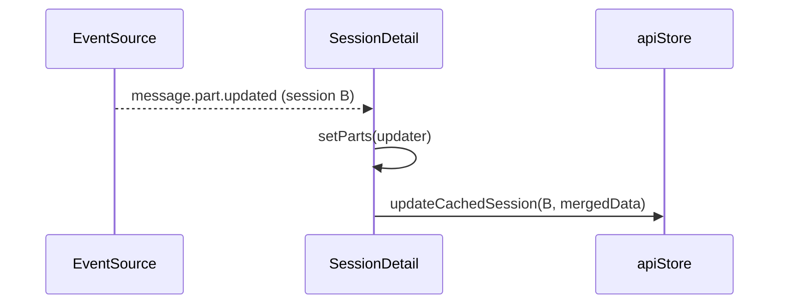

# Architecture: Faster session switching via client-side cache

## Overview

Add a small, in-memory LRU cache of session detail responses to the Zustand
API store. `SessionDetail` renders from the cache immediately on mount when a
hit is available, then refetches in the background and merges changes. Cache
entries are updated in place by SSE events so subsequent switches see the
freshest data.

No server changes. No persistence — the cache lives for the lifetime of the
tab.

## Component scope

### Files touched

- `frontend/src/lib/apiStore.ts` — add cache state and cache-aware
  `getSession` variant.
- `frontend/src/pages/SessionDetail.tsx` — read from cache on mount, write
  to cache on load/SSE updates, skip redundant reconciliation.
- `frontend/src/lib/apiStore.test.ts` (new) — unit tests for cache behaviour.

### Files NOT touched

- Any server-side Go code (`internal/**/*.go`).
- `frontend/src/lib/api.ts` — the raw fetch layer stays untouched.
- SSE event handling logic — only the state setters become "write to cache
  too" helpers.

## Data model

```ts
// apiStore.ts
interface CachedSessionDetail {
  data: SessionDetail;            // the last successful response
  fetchedAt: number;              // Date.now() of the last successful load
  // `data.messages` and `data.parts` are kept in the same shape the API
  // returned, so `SessionDetail` can consume them without conversion.
}

type ApiStore = {
  // ...existing fields
  sessionCache: Map<string, CachedSessionDetail>;
  sessionCacheOrder: string[];    // LRU order, most-recent last
  getCachedSession: (id: string) => SessionDetail | null;
  setCachedSession: (id: string, data: SessionDetail) => void;
  updateCachedSession: (
    id: string,
    updater: (prev: SessionDetail) => SessionDetail,
  ) => void;
  clearCachedSession: (id: string) => void;
};
```

Constants:

```ts
const SESSION_CACHE_MAX = 5;
const SESSION_CACHE_STALE_MS = 30_000;  // revalidation hint only; we always
                                        // refetch on switch, this is just
                                        // used to tag entries as stale for
                                        // diagnostics/future use.
```

### LRU semantics

- `setCachedSession(id, data)` bumps `id` to the end of `sessionCacheOrder`
  and truncates the front when length exceeds `SESSION_CACHE_MAX`.
- `getCachedSession(id)` does NOT reorder — reading from the cache shouldn't
  penalise a legitimate new write happening concurrently. The next
  `setCachedSession` call during revalidation handles promotion.
- `updateCachedSession(id, updater)` is a no-op when `id` is not in the cache
  (so SSE updates for a session that was evicted don't silently resurrect a
  partial entry).

## Flow: session switch

```mermaid
sequenceDiagram
    participant User
    participant SD as SessionDetail
    participant Store as apiStore
    participant API as /api/session/:id

    User->>SD: navigate to /session/B
    SD->>Store: getCachedSession(B)
    alt cache hit
        Store-->>SD: cached SessionDetail
        SD->>SD: render immediately (no spinner)
        SD->>API: load(B) in background
        API-->>SD: fresh SessionDetail
        SD->>SD: hash-diff; update state if changed
        SD->>Store: setCachedSession(B, fresh)
    else cache miss
        Store-->>SD: null
        SD->>SD: show loading state (as today)
        SD->>API: load(B)
        API-->>SD: SessionDetail
        SD->>SD: render
        SD->>Store: setCachedSession(B, data)
    end
```

## Flow: SSE update on a cached session



The cache mirror is written from a single `useEffect` in `SessionDetail` that
depends on `messages`, `parts`, and `session` (see "Integration" below). This
avoids sprinkling `updateCachedSession` calls across every SSE handler.

## Integration in `SessionDetail.tsx`

### 1. Initial state uses the cache

Today:

```ts
const [session, setSession] = useState<...>(null);
const [messages, setMessages] = useState<Message[]>([]);
const [parts, setParts] = useState<Part[]>([]);
const [loading, setLoading] = useState(true);
```

New behaviour:

```ts
const cached = useApiStore.getState().getCachedSession(id ?? '');
const [session, setSession] = useState<...>(cached?.session ?? null);
const [messages, setMessages] = useState<Message[]>(cached?.messages ?? []);
const [parts, setParts] = useState<Part[]>(cached?.parts ?? []);
const [loading, setLoading] = useState(cached == null);
```

Using `useApiStore.getState()` (imperative, not `useApiStore(selector)`) so
the cache read happens once during the initial render, not as a reactive
subscription. The cache is a cheap side channel — we don't want to trigger
re-renders on cache writes for every session.

### 2. Session-change effect preserves cached state

Today (line ~610):

```ts
useEffect(() => {
  abortControllerRef.current?.abort();
  // ...
  setSession(null);
  setMessages([]);
  setParts([]);
  setTotalMessages(0);
  setLoading(true);
  // ...
}, [..., id, load]);
```

New:

```ts
useEffect(() => {
  abortControllerRef.current?.abort();
  const controller = new AbortController();
  abortControllerRef.current = controller;

  const cached = getCachedSession(id ?? '');
  if (cached) {
    setSession({
      ...cached.session,
      contextTokenCount: cached.session.contextTokenCount ?? cached.contextTokenCount,
      defaultAgent: cached.defaultAgent,
      defaultModel: cached.defaultModel,
    });
    setMessages(cached.messages);
    setParts(cached.parts);
    setTotalMessages(cached.totalMessages || cached.session.messageCount || 0);
    setLoading(false);
    // seed the hash refs so the upcoming load() only triggers updates when
    // content actually changed
    lastHashRef.current = hashMessagesAndParts(cached.messages, cached.parts);
    lastSessionHashRef.current = hashSession(cached.session);
  } else {
    setSession(null);
    setMessages([]);
    setParts([]);
    setTotalMessages(0);
    setLoading(true);
    lastHashRef.current = '';
    lastSessionHashRef.current = '';
  }
  droppedMessageCountRef.current = 0;
  // clear transient prompt state regardless
  setPortAvailable(false);
  setSelectedModel('');
  setSelectedAgent('');
  setPendingPermission(null);
  setPermissionError(null);
  setPendingQuestion(null);
  setSseDebugEvents([]);

  load(controller.signal);
  // ... port/whisper/models fetches unchanged
  return () => controller.abort();
}, [..., id, load]);
```

The hashing helpers need to be extracted once — currently they are inlined in
`load()` (line ~488 for messages/parts, ~476 for session). We pull them out as
pure functions so we can seed them from a cache hit.

### 3. Cache writes happen on successful load

In `load()` (line ~461) and `loadMore()` (line ~516), after a successful
response that is not aborted, call:

```ts
setCachedSession(id, {
  session: sessionData,
  messages: mergedMessages,    // after the existing merge logic
  parts: mergedParts,
  totalMessages: result.totalMessages || result.session.messageCount || 0,
  contextTokenCount: result.contextTokenCount,
  defaultAgent: result.defaultAgent,
  defaultModel: result.defaultModel,
});
```

Because the state setters are functional (`setMessages(prev => ...)`) we can't
read the merged result synchronously. Two options:

**Option A (chosen):** compute the merged arrays outside the setter, use them
to update state *and* update the cache:

```ts
setMessages(prev => {
  const merged = mergeMessages(prev, newMsgs);
  // schedule the cache write in a microtask so React batches first
  queueMicrotask(() => setCachedSession(id, { ...otherFields, messages: merged, parts: mergedParts }));
  return merged;
});
```

This is awkward because we need *both* merged arrays. Cleaner: move the merge
logic out of the setters.

**Option B (cleaner, chosen):** perform the merge imperatively against the
current state snapshot, then call both setters and the cache write with the
same value:

```ts
const prevMessages = messagesRef.current;
const prevParts = partsRef.current;
const mergedMessages = mergeMessages(prevMessages, newMsgs);
const mergedParts = mergeParts(prevParts, newParts);
setMessages(mergedMessages);
setParts(mergedParts);
setCachedSession(id, { ...sessionData, messages: mergedMessages, parts: mergedParts, ... });
```

This requires refs that mirror `messages` and `parts`. We already maintain
`lastHashRef`, so adding `messagesRef`/`partsRef` is a small, well-contained
change. The existing "trim old messages" effect must keep both the state and
the refs in sync.

### 4. SSE updates mirror to the cache

Add a dedicated effect:

```ts
useEffect(() => {
  if (!session?.id) return;
  updateCachedSession(session.id, (prev) => ({
    ...prev,
    session: { ...prev.session, ...session },
    messages,
    parts,
    totalMessages: Math.max(prev.totalMessages, totalMessages),
  }));
}, [session, messages, parts, totalMessages, updateCachedSession]);
```

`updateCachedSession` no-ops on cache miss, so this is safe to run
unconditionally. Debouncing is unnecessary at this scale; React batches the
updates and the Map write is cheap. If this becomes a profiling hotspot we can
add a trailing debounce later.

### 5. Drop the redundant reconciliation `load()`

Today (line ~912):

```ts
setTimeout(() => {
  if (!hasReceivedContentEvent && !cancelled) {
    load(signal);
  }
}, 500);
```

Change:

```ts
setTimeout(() => {
  if (cancelled) return;
  // Only fetch if the initial load() in the session-change effect failed
  // AND no SSE content events have arrived yet.
  if (!hasReceivedContentEvent && loadErrorRef.current) {
    load(signal);
  }
}, 500);
```

Where `loadErrorRef` is a new ref mirroring the existing `loadError` state
(or we add one). The intent: the initial `load()` is almost always the source
of truth, and SSE takes over for live updates. The reconciliation was paper-
ing over the old "wipe state on switch" pattern; with the cache it becomes
redundant.

## Helper functions (to be extracted)

```ts
// frontend/src/lib/sessionHash.ts (new)
export function hashSession(s: Session & {
  contextTokenCount?: number;
  defaultAgent?: string;
  defaultModel?: string;
}): string {
  return JSON.stringify({
    id: s.id,
    status: s.status,
    title: s.title,
    ctx: s.contextTokenCount,
    agent: s.defaultAgent,
    model: s.defaultModel,
  });
}

export function hashMessagesAndParts(msgs: Message[], parts: Part[]): string {
  return (
    msgs.map(m => m.id + ':' + m.timeCreated).join(',') +
    '|' +
    parts.map(p => p.id + ':' + JSON.stringify(p.data)).join(',')
  );
}
```

These replace the inline expressions at `SessionDetail.tsx:476` and `:488-489`.

## Memory bounds

Worst case with `SESSION_CACHE_MAX = 5` and the existing
`MAX_RETAINED_MESSAGES = 300` per session = 1,500 messages + parts in memory.
Each part's text/output is already truncated at 200k chars by `truncatePartField`,
so a realistic upper bound is a few tens of MB — acceptable for a desktop
browser tab. If this turns out to be too much we lower `SESSION_CACHE_MAX` or
deep-trim entries before caching (drop `parts` data strings for evicted-from-
view entries), but neither is needed initially.

## Implementation plan

Sequenced so each step is independently testable and leaves the app working.

### Step 1 — Extract hash helpers

- Create `frontend/src/lib/sessionHash.ts` with `hashSession` and
  `hashMessagesAndParts`.
- Replace the two inline hash expressions in `SessionDetail.tsx` with calls to
  the new helpers.
- Add unit tests in `frontend/src/lib/sessionHash.test.ts`.
- Verify `make test-frontend` and `make lint-frontend` pass. No user-visible
  change.

### Step 2 — Add cache primitives to the store

- Add `sessionCache`, `sessionCacheOrder`, `getCachedSession`,
  `setCachedSession`, `updateCachedSession`, `clearCachedSession` to
  `apiStore.ts`.
- Add `frontend/src/lib/apiStore.test.ts` covering:
  - LRU eviction at `SESSION_CACHE_MAX`.
  - `updateCachedSession` no-ops on cache miss.
  - `setCachedSession` promotes to most-recent.
  - `getCachedSession` returns null for missing IDs.
- Verify `make test-frontend` passes. Cache is unused by the UI at this
  point.

### Step 3 — Mirror loaded data into the cache

- Add `messagesRef` and `partsRef` in `SessionDetail.tsx`, kept in sync with
  their state counterparts via an effect.
- Refactor `load()` to compute merged arrays imperatively and write both
  state and cache.
- Refactor `loadMore()` the same way.
- Add the SSE-mirroring effect from section 4 above.
- Verify: `make test-frontend` still passes; manual check that sessions still
  load and stream correctly.

### Step 4 — Hydrate from cache on mount

- Read the cache in the initial `useState` calls.
- Update the session-change effect to hydrate from cache instead of wiping
  state when a cached entry exists.
- Seed `lastHashRef` / `lastSessionHashRef` from the cached content so the
  subsequent background `load()` only triggers a re-render when data
  genuinely changed.
- Manual verification: A → B → A no longer shows a loading state for
  recently-viewed sessions.

### Step 5 — Gate the SSE reconciliation fetch

- Introduce `loadErrorRef` (or reuse the existing `loadError` via ref).
- Change the `setTimeout(..., 500)` in `onopen` to only call `load()` when
  `loadErrorRef.current` is truthy AND `hasReceivedContentEvent` is false.
- Manual verification: DevTools network tab shows one session fetch per
  switch on the happy path (not two).

### Step 6 — Polish and validation

- Run `make lint` and `make test`.
- Run `make build` to confirm the production build still succeeds.
- Manually test:
  - A → B → A instant return.
  - Long-running streaming session: switch away and back; messages continue
    streaming with no duplication.
  - Session that errors on load: cache is not populated, fallback path still
    works.
  - Open 6 different sessions; confirm the oldest one causes a full reload
    when revisited.

## Testing strategy

### Unit tests

- `sessionHash.test.ts` — deterministic hashing, order-sensitivity,
  independence across fields.
- `apiStore.test.ts` — LRU cache mechanics as listed in Step 2.

### Integration / manual

The existing codebase has no integration tests for `SessionDetail` and adding
them would require a non-trivial test harness for Zustand + react-router +
SSE. We rely on manual verification against the acceptance criteria for the
UI-level behaviour, same as the rest of the frontend. If flakiness surfaces
we can add Playwright coverage in a follow-up.

## Risks and mitigations

| Risk | Mitigation |
| --- | --- |
| Stale cache shown after returning to a session whose content diverged server-side | Background refetch runs on every mount; hash-diff updates UI as soon as new data arrives. Worst case: user sees ~hundreds of ms of stale content. |
| Cache memory growth on very large sessions | Capped at 5 entries. Existing per-session trim (`MAX_RETAINED_MESSAGES`) also applies. |
| SSE updates overwriting newer cache data from another session switch | The SSE effect is keyed on `session?.id`; when the user switches, the effect tears down and the ref-based updates target the new id. |
| `messagesRef`/`partsRef` drift from state | Single `useEffect` syncs both after each render. Drift is detectable via the hash and would manifest as unnecessary re-renders, not correctness bugs. |
| Breaking existing pagination / `loadMore` behaviour | `loadMore` already merges by ID; we reuse the same merge logic in both state updates and cache writes. |

## Follow-ups (explicitly deferred)

- In-flight request dedup in `runRequest` (would eliminate duplicate fetches
  under concurrent callers).
- Server-side pagination and ETags.
- Hover prefetch for sidebar sessions.
