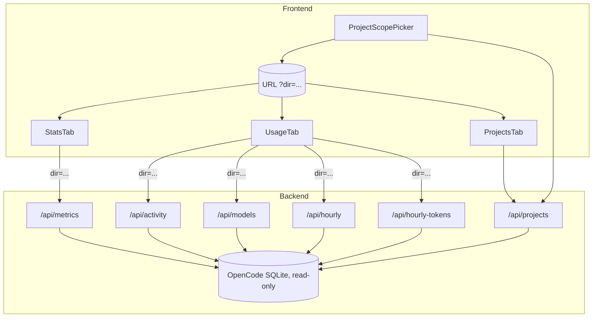
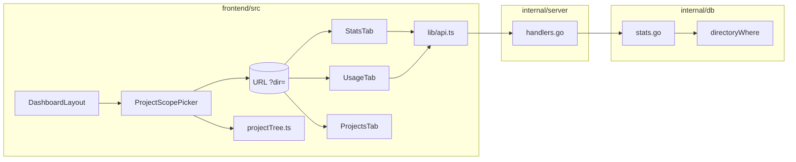
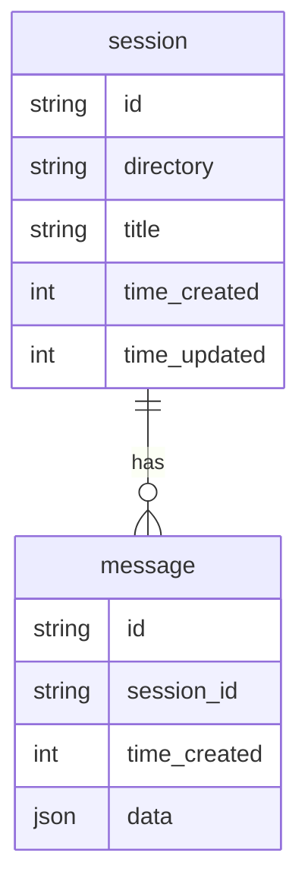
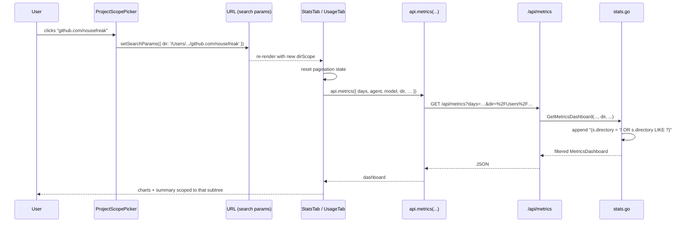
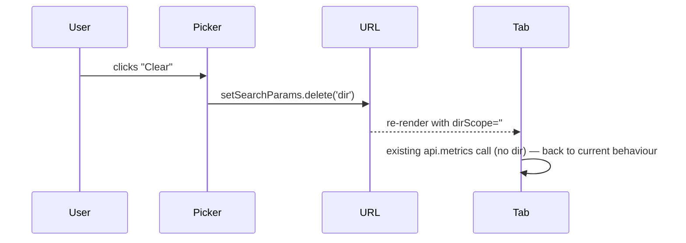

# Stats & Usage Project-Prefix Filter — Architecture

> **Note**: there is no `requirements.md` for this feature. The user opted to
> skip the BA step and treat the architecture conversation as the specification.
> The intent, captured from that conversation, is reproduced in
> ["Intent (from conversation)"](#intent-from-conversation) below.

## Overview

Add a **directory-prefix filter** to the Stats and Usage tabs (and, as a free
extension, the Projects tab). Today the user can scope by `agent` / `model` /
`days`; this feature adds `dir` — the absolute path of any project or any
ancestor directory of a project. A session contributes to the dashboard when
its `session.directory` is equal to the chosen prefix or starts with
`prefix + '/'`.

The implementation is deliberately small:

- **Backend**: extend the existing `/api/metrics`, `/api/activity`,
  `/api/models`, `/api/hourly`, `/api/hourly-tokens` handlers with a `dir=`
  query param. The DB layer adds one extra `WHERE` clause that joins to
  `session.directory`. No new endpoints, no schema changes.
- **Frontend**: add a single hierarchical "Project scope" picker, derived from
  the existing `/api/projects` payload. The selected prefix lives in the URL
  search params (`?dir=…`) and is shared between Stats and Usage. The Projects
  tab already shows projects flat; we add the same picker so the list can be
  scoped to a subtree.

The feature is **OpenCode-only**, matching the existing scope of these
endpoints. Multi-platform metrics are out of scope.

## Intent (from conversation)

User asked for:

> "I would like Stats and Usage to have an additional filter option per project
> and project parent: `~/src/github.com/nousefreak/ocman` has parent
> `~/src/github.com/nousefreak`, has parent `~/src/github.com/`."

In other words, three semantic levels — exact project, user/org, host — all
expressible as **directory prefixes**.

## Context Diagram



## Architectural Decisions

### AD-1: Filter UI shape — hierarchical "scope" picker

- **Status**: Decided (default; subject to user override)
- **Context**: The user described three semantic levels — exact project,
  user/org, host. We need a control that exposes both the leaves and the
  intermediate parent paths.
- **Options**:
  1. Free-form path text field with autocomplete from `/api/projects`.
  2. Flat dropdown of every project (mirrors the existing `model` filter).
  3. Hierarchical picker — derive a tree of every prefix from the project
     list, let the user pick any node (leaf or intermediate).
- **Decision**: **Option 3** — hierarchical picker.
- **Rationale**: It makes "parent" a first-class concept, requires no
  typing, and falls out cheaply from the data we already serve. Options 1 and
  2 either don't expose parents at all or require the user to construct the
  parent path manually.
- **Consequences**: We need a tiny pure helper that turns
  `Project[]` → tree-of-prefixes (see [`ProjectScopePicker`](#projectscopepicker)).
  No backend work.

### AD-2: Filter applied server-side, not client-side

- **Status**: Decided
- **Context**: The dashboards consume pre-aggregated payloads — summary cards,
  bucketed series, top-N tables. Filtering on the client would require either
  fetching everything (which the API doesn't expose; `/api/metrics` already
  pages) or accepting wrong totals.
- **Options**:
  1. Backend: add `dir=` to each handler; SQL filters by `session.directory`
     LIKE-prefix.
  2. Frontend: keep the API as-is, filter / re-aggregate the response.
- **Decision**: **Option 1** — backend.
- **Rationale**: Aggregation correctness, payload size, future-proofing.
  Time-series buckets and summary cards become honest. The SQL change is
  one extra `WHERE`/`AND` clause per query; trivial.
- **Consequences**: We touch every aggregation function in
  `internal/db/stats.go` and add a thread of plumbing through
  `db.GetMetricsDashboard`. Indexing (see AD-7) is something to keep in mind
  but is not blocking at our data sizes.

### AD-3: Filter encoded as URL-encoded absolute path in `?dir=`

- **Status**: Decided
- **Context**: Filter state must survive refresh / back-forward / link-share,
  matching how `?t=` and `?a=` already behave on Sessions/Projects tabs.
- **Options**:
  1. URL-encoded absolute path: `?dir=%2FUsers%2Fdries%2Fsrc%2Fgithub.com`.
  2. Opaque ID (e.g. base64 / hash).
- **Decision**: **Option 1**.
- **Rationale**: Debuggable, shareable, no server-side ID table to maintain.
  URL length is fine — directories are bounded by filesystem path limits.
- **Consequences**: Use `searchParams.get('dir')` (returns the decoded value)
  on read; pass straight through to `?dir=…` on the API request, where Go's
  `r.URL.Query().Get("dir")` also returns the decoded value.

### AD-4: OpenCode-only — defer multi-platform

- **Status**: Decided
- **Context**: Stats/Usage handlers are gated on `requireDB` (OpenCode SQLite).
  Claude Code data is in JSONL files and has no equivalent aggregation today.
- **Options**:
  1. OpenCode-only.
  2. Build platform-agnostic aggregation as part of this feature.
  3. OpenCode-only now, but reshape the API contract to be platform-agnostic.
- **Decision**: **Option 1**.
- **Rationale**: Multi-platform stats is a separate, much larger feature
  (foreshadowed by `spec/multi-agent-support`). Bundling it here would balloon
  scope and delay the user-facing win.
- **Consequences**: The picker is sourced from `/api/projects`, which is
  OpenCode-only. Claude Code projects don't appear. Documented in
  ["Open Questions"](#open-questions).

### AD-5: Scope — every aggregation in Stats + Usage + Projects

- **Status**: Decided
- **Context**: The user said "Stats and Usage". We want a single conceptual
  filter, not "filter applies to some charts but not others".
- **Options**:
  1. Stats only.
  2. Stats + Usage.
  3. Stats + Usage + Projects (free, since Projects already has the data).
- **Decision**: **Option 3**.
- **Rationale**: One mental model for the user. Projects tab gets the same
  filter for ~20 lines of code and sets up the natural "drill from a parent
  scope into one project" flow.
- **Consequences**: Filter state lives in the URL and is preserved across the
  three tabs. The picker control is rendered once per tab in the same place
  the existing `days` / `model` filters render.

### AD-6: Filter is a single value, not a multi-select

- **Status**: Decided
- **Context**: A user could conceivably want "all projects under
  `github.com/nousefreak` *or* `github.com/some-other-org`".
- **Options**:
  1. Single prefix.
  2. Multi-select set of prefixes.
- **Decision**: **Option 1**.
- **Rationale**: YAGNI. The user explicitly described single-prefix navigation.
  Multi-select would cost a non-trivial query rewrite (`WHERE dir LIKE ? OR
  dir LIKE ?`) and a more complex picker. We can revisit if asked.
- **Consequences**: If a future feature needs multi-prefix, we'd extend `dir`
  to accept a comma-separated list, or add a `dirs[]` repeated param.

### AD-7: SQL pattern for prefix matching

- **Status**: Decided
- **Context**: We need a robust SQLite predicate that catches both an exact
  match and the "under this directory" case, without falsely catching a
  sibling whose path starts with the same string (`/repo/foo` ≠ `/repo/foobar`).
- **Options**:
  1. `directory = ? OR directory LIKE ? || '/%'` (two predicates).
  2. `directory LIKE ? || '%'` (single predicate, but matches `/repo/foobar`
     when filtering on `/repo/foo`).
  3. Normalise both sides with a trailing slash and use `LIKE`.
- **Decision**: **Option 1**.
- **Rationale**: Correct, obvious, and doesn't depend on path normalisation.
  Two predicates collapse to one index scan in practice; `directory` already
  has decent selectivity for our row counts.
- **Consequences**: A small helper builds the WHERE fragment + args:
  ```go
  func directoryWhere(dir string) (sql string, args []interface{}) {
      if dir == "" {
          return "", nil
      }
      return "(s.directory = ? OR s.directory LIKE ?)", []interface{}{dir, dir + "/%"}
  }
  ```
  The handler trims trailing slashes so `/repo/` and `/repo` behave the same.

### AD-8: Picker tree is built on the frontend, not served pre-built

- **Status**: Decided
- **Context**: The picker needs the set of prefixes; the only inputs it needs
  are the project directories.
- **Options**:
  1. Compute on the frontend from `/api/projects`.
  2. Add a new `/api/project-tree` endpoint.
- **Decision**: **Option 1**.
- **Rationale**: `/api/projects` already returns every directory; the tree is
  a cheap derivation (`O(total path components)`). No new endpoint, no extra
  cache to invalidate. The data already loads on the dashboard layout.
- **Consequences**: A pure helper in `frontend/src/lib/projectTree.ts` with
  unit tests. No backend change.

## Component Design

### Component Diagram



### `ProjectScopePicker` (frontend)

- **Responsibility**: Render the active scope label, open a dropdown listing
  all prefixes (collapsible tree), update `?dir=` on selection, "Clear"
  button when a scope is active.
- **Interfaces**:
  ```ts
  interface ProjectScopePickerProps {
    projects: Project[];          // from useDashboard()
    value: string;                // selected dir, '' = all
    onChange: (dir: string) => void;
  }
  ```
- **Dependencies**: `projectTree.ts` for prefix derivation, `format.shortPath`
  for display.
- **Notes**: The picker MUST gracefully handle `projects.length === 0` (the
  initial loading state) by rendering disabled. It MUST persist the user's
  expand/collapse state only inside its own `useState` — it does not leak
  into the URL.

### `projectTree.ts` (pure helper)

- **Responsibility**: Turn `Project[]` into a tree of nodes, where each node's
  `path` is the cumulative prefix at that level.
- **Interfaces**:
  ```ts
  export interface ScopeNode {
    path: string;       // absolute path, e.g. '/Users/x/src/github.com'
    label: string;      // last segment for display, e.g. 'github.com'
    children: ScopeNode[];
    projectCount: number; // count of leaves in subtree
  }

  export function buildScopeTree(projects: { directory: string }[]): ScopeNode[];
  ```
- **Dependencies**: None (pure function, fully unit-tested).
- **Algorithm**: Insert each `directory` into a trie keyed on path segments
  (split on `/`), accumulating `projectCount` at each ancestor. Collapse
  single-child chains where the parent has no leaf of its own (so
  `/Users/dries/src/github.com` doesn't render four useless intermediate
  rows when no other directories share `/Users/`).

### `DashboardLayout` (existing, modified)

- **Responsibility**: Read `?dir=` from URL, expose it in `DashboardCtx`,
  render `ProjectScopePicker` once near the existing time-range filter so
  Stats/Usage/Projects all share the same control.
- **Changes**:
  - Add `dirScope: string` and `setDirScope: (v: string) => void` to
    `DashboardCtx`.
  - Read `searchParams.get('dir')`, write back via `setSearchParams`.

### `StatsTab`, `UsageTab`, `ProjectsTab` (existing, modified)

- **Responsibility**: Pass `dirScope` down to API calls. Reset pagination
  whenever `dirScope` changes (mirrors the existing
  `selectedAgent`/`selectedModel`/`metricsDays` reset effect).
- **Changes**:
  - `StatsTab`: include `dir: dirScope || undefined` in the `api.metrics`
    params; add `dirScope` to the `useEffect` deps; reset
    `logPage`/`sessionLogPage`/`projectLogPage`.
  - `UsageTab`: include `dir` in all four API calls (`activity`, `models`,
    `hourly`, `hourlyTokens`); add `dirScope` to deps.
  - `ProjectsTab`: filter `projects` client-side using the same prefix rule
    before rendering the table. (No backend filter for `/api/projects`
    needed — the list is small.)

### `internal/server/handlers.go` (modified)

- **Responsibility**: Parse and forward the `dir` query param.
- **Changes**:
  - In `handleMetrics`, `handleActivity`, `handleModels`, `handleHourlyTokens`,
    `handleHourly`: read `r.URL.Query().Get("dir")`, `strings.TrimSpace`, then
    `strings.TrimRight(dir, "/")` to normalise. Pass it down to the DB layer.
  - Method signatures of `db.GetMetricsDashboard`,
    `db.GetDailyActivity`, `db.GetModelUsage`,
    `db.GetHourlyTokensByModel`, `db.GetHourlyActivity` gain a leading
    or trailing `dir string` parameter (see AD-9).

### AD-9: Where does `dir` go in the DB function signatures?

- **Status**: Decided
- **Context**: The existing signatures are already long — `GetMetricsDashboard`
  takes 11 args today. Adding another positional arg is fine but easy to
  miscount.
- **Options**:
  1. Append `dir string` at the end of each signature.
  2. Refactor each signature into a `*Filter` struct.
- **Decision**: **Option 1** — append.
- **Rationale**: One feature, one line of churn per call site. A larger
  refactor to filter structs is reasonable but should be a separate change so
  it can land independently of this feature. Documented in
  ["Open Questions"](#open-questions) as a follow-up.
- **Consequences**: Update each handler's call site. Tests pass an empty
  string for the new arg, preserving existing behaviour.

### `internal/db/stats.go` (modified)

- **Responsibility**: Apply the prefix filter inside SQL, before any
  in-Go aggregation.
- **Changes**:
  - New unexported helper `directoryWhere(dir string) (sqlFragment string,
    args []interface{})` returning `("", nil)` when `dir` is empty.
  - `GetMetricsDashboard`: the outer `SELECT ... FROM message m` joins
    `session s ON s.id = m.session_id` and adds the directoryWhere fragment.
  - `GetDailyActivity`: both `SELECT ... FROM session` and
    `SELECT ... FROM message m JOIN session s` queries gain the fragment.
  - `GetModelUsage`: add `JOIN session s ON s.id = message.session_id` and
    apply the fragment.
  - `GetHourlyTokensByModel`: same — add the join + fragment.
  - `GetHourlyActivity`: only filters `session` directly; add the fragment to
    the existing `WHERE`.
- **Notes**: For `GetDailyActivity` and `GetModelUsage` the join is added
  even today's behaviour is fine without it; the join row count is one per
  message and is index-backed (`message.session_id`). No measurable cost at
  realistic data sizes.

## Data Model

No schema changes. The filter operates entirely on the existing `session`
table's `directory` column. ER unchanged:



## API Design

All five endpoints accept a new optional query param:

| Endpoint              | Existing params                 | New param        |
| --------------------- | ------------------------------- | ---------------- |
| `/api/metrics`        | `agent`, `model`, `days`, …     | `dir`            |
| `/api/activity`       | `days`, `model`                 | `dir`            |
| `/api/models`         | `days`                          | `dir`            |
| `/api/hourly`         | `days`                          | `dir`            |
| `/api/hourly-tokens`  | `days`, `model`                 | `dir`            |

`dir` semantics:

- Absent or empty: no filter (preserves current behaviour exactly).
- Non-empty: include only sessions whose `directory` is `dir` itself or starts
  with `dir + '/'`.
- Trailing slashes are stripped server-side before comparison.
- Path is treated as opaque text — no globbing, no `~` expansion (the user
  already navigates with absolute paths via the picker, which sources the
  raw `session.directory` values).

Frontend `api.ts` extension:

```ts
metrics: (params?: { …existing fields…; dir?: string }) => { … }
activity: (params?: { days?: number; model?: string; dir?: string }) => { … }
models:   (params?: { days?: number; dir?: string }) => { … }
hourly:   (params?: { days?: number; dir?: string }) => { … }
hourlyTokens: (params?: { days?: number; model?: string; dir?: string }) => { … }
```

## Sequence Diagrams

### User selects a scope



### User clears the scope



## File Structure

```
frontend/src/
  components/
    ProjectScopePicker.tsx        (new)
    ProjectScopePicker.test.tsx   (new)
  lib/
    projectTree.ts                (new — pure helper)
    projectTree.test.ts           (new)
    api.ts                        (modified — new dir? params)
  pages/
    Dashboard.tsx                 (modified — picker mount + dirScope plumbing)

internal/
  db/
    stats.go                      (modified — directoryWhere helper + 5 queries)
    db_test.go / stats_test.go    (modified — coverage for the new arg)
  server/
    handlers.go                   (modified — parse + forward `dir`)
    integration_test.go           (modified — exercise dir= round-trip)

spec/stats-project-filter/
  architecture.md                 (this file)
```

## Dependencies

None new. The feature uses libraries already in the project:

- **Frontend**: react, react-router-dom, the existing `useDashboard()`
  context, the existing `api` module.
- **Backend**: `database/sql`, the existing `internal/db` package.

## Implementation Plan

The order minimises rework — each step builds on the previous one and can be
landed/tested independently if needed.

1. **Pure helper + tests**: `frontend/src/lib/projectTree.ts` with full unit
   tests for `buildScopeTree`. Covers degenerate inputs (empty list, a single
   project, deeply nested, sibling collapse). No UI yet.

2. **Backend: directoryWhere helper + plumbing**:
   - Add `directoryWhere(dir string)` in `internal/db/stats.go`.
   - Extend the five aggregation function signatures with a trailing
     `dir string` parameter. Wire the fragment into each query.
   - Update existing call sites in `internal/server/handlers.go` to pass
     `""` (preserves behaviour).
   - Add Go tests for each function: empty `dir`, exact match, prefix match,
     prefix that matches a sibling-not-descendant (to prove AD-7 is correct).

3. **Backend: handler param wiring**:
   - In each of the five handlers, read and trim `dir` from the query string,
     then pass it through.
   - Add an integration test under `internal/server/integration_test.go`
     hitting `/api/metrics?dir=…` and `/api/activity?dir=…` and asserting the
     payload differs from the unfiltered call.

4. **Frontend: `api.ts` parameter additions**:
   - Add the optional `dir?: string` field to each of the five API helpers.
   - Add `q.set('dir', params.dir)` when present.

5. **Frontend: picker component**:
   - Build `ProjectScopePicker.tsx` consuming the helper from step 1.
   - Component test: renders the tree, fires `onChange` with the right path,
     "Clear" emits `''`.

6. **Frontend: Dashboard wiring**:
   - Add `dirScope` / `setDirScope` to `DashboardCtx` (read/write `?dir=`).
   - Mount `ProjectScopePicker` once near the existing filter row inside
     `DashboardLayout` (visible on Stats/Usage/Projects, hidden or
     no-op on Sessions if scope is irrelevant there — confirm with user
     before scoping further).
   - In `StatsTab`: pass `dir: dirScope || undefined` to `api.metrics`,
     add `dirScope` to deps, reset pagination on change.
   - In `UsageTab`: same pattern across all four API calls.
   - In `ProjectsTab`: filter the `projects` array client-side before
     rendering (uses the same prefix rule as the SQL).

7. **Frontend: lint + build** (`make lint`, `make test`). Verify
   `scripts/check-platform-branching.sh` is unaffected (no platform branches
   touched).

8. **Manual smoke test** with the dev stack (`make dev`):
   - Pick a deep project → all dashboards re-render with smaller numbers.
   - Pick the host-level prefix → numbers grow.
   - Refresh the page → state survives via URL.
   - Switch tabs while a scope is active → scope persists.
   - Clear scope → returns to current behaviour byte-for-byte.

## Risks and Mitigations

| Risk | Mitigation |
| --- | --- |
| `LIKE 'prefix%'` accidentally matching siblings (`/repo/foo` vs `/repo/foobar`). | AD-7 uses the two-predicate form `directory = ? OR directory LIKE ? || '/%'`. Tested explicitly. |
| Trailing-slash inconsistency between picker output and DB values. | Handler trims trailing slashes; the picker derives prefixes from raw `session.directory` values, which never have trailing slashes. Both paths go through the same normalisation. |
| Path encoding issues (spaces, unicode) in the URL. | We rely on standard `URLSearchParams` encoding on the way out and Go's `r.URL.Query().Get` decoding on the way in. No bespoke escaping. |
| Adding the `JOIN session` in `GetModelUsage` / `GetHourlyTokensByModel` regresses query performance. | Both joins are on `message.session_id` (already indexed). Run the existing benchmarks (`go test ./internal/db -bench .` if any exist) before/after; flag in PR. |
| Frontend builds the tree on every render. | Wrap `buildScopeTree(projects)` in `useMemo` keyed on `projects`. |
| Missing requirements doc means edge cases get discovered late. | This document is the spec; the user has confirmed (option A) that this conversation is the requirements substrate. New ambiguity is logged in ["Open Questions"](#open-questions). |

## Open Questions

1. **Should the picker also appear on the Sessions tab?** The Sessions tab
   already supports `dir` filtering via the `ProjectDetail` page, but the
   tab-level Sessions list does not. The simplest answer is "leave Sessions
   tab alone — that flow uses `/project/:dir` for drill-down." Confirm
   before wiring.
2. **Multi-platform metrics.** Long-term, Stats/Usage will likely need to
   surface Claude Code data too. When that happens, the `dir` filter applies
   uniformly (Claude Code sessions also carry a `cwd`), but each adapter will
   need to expose aggregation. Tracked separately;
   `spec/multi-agent-support/architecture.md` is the umbrella.
3. **DB function-signature refactor.** AD-9 chooses appended args for now.
   A follow-up could refactor the five aggregation functions onto a shared
   `MetricsFilter` struct. Worth doing before signature length 14+, but
   not gating this feature.
4. **Picker visual design.** The architecture leaves the visual treatment
   open — collapsible tree vs. cascade vs. breadcrumb. Resolve in a quick
   design pass when implementing step 5.
