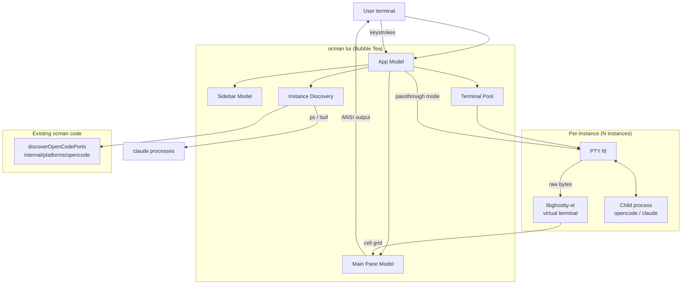
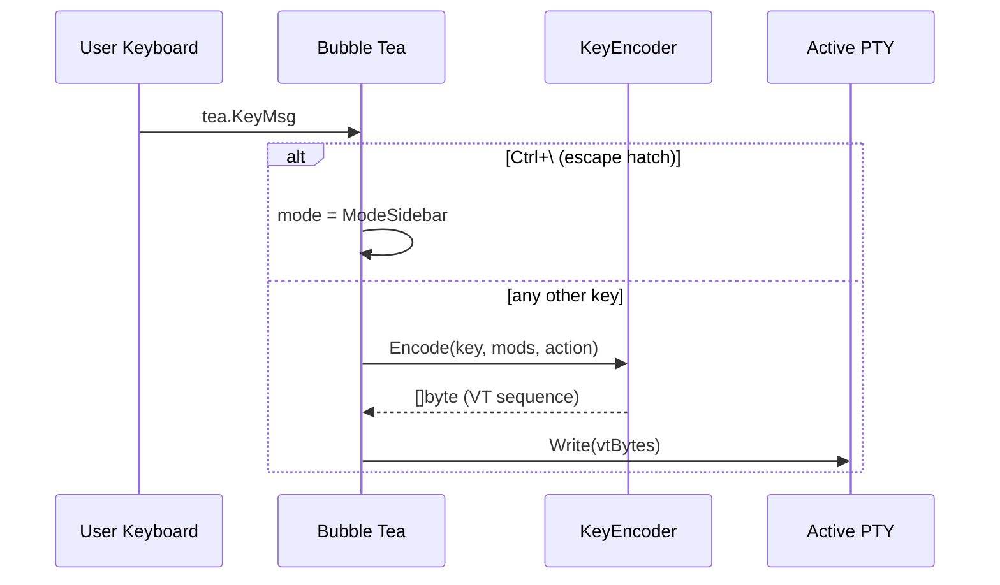
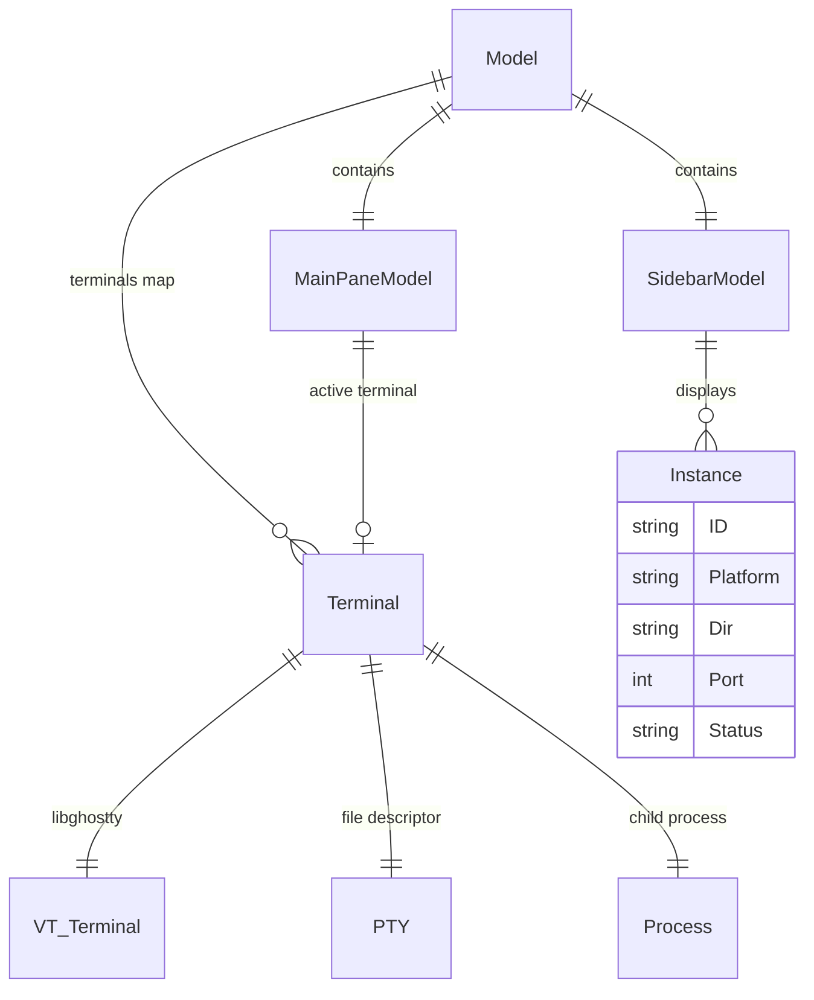

# TUI PoC - Architecture

## Overview

The TUI PoC embeds fully interactive coding-agent terminals inside a
Bubble Tea application. The key technical enabler is **libghostty-vt**,
Ghostty's embeddable VT emulator library, which provides a virtual
terminal that processes raw PTY output into a cell grid (codepoints +
colors + style flags). The Bubble Tea render loop reads this cell grid
and re-encodes it as ANSI escape sequences for the outer terminal.

The architecture has four layers:

1. **CGo bindings** (`internal/tui/vt/`) — thin Go wrappers around
   libghostty-vt's C API. Isolated in a single package so CGo does
   not leak into the rest of the codebase.
2. **Terminal model** (`internal/tui/term/`) — manages a PTY +
   libghostty terminal pair per instance. Reads PTY output, feeds it
   to the virtual terminal, and exposes the rendered cell grid.
3. **TUI application** (`internal/tui/`) — Bubble Tea models for the
   sidebar, main pane, and input routing. Orchestrates discovery,
   terminal models, and the render loop.
4. **Instance discovery** (`internal/tui/discovery/`) — reuses
   existing ocman infrastructure to find running OpenCode and Claude
   Code instances.

```
┌─────────────────────────────────────────────────────────────────┐
│                     Outer Terminal (user's)                      │
│                                                                 │
│  ┌─ Bubble Tea ───────────────────────────────────────────────┐ │
│  │                                                             │ │
│  │  ┌─ Sidebar ──────┐  ┌─ Main Pane ──────────────────────┐ │ │
│  │  │ Instance List   │  │ Rendered cell grid from           │ │ │
│  │  │ (discovery +    │  │ libghostty-vt, styled with        │ │ │
│  │  │  status)        │  │ ANSI escape sequences             │ │ │
│  │  └────────────────┘  └──────────────────────────────────┘ │ │
│  │                                                             │ │
│  │  ┌─ Terminal Model (per instance) ────────────────────────┐ │ │
│  │  │  PTY fd  ←→  child process (opencode / claude)         │ │ │
│  │  │     ↓ raw bytes                                        │ │ │
│  │  │  ghostty_terminal_vt_write()                           │ │ │
│  │  │     ↓                                                  │ │ │
│  │  │  ghostty_render_state_update()                         │ │ │
│  │  │     ↓ cell grid (codepoint, fg, bg, flags)             │ │ │
│  │  │  → Bubble Tea View() → ANSI string                     │ │ │
│  │  └────────────────────────────────────────────────────────┘ │ │
│  └─────────────────────────────────────────────────────────────┘ │
└─────────────────────────────────────────────────────────────────┘
```

## Context Diagram



## Architectural Decisions

### AD-1: libghostty-vt via CGo for terminal emulation

- **Status**: Decided
- **Context**: Embedding a full TUI (OpenCode) inside another TUI
  requires a terminal emulator that correctly handles alternate screen
  buffers, cursor positioning, 24-bit color, Unicode grapheme clusters,
  and all standard VT escape sequences. The alternatives are:
  1. **tmux orchestration** — use tmux panes instead of embedding.
     Perfect rendering but requires tmux; not a single-binary
     experience.
  2. **vt10x (Go)** — pure Go VT parser. Limited escape sequence
     support; no alternate screen, no 24-bit color, no mouse protocol.
     Would produce a degraded rendering of OpenCode.
  3. **libghostty-vt (C/Zig)** — production-grade VT emulator from
     Ghostty. Full escape sequence support, dirty-row tracking,
     cell-level access, key encoder. Requires CGo.
  4. **Write a custom VT parser in Go** — months of work to reach
     parity with libghostty; not viable for a PoC.
- **Decision**: Option 3 (libghostty-vt via CGo).
- **Rationale**: It is the only option that can faithfully render a
  nested Bubble Tea application. The CGo cost is acceptable because:
  (a) it is isolated in a single package, (b) the TUI binary can be
  built separately from the pure-Go web dashboard, and (c) the PoC
  is explicitly about validating this approach.
- **Consequences**: The TUI binary requires CGo. Cross-compilation
  requires pre-built libghostty-vt static libraries per target
  platform. The Zig toolchain is needed to build libghostty from
  source.

### AD-2: Separate binary, not a subcommand

- **Status**: Decided
- **Context**: The main `ocman` binary is pure Go (no CGo). Adding
  CGo for the TUI would infect the entire build.
- **Options**:
  1. Subcommand `ocman tui` behind a `//go:build cgo` tag. Single
     binary but CGo leaks into the build for all targets.
  2. Separate binary `cmd/ocman-tui/main.go`. Clean separation; the
     main binary stays pure Go.
  3. Build tag `tui` that conditionally includes the TUI code. Works
     but is fragile and confusing.
- **Decision**: Option 2 (separate binary).
- **Rationale**: Cleanest separation. The main ocman binary is
  unaffected. The TUI binary can have its own build target
  (`make build-tui`) and its own dependency on libghostty. If the
  PoC succeeds and the TUI graduates to a real feature, merging into
  a single binary via build tags is a future option.
- **Consequences**: Two binaries. Users install `ocman-tui` separately.
  The TUI binary imports from `internal/` (allowed since both live in
  the same module).

### AD-3: One PTY + one libghostty terminal per instance

- **Status**: Decided
- **Context**: Each embedded instance needs its own process, PTY, and
  virtual terminal state. The question is whether to pool/share any
  of these.
- **Decision**: Each instance gets its own:
  - `*os.File` PTY master fd (via `creack/pty`)
  - `*exec.Cmd` child process
  - `GhosttyTerminal` (libghostty virtual terminal)
  - `GhosttyRenderState` (libghostty render snapshot)
- **Rationale**: No sharing is needed or beneficial. Each instance is
  independent. The memory cost per terminal is small (a few hundred
  KB for the screen buffer + scrollback).
- **Consequences**: Switching instances is instant — the cell grid is
  already in memory. No re-parsing or re-rendering needed.

### AD-4: Bubble Tea View() re-encodes the cell grid as ANSI

- **Status**: Decided
- **Context**: libghostty-vt gives us a grid of cells, each with a
  codepoint, foreground color (RGB or palette), background color, and
  style flags (bold, italic, underline, etc.). Bubble Tea's `View()`
  returns a string that the framework writes to the terminal. We need
  to convert cells to ANSI escape sequences.
- **Options**:
  1. **Full re-encode every frame**: iterate all cells, emit ANSI
     sequences. Simple but O(cols * rows) per frame.
  2. **Dirty-row tracking**: use `ghostty_render_state_is_row_dirty()`
     to only re-encode changed rows. Emit cursor-positioning sequences
     to skip clean rows.
  3. **Use libghostty's formatter API**: `ghostty_formatter_terminal_new()`
     with `FORMAT_VT` emits VT sequences directly. Potentially the
     most efficient but less control over the output.
- **Decision**: Start with option 1 for the PoC. Optimize to option 2
  or 3 if profiling shows it's needed.
- **Rationale**: Option 1 is the simplest to implement and debug. At
  80x24 (1920 cells) or even 200x50 (10000 cells), the re-encoding
  is fast enough for a PoC. Dirty-row tracking adds complexity that
  is premature before we know the baseline performance.
- **Consequences**: May need optimization for large terminals or fast
  output. The architecture supports upgrading to dirty-row tracking
  without changing the component boundaries.

### AD-5: Input routing via modal state machine

- **Status**: Decided
- **Context**: The TUI has two modes: sidebar (Bubble Tea handles
  input) and passthrough (input goes to the PTY). The transition
  between them must be unambiguous.
- **Decision**: A simple state machine in the root Bubble Tea model:
  ```
  SidebarMode ──[Enter]──→ PassthroughMode
  PassthroughMode ──[Ctrl+\]──→ SidebarMode
  ```
  In `PassthroughMode`, the `Update()` function converts Bubble Tea
  key messages to VT byte sequences via the libghostty key encoder
  and writes them to the active PTY. The only exception is the escape
  key combination (`Ctrl+\`), which is intercepted before forwarding.
- **Rationale**: Two modes is the minimum viable UX. More complex
  schemes (focus follows mouse, per-pane focus) are follow-ups.
- **Consequences**: `Ctrl+\` cannot be sent to the child process.
  This is the same trade-off tmux makes with its prefix key. If
  `Ctrl+\` conflicts with a user's workflow, the escape key is
  configurable (see Open Questions in requirements).

### AD-6: Discovery reuses existing code via direct import

- **Status**: Decided
- **Context**: The TUI needs to discover running instances. Ocman
  already has `discoverOpenCodePorts()` in
  `internal/platforms/opencode/client.go`.
- **Options**:
  1. Import `internal/platforms/opencode` directly from the TUI code.
  2. Extract discovery into a shared package.
  3. Reimplement discovery in the TUI package.
- **Decision**: Option 1 for the PoC.
- **Rationale**: The TUI binary lives in the same Go module, so
  importing `internal/` packages is allowed. No need to refactor for
  a PoC. If the TUI graduates, extraction (option 2) is a clean
  follow-up.
- **Consequences**: The TUI binary transitively depends on the
  OpenCode platform package. This is acceptable; the package has no
  heavy dependencies beyond `os/exec` and `net/http`.

### AD-7: Pre-built libghostty-vt static libraries fetched during build

- **Status**: Decided
- **Context**: libghostty-vt is built with Zig. Requiring every
  developer to install Zig is too much friction for a PoC.
- **Options**:
  1. Commit `.a` files to the repo. Simple but bloats git history.
  2. Fetch from a GitHub release during `make build-tui`. Clean but
     adds a network dependency.
  3. Use a git submodule + Zig build. Most correct but highest
     friction.
- **Decision**: Option 2 for the PoC, with option 3 documented as
  the "build from source" path for developers who want it.
- **Rationale**: Keeps the repo clean. A `Makefile` target
  (`make fetch-libghostty`) downloads the correct `.a` for the
  current platform. The PoC README documents both paths.
- **Consequences**: First build requires network access (one-time
  download). The `.a` files are gitignored. CI builds fetch them as
  a step.

## Component Design

### Component Diagram

```mermaid
graph TD
    subgraph cmd["cmd/ocman-tui/"]
        Main[main.go<br/>flag parsing, setup]
    end

    subgraph tui["internal/tui/"]
        App[app.go<br/>root Bubble Tea model]
        Sidebar[sidebar.go<br/>instance list + status]
        MainPane[mainpane.go<br/>terminal viewport]
        Keymap[keymap.go<br/>key bindings + mode state]
        Styles[styles.go<br/>lipgloss styles]
    end

    subgraph term["internal/tui/term/"]
        TermModel[terminal.go<br/>PTY + VT lifecycle]
        Renderer[renderer.go<br/>cell grid → ANSI string]
    end

    subgraph vt["internal/tui/vt/"]
        Bindings[ghostty.go<br/>CGo bindings]
        Types[types.go<br/>Go types for cells, colors]
        Header[ghostty.h<br/>C header (vendored)]
        Lib[libghostty_vt.a<br/>static library (fetched)]
    end

    subgraph discovery["internal/tui/discovery/"]
        Scanner[scanner.go<br/>instance discovery]
        Instance[instance.go<br/>instance types]
    end

    subgraph existing["existing ocman packages"]
        OCClient[internal/platforms/opencode/client.go]
    end

    Main --> App
    App --> Sidebar
    App --> MainPane
    App --> Scanner

    Sidebar --> Instance
    MainPane --> TermModel
    TermModel --> Bindings
    TermModel --> Renderer
    Renderer --> Bindings
    Renderer --> Types

    Bindings --> Header
    Bindings --> Lib

    Scanner --> OCClient
    Scanner --> Instance
```

### `internal/tui/vt/` — CGo bindings

- **Responsibility**: Thin, safe Go wrappers around libghostty-vt's
  C API. This is the only package in the codebase that uses CGo.
- **Files**:
  - `ghostty.go` — CGo bindings with `#cgo` directives for linking.
  - `types.go` — Go types mirroring libghostty's C structs (Cell,
    Color, StyleFlags, CursorState).
  - `ghostty.h` — vendored C header from libghostty-vt.
  - `libghostty_vt.a` — pre-built static library (gitignored, fetched
    by Makefile).
- **Public API**:
  ```go
  package vt

  // Terminal wraps a GhosttyTerminal + GhosttyRenderState.
  type Terminal struct { ... }

  // New creates a virtual terminal with the given dimensions.
  func New(cols, rows uint16, scrollback uint32) (*Terminal, error)

  // Write feeds raw PTY output into the terminal's VT parser.
  func (t *Terminal) Write(data []byte)

  // Resize changes the terminal dimensions.
  func (t *Terminal) Resize(cols, rows uint16)

  // UpdateRenderState snapshots the terminal state for rendering.
  // Must be called before reading cells.
  func (t *Terminal) UpdateRenderState() error

  // Cell returns the cell at (col, row) from the last render snapshot.
  func (t *Terminal) Cell(col, row uint16) Cell

  // Cursor returns the current cursor state.
  func (t *Terminal) Cursor() CursorState

  // Cols/Rows returns the current dimensions.
  func (t *Terminal) Cols() uint16
  func (t *Terminal) Rows() uint16

  // IsRowDirty reports whether a row changed since the last
  // ClearDirty call.
  func (t *Terminal) IsRowDirty(row uint16) bool

  // ClearDirty resets the dirty flags for all rows.
  func (t *Terminal) ClearDirty()

  // Free releases all C-allocated resources.
  func (t *Terminal) Free()

  // Cell represents a single terminal cell.
  type Cell struct {
      Codepoint rune
      FG        Color
      BG        Color
      Flags     StyleFlags // Bold, Italic, Underline, Strikethrough, ...
      Wide      bool       // true for the first cell of a wide character
      Cont      bool       // true for continuation cells (2nd cell of wide char)
  }

  // Color represents a terminal color.
  type Color struct {
      Type  ColorType // ColorDefault, ColorPalette, ColorRGB
      R, G, B uint8   // valid when Type == ColorRGB
      Index   uint8   // valid when Type == ColorPalette
  }

  type ColorType int
  const (
      ColorDefault ColorType = iota
      ColorPalette
      ColorRGB
  )

  type StyleFlags uint16
  const (
      Bold          StyleFlags = 1 << iota
      Italic
      Underline
      Strikethrough
      Dim
      Inverse
      Hidden
      Blink
  )

  type CursorState struct {
      Col, Row uint16
      Visible  bool
      Shape    CursorShape
  }

  // KeyEncoder wraps GhosttyKeyEncoder for input translation.
  type KeyEncoder struct { ... }

  func NewKeyEncoder() *KeyEncoder
  func (e *KeyEncoder) Encode(key Key, mods Modifiers, action KeyAction) []byte
  func (e *KeyEncoder) Free()
  ```
- **CGo directives** (in `ghostty.go`):
  ```go
  // #cgo CFLAGS: -I${SRCDIR}
  // #cgo darwin,arm64 LDFLAGS: -L${SRCDIR}/lib/darwin-arm64 -lghostty_vt
  // #cgo darwin,amd64 LDFLAGS: -L${SRCDIR}/lib/darwin-amd64 -lghostty_vt
  // #cgo linux,amd64 LDFLAGS: -L${SRCDIR}/lib/linux-amd64 -lghostty_vt
  // #include "ghostty.h"
  import "C"
  ```
- **Memory management**: `Terminal.Free()` and `KeyEncoder.Free()`
  call the corresponding `ghostty_*_free()` functions. A finalizer
  is set as a safety net but callers should call `Free()` explicitly.

### `internal/tui/term/` — Terminal model

- **Responsibility**: Manages the lifecycle of a single embedded
  terminal: PTY creation, child process spawning, reading PTY output
  into the VT emulator, and rendering the cell grid to an ANSI string.
- **Files**:
  - `terminal.go` — PTY + process + VT lifecycle.
  - `renderer.go` — cell grid to ANSI string conversion.
- **Public API**:
  ```go
  package term

  // Terminal manages a PTY + child process + libghostty VT.
  type Terminal struct { ... }

  type Config struct {
      Command  string   // e.g. "opencode", "claude"
      Args     []string // e.g. ["--port", "0"]
      Dir      string   // working directory
      Cols     uint16
      Rows     uint16
  }

  // New spawns the child process in a PTY and starts reading output.
  func New(cfg Config) (*Terminal, error)

  // Render returns the current screen as an ANSI-encoded string
  // suitable for Bubble Tea's View().
  func (t *Terminal) Render() string

  // Resize updates the PTY and virtual terminal dimensions.
  func (t *Terminal) Resize(cols, rows uint16)

  // Write sends raw bytes to the PTY (for keyboard input).
  func (t *Terminal) Write(data []byte) (int, error)

  // Exited reports whether the child process has exited.
  func (t *Terminal) Exited() bool

  // ExitCode returns the exit code if Exited() is true.
  func (t *Terminal) ExitCode() int

  // Close sends SIGTERM to the child, waits briefly, then SIGKILL.
  // Frees the VT resources.
  func (t *Terminal) Close() error

  // HasUpdate reports whether new PTY output has been processed
  // since the last Render() call. Used to avoid unnecessary redraws.
  func (t *Terminal) HasUpdate() bool
  ```
- **Internal goroutine**: `readLoop()` runs in a goroutine, reading
  from the PTY master fd in 4KB chunks and calling
  `vt.Terminal.Write()` for each chunk. Sets a dirty flag after each
  write. The goroutine exits when the PTY fd is closed (child exit
  or explicit close).
- **Renderer** (`renderer.go`):
  ```go
  // RenderCells converts the VT's cell grid to an ANSI string.
  // Iterates row by row, cell by cell, emitting SGR sequences for
  // color/style changes and the codepoint for each cell.
  func RenderCells(vt *vt.Terminal) string
  ```
  The renderer tracks the "current" SGR state and only emits escape
  sequences when the style changes between adjacent cells. This
  minimizes output size. Wide characters emit the codepoint on the
  first cell and skip the continuation cell.

### `internal/tui/discovery/` — Instance discovery

- **Responsibility**: Periodically scans for running coding-agent
  instances and emits updates as Bubble Tea messages.
- **Files**:
  - `scanner.go` — discovery logic + tick-based scanning.
  - `instance.go` — instance type definitions.
- **Public API**:
  ```go
  package discovery

  type Platform string
  const (
      PlatformOpenCode  Platform = "opencode"
      PlatformClaudeCode Platform = "claude-code"
  )

  type Status string
  const (
      StatusBusy    Status = "busy"
      StatusIdle    Status = "idle"
      StatusOffline Status = "offline"
      StatusUnknown Status = "unknown"
  )

  type Instance struct {
      ID       string   // unique key: "<platform>:<dir>"
      Platform Platform
      Dir      string   // working directory (absolute path)
      DirShort string   // display name (basename or short relative path)
      Port     int      // OpenCode port (0 if not applicable)
      Status   Status
  }

  // ScanResult is a Bubble Tea message emitted after each scan.
  type ScanResult struct {
      Instances []Instance
      Err       error
  }

  // Scan performs a one-shot discovery of all running instances.
  func Scan(ctx context.Context) ScanResult

  // TickCmd returns a Bubble Tea Cmd that triggers a scan after
  // the given interval.
  func TickCmd(interval time.Duration) tea.Cmd
  ```
- **OpenCode discovery**: calls
  `opencode.DiscoverOpenCodePorts(ctx)` (imported from
  `internal/platforms/opencode`). Each entry becomes an Instance
  with `Platform: PlatformOpenCode`.
- **Claude Code discovery**: runs `ps aux` or `lsof` to find
  processes named `claude` (filtering out `Claude.app` by argv
  inspection). Extracts the working directory from `/proc/<pid>/cwd`
  (Linux) or `lsof -a -p <pid> -d cwd` (macOS). Each entry becomes
  an Instance with `Platform: PlatformClaudeCode`.
- **Status probing** (OpenCode only, PoC scope): for each discovered
  OpenCode instance, makes a lightweight HTTP request to
  `http://127.0.0.1:<port>/session` to check if any session is
  active. Maps to `StatusBusy` or `StatusIdle`. Timeout: 500ms.
  Claude Code instances default to `StatusUnknown` (no hooks in PoC).

### `internal/tui/` — Bubble Tea application

- **Responsibility**: The main TUI application. Composes the sidebar,
  main pane, and input routing.
- **Files**:
  - `app.go` — root model, layout, mode state machine.
  - `sidebar.go` — instance list component.
  - `mainpane.go` — terminal viewport component.
  - `keymap.go` — key binding definitions.
  - `styles.go` — lipgloss style constants.

#### `app.go` — Root model

```go
type InputMode int
const (
    ModeSidebar InputMode = iota
    ModePassthrough
)

type Model struct {
    mode       InputMode
    sidebar    SidebarModel
    mainPane   MainPaneModel
    terminals  map[string]*term.Terminal // keyed by Instance.ID
    activeID   string                    // currently displayed instance
    width      int
    height     int
    scanTicker time.Duration
}
```

- **Init()**: starts the discovery ticker, returns `TickCmd`.
- **Update()**:
  - `tea.WindowSizeMsg`: propagates to sidebar + main pane; resizes
    the active terminal.
  - `discovery.ScanResult`: updates the sidebar's instance list.
    Creates terminal models for new instances (lazy — only when
    selected). Marks disappeared instances.
  - `tea.KeyMsg` (sidebar mode): `j`/`k`/arrows for navigation,
    `Enter` to switch to passthrough, `q` to quit, `n` to launch
    new instance (stretch).
  - `tea.KeyMsg` (passthrough mode): if `Ctrl+\`, switch to sidebar
    mode. Otherwise, encode via `KeyEncoder` and write to the active
    terminal's PTY.
  - `termUpdateMsg`: signals that a terminal has new output. Triggers
    a re-render.
- **View()**:
  ```
  ┌─ sidebar (sidebarWidth) ─┐┌─ main pane (remaining width) ─┐
  │ sidebar.View()            ││ mainPane.View()                │
  └───────────────────────────┘└────────────────────────────────┘
  ```
  Uses lipgloss `JoinHorizontal` with a vertical divider.

#### `sidebar.go` — Instance list

```go
type SidebarModel struct {
    instances []discovery.Instance
    selected  int
    width     int
    height    int
    focused   bool // true when in sidebar mode
}
```

- Renders each instance as a row:
  ```
  ● ocman          busy
  ○ my-api         idle
  ◆ claude:frontend busy
  ```
- Platform indicator: `●` for OpenCode, `◆` for Claude Code.
- Status colors: green=idle, yellow=busy, red=error, gray=offline.
- Selected row is highlighted with a background color or `>` marker.
- Scrolls when the list exceeds the viewport height.

#### `mainpane.go` — Terminal viewport

```go
type MainPaneModel struct {
    terminal *term.Terminal // nil when no instance selected
    width    int
    height   int
}
```

- **View()**: if `terminal` is non-nil and has updates, calls
  `terminal.Render()`. Otherwise returns the cached last render.
  If no terminal is selected, shows a placeholder message.
- **Resize**: propagates to the terminal model.

#### PTY output → Bubble Tea render loop

The terminal model's `readLoop()` goroutine reads PTY output
continuously. After each read, it sends a `termUpdateMsg` to the
Bubble Tea program via `p.Send()`. This triggers an `Update()` cycle,
which calls `View()`, which calls `terminal.Render()`, which reads
the cell grid from libghostty and produces the ANSI string.

```mermaid
sequenceDiagram
    participant Proc as Child Process
    participant PTY as PTY fd
    participant Loop as readLoop goroutine
    participant VT as libghostty-vt
    participant BT as Bubble Tea
    participant Term as Outer Terminal

    Proc->>PTY: write stdout/stderr
    PTY->>Loop: read(buf)
    Loop->>VT: ghostty_terminal_vt_write(buf)
    Loop->>BT: p.Send(termUpdateMsg{})
    BT->>BT: Update() → no state change
    BT->>BT: View()
    BT->>VT: ghostty_render_state_update()
    BT->>VT: iterate cells
    BT->>Term: write ANSI string
```

#### Input routing (passthrough mode)



### `cmd/ocman-tui/main.go` — Entry point

- **Responsibility**: Flag parsing, libghostty initialization, Bubble
  Tea program setup.
- **Flags**:
  - `--scan-interval` (default `10s`): how often to scan for instances.
  - `--sidebar-width` (default `30`): sidebar column width.
- **Flow**:
  1. Parse flags.
  2. Create the root `tui.Model`.
  3. Create a `tea.Program` with `tea.WithAltScreen()` (the TUI uses
     the alternate screen buffer).
  4. Run the program.
  5. On exit, close all terminals (sends SIGTERM/SIGKILL to children).

## Data Model

No persistent data. All state is in-memory:



## File Structure

```
cmd/
  ocman-tui/
    main.go                     # Entry point

internal/
  tui/
    app.go                      # Root Bubble Tea model
    app_test.go                 # Model tests (no CGo needed)
    sidebar.go                  # Instance list component
    sidebar_test.go
    mainpane.go                 # Terminal viewport component
    keymap.go                   # Key binding definitions
    styles.go                   # Lipgloss style constants
    term/
      terminal.go               # PTY + VT lifecycle
      terminal_test.go          # Tests with mock VT (interface)
      renderer.go               # Cell grid → ANSI string
      renderer_test.go          # Tests with synthetic cell grids
    vt/
      ghostty.go                # CGo bindings
      types.go                  # Go types (Cell, Color, StyleFlags)
      ghostty.h                 # Vendored C header
      lib/
        darwin-arm64/
          libghostty_vt.a       # Pre-built (gitignored, fetched)
        darwin-amd64/
          libghostty_vt.a
        linux-amd64/
          libghostty_vt.a
    discovery/
      scanner.go                # Instance discovery
      scanner_test.go
      instance.go               # Instance types

spec/tui-poc/
  requirements.md               # This feature's requirements
  architecture.md               # This document
```

## Dependencies

### New Go dependencies

| Module | Purpose |
|---|---|
| `github.com/charmbracelet/bubbletea` | TUI framework |
| `github.com/charmbracelet/lipgloss` | Terminal styling |
| `github.com/charmbracelet/bubbles` | Reusable TUI components |
| `github.com/creack/pty` | PTY allocation and management |

### New C dependency

| Library | Purpose | Linkage |
|---|---|---|
| `libghostty_vt` | Virtual terminal emulation | Static (`.a`) |

### Build tools

| Tool | Purpose | Required? |
|---|---|---|
| Zig | Build libghostty-vt from source | Only if building from source |
| Go (with CGo) | Build the TUI binary | Yes |

### Existing ocman packages reused

| Package | What's reused |
|---|---|
| `internal/platforms/opencode` | `discoverOpenCodePorts()` for instance discovery |

## Implementation Plan

The plan is structured as incremental slices. Each step produces
something testable. The PoC does not need to pass `make test` or
`make lint` for the main ocman codebase (since it's a separate
binary), but each step should compile and run.

### Step 1 — CGo bindings (`internal/tui/vt/`)

1. Obtain or build `libghostty_vt.a` for darwin-arm64. Document the
   build process.
2. Vendor the C header (`ghostty.h` or the relevant subset).
3. Implement `vt.Terminal`: `New`, `Write`, `Resize`,
   `UpdateRenderState`, `Cell`, `Cursor`, `Free`.
4. Implement `vt.KeyEncoder`: `New`, `Encode`, `Free`.
5. Write a minimal `main.go` that creates a terminal, writes
   `"Hello, \033[1;32mworld\033[0m!\r\n"` to it, reads back the
   cells, and prints them. This validates the CGo linkage and basic
   API.

**Done when**: the test program compiles with CGo, links against
libghostty_vt.a, and prints the expected cell contents.

### Step 2 — Cell renderer (`internal/tui/term/renderer.go`)

1. Implement `RenderCells(vt *vt.Terminal) string` that iterates the
   cell grid and produces an ANSI-encoded string.
2. Handle: default colors, palette colors, RGB colors, bold, italic,
   underline, strikethrough, wide characters, cursor positioning.
3. Test with synthetic cell data (mock the `vt.Terminal` interface
   for unit tests that don't need CGo).

**Done when**: `RenderCells` produces correct ANSI output for a
variety of cell configurations.

### Step 3 — Terminal model (`internal/tui/term/terminal.go`)

1. Implement `term.Terminal`: spawns a child process in a PTY, starts
   `readLoop()`, feeds output to `vt.Terminal`.
2. Implement `Render()`, `Resize()`, `Write()`, `Close()`.
3. Test manually: spawn `bash`, type `ls --color`, verify the
   rendered output shows colored filenames.

**Done when**: a simple program can spawn `bash` in a PTY, render
its output via libghostty, and accept keyboard input.

### Step 4 — Discovery (`internal/tui/discovery/`)

1. Implement `Scan()` for OpenCode (reuse `discoverOpenCodePorts`).
2. Implement `Scan()` for Claude Code (process scanning).
3. Implement `TickCmd()` for periodic scanning.
4. Test with mock data and manually against running instances.

**Done when**: `Scan()` returns a list of running instances on the
developer's machine.

### Step 5 — Bubble Tea shell (sidebar + main pane, no terminal)

1. Implement `app.go` with the root model, layout, and mode state
   machine.
2. Implement `sidebar.go` with the instance list (populated from
   discovery).
3. Implement `mainpane.go` with a placeholder ("Select an instance").
4. Implement `keymap.go` and `styles.go`.
5. Wire up `cmd/ocman-tui/main.go`.

**Done when**: the TUI launches, shows discovered instances in the
sidebar, and responds to navigation keys.

### Step 6 — Integration: embed terminals in the main pane

1. Wire `MainPaneModel` to create `term.Terminal` instances when an
   instance is selected.
2. Implement the `termUpdateMsg` flow (readLoop → p.Send → View).
3. Implement passthrough mode input routing.
4. Test: select an OpenCode instance, see its TUI rendered in the
   main pane, type into it.

**Done when**: the user can navigate to an instance, see its real
TUI, and interact with it.

### Step 7 — Polish

1. Handle terminal resize (outer terminal resize → PTY + VT resize).
2. Handle child process exit (show "exited" state, allow respawn).
3. Handle instance disappearance (mark offline in sidebar).
4. Add the `Ctrl+\` escape hatch indicator.
5. Profile and optimize if rendering is slow (dirty-row tracking).
6. Add `make build-tui` and `make fetch-libghostty` Makefile targets.

**Done when**: the PoC is usable for a real work session with
multiple OpenCode instances.

## Risks and Mitigations

- **Risk**: libghostty-vt's C API changes between Ghostty releases.
  - **Mitigation**: Pin to a specific Ghostty commit/tag for the PoC.
    The vendored header acts as a contract. Update deliberately.

- **Risk**: The "decode VT to re-encode VT" overhead causes visible
  lag during fast output (e.g. streaming code generation).
  - **Mitigation**: Start with full re-render (AD-4). If slow,
    switch to dirty-row tracking (libghostty supports it natively).
    Worst case, throttle re-renders to 30fps (every ~33ms) — the
    human eye won't notice.

- **Risk**: Bubble Tea's rendering model (full `View()` string per
  frame) conflicts with partial terminal updates.
  - **Mitigation**: Bubble Tea supports `tea.WithAltScreen()` and
    writes the full view each frame. This is compatible with our
    approach (we produce a full ANSI string each frame). Performance
    is bounded by terminal write speed, not by Bubble Tea.

- **Risk**: Key encoding mismatches — libghostty's key encoder
  produces sequences that the child process doesn't expect.
  - **Mitigation**: libghostty's key encoder is the same one Ghostty
    uses in production. It handles kitty keyboard protocol, legacy
    mode, and all standard key encodings. If issues arise, fall back
    to manual key-to-byte mapping for the PoC.

- **Risk**: OpenCode (itself a Bubble Tea app) detects that it's
  running inside a non-standard terminal and degrades its rendering.
  - **Mitigation**: libghostty-vt responds to terminal queries
    (DA1, DA2, XTVERSION) correctly. Set `TERM=xterm-256color` on
    the child process. OpenCode has no known terminal-sniffing logic
    beyond standard terminfo.

- **Risk**: CGo complicates the build for contributors.
  - **Mitigation**: The TUI is a separate binary. Contributors
    working on the web dashboard never need CGo. The `make build`
    target for the main binary is unchanged.

## Open Questions

- **libghostty-vt thread safety**: is `ghostty_terminal_vt_write()`
  safe to call from a goroutine while `ghostty_render_state_update()`
  is called from the Bubble Tea goroutine? If not, a mutex around
  the terminal is needed (likely cheap). The C API docs suggest
  terminal instances are not thread-safe; a per-terminal mutex is
  the safe default.
- **Scrollback**: should the embedded terminal support scrollback
  (scroll up to see previous output)? libghostty-vt supports it
  (`max_scrollback` option). The PoC can start with scrollback
  disabled (the child TUI manages its own scrollback) and add it
  later.
- **Mouse passthrough**: out of scope for the PoC, but libghostty-vt
  supports mouse encoding. If OpenCode uses mouse events (e.g. for
  clicking in the sidebar), this would need to be wired through.
  Bubble Tea has `tea.WithMouseCellMotion()` for mouse support.
- **Color theme**: should the embedded terminal inherit the outer
  terminal's color scheme, or use a fixed palette? libghostty-vt
  accepts a custom palette in `GhosttyTerminalOptions`. The PoC
  should use the default palette and let the outer terminal's
  colors show through.
- **Multiple visible terminals**: the PoC shows one terminal at a
  time. A future version could split the main pane to show 2-4
  terminals simultaneously (like tmux panes). The architecture
  supports this — each terminal has its own VT instance and
  renderer — but the layout logic would need work.
