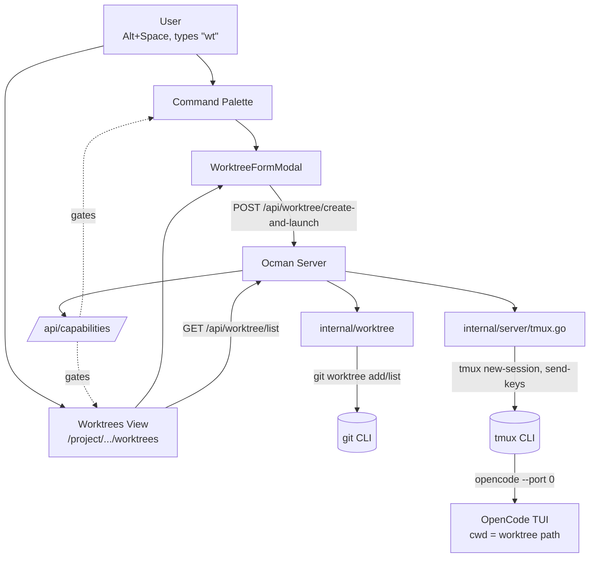
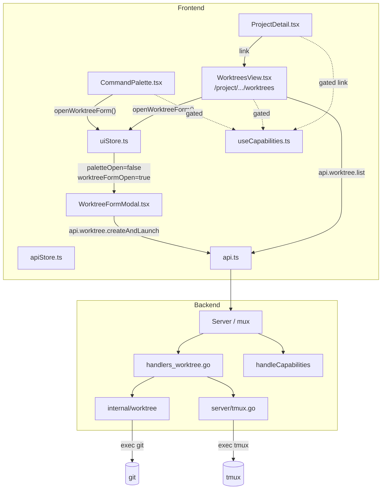
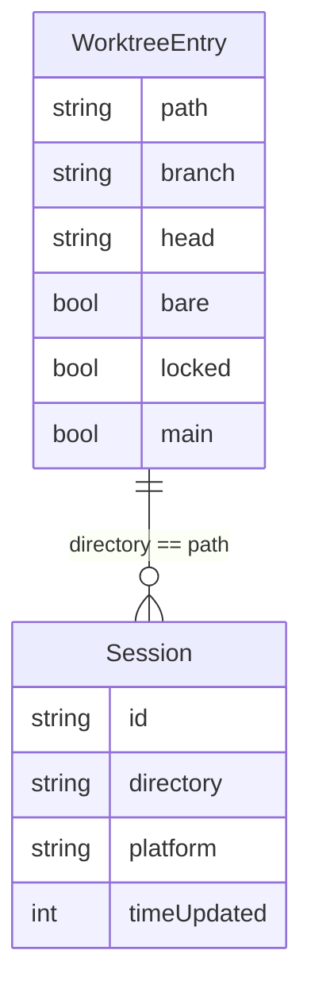
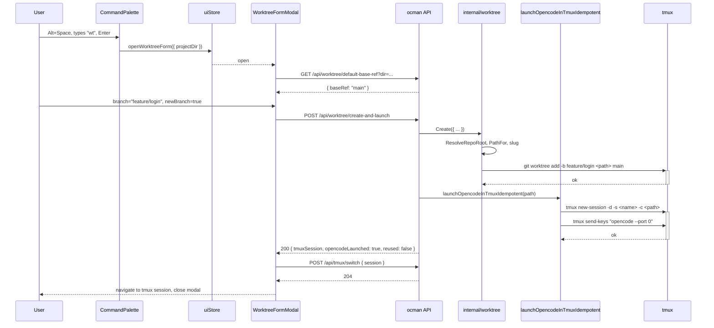
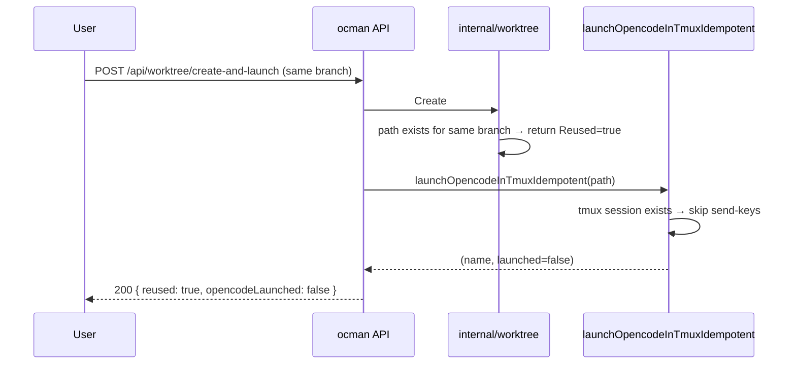
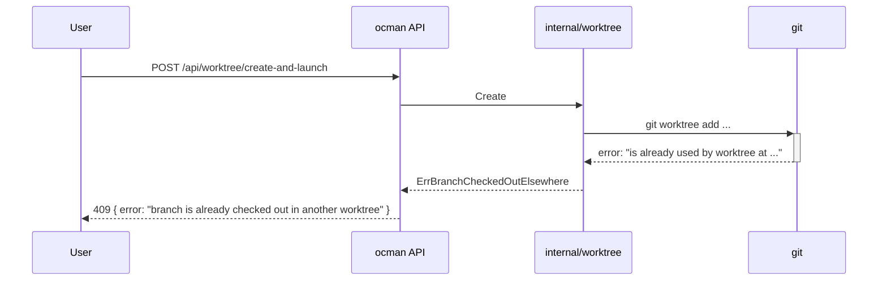

# Worktree Sessions - Architecture

> **Superseded (launch model):** this spec describes the original flow
> that launched a dedicated `opencode --port 0` in tmux *per worktree*.
> As of the **one-opencode-per-project** work, worktree (and same-dir)
> sessions run **in-app on the project's single opencode instance**
> (ensured via `EnsureProjectOpencode`) with a per-session working
> directory; there is no per-worktree opencode/tmux process. The
> per-worktree tmux launcher (`tmux.LaunchWorktreeWindow*`, the
> `ocman-worktree` session) has been removed. See AGENTS.md and
> `docs/architecture.md` for the current model. The rest of this
> document (git worktree creation, `/api/worktree/...`, slug rules,
> frontend) is still accurate.

## Overview

`/wt` adds an on-demand "session in a git worktree" flow to ocman: the
user picks a project + branch, ocman runs `git worktree add` at a
deterministic path, and launches `opencode --port 0` inside it via the
existing tmux launcher. Each session ends up in its own working tree,
eliminating the file-edit / rebuild / staging conflicts that occur
when two concurrent OpenCode sessions share a checkout.

The design is deliberately small. It is built almost entirely from
primitives that already exist in ocman:

- The **command palette** (Alt+Space) gets a new `wt` command.
- A new **`internal/worktree/`** package wraps `git worktree list/add`
  with the path-resolution and slugification logic.
- A new **`/api/worktree/...`** endpoint group hosts the create + list
  operations.
- The existing **`launchOpencodeInTmux`** helper handles the tmux
  spawn — extended slightly to support an "idempotent re-launch" mode.
- The existing **capability system** (`/api/capabilities` +
  `useCapabilities`) gates the feature so the frontend never has to
  branch on `platform === 'opencode'`.

No new persistent state. No new platform code. No multi-user concerns.
The feature is OpenCode-only in v1.

## Context Diagram



The OpenCode TUI runs *inside* the tmux session that ocman spawns; ocman
does not invoke `opencode` directly. The user is then switched to that
tmux session via the existing `/api/tmux/switch` endpoint.

## Architectural Decisions

### AD-1: Worktree creation lives in a new `internal/worktree/` package

- **Status**: Decided
- **Context**: Worktree creation needs slug-safe path computation,
  `git worktree add/list` invocation + porcelain parsing, repo-root
  resolution, and idempotency logic. This is non-trivial and easy
  to unit-test in isolation.
- **Options**:
  1. New `internal/worktree/` package, mirroring `internal/gitinfo/`
     (separate types, separate `git` shell-out, table-driven tests).
  2. Inline the logic into `internal/server/` next to `tmux.go`.
- **Decision**: Option 1.
- **Rationale**: `gitinfo` is the precedent for "shell-out to git,
  cache, parse porcelain" in this codebase. Same shape, same isolation
  benefits. The server package stays a thin HTTP veneer.
- **Consequences**: One more package; more clearly testable; no
  circular import concerns because `internal/server` already imports
  `internal/gitinfo`.

### AD-2: List + create are two separate HTTP endpoints

- **Status**: Decided
- **Context**: The Worktrees view needs to *list* worktrees of a repo;
  the `/wt` flow needs to *create* one and launch tmux. These have
  different shapes, lifecycle, and security posture (create mutates
  the filesystem and spawns processes; list is read-only).
- **Options**:
  1. Two endpoints: `GET /api/worktree/list` and
     `POST /api/worktree/create-and-launch`.
  2. Overload `/api/git/info` with an extra mode.
  3. Single endpoint that handles both via a `mode` field.
- **Decision**: Option 1.
- **Rationale**: Read-only vs. mutating; one returns a list, the other
  returns a single result + side-effects. Conflating them muddles the
  type contract and complicates `requireLocalhost` gating (which only
  the create endpoint needs strictly, mirroring the existing tmux
  launch endpoint).
- **Consequences**: Two handlers, two TS clients, two test files.

### AD-3: Frontend joins worktrees ↔ sessions client-side

- **Status**: Decided
- **Context**: The Worktrees view shows "associated sessions" per
  worktree. Sessions know their `directory`/`cwd`; worktrees know
  their path.
- **Options**:
  1. Backend joins: `/api/worktree/list` returns each worktree with
     embedded session IDs.
  2. Frontend joins: backend returns plain worktrees; the UI uses its
     existing cached `sessions` list and filters by directory match.
- **Decision**: Option 2.
- **Rationale**: `apiStore.cachedSessions` already exists and is used
  by the palette + dashboard. Client-side filter is a one-liner
  (`sessions.filter(s => s.directory === wt.path)`). Keeps the
  worktree backend a thin pass-through to git, with no coupling to
  the platform registry.
- **Consequences**: The Worktrees view depends on `cachedSessions`
  being warm (it generally is — the dashboard drives that). Worst
  case the "associated sessions" column appears empty for ~1 frame
  before sessions hydrate.

### AD-4: Idempotent re-launch trusts "tmux session pre-existed"

- **Status**: Decided
- **Context**: Re-running `/wt` against the same branch must not
  spawn a second `opencode` instance.
- **Options**:
  1. If `listTmuxSessions` reports the target session name as already
     present, skip the `tmux send-keys "opencode --port 0"` step.
  2. Inspect `tmux list-panes` for a pane whose
     `pane_current_command` matches `opencode`.
  3. Always re-send-keys, but in a new tmux window (current
     `launchOpencodeInTmux` behaviour).
- **Decision**: Option 1.
- **Rationale**: Simplest, sufficient for the maintainer's workflow.
  The current `launchOpencodeInTmux` actually opens a new tmux
  *window* on re-launch and re-sends the keys; that's the bug we're
  fixing. Pane/process introspection (option 2) is fragile across
  shells and across platforms. Option 3 violates idempotency.
- **Consequences**: If the user manually killed the opencode pane but
  left the tmux session alive, re-running `/wt` won't relaunch
  opencode. The user has to either kill the empty session or run
  `opencode --port 0` themselves. This is acceptable: the failure
  mode is visible (no opencode running in the session) and easy to
  recover from.

### AD-5: Default base ref resolution order

- **Status**: Decided
- **Context**: When the user creates a *new* branch, the form
  pre-fills a "base ref" field. We need a deterministic resolution
  order.
- **Options**:
  1. `origin/HEAD` → main checkout's current branch → `main`.
  2. Always main checkout's current branch.
  3. Always `main`.
- **Decision**: Option 1.
- **Rationale**: `git symbolic-ref refs/remotes/origin/HEAD` is the
  upstream's "real" default branch. Falling back to the current
  branch lets the feature work on repos without an `origin/HEAD`
  (initial fetch hasn't run, or the upstream isn't a typical fork).
  Hard-coded `main` is the last-resort sentinel.
- **Consequences**: Resolver is one helper in
  `internal/worktree/baseref.go`; user can always override the
  prefill in the form.

### AD-6: Worktree form is its own modal, not a palette sub-mode

- **Status**: Decided
- **Context**: The form needs ≥3 fields (branch name, "new branch?",
  base ref) plus validation messaging. The palette is optimised for
  single-field, list-driven UX.
- **Options**:
  1. Add `paletteMode: 'worktree-form'` to the existing
     `CommandPalette` component.
  2. New `WorktreeFormModal.tsx` component, opened via a new
     `uiStore.openWorktreeForm({ projectDir? })` action.
- **Decision**: Option 2.
- **Rationale**: Palette stays clean; the form is a real form with
  proper labels and tab order. Same pattern that other multi-field
  prompts in the app use.
- **Consequences**: One new component + one new uiStore action; the
  palette command for `wt` just dispatches the action and closes
  itself.

### AD-7: Capability flag is wired through `Capabilities`

- **Status**: Decided
- **Context**: The frontend must not branch on platform identity
  (enforced by `scripts/check-platform-branching.sh`). All UI gating
  must come from `/api/capabilities`.
- **Options**:
  1. Add a `WorktreeSessions bool` flag to `platforms.Capabilities`,
     populated by the OpenCode adapter.
  2. Add a top-level `WorktreeSessions bool` to the
     `CapabilitiesResponse` (alongside `platforms`), set by the
     server based on adapter availability + `git`/`tmux` on PATH.
- **Decision**: Option 2.
- **Rationale**: The capability is *server-wide*, not per-platform —
  it depends on the host's tooling (`git`, `tmux`, `opencode` binary)
  and on at least one OpenCode adapter being registered. It would be
  awkward to make every adapter report it. Mirrors how a future
  Claude-Code-supporting iteration would broaden the same flag.
- **Consequences**: One new top-level field on `CapabilitiesResponse`;
  one helper `worktreeSessionsAvailable(registry) bool` on the server.

### AD-8: No persistent state for worktrees

- **Status**: Decided
- **Context**: Worktrees could in principle be tracked in `state.db`
  to know which ones ocman created vs. which existed already.
- **Options**:
  1. Track in `state.db` (new table, new migration).
  2. Discover on demand via `git worktree list`.
- **Decision**: Option 2.
- **Rationale**: `git worktree list --porcelain` is the source of
  truth; tracking ocman's own creations adds drift risk (orphaned
  rows when the user deletes a worktree manually) for no observable
  benefit in v1. Confirmed by the requirements doc.
- **Consequences**: No migration. The Worktrees view re-queries git
  on every load (cheap; the `gitinfo` precedent caches similar
  output for 30 s — we may add a small TTL cache later if needed).

### AD-9: Slugification is a one-way path-only transformation

- **Status**: Decided
- **Context**: Branch names can contain characters that are awkward
  in directory names (`/`, capitals, etc.). The on-disk path needs
  to be predictable; the branch name itself must be passed through
  to git unchanged.
- **Options**:
  1. Slugify aggressively (lowercase, ASCII only, `/` → `-`, strip
     all other non-`[a-z0-9-_.]`).
  2. Slugify minimally (only replace `/` with `-`).
  3. URL-encode (`%2F`).
- **Decision**: Option 1, with explicit rules:
  - Lowercase the whole string.
  - Replace `/` with `-`.
  - Drop any character not in `[a-z0-9._-]`.
  - Collapse runs of `-` to a single `-`.
  - Trim leading/trailing `-` and `.`.
  - If empty after all that, fall back to `wt-<8-char hash of branch>`.
  - Truncate to 96 chars; if truncated, append `-<8-char hash>` to
    keep collision risk low.
- **Rationale**: Path is the slug, not the identity — git always
  receives the original branch name. Aggressive slug avoids OS-level
  weirdness (case-insensitive macOS filesystems, dotfile gotchas).
- **Consequences**: A pure helper `worktree.SlugForBranch(branch)
  string` that's trivially testable. Two distinct branches *could*
  slug to the same path (e.g. `Feature/Login` and `feature-login`);
  in that case the second `git worktree add` fails because the path
  already points to a different branch — surface as a clean error.

## Component Design

### Component Diagram



### `internal/worktree` (Go)

- **Responsibility**: Encapsulates everything ocman needs to know
  about git worktrees: path computation, slug rules, repo-root
  resolution, listing, creation, idempotency check.
- **Public surface** (suggested):
  ```go
  package worktree

  // PathFor returns the deterministic on-disk path:
  //   <repo-parent>/.worktrees/<repo-name>/<slug>/
  func PathFor(repoRoot, branch string) string

  // SlugForBranch applies AD-9.
  func SlugForBranch(branch string) string

  // List runs `git worktree list --porcelain` and returns the parsed entries.
  func List(ctx context.Context, repoRoot string) ([]Entry, error)

  // Entry is one row from `git worktree list`.
  type Entry struct {
      Path   string `json:"path"`
      Branch string `json:"branch"` // short name; empty for detached
      Head   string `json:"head"`
      Bare   bool   `json:"bare"`
      Locked bool   `json:"locked"`
      Main   bool   `json:"main"` // true for the primary worktree
  }

  // CreateRequest captures the user's choice from the form.
  type CreateRequest struct {
      RepoRoot   string
      Branch     string
      NewBranch  bool
      BaseRef    string // ignored when NewBranch is false
  }

  // CreateResult tells the caller what happened.
  type CreateResult struct {
      Path    string
      Branch  string
      Reused  bool // true when the worktree already existed for the same branch
  }

  // Create runs `git worktree add` with the right flags and handles
  // idempotent reuse. Returns CreateResult on success.
  func Create(ctx context.Context, req CreateRequest) (*CreateResult, error)

  // ResolveBaseRef applies AD-5.
  func ResolveBaseRef(ctx context.Context, repoRoot string) string

  // ResolveRepoRoot returns the top-level path of the worktree
  // containing dir, by shelling out to `git -C <dir> rev-parse --show-toplevel`.
  func ResolveRepoRoot(ctx context.Context, dir string) (string, error)

  // Errors surfaced by Create.
  var (
      ErrBranchCheckedOutElsewhere = errors.New("branch is already checked out in another worktree")
      ErrPathConflict              = errors.New("worktree path already exists for a different branch")
      ErrNotARepo                  = errors.New("directory is not a git repository")
  )
  ```
- **Dependencies**: `os/exec`, `context`, `path/filepath`, `regexp`,
  `strings`, `crypto/sha256` (for slug hash suffixes).
- **Testing**: table-driven tests for `SlugForBranch` + `PathFor`;
  integration tests against a temp repo for `List` and `Create`
  (initialise a real git repo in `t.TempDir()`).

### `internal/server/handlers_worktree.go` (Go)

- **Responsibility**: HTTP layer. Translates JSON requests into
  `worktree.*` calls + invokes `launchOpencodeInTmux`.
- **Endpoints**: see [API Design](#api-design).
- **Dependencies**: `internal/worktree`, existing `tmux.go` helpers,
  `internal/gitinfo` (only `ResolveRepoRoot` if we don't add our own).
- **Wired in** `internal/server/server.go` next to the existing tmux
  routes; both `requirePOST` and `requireLocalhost` for the create
  endpoint, `requireGET` for list.

### `internal/server/tmux.go` (extended)

- **Responsibility**: Existing tmux launcher, extended with one new
  helper that supports the "skip send-keys when the session already
  existed" rule (AD-4).
- **Change**: Add `launchOpencodeInTmuxIdempotent(directory string)
  (sessionName string, launched bool, err error)` alongside the
  current `launchOpencodeInTmux`. The new helper returns `launched
  = true` only when it actually ran `opencode --port 0`. Existing
  callers continue using the old function (no behaviour change).
- **Implementation note**: If the session pre-existed, do **not**
  open a new window and do **not** `send-keys`. Just return
  `(name, false, nil)`. If the session did not exist, follow today's
  flow (create session, send-keys) and return `(name, true, nil)`.
- **Character set constraints**: Two regular expressions govern which
  characters are safe for tmux identifiers:
  - `validTmuxName` (`[a-zA-Z0-9._/~:-]+`) — user-supplied target
    identifiers (e.g. `session:window` pairs from `tmux switch-client`).
  - `validTmuxComponent` (`[a-zA-Z0-9._/~-]+`) — names *derived from
    filesystem paths*. The colon is excluded because tmux treats `:`
    as the session/window separator in target identifiers; an embedded
    `:` would silently mis-target the wrong pane.
  `launchOpencodeInTmuxWith` and `launchOpencodeInProjectTmuxWindowWith`
  validate their derived names against `validTmuxComponent` and return
  an error if the check fails (surfaced as HTTP 422 by the worktree
  handler). tmux itself replaces dots with underscores when *displaying*
  session names (e.g. `~/src/github.com/foo` becomes
  `~/src/github_com/foo` in `tmux list-sessions` output); the
  `resolveTmuxSessionPath` helper reverses this substitution when
  matching sessions back to filesystem paths. In practice the worktree
  slug rules (AD-9) strip everything outside `[a-z0-9._-]` before a
  path reaches tmux, so only atypical *project* directory names
  (containing `:` or spaces) can trigger the validation error.

### `frontend/src/components/CommandPalette.tsx` (extended)

- **Responsibility**: Adds a new `STATIC_COMMANDS` entry:
  ```ts
  { kind: 'command', id: 'cmd.worktree', label: 'wt', description: 'New worktree session' }
  ```
- **Behaviour on select**: closes the palette and calls
  `useUiStore.getState().openWorktreeForm({ projectDir })`, where
  `projectDir` is derived from the current route (project-page or
  session-detail context) or `undefined` from a global page.
- **Gating**: the entry is filtered out of `STATIC_COMMANDS` when
  `caps.worktreeSessions === false`. Use a `useMemo` over the static
  array; do not branch on platform identity.

### `frontend/src/components/WorktreeFormModal.tsx` (new)

- **Responsibility**: The multi-field form (AD-6).
- **Props**: read state from `useUiStore` (`worktreeFormOpen`,
  `worktreeFormProject`); no direct props.
- **Fields**:
  - **Project** (read-only when prefilled; project picker when not).
  - **Branch name** — required text input.
  - **New branch?** — checkbox, default `true`.
  - **Base ref** — text input, visible only when "New branch?" is
    checked. Pre-filled by a one-shot `GET /api/worktree/default-base-ref?dir=<projectDir>`
    response (or by the modal calling that endpoint on open).
- **Submit**:
  1. POST `/api/worktree/create-and-launch` with the form values.
  2. While in flight: render a "Creating worktree…" spinner; disable
     all inputs.
  3. On 200: read `tmuxSession` from the response, call the existing
     `tmuxSwitch` API (or navigate the user via the existing tmux
     switch flow), close the modal.
  4. On 4xx: show the server error message inline; leave the form
     open so the user can adjust.
- **Hide when** `caps.worktreeSessions === false` (defensive — the
  `/wt` palette command is also gated; this is belt-and-braces in
  case the modal gets opened by some other path).

### `frontend/src/pages/WorktreesView.tsx` (new)

- **Responsibility**: Per-project worktrees view at
  `/project/<encoded-dir>/worktrees`.
- **Data**:
  - `GET /api/worktree/list?dir=<projectDir>` for the worktree list.
  - `useApiStore(s => s.cachedSessions)` for the join (AD-3).
- **Layout**: one row per worktree:
  | Branch | Path | Sessions | Last activity | Actions |
  - **Sessions**: count + tooltip listing session IDs whose
    `directory === worktree.path`.
  - **Last activity**: most recent `timeUpdated` of associated
    sessions (or empty when none).
  - **Actions**: "Open in tmux", "Open in VS Code" — both dispatch
    the existing handlers (reuse `useTmux` + the existing VS Code
    open helper).
- **Header**: a primary button "New worktree session" that calls
  `openWorktreeForm({ projectDir })`.
- **Mounted at**: `/project/:dir/worktrees` — needs a route addition
  in `App.tsx` (alongside the existing `/project/*`).

### `frontend/src/pages/ProjectDetail.tsx` (extended)

- **Responsibility**: Add a "Worktrees" link/button to the project
  page header.
- **Gating**: hide when `caps.worktreeSessions === false`.

### `frontend/src/lib/uiStore.ts` (extended)

- **Responsibility**: New state slice for the worktree form.
- **Additions**:
  ```ts
  worktreeFormOpen: boolean;
  worktreeFormProject: string | undefined; // pre-filled project dir
  openWorktreeForm: (opts?: { projectDir?: string }) => void;
  closeWorktreeForm: () => void;
  ```
- The action also closes the palette if it's open.

### `frontend/src/lib/api.ts` (extended)

- Add typed clients:
  ```ts
  api.worktree.list(dir: string): Promise<{ worktrees: WorktreeEntry[] }>
  api.worktree.createAndLaunch(req: CreateAndLaunchRequest): Promise<CreateAndLaunchResponse>
  api.worktree.defaultBaseRef(dir: string): Promise<{ baseRef: string }>
  ```
- Types mirror the Go structs in `internal/worktree`.

### `frontend/src/lib/useCapabilities.ts` (extended)

- Add a small helper `useWorktreeSessions(): boolean` that reads
  `useCapabilities()?.worktreeSessions ?? false`. Components import
  this rather than reading the field directly.

## Data Model

There is no persistent data model. All state is derived on demand
from `git worktree list --porcelain` and from the in-memory caches
that already exist (`apiStore.cachedSessions`).

The wire types are:



The "association" between a worktree and a session is the directory
equality, computed on the frontend.

## API Design

All routes are localhost-only (mirroring the existing tmux routes)
unless explicitly noted.

### `GET /api/worktree/list?dir=<repoOrWorktreePath>`

- **Auth**: standard ocman auth chain (no `requireLocalhost` — read-only).
- **Behaviour**: resolves the repo root from `dir`, runs
  `git worktree list --porcelain`, returns parsed entries.
- **Response 200**:
  ```json
  {
    "worktrees": [
      {
        "path": "/abs/path",
        "branch": "main",
        "head": "abcd1234...",
        "bare": false,
        "locked": false,
        "main": true
      }
    ]
  }
  ```
- **Errors**:
  - `400` — `dir` missing or relative.
  - `404` — `dir` is not inside a git repository.
  - `502` — `git` invocation failed.

### `POST /api/worktree/create-and-launch`

- **Auth**: `requirePOST` + `requireLocalhost`.
- **Request body**:
  ```json
  {
    "projectDir": "/abs/path/to/main/checkout",
    "branch": "feature/login",
    "newBranch": true,
    "baseRef": "main"
  }
  ```
  - `baseRef` is required when `newBranch` is `true`; ignored
    otherwise.
  - All paths must be absolute.
- **Behaviour**:
  1. Resolve repo root from `projectDir`.
  2. Compute target path via `worktree.PathFor`.
  3. If the path already exists and resolves to a worktree for the
     same branch: skip step 4 and set `reused = true`.
  4. Otherwise call `worktree.Create` (uses `git worktree add` with
     the right flags). Errors map to HTTP 4xx (see below).
  5. Call `launchOpencodeInTmuxIdempotent(path)`. Captures
     `(tmuxSession, launched)`.
  6. Return the response.
- **Response 200**:
  ```json
  {
    "worktreePath": "/abs/path/.worktrees/repo/feature-login",
    "branch": "feature/login",
    "tmuxSession": "~/src/.../.worktrees/repo/feature-login",
    "reused": false,
    "opencodeLaunched": true
  }
  ```
  - `reused` reflects step 3.
  - `opencodeLaunched` reflects whether `send-keys` actually fired
    (per AD-4 / `launchOpencodeInTmuxIdempotent`).
- **Errors**:
  - `400` — invalid input (missing branch, relative path, etc.).
  - `404` — `projectDir` is not a git repo.
  - `409` — `worktree.ErrBranchCheckedOutElsewhere` or
    `worktree.ErrPathConflict`. Body explains which.
  - `503` — `git` or `tmux` not on PATH.
  - `502` — `git worktree add` failed for any other reason.

### `GET /api/worktree/default-base-ref?dir=<projectDir>`

- **Auth**: standard.
- **Behaviour**: returns the result of `worktree.ResolveBaseRef` (AD-5).
- **Response 200**:
  ```json
  { "baseRef": "main" }
  ```
- **Errors**:
  - `400` / `404` — same as list.

### `GET /api/capabilities` (extended)

- The response gains a top-level field:
  ```json
  {
    "platforms": [...],
    "worktreeSessions": true
  }
  ```
- Server-side helper:
  ```go
  func worktreeSessionsAvailable(reg *platforms.Registry) bool {
      if !isTmuxAvailable() { return false }
      if _, err := exec.LookPath("git"); err != nil { return false }
      if _, err := exec.LookPath("opencode"); err != nil { return false }
      for _, p := range reg.Platforms() {
          if p.ID() == "opencode" { return true }
      }
      return false
  }
  ```

## Sequence Diagrams

### Happy path: create worktree from `/wt`



### Idempotent re-launch



### Error: branch checked out elsewhere



## File Structure

```
internal/
  worktree/
    worktree.go         # Public API: PathFor, Create, List, ResolveBaseRef, errors
    slug.go             # SlugForBranch + tests
    git.go              # git worktree add/list shell-out + porcelain parsing
    baseref.go          # ResolveBaseRef
    worktree_test.go    # Table-driven + temp-repo integration tests
    slug_test.go
  server/
    handlers_worktree.go        # New: list, create-and-launch, default-base-ref
    handlers_worktree_test.go   # Handler-level tests against a temp repo
    tmux.go                     # Add launchOpencodeInTmuxIdempotent
    server.go                   # Wire new routes
    handlers.go                 # Extend handleCapabilities

frontend/src/
  components/
    CommandPalette.tsx          # Add cmd.worktree to STATIC_COMMANDS (capability-gated)
    WorktreeFormModal.tsx       # NEW
    WorktreeFormModal.css       # NEW
  pages/
    WorktreesView.tsx           # NEW
    WorktreesView.css           # NEW
    ProjectDetail.tsx           # Add link to /project/:dir/worktrees
  lib/
    uiStore.ts                  # Add worktreeFormOpen + actions
    api.ts                      # Add api.worktree.{list,createAndLaunch,defaultBaseRef}
    apiStore.ts                 # (no change expected; cachedSessions is reused)
    useCapabilities.ts          # Add useWorktreeSessions()
  App.tsx                       # Add /project/:dir/worktrees route + mount WorktreeFormModal

spec/worktree-sessions/
  requirements.md               # Existing
  architecture.md               # This document
```

## Dependencies

- **External binaries** (must be on `PATH` of the ocman host):
  - `git` — already a soft dep via `internal/gitinfo`. New hard
    requirement for the create endpoint.
  - `tmux` — already required by the existing launch flow.
  - `opencode` — already required by the existing launch flow.
- **Go libraries**: none new. Standard library is sufficient
  (`os/exec`, `path/filepath`, `regexp`, `crypto/sha256`).
- **JS libraries**: none new. Existing `react-router-dom`, Zustand,
  Fuse.js are sufficient.

## Implementation Plan

The plan is structured so each step lands a small, independently
verifiable slice. CI must stay green at each step. Each step
includes its tests and ends with `make test && make lint`.

### Step 1 — `internal/worktree` package (no HTTP, no UI)

1. Create `internal/worktree/` with `slug.go`, `slug_test.go`,
   `worktree.go` (just `PathFor` + `ResolveRepoRoot` + errors).
2. Add table-driven tests for `SlugForBranch` covering: simple
   names, slashes, capitals, Unicode, empty-after-slug, very long.
3. Add tests for `PathFor` covering the
   `<repo-parent>/.worktrees/<repo-name>/<slug>/` shape.
4. Verify with `go test ./internal/worktree/...`.

**Done when**: package compiles, tests pass, no callers yet.

### Step 2 — `worktree.List` + `worktree.Create` + `ResolveBaseRef`

1. Add `git.go` with `List` (parses `git worktree list --porcelain`)
   and `Create` (runs `git worktree add` with the right flags;
   handles the "already in another worktree" error mapping to
   `ErrBranchCheckedOutElsewhere`).
2. Add `baseref.go` with `ResolveBaseRef` (AD-5 fallback chain).
3. Integration tests: spin up a temp repo via `git init` in
   `t.TempDir()`, exercise list/create/idempotent reuse/error paths.
   Mirror the style of `gitinfo`'s tests.

**Done when**: `go test ./internal/worktree/...` exercises real git
in a temp directory; happy + error paths covered.

### Step 3 — Extend `tmux.go` with `launchOpencodeInTmuxIdempotent`

1. Add the new helper next to the existing `launchOpencodeInTmux`,
   sharing the `tmuxSessionNameForPath` + `listTmuxSessions`
   helpers.
2. Unit-test the "session exists → no send-keys" branch by stubbing
   the `listTmuxSessions` call (extract a small interface or
   variable for injection — keep the diff small).
3. Leave the existing `launchOpencodeInTmux` untouched so its
   callers don't change.

**Done when**: existing tmux tests still pass; new test for the
idempotent path passes.

### Step 4 — HTTP handlers + capability flag

1. Create `internal/server/handlers_worktree.go` with the three
   handlers (`handleWorktreeList`, `handleWorktreeCreateAndLaunch`,
   `handleWorktreeDefaultBaseRef`).
2. Wire them in `server.go`:
   ```go
   mux.HandleFunc("/api/worktree/list", s.get(s.handleWorktreeList))
   mux.HandleFunc("/api/worktree/default-base-ref", s.get(s.handleWorktreeDefaultBaseRef))
   mux.HandleFunc("/api/worktree/create-and-launch", requirePOST(requireLocalhost(s.handleWorktreeCreateAndLaunch)))
   ```
3. Extend `handleCapabilities` to emit `worktreeSessions` at the
   top level + add `worktreeSessionsAvailable(registry)` helper.
4. Handler tests in `handlers_worktree_test.go`: spin up a temp
   repo, fire HTTP requests, assert response shapes + status
   codes for happy and error paths. Use the existing test
   harness pattern.

**Done when**: `go test ./internal/server/...` is green; manual
`curl http://localhost:8228/api/capabilities` shows the new field.

### Step 5 — Typed frontend client + capability hook

1. Add `api.worktree.{list, createAndLaunch, defaultBaseRef}` in
   `frontend/src/lib/api.ts`.
2. Extend `CapabilitiesResponse` type to include `worktreeSessions`.
3. Add `useWorktreeSessions()` to `useCapabilities.ts`.
4. Tests: extend `api.test.ts` with mocked-fetch round-trips for
   the three new methods.

**Done when**: `pnpm test` passes; types compile.

### Step 6 — `WorktreeFormModal` component

1. New `uiStore` slice: `worktreeFormOpen`, `worktreeFormProject`,
   `openWorktreeForm`, `closeWorktreeForm`.
2. New `WorktreeFormModal.tsx` reading from uiStore. Implement
   the form fields, base-ref prefill via
   `api.worktree.defaultBaseRef`, submit handler, error display.
3. Mount the modal once in `App.tsx` (alongside `<CommandPalette/>`).
4. Tests:
   - Form renders correct fields based on "New branch?" checkbox.
   - Submit calls the API and on success calls `tmux switch`.
   - On 409 error, error message is shown inline and form stays
     open.

**Done when**: opening the modal manually (e.g. via dev tools
calling `useUiStore.getState().openWorktreeForm()`) works
end-to-end against a real backend.

### Step 7 — `/wt` palette command

1. Add `cmd.worktree` to `STATIC_COMMANDS` in
   `CommandPalette.tsx`. Filter it out when
   `useWorktreeSessions()` is false.
2. Wire its `handleSelect` branch: derive `projectDir` from the
   route (best-effort; otherwise leave undefined), close the
   palette, call `openWorktreeForm({ projectDir })`.
3. Test: palette test that types "wt", presses Enter, asserts that
   `useUiStore.getState().worktreeFormOpen === true`.

**Done when**: typing `wt` (or `>wt`) in the palette opens the modal.

### Step 8 — `WorktreesView` page + `ProjectDetail` link

1. New page component at
   `frontend/src/pages/WorktreesView.tsx` — fetches via
   `api.worktree.list`, joins to `cachedSessions`.
2. Per-row actions reuse existing `useTmux` + the existing VS
   Code open helper.
3. Add route `/project/:dir/worktrees` in `App.tsx`.
4. Add a "Worktrees" link/tab on `ProjectDetail.tsx`, gated by
   `useWorktreeSessions()`.
5. Add a primary "New worktree session" button on the page that
   calls `openWorktreeForm({ projectDir })`.
6. Tests:
   - Rendering the page with mocked `api.worktree.list` shows the
     expected rows.
   - Session-count column reflects `cachedSessions` filtering.

**Done when**: the page lists worktrees and the action buttons
work.

### Step 9 — Polish + end-to-end verification

1. Manual smoke tests:
   - Fresh repo, no worktrees: `/wt` flow creates one, switches
     to tmux, opencode launches.
   - Re-run `/wt` for the same branch: `reused=true`,
     `opencodeLaunched=false`, user lands in the existing tmux
     session.
   - Branch already checked out elsewhere: clean 409 error toast.
   - Worktrees view shows the main checkout + new worktrees +
     associated sessions.
2. Lint sweep: ensure no `platform === 'opencode'` slipped in
   (`make lint` enforces this).
3. Update `AGENTS.md` with a one-paragraph summary of the new
   feature + new endpoints.

**Done when**: `make test && make lint && make build` all pass;
the maintainer can use `/wt` in their daily workflow.

## Risks and Mitigations

- **Risk**: `git worktree add` against a remote-only branch behaves
  differently across git versions (the auto-tracking-branch
  behaviour was added in git 2.30+).
  - **Mitigation**: detect via `git --version` at server start;
    surface a clear error if too old. Document the minimum version
    in `AGENTS.md`.
- **Risk**: User's `<repo-parent>` is not user-writable (e.g. a
  cloned-in-system-dir setup).
  - **Mitigation**: `worktree.Create` fails with the underlying
    `git` error; the handler returns 502 with the message. v1
    accepts this; future iteration could let users override the
    base path.
- **Risk**: Slug collisions (e.g. `Feature/Login` and
  `feature-login` both resolve to the same on-disk path).
  - **Mitigation**: `git worktree add` will refuse to overwrite a
    path that already maps to a different branch; we surface
    `ErrPathConflict`. The user is forced to rename one branch.
- **Risk**: User manually killed the opencode pane but kept the
  tmux session (AD-4 footnote).
  - **Mitigation**: `opencodeLaunched=false` in the response is
    explicit; the modal could show a small inline notice "tmux
    session reused; opencode not relaunched — start it manually
    if needed". Optional polish for v1.
- **Risk**: The project checkout directory contains characters that are
  invalid in a tmux session name (e.g. a path like
  `/home/u/my:project` contains `:`, which tmux uses as the
  session/window separator).
  - **Mitigation**: `launchOpencodeInTmuxWith` validates the derived
    session name against `validTmuxComponent` (`[a-zA-Z0-9._/~-]+`)
    before calling tmux. Invalid names result in an error that surfaces
    as HTTP 422 from the worktree handler, with a clear message
    identifying the offending name. The worktree slug (AD-9) already
    strips all non-`[a-z0-9._-]` characters from the branch portion of
    the path, so this guard is primarily for project root directories
    with unusual naming.
- **Risk**: `cachedSessions` is empty when the Worktrees view loads
  (associated-session column shows 0 even when sessions exist).
  - **Mitigation**: the view triggers a refresh via
    `apiStore.refreshCachedSessions()` on mount; renders count as
    "—" while sessions are loading.
- **Risk**: A future Claude Code support iteration makes the
  capability flag's "OpenCode-only" semantics confusing.
  - **Mitigation**: the flag is intentionally named
    `worktreeSessions`, not `opencodeWorktreeSessions`. When Claude
    Code support lands, the helper just adds another adapter check;
    the flag stays meaningful.

## Open Questions

- **Should the Worktrees view auto-refresh** when a session changes
  status, or is on-mount fetch + manual refresh enough? v1: manual
  refresh button + on-mount fetch; SSE-driven refresh deferred.
- **Should we cache `git worktree list`** for a few seconds (à la
  `gitinfo`)? v1: no cache, recompute on each call. Add only if
  measured to be slow.
- **Do we want a "open in editor" action** beyond VS Code (e.g.
  `idea`, `nvim`)? Out of scope for v1; existing VS Code integration
  is reused as-is.
- **Should `/wt` accept a one-shot inline form** (e.g. typing
  `>wt feature/login` in the palette pre-fills branch)? Tempting,
  but adds parser complexity; deferred.
- **Telemetry**: do we want a new OTel span around
  `handleWorktreeCreateAndLaunch`? Probably yes — copy the existing
  `srvtiming` pattern from the tmux launch handler. Light lift,
  worth doing during Step 4.
